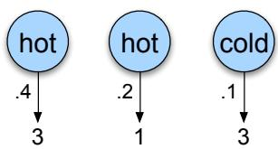

# A.3 似然计算：前向算法

第一个问题是计算某个观察序列的似然。例如，给定图 A.2 中的冰淇淋 HMM，序列 3 1 3 的概率是多少？形式化地说：

> **似然计算**：给定 HMM $\lambda=(A,B)$ 和观察序列 $O$，求似然 $P(O\mid\lambda)$。

对马尔可夫链而言，表面观察就是隐藏事件本身，所以只需沿着标为 3、1、3 的状态前进，并将各弧的概率相乘，就能计算 3 1 3 的概率。隐马尔可夫模型没有这么简单。我们想求冰淇淋观察序列 3 1 3 的概率，却不知道隐藏状态序列是什么。

先从稍简单的情形开始。假设我们已经知道天气，想预测 Jason 会吃多少冰淇淋；这是许多 HMM 任务中的一个有用子问题。给定隐藏状态序列，例如 hot hot cold，可以轻易计算 3 1 3 的输出似然。

回想一下，在隐马尔可夫模型中，每个隐藏状态只产生一个观察。因此，隐藏状态序列和观察序列长度相同。给定这种一一对应关系以及公式 A.4 的马尔可夫假设，对某个隐藏状态序列 $Q=q_1,q_2,\ldots,q_T$ 和观察序列 $O=o_1,o_2,\ldots,o_T$，观察序列的似然为：

$$
P(O\mid Q)=\prod_{i=1}^{T}P(o_i\mid q_i)\tag{A.6}
$$

对于冰淇淋观察 3 1 3 和一种可能的隐藏状态序列 hot hot cold，计算结果见公式 A.7，图 A.3 以图形展示该计算。

$$
P(3\ 1\ 3\mid\text{hot hot cold})=P(3\mid\text{hot})P(1\mid\text{hot})P(3\mid\text{cold})\tag{A.7}
$$



**图 A.3　给定隐藏状态序列 hot hot cold，计算冰淇淋事件 3 1 3 的观察似然。**

当然，我们实际上不知道隐藏的天气状态序列。因此，需要对所有可能的天气序列求和，并以各序列的概率加权，才能计算冰淇淋事件 3 1 3 的概率。先计算处于某个天气序列 $Q$ 并生成某个冰淇淋事件序列 $O$ 的联合概率。一般形式为：

$$
P(O,Q)=P(O\mid Q)P(Q)=\prod_{i=1}^{T}P(o_i\mid q_i)\prod_{i=1}^{T}P(q_i\mid q_{i-1})\tag{A.8}
$$

冰淇淋观察 3 1 3 与一种可能的隐藏状态序列 hot hot cold 的联合概率见公式 A.9；图 A.4 给出相应的图形表示。

$$
\begin{aligned}
P(3\ 1\ 3,\text{hot hot cold})={}&P(\text{hot}\mid\text{start})P(\text{hot}\mid\text{hot})P(\text{cold}\mid\text{hot})\\
&\times P(3\mid\text{hot})P(1\mid\text{hot})P(3\mid\text{cold}).
\end{aligned}\tag{A.9}
$$


**图 A.4　计算冰淇淋事件 3 1 3 与隐藏状态序列 hot hot cold 的联合概率。**

知道如何计算观察与某个隐藏状态序列的联合概率后，只需对全部可能的隐藏状态序列求和，就能计算观察的总概率：

$$
P(O)=\sum_QP(O,Q)=\sum_QP(O\mid Q)P(Q)\tag{A.10}
$$

在本例中，需要对八种长度为 3 的事件序列求和，包括 cold cold cold、cold cold hot 等：

$$
\begin{aligned}
P(3\ 1\ 3)={}&P(3\ 1\ 3,\text{cold cold cold})+P(3\ 1\ 3,\text{cold cold hot})\\
&+P(3\ 1\ 3,\text{hot hot cold})+\cdots
\end{aligned}
$$

若 HMM 有 $N$ 个隐藏状态，观察序列包含 $T$ 个观察，就存在 $N^T$ 种可能的隐藏序列。在真实任务中，$N$ 和 $T$ 通常都很大，因而 $N^T$ 极其庞大；不能分别计算每个隐藏状态序列的观察似然后再求和。

我们改用高效的 $O(N^2T)$ **前向算法**（forward algorithm）。前向算法是一种动态规划算法：它用表格保存构造观察序列概率时的中间值。算法通过对所有能够生成该观察序列的隐藏状态路径之概率求和，计算观察概率；其效率来自把这些路径隐式折叠到同一个前向网格中。

图 A.5 给出一个前向网格示例，用于计算观察序列 3 1 3 的似然。


**图 A.5　计算冰淇淋事件 3 1 3 总观察似然的前向网格。圆形表示隐藏状态，方形表示观察。图中展示两个时间步、两个状态上的 $\alpha_t(j)$ 计算。每个单元格按公式 A.12 计算，最终在格中表示的概率定义见公式 A.11。**

前向算法网格中的每个单元格 $\alpha_t(j)$，表示给定自动机 $\lambda$，看到前 $t$ 个观察之后处于状态 $j$ 的概率。计算 $\alpha_t(j)$ 时，要对所有能够到达该单元格的路径概率求和。形式上，每个单元格表示：

$$
\alpha_t(j)=P(o_1,o_2,\ldots,o_t,q_t=j\mid\lambda)\tag{A.11}
$$

$q_t=j$ 表示“状态序列中的第 $t$ 个状态是状态 $j$”。我们对所有到达当前单元格的路径扩展求和，计算 $\alpha_t(j)$。对时间 $t$ 的给定状态 $q_j$，有：

$$
\alpha_t(j)=\sum_{i=1}^{N}\alpha_{t-1}(i)a_{ij}b_j(o_t)\tag{A.12}
$$

公式 A.12 把已有路径扩展到时间 $t$，其中相乘的三个因子是：

- $\alpha_{t-1}(i)$：前一个时间步的前向路径概率；
- $a_{ij}$：从前一状态 $q_i$ 到当前状态 $q_j$ 的转移概率；
- $b_j(o_t)$：当前状态 $j$ 生成观察符号 $o_t$ 的观察似然。

以图 A.5 中 $\alpha_2(2)$ 的计算为例：它表示已经生成部分观察 3 1、并在时间步 2 处于状态 2 的前向概率。我们从时间步 1 的两个 $\alpha$ 概率分别扩展路径；每次扩展都包含以上三个因子，即 $\alpha_1(1)P(H\mid C)P(1\mid H)$ 和 $\alpha_1(2)P(H\mid H)P(1\mid H)$。

图 A.6 从另一个角度展示网格中一个新单元格的归纳计算步骤。


**图 A.6　计算网格中单个元素 $\alpha_t(i)$：对所有前一时刻的值 $\alpha_{t-1}$ 按相应转移概率加权求和，再乘以观察概率 $b_i(o_t)$。许多 HMM 应用中，大量转移概率为零，所以并非每个前一状态都会贡献当前状态的前向概率。圆形表示隐藏状态，方形表示观察；阴影结点参与 $\alpha_t(i)$ 的计算。**

前向算法的伪代码如下：

```text
function FORWARD(observations[1..T], state-graph[1..N]) returns forward-prob
    create probability matrix forward[N,T]
    for each state s = 1..N                         # 初始化
        forward[s,1] ← π_s × b_s(o_1)
    for each time step t = 2..T                    # 递归
        for each state s = 1..N
            forward[s,t] ← Σ_{s'=1..N} forward[s',t-1] × a_{s',s} × b_s(o_t)
    forward-prob ← Σ_{s=1..N} forward[s,T]         # 终止
    return forward-prob
```

**图 A.7　前向算法，其中 $\text{forward}[s,t]$ 表示 $\alpha_t(s)$。**

相应的定义递归为：

1. 初始化：

$$
\alpha_1(j)=\pi_jb_j(o_1),\qquad 1\leq j\leq N
$$

2. 递归：

$$
\alpha_t(j)=\sum_{i=1}^{N}\alpha_{t-1}(i)a_{ij}b_j(o_t),\qquad 1\leq j\leq N,\ 1<t\leq T
$$

3. 终止：

$$
P(O\mid\lambda)=\sum_{i=1}^{N}\alpha_T(i)
$$

