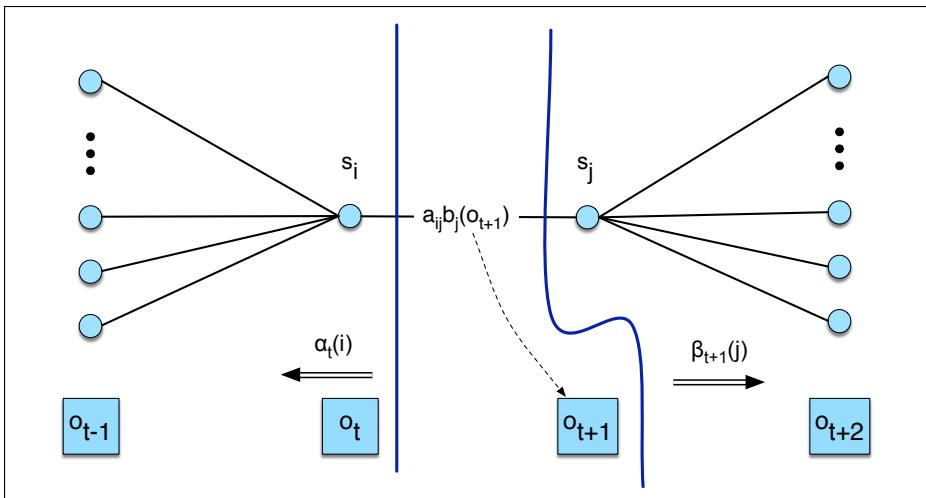
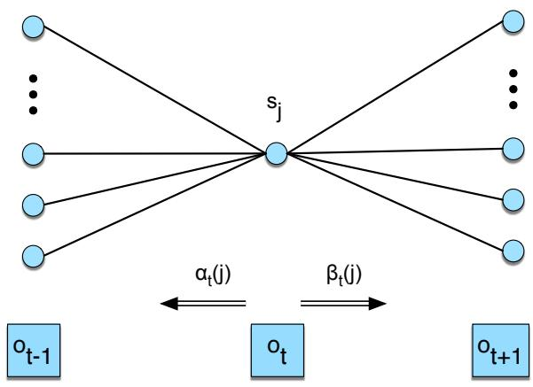

# A.5 HMM 训练：前向—后向算法

下面讨论 HMM 的第三个问题：学习 HMM 的参数，即矩阵 $A$ 和 $B$。形式化地说：

> **学习**：给定观察序列 $O$ 和 HMM 中可能的状态集合，学习 HMM 参数 $A$ 和 $B$。

这类学习算法的输入是不带标签的观察序列 $O$ 和潜在隐藏状态词表 $Q$。因此，在冰淇淋任务中，我们从观察序列 $O=\{1,3,2,\ldots\}$ 以及隐藏状态集合 H、C 开始。

训练 HMM 的标准算法是**前向—后向算法**（forward-backward algorithm），也称 **Baum–Welch 算法**（Baum, 1972）。它是**期望最大化**（expectation-maximization，EM）算法（Dempster et al., 1977）的一个特例。利用该算法，可以训练 HMM 的转移概率 $A$ 和发射概率 $B$。EM 是迭代算法：先计算概率的初始估计，再用已有估计计算更好的估计，如此反复，不断改善所学概率。

先考虑一个简单得多的情况：训练完全可见的马尔可夫模型，即每天的气温和冰淇淋数都已知。设想我们看到了以下输入观察，并且神奇地知道与之对齐的隐藏状态序列：

$$
\begin{array}{ccccccccc}
3&3&2&&1&1&2&&1\ 2\ 3\\
\text{hot}&\text{hot}&\text{cold}&&\text{cold}&\text{cold}&\text{cold}&&\text{cold}\ \text{hot}\ \text{hot}
\end{array}
$$

这时，只需对训练数据进行最大似然估计，就能计算 HMM 参数。首先，根据三个序列初始隐藏状态的计数计算 $\pi$：

$$
\pi_h=1/3,\qquad \pi_c=2/3
$$

接着，根据状态转移直接计算矩阵 $A$，忽略各序列的最终隐藏状态：

$$
\begin{aligned}
p(\text{hot}\mid\text{hot})&=2/3, &p(\text{cold}\mid\text{hot})&=1/3,\\
p(\text{cold}\mid\text{cold})&=2/3, &p(\text{hot}\mid\text{cold})&=1/3.
\end{aligned}
$$

矩阵 $B$ 为：

$$
\begin{aligned}
P(1\mid\text{hot})&=0/4=0, &P(1\mid\text{cold})&=3/5=0.6,\\
P(2\mid\text{hot})&=1/4=0.25, &P(2\mid\text{cold})&=2/5=0.4,\\
P(3\mid\text{hot})&=3/4=0.75, &P(3\mid\text{cold})&=0.
\end{aligned}
$$

对真正的 HMM，我们无法直接从观察序列计算这些计数，因为不知道某个输入经过了模型中的哪条状态路径。假设只是不告诉你第 2 天的气温，而你神奇地拥有以上概率，并知道其他各天的气温，那么可以结合其他所有概率进行贝叶斯计算，估计缺失那天的可能气温，再据此得到第 2 天各气温的期望计数。

但真正的问题更困难：任何隐藏状态上的计数都不知道。Baum–Welch 算法通过反复估计计数来解决这个问题。我们从转移概率和观察概率的某个估计出发，用这些估计逐步导出更好的概率。具体方法是计算某个观察的前向概率，再把这部分概率质量分配给所有对该前向概率作出贡献的不同路径。

要理解该算法，需要定义一个与前向概率相关的实用概率——**后向概率**（backward probability）。后向概率 $\beta$ 表示：给定时间 $t$ 处于状态 $i$，并给定自动机 $\lambda$，看到从时间 $t+1$ 直到末尾的全部观察之概率：

$$
\beta_t(i)=P(o_{t+1},o_{t+2},\ldots,o_T\mid q_t=i,\lambda)\tag{A.15}
$$

它以类似前向算法的方式归纳计算。

1. 初始化：

$$
\beta_T(i)=1,\qquad 1\leq i\leq N
$$

2. 递归：

$$
\beta_t(i)=\sum_{j=1}^{N}a_{ij}b_j(o_{t+1})\beta_{t+1}(j),\qquad 1\leq i\leq N,\ 1\leq t<T
$$

3. 终止：

$$
P(O\mid\lambda)=\sum_{j=1}^{N}\pi_jb_j(o_1)\beta_1(j)
$$


**图 A.11　$\beta_t(i)$ 的计算：把所有后继值 $\beta_{t+1}(j)$ 按转移概率 $a_{ij}$ 和观察概率 $b_j(o_{t+1})$ 加权后求和。**

现在可以说明，即使模型中的实际路径隐藏不可见，前向和后向概率如何帮助我们根据观察序列计算转移概率 $a_{ij}$ 和观察概率 $b_i(o_t)$。

先看如何用简单最大似然估计的一个变体估计 $\hat a_{ij}$：

$$
\hat a_{ij}=\frac{\text{从状态 }i\text{ 转移到状态 }j\text{ 的期望次数}}{\text{从状态 }i\text{ 出发的转移期望总次数}}\tag{A.16}
$$

怎样计算分子？直觉如下：假设我们能够估计观察序列中某个时刻 $t$ 发生给定转移 $i\to j$ 的概率。若知道每个时刻 $t$ 的这一概率，就可以对所有 $t$ 求和，估计转移 $i\to j$ 的总计数。

形式上，定义概率 $\xi_t$：给定观察序列和模型，在时间 $t$ 处于状态 $i$、并在时间 $t+1$ 处于状态 $j$ 的概率：

$$
\xi_t(i,j)=P(q_t=i,q_{t+1}=j\mid O,\lambda)\tag{A.17}
$$

为了计算 $\xi_t$，先计算一个与之相近、但把观察本身的概率也包括进来的量。注意，下面公式中 $O$ 的条件位置与公式 A.17 不同：

$$
\widetilde{\xi}_t(i,j)=P(q_t=i,q_{t+1}=j,O\mid\lambda)\tag{A.18}
$$



**图 A.12　计算时间 $t$ 处于状态 $i$、并在时间 $t+1$ 处于状态 $j$ 的联合概率。需要组合前向概率 $\alpha$、后向概率 $\beta$、转移概率 $a_{ij}$ 和观察概率 $b_j(o_{t+1})$，得到 $P(q_t=i,q_{t+1}=j,O\mid\lambda)$。改编自 Rabiner（1989），© 1989 IEEE。**

图 A.12 展示计算 $\widetilde\xi_t$ 所需的概率：相关弧的转移概率、弧之前的 $\alpha$ 概率、弧之后的 $\beta$ 概率，以及弧之后符号的观察概率。四者相乘得到：

$$
\widetilde{\xi}_t(i,j)=\alpha_t(i)a_{ij}b_j(o_{t+1})\beta_{t+1}(j)\tag{A.19}
$$

根据概率法则，用 $P(O\mid\lambda)$ 除 $\widetilde\xi_t$，即可得到 $\xi_t$，因为：

$$
P(X\mid Y,Z)=\frac{P(X,Y\mid Z)}{P(Y\mid Z)}\tag{A.20}
$$

给定模型时观察的概率，就是整条话语的前向概率；也可以等价地用整条话语的后向概率表示：

$$
P(O\mid\lambda)=\sum_{j=1}^{N}\alpha_t(j)\beta_t(j)\tag{A.21}
$$

因此，$\xi_t$ 的最终公式为：

$$
\xi_t(i,j)=\frac{\alpha_t(i)a_{ij}b_j(o_{t+1})\beta_{t+1}(j)}{\sum_{j=1}^{N}\alpha_t(j)\beta_t(j)}\tag{A.22}
$$

从状态 $i$ 到状态 $j$ 的期望转移次数，就是对所有 $t$ 的 $\xi_t(i,j)$ 求和。为了得到公式 A.16 中的 $a_{ij}$ 估计，还需要从状态 $i$ 出发的期望转移总次数；对从 $i$ 出发的所有转移求和即可得到。最终公式为：

$$
\hat a_{ij}=\frac{\sum_{t=1}^{T-1}\xi_t(i,j)}{\sum_{t=1}^{T-1}\sum_{k=1}^{N}\xi_t(i,k)}\tag{A.23}
$$

还需要重新估计观察概率。对观察词表 $V$ 中的给定符号 $v_k$ 和状态 $j$，目标为 $\hat b_j(v_k)$：

$$
\hat b_j(v_k)=\frac{\text{处于状态 }j\text{ 且观察到符号 }v_k\text{ 的期望次数}}{\text{处于状态 }j\text{ 的期望次数}}\tag{A.24}
$$

为此，需要知道时间 $t$ 处于状态 $j$ 的概率，记作 $\gamma_t(j)$：

$$
\gamma_t(j)=P(q_t=j\mid O,\lambda)\tag{A.25}
$$

同样，可以先把观察序列包括在联合概率中：

$$
\gamma_t(j)=\frac{P(q_t=j,O\mid\lambda)}{P(O\mid\lambda)}\tag{A.26}
$$



**图 A.13　计算时间 $t$ 处于状态 $j$ 的概率 $\gamma_t(j)$。$\gamma$ 实际上是 $\xi$ 的退化情形，因此本图相当于把图 A.12 中的状态 $i$ 与状态 $j$ 合并。改编自 Rabiner（1989），© 1989 IEEE。**

图 A.13 表明，公式 A.26 的分子就是前向概率与后向概率的乘积：

$$
\gamma_t(j)=\frac{\alpha_t(j)\beta_t(j)}{P(O\mid\lambda)}\tag{A.27}
$$

现在可以计算 $b$。分子对所有满足观察 $o_t=v_k$ 的时间步 $t$ 的 $\gamma_t(j)$ 求和，分母则对所有时间步的 $\gamma_t(j)$ 求和。所得结果就是处于状态 $j$ 时看到符号 $v_k$ 的比例：

$$
\hat b_j(v_k)=\frac{\sum_{\substack{t=1\\o_t=v_k}}^{T}\gamma_t(j)}{\sum_{t=1}^{T}\gamma_t(j)}\tag{A.28}
$$

公式 A.23 和 A.28 给出了根据观察序列 $O$ 重新估计转移概率 $A$ 和观察概率 $B$ 的方法，前提是已经拥有 $A$、$B$ 的上一轮估计。

这些重估公式构成迭代式前向—后向算法的核心。算法从 HMM 参数 $\lambda=(A,B)$ 的某个初始估计开始，随后反复执行两个步骤。与其他 EM 算法相同，这两个步骤分别是**期望步骤**（E-step）和**最大化步骤**（M-step）。

在 E 步中，根据上一轮的 $A$ 和 $B$，计算期望状态占用计数 $\gamma$ 和期望状态转移计数 $\xi$。在 M 步中，利用 $\gamma$ 和 $\xi$ 重新计算新的 $A$、$B$ 概率。

```text
function FORWARD-BACKWARD(observations[1..T], vocabulary V, states Q)
    returns HMM=(A,B)
    initialize A and B
    repeat until convergence
        E-step:
            γ_t(j) ← α_t(j)β_t(j) / P(O|λ)                  for all t,j
            ξ_t(i,j) ← α_t(i)a_ij b_j(o_{t+1})β_{t+1}(j) / P(O|λ)
                                                               for all t,i,j
        M-step:
            â_ij ← Σ_{t=1}^{T-1}ξ_t(i,j) /
                   Σ_{t=1}^{T-1}Σ_{k=1}^{N}ξ_t(i,k)
            b̂_j(v_k) ← Σ_{t:o_t=v_k}γ_t(j) / Σ_{t=1}^{T}γ_t(j)
    return A,B
```

**图 A.14　前向—后向算法。**

理论上，前向—后向算法可以完全无监督地学习参数 $A$ 和 $B$；但实践中，初始条件极其重要，因此算法经常还会获得额外信息。例如，在基于 HMM 的语音识别中，HMM 结构往往由人工设定，只根据观察序列集合 $O$ 训练发射概率 $B$ 和 $A$ 中非零的转移概率。

