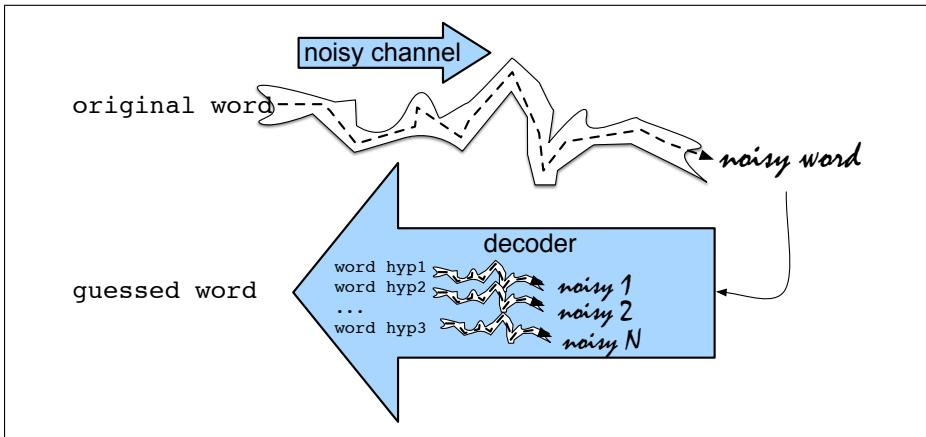

# D.1 噪声信道模型

本节介绍**噪声信道模型**（noisy channel model）及其在拼写错误检测与纠正中的应用。AT&T Bell Laboratories（Kernighan et al., 1990；Church and Gale, 1991）和 IBM Watson Research（Mays et al., 1991）的研究者大约同时把噪声信道模型用于拼写纠错。



**图 D.1　噪声信道模型假设，我们看到的表面形式其实是原始词通过噪声信道后产生的“失真”形式。解码器让每个假设经过信道模型，选出与表面噪声词最匹配的词。**

该模型的直觉是，把拼错的词看成一个正确拼写词通过带噪通信信道后被“扭曲”的结果。信道以替换或其他字母变化形式引入“噪声”，使“真实”词难以识别。我们的目标是建立信道模型；有了模型，就可以让语言中的每个词通过模拟信道，找出最接近错误词的候选。

噪声信道模型是一种贝叶斯推理。观察到拼错的词 $x$ 后，要找出生成它的词 $w$。在词表 $V$ 的所有可能词中，寻找使 $P(w\mid x)$ 最大的 $w$；帽号表示对正确词的估计：

$$
\hat w=\arg\max_{w\in V}P(w\mid x)\tag{D.1}
$$

$\arg\max_x f(x)$ 表示“使 $f(x)$ 最大的那个 $x$”。贝叶斯分类的直觉是用贝叶斯规则把公式 D.1 转化为其他概率。贝叶斯规则把任意条件概率 $P(a\mid b)$ 分解为：

$$
P(a\mid b)=\frac{P(b\mid a)P(a)}{P(b)}\tag{D.2}
$$

代入公式 D.1：

$$
\hat w=\arg\max_{w\in V}\frac{P(x\mid w)P(w)}{P(x)}\tag{D.3}
$$

可以去掉分母 $P(x)$：我们始终针对同一个观察错误 $x$ 比较候选词，所以每个候选的 $P(x)$ 相同。于是：

$$
\hat w=\arg\max_{w\in V}P(x\mid w)P(w)\tag{D.4}
$$

综上，模型假设存在真实的潜在词 $w$，噪声信道把它改成某个可能拼错的表面形式。信道产生观察 $x$ 的似然或**信道模型**为 $P(x\mid w)$，隐藏词的先验概率为 $P(w)$。将先验与似然相乘，再选择乘积最大的词，就得到观察到错误拼写 $x$ 后概率最大的词 $\hat w$。

用于非词错误时，算法对拼写词典中没有的词生成候选列表，按公式 D.4 排序，并选择排名最高的候选。把完整词表 $V$ 换成候选集合 $C$：

$$
\hat w=\arg\max_{w\in C}\underbrace{P(x\mid w)}_{\text{信道模型}}\underbrace{P(w)}_{\text{先验}}\tag{D.5}
$$

```text
function NOISY-CHANNEL-SPELLING(word x, dictionary D, lm, editprob)
    returns correction
    if x not in D
        candidates, edits ← 与 x 编辑距离为 1、且在 D 中的字符串及其编辑
        for each candidate c and edit e
            channel ← editprob(e)
            prior ← lm(c)
            score[c] ← log channel + log prior
        return argmax_c score[c]
```

**图 D.2　针对未知词的噪声信道拼写纠错算法。**

下面以错误拼写 *acress* 为例，说明似然与先验的计算。第一阶段寻找拼写相似的候选。错误数据分析表明，多数拼写错误只涉及一个字母变化，因此经常简化地假设候选与错误词的编辑距离为 1。这里使用第 2 章的最小编辑距离，但在插入、删除和替换之外增加第四种编辑：交换两个字母的**换位**。包含换位的版本称为 Damerau–Levenshtein 编辑距离。对 *acress* 应用所有单次变换得到：

<table><tr><th>错误</th><th>候选纠正</th><th>正确字母</th><th>错误字母</th><th>位置</th><th>类型</th></tr><tr><td>acress</td><td>actress</td><td>t</td><td>—</td><td>2</td><td>删除</td></tr><tr><td>acress</td><td>cress</td><td>—</td><td>a</td><td>0</td><td>插入</td></tr><tr><td>acress</td><td>caress</td><td>ca</td><td>ac</td><td>0</td><td>换位</td></tr><tr><td>acress</td><td>access</td><td>c</td><td>r</td><td>2</td><td>替换</td></tr><tr><td>acress</td><td>across</td><td>o</td><td>e</td><td>3</td><td>替换</td></tr><tr><td>acress</td><td>acres</td><td>—</td><td>s</td><td>5</td><td>插入</td></tr><tr><td>acress</td><td>acres</td><td>—</td><td>s</td><td>4</td><td>插入</td></tr></table>

**图 D.3　错误拼写 *acress* 的候选纠正，以及会产生该错误的变换（改编自 Kernighan et al., 1990）。“—”表示空字母。**

有了候选集合后，按公式 D.5 评分需要计算先验与信道模型。每个候选纠正的先验 $P(w)$，就是词 $w$ 在上下文中的语言模型概率；可以使用从一元到三元或四元的任何语言模型。先从一元模型开始。根据含 404,253,213 个词的 Corpus of Contemporary American English（COCA）计算：

:::{list-table}
:header-rows: 1

* - $w$
  - count($w$)
  - $P(w)$
* - actress
  - 9,321
  - 0.0000231
* - cress
  - 220
  - 0.000000544
* - caress
  - 686
  - 0.00000170
* - access
  - 37,038
  - 0.0000916
* - across
  - 120,844
  - 0.000299
* - acres
  - 12,874
  - 0.0000318
:::

如何估计似然 $P(x\mid w)$，即信道模型或错误模型？理想模型会考虑打字者身份、惯用左手还是右手等各种因素。幸运的是，只看局部上下文——正确字母、错误字母和周围字母——就能得到相当合理的估计。例如，`m` 和 `n` 经常互相替换，一方面因为二者发音相似、键盘位置相邻，另一方面也因为它们出现在相似上下文中。

例如，简单模型可仅根据大型错误语料中 `e` 替换 `o` 的次数估计 $P(\text{acress}\mid\text{across})$。需要用包含错误计数的**混淆矩阵**计算各种编辑概率。替换矩阵是 $26\times26$ 的方阵，更一般地说，对字母表 $A$ 为 $|A|\times|A|$。依照 Kernighan 等人（1990），使用四个混淆矩阵：

```text
del[x,y]   : xy 被键入为 x 的次数
ins[x,y]   : x 被键入为 xy 的次数
sub[x,y]   : x 被键入为 y 的次数
trans[x,y] : xy 被键入为 yx 的次数
```

插入和删除概率以之前的字符为条件，也可以改为以之后的字符为条件。混淆矩阵可以从错误拼写列表中抽取，例如 `additional: addional, additonal`、`environments: enviornments, enviorments, enviroments`、`preceded: preceeded`。另一种方法（Kernighan et al., 1990）是迭代运行拼写纠错算法：先用相等值初始化矩阵；用算法纠正一组错误；根据“错误—预测纠正”对重新计算矩阵；再次运行。该过程是附录 A 所述 EM 算法的一个实例。

有了混淆矩阵，可以按下式估计 $P(x\mid w)$；其中 $w_i$ 是正确词 $w$ 的第 $i$ 个字符，$x_i$ 是错误词 $x$ 的第 $i$ 个字符：

$$
P(x\mid w)=
\begin{cases}
\dfrac{\operatorname{del}[x_{i-1},w_i]}{\operatorname{count}[x_{i-1}w_i]},&\text{删除},\\[6pt]
\dfrac{\operatorname{ins}[x_{i-1},w_i]}{\operatorname{count}[w_{i-1}]},&\text{插入},\\[6pt]
\dfrac{\operatorname{sub}[x_i,w_i]}{\operatorname{count}[w_i]},&\text{替换},\\[6pt]
\dfrac{\operatorname{trans}[w_i,w_{i+1}]}{\operatorname{count}[w_iw_{i+1}]},&\text{换位}.
\end{cases}\tag{D.6}
$$

利用 Kernighan 等人（1990）的计数，可得到 *acress* 的错误模型概率。把一元先验与公式 D.6 的似然相乘后，主要候选的最终分数如下；最后一列为便于阅读放大 $10^9$ 倍：

:::{list-table}
:header-rows: 1

* - 候选
  - $P(x\mid w)$
  - $P(w)$
  - $10^9P(x\mid w)P(w)$
* - actress
  - 0.000117
  - 0.0000231
  - 2.7
* - cress
  - 0.00000144
  - 0.000000544
  - 0.00078
* - caress
  - 0.00000164
  - 0.00000170
  - 0.0028
* - access
  - 0.000000209
  - 0.0000916
  - 0.019
* - across
  - 0.0000093
  - 0.000299
  - 2.8
* - acres
  - 约 0.000033
  - 0.0000318
  - 1.0
:::

计算结果把 *across* 选为最佳纠正，*actress* 排在第二。但这里算法错了；上下文是：“…was called a ‘stellar and versatile acress whose combination of sass and glamour has defined her…’”。周围词语清楚表明作者想写的是 *actress*，而不是 *across*。

因此，使用比一元模型更大的语言模型十分重要。用 COCA 通过加一平滑计算上下文中 *actress* 和 *across* 的二元概率：

$$
\begin{aligned}
P(\text{actress}\mid\text{versatile})&=0.000021,\\
P(\text{across}\mid\text{versatile})&=0.000021,\\
P(\text{whose}\mid\text{actress})&=0.0010,\\
P(\text{whose}\mid\text{across})&=0.000006.
\end{aligned}
$$

于是两项上下文语言模型概率分别为 $210\times10^{-10}$ 和 $1\times10^{-10}$。把它们与错误模型结合后，二元噪声信道模型会选出正确的 *actress*。

评估拼写纠错算法时，通常从错误列表中划分并留出训练集、开发集和测试集；Norvig 与 Mitton 的错误列表就是常用来源。

