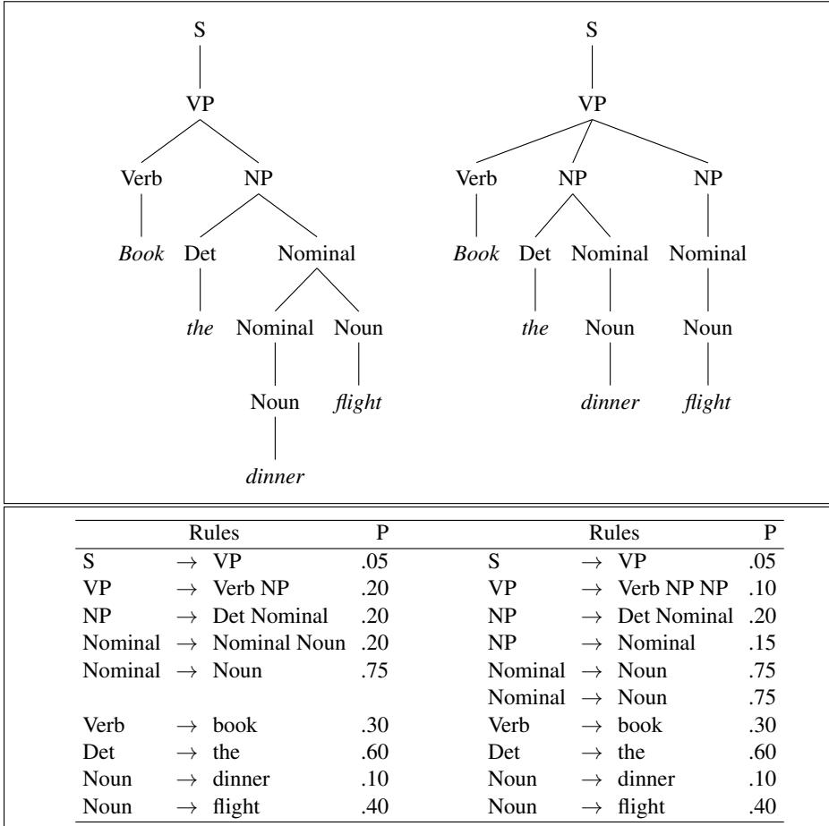

# E.1.1 PCFG 用于消歧

PCFG 为句子 $S$ 的每棵分析树 $T$（即每个推导）分配概率，这一属性可用于消歧。例如，考虑图 E.2 中句子“Book the dinner flight”的两种分析。左边合理的分析表示“预订提供晚餐的航班”；右边不合理的分析则只能表示类似“代表‘晚餐’预订航班”的意思，正如结构相似的“Can you book John a flight?”表示“你能替 John 预订一个航班吗？”

一棵特定分析树 $T$ 的概率，定义为树中 $n$ 个非终结节点展开时所用 $n$ 条规则的概率之积，其中规则 $i$ 可写成 $LHS_i\to RHS_i$：

$$
P(T,S)=\prod_{i=1}^nP(RHS_i\mid LHS_i)\tag{E.2}
$$

所得概率 $P(T,S)$ 既是分析树与句子的联合概率，也是分析树本身的概率 $P(T)$。为什么？根据联合概率的定义：

$$
P(T,S)=P(T)P(S\mid T)\tag{E.3}
$$

由于分析树已经包含句子的全部词语，$P(S\mid T)=1$，所以：

$$
P(T,S)=P(T)P(S\mid T)=P(T)\tag{E.4}
$$

可以把推导所用各规则的概率相乘，计算图 E.2 两棵树的概率。令左树为 $T_{left}$，右树为 $T_{right}$：

$$
P(T_{left})=.05*.20*.20*.20*.75*.30*.60*.10*.40=2.2\times10^{-6}
$$

$$
P(T_{right})=.05*.10*.20*.15*.75*.75*.30*.60*.10*.40=6.1\times10^{-7}
$$

**图 E.2** 一个歧义句子的两棵分析树。左侧分析对应合理含义“预订提供晚餐的航班”，右侧分析对应不合理含义“代表‘晚餐’预订航班”。

图 E.2 的左树概率远高于右树。因此，选择 PCFG 概率最高分析的消歧算法会正确选择左树。

下面形式化“选择概率最高的分析就是正确消歧方式”这一直觉。考虑给定句子 $S$ 的所有可能分析树。词串 $S$ 称为任何覆盖 $S$ 的分析树的**产出**（yield）。在所有产出为 $S$ 的分析树中，消歧算法选择给定 $S$ 时概率最大的分析树：

$$
\hat T(S)=\operatorname*{argmax}_{T\;s.t.\;S=\operatorname{yield}(T)}P(T\mid S)\tag{E.5}
$$

按定义，$P(T\mid S)$ 可改写为 $P(T,S)/P(S)$：

$$
\hat T(S)=\operatorname*{argmax}_{T\;s.t.\;S=\operatorname{yield}(T)}\frac{P(T,S)}{P(S)}\tag{E.6}
$$

因为我们在同一句子的所有分析树上取最大值，所以每棵树的 $P(S)$ 都是常数，可以消去：

$$
\hat T(S)=\operatorname*{argmax}_{T\;s.t.\;S=\operatorname{yield}(T)}P(T,S)\tag{E.7}
$$

又因为上面已证明 $P(T,S)=P(T)$，选择最可能分析的最终公式简化为选择概率最高的分析树：

$$
\hat T(S)=\operatorname*{argmax}_{T\;s.t.\;S=\operatorname{yield}(T)}P(T)\tag{E.8}
$$
