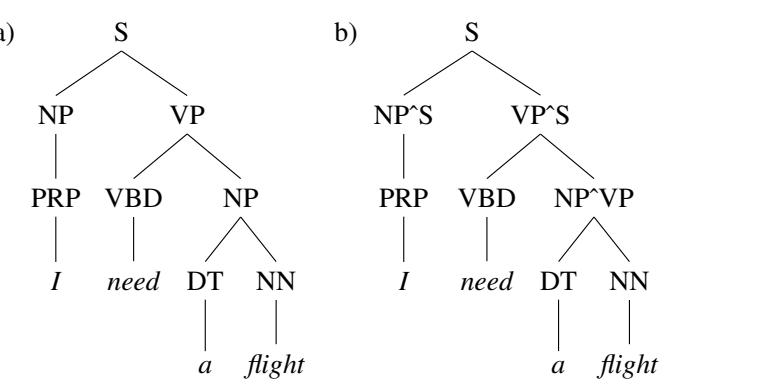

# E.5 通过拆分非终结符改进 PCFG

先处理前面提到的 PCFG 两个问题中的第一个：它无法对结构依赖建模。例如，主语位置的 NP 倾向于采用代词，而宾语位置的 NP 倾向于采用完整的词汇形式（非代词）。怎样扩充 PCFG 才能正确刻画这一事实？

一种思路是把非终结符 NP 拆成两个版本：一个表示主语，一个表示宾语。使用两个节点（例如 $NP_{subject}$ 和 $NP_{object}$），就能正确模拟它们不同的分布性质，因为规则 $NP_{subject}\to PRP$ 和 $NP_{object}\to PRP$ 可以有不同概率。

实现这种拆分直觉的一种方法是**父节点标注**（parent annotation；Johnson, 1998）：用分析树中每个节点的父节点来标注它。因此，句子主语 NP 的父节点是 S，可标为 $NP^{\uparrow S}$；直接宾语 NP 的父节点是 VP，可标为 $NP^{\uparrow VP}$。图 E.8 展示由一种对短语非终结符（如 NP、VP）进行父节点标注的语法所产生的树。

**图 E.8** 标准 PCFG 分析树（a），以及在非预终结节点上作父节点标注的分析树（b）。分析（b）中的全部非终结节点（预终结的词性节点除外）都标注了其父节点的身份。

除了拆分短语节点，还可以拆分预终结的词性节点来改进 PCFG（Klein and Manning, 2003b）。例如，不同种类的副词（RB）倾向出现在不同句法位置：父节点为 ADVP 时最常见的副词是 *also* 和 *now*；父节点为 VP 时是 *n’t* 和 *not*；父节点为 NP 时是 *only* 和 *just*。因此，增加 $RB^{\uparrow ADVP}$、$RB^{\uparrow VP}$、$RB^{\uparrow NP}$ 等标记有助于改进 PCFG 建模。

同样，Penn Treebank 标签 IN 可以标记多种词性，包括从属连词（*while, as, if*）、补语标记（*that, for*）和介词（*of, in, from*）。其中一些差异能由父节点标注捕捉（从属连词位于 S 下，介词位于 PP 下），另一些则要求拆分预终结节点。图 E.9 给出 Klein and Manning（2003b）的例子：在 *to see if advertising works* 中，即使采用父节点标注，语法仍把 *works* 错析为名词；拆分预终结符，使 *if* 能够偏好句子补语后，便得到正确的动词分析。

**图 E.9** 即使采用父节点标注仍会得到错误分析（左）。右边的正确分析来自拆分了预终结节点的语法，因此概率语法能够捕捉 *if* 偏好句子补语这一事实。改编自 Klein and Manning（2003b）。

节点拆分并非没有问题：它会增大语法规模，从而减少每条语法规则可用的训练数据，导致过拟合。因此，必须针对特定训练集只拆分到恰当的粒度。早期模型采用手写规则，试图找到最优的非终结符数量（Klein and Manning, 2003b）；现代模型则自动搜索最佳拆分。Petrov et al.（2006）的**拆分—合并算法**从简单的 X-bar 语法开始，交替拆分和合并非终结符，寻找能使训练树库似然最大的标注节点集合。
