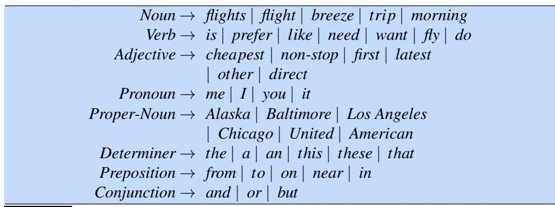
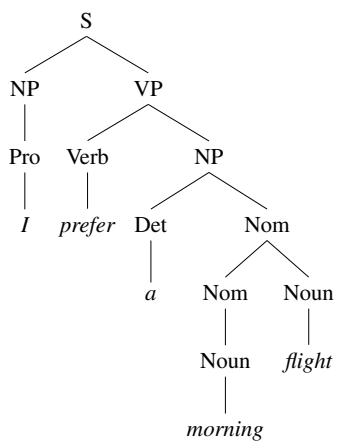

# F.2 上下文无关语法

为英语及其他自然语言的成分结构建模时，使用最广泛的形式系统是**上下文无关语法**（Context-Free Grammar，CFG）。上下文无关语法也叫**短语结构语法**（Phrase-Structure Grammar），这一形式体系与巴科斯–诺尔范式（Backus–Naur Form，BNF）等价。以成分结构为语法基础的思想可以追溯至心理学家 Wilhelm Wundt（1900），但直到 Chomsky（1956）以及独立开展工作的 Backus（1959）才得到形式化。

上下文无关语法由一组**规则**或**产生式**以及一个由词和符号构成的词典组成；每条规则都说明语言符号可以怎样组合与排序。例如，下面的产生式表示：NP（即名词短语）可以由一个专有名词（ProperNoun）组成，也可以由限定词（Det）后接名词性成分（Nominal）组成；Nominal 又可以由一个或多个名词（Noun）组成。1

$$
\begin{array}{c}
NP \to Det\ Nominal\\
NP \to ProperNoun\\
Nominal \to Noun \mid Nominal\ Noun
\end{array}
$$

上下文无关规则可以层次化嵌套，因此可以把上述规则同其他规则组合起来，例如下面这些表达词典事实的规则：

$$
\begin{array}{c}
Det \to a\\
Det \to the\\
Noun \to flight
\end{array}
$$

CFG 使用的符号分为两类。与语言中的词（如 *the*、*nightclub*）对应的符号叫作**终结符**（terminal symbol）；词典就是引入这些终结符的一组规则。对终结符进行抽象的符号叫作**非终结符**（non-terminal）。在每条上下文无关规则中，箭头（$\to$）右侧是由一个或多个终结符和非终结符组成的有序列表；箭头左侧则是单个非终结符，表示某种聚类或概括。词典中与每个词相联系的非终结符就是该词的**词汇范畴**（lexical category），也就是词性。

CFG 可以从两个角度理解：它既是生成句子的装置，也是为给定句子指派结构的装置。把 CFG 看成生成器时，可以把箭头 $\to$ 读作“用右侧符号串重写左侧符号”。

$$
\begin{array}{lll}
\text{从符号开始：} && NP\\
\text{用第一条规则把 }NP\text{ 重写为：} && Det\ Nominal\\
\text{再把 }Nominal\text{ 重写为：} && Noun\\
\text{最后把这些词性重写为：} && a\ flight
\end{array}
$$

我们说字符串 *a flight* 可以从非终结符 NP **推导**（derive）出来。因此，CFG 可以用来生成一个字符串集合。上述规则展开序列叫作该词串的**推导**（derivation）。通常用**句法分析树**（parse tree）表示推导；这种树一般倒置绘制，根位于顶部。图 F.1 给出了这个推导的树形表示。

在图 F.1 的句法分析树中，可以说 NP 节点**支配**树中的所有节点（Det、Nominal、Noun、*a*、*flight*），还可以说它**直接支配** Det 和 Nominal 两个节点。

CFG 定义的**形式语言**，是可以从指定起始符号推导出的所有字符串的集合。每个语法都必须有一个指定起始符号，通常记作 S。由于上下文无关语法常用于定义句子，S 一般被解释为“句子”节点，而能从 S 推导出的字符串集合就是某个英语简化版本中的句子集合。

<table><tr><td style="text-align:center">NP ↙　↘ Det　Nominal │　　│ <em>a</em>　Noun 　　 │ 　　<em>flight</em></td></tr></table>

**图 F.1　“a flight”的句法分析树。**

下面再加入几条规则。第一条规则表示句子可以由名词短语后接动词短语组成：

$$
S \to NP\ VP \qquad \textit{I prefer a morning flight}
$$

英语中的动词短语由动词及其后的各种成分组成；例如，一类动词短语由动词后接名词短语构成：

$$
VP \to Verb\ NP \qquad \textit{prefer a morning flight}
$$

动词后也可以接名词短语和介词短语：

$$
VP \to Verb\ NP\ PP \qquad \textit{leave Boston in the morning}
$$

或者，动词短语可以只由动词后接介词短语构成：

$$
VP \to Verb\ PP \qquad \textit{leaving on Thursday}
$$

介词短语通常由介词后接名词短语组成。例如，ATIS 语料库中一种常见介词短语用于表示位置或方向：

$$
PP \to Preposition\ NP \qquad \textit{from Los Angeles}
$$

PP 内部的 NP 不一定表示地点；PP 也常用于时间、日期和其他名词，而且可以任意复杂。下面是 ATIS 语料库中的十个例子：

<table><tr><td>to Seattle（到西雅图）</td><td>on these flights（在这些航班上）</td></tr><tr><td>in Minneapolis（在明尼阿波利斯）</td><td>about the ground transportation in Chicago（关于芝加哥的地面交通）</td></tr><tr><td>on Wednesday（在星期三）</td><td>of the round trip flight on United Airlines（联合航空往返航班的）</td></tr><tr><td>in the evening（在晚上）</td><td>of the AP fifty seven flight（AP 57 航班的）</td></tr><tr><td>on the ninth of July（在 7 月 9 日）</td><td>with a stopover in Nashville（在纳什维尔中途停留的）</td></tr></table>

图 F.2 给出一个示例词典，图 F.3 汇总了目前见过的语法规则；我们把这个语法称为 $\mathcal L_0$。注意，可以用“或”符号 $\mid$ 表示非终结符存在多个可能的展开。

**图 F.2　$\mathcal L_0$ 的词典。**

:::{list-table}
:header-rows: 1

* - 语法规则
  -
  -
  - 例子
* -
  - $S \to NP\ VP$
  -
  - *I* + *want a morning flight*
* -
  - $NP \to Pronoun$
  -
  - *I*
* -
  -
  - $ProperNoun$
  - *Los Angeles*
* -
  -
  - $Det\ Nominal$
  - *a* + *flight*
* -
  - $Nominal \to Nominal\ Noun$
  -
  - *morning* + *flight*
* -
  -
  - $Noun$
  - *flights*
* -
  - $VP \to Verb$
  -
  - *do*
* -
  -
  - $Verb\ NP$
  - *want* + *a flight*
* -
  -
  - $Verb\ NP\ PP$
  - *leave* + *Boston* + *in the morning*
* -
  -
  - $Verb\ PP$
  - *leaving* + *on Thursday*
* -
  - $PP \to Preposition\ NP$
  -
  - *from* + *Los Angeles*
:::

**图 F.3　语法 $\mathcal L_0$ 的规则及示例。**

可以用这个语法生成“ATIS 语言”中的句子。我们从 S 开始，把它展开为 NP VP，再随机选择 NP 的一种展开（例如 *I*），然后随机选择 VP 的一种展开（例如 Verb NP），以此类推，直至生成字符串 *I prefer a morning flight*。图 F.4 的句法分析树表示该句子的完整推导。

**图 F.4　根据语法 $\mathcal L_0$ 得到的“I prefer a morning flight”句法分析树。**

也可以采用一种更紧凑的格式——**括号表示法**（bracketed notation）来表示句法分析树。图 F.4 的分析树可写成：

> **(F.1)** `[S [NP [Pro I]] [VP [V prefer] [NP [Det a] [Nom [N morning] [Nom [N flight]]]]]]`

像 $\mathcal L_0$ 这样的 CFG 定义了一种形式语言。第 2 章已经讲过，形式语言是一个字符串集合。能够由语法推导出的句子（词串）属于该语法定义的形式语言，称为**合语法句**（grammatical sentence）；不能由给定形式语法推导出的句子不属于该语法定义的语言，称为**不合语法句**（ungrammatical sentence）。

所有形式语言都有这种泾渭分明的“属于/不属于”界线，但它只是对自然语言真实运作方式的一种高度简化，因为判断一个给定句子是否属于某种自然语言（例如英语）往往取决于语境。在语言学中，使用形式语言对自然语言建模称为**生成语法**（generative grammar），因为语言由语法“生成”的可能句子集合来定义。

## F.2.1 上下文无关语法的形式定义

最后，我们简要、形式化地描述上下文无关语法及其生成的语言。上下文无关语法 $G$ 由四个参数 $N,\Sigma,R,S$ 定义（严格地说，这是一个“四元组”）：

:::{list-table}
* - $N$
  - 非终结符（或变量）的集合
* - $\Sigma$
  - 终结符的集合（与 $N$ 不相交）
* - $R$
  - 规则或产生式的集合，每条形如 $A\to\beta$；其中 $A$ 是非终结符，$\beta$ 是无限字符串集合 $(\Sigma\cup N)^*$ 中的一个符号串
* - $S$
  - 指定的起始符号，且 $S\in N$
:::

本书余下部分在讨论上下文无关语法的形式性质时（而不是说明英语或其他语言的具体事实时），将遵循以下约定：

:::{list-table}
* - $A,B,S$ 等大写字母
  - 非终结符
* - $S$
  - 起始符号
* - $\alpha,\beta,\gamma$ 等小写希腊字母
  - 取自 $(\Sigma\cup N)^*$ 的字符串
* - $u,v,w$ 等小写罗马字母
  - 终结符字符串
:::

语言通过推导概念来定义。若一个字符串经过某个规则应用序列可以重写为另一个字符串，就说前者**推导出**后者。更形式化地，沿用 Hopcroft and Ullman（1979）的定义：

若 $A\to\beta$ 是 $R$ 中的一个产生式，而 $\alpha$ 和 $\gamma$ 是集合 $(\Sigma\cup N)^*$ 中任意两个字符串，那么称 $\alpha A\gamma$ **直接推导出** $\alpha\beta\gamma$，记作

$$
\alpha A\gamma\Rightarrow\alpha\beta\gamma.
$$

推导则是直接推导的推广。设 $\alpha_1,\alpha_2,\ldots,\alpha_m$ 是 $(\Sigma\cup N)^*$ 中的字符串，$m\geq 1$，并且

$$
\alpha_1\Rightarrow\alpha_2,\quad
\alpha_2\Rightarrow\alpha_3,\quad\ldots,\quad
\alpha_{m-1}\Rightarrow\alpha_m,
$$

那么称 $\alpha_1$ 推导出 $\alpha_m$，记作 $\alpha_1\stackrel{*}{\Rightarrow}\alpha_m$。

由语法 $G$ 生成的语言 $\mathcal L_G$，可以形式化定义为所有能够从指定起始符号 S 推导出的终结符字符串的集合：

$$
\mathcal L_G=\{w\mid w\in\Sigma^*\ \text{且}\ S\stackrel{*}{\Rightarrow}w\}.
$$

把一个词串映射到其句法分析树的问题称为**句法分析**（syntactic parsing）；第 19 章将定义成分句法分析算法。
