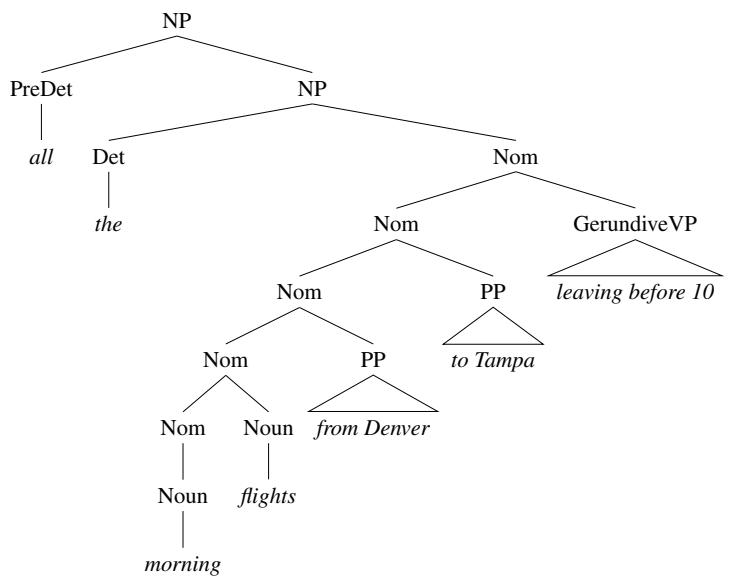

# F.3 英语的一些语法规则

本节进一步介绍英语短语结构的几个方面；为保持一致，我们仍聚焦于 ATIS 领域的句子。受篇幅限制，这里只能讨论其中的重点。强烈建议读者参阅优秀的英语参考语法，例如 Huddleston and Pullum（2002）。

## F.3.1 句子层面的结构

在小型语法 $\mathcal L_0$ 中，我们只为 *I prefer a morning flight*（我更喜欢早班航班）这样的陈述句提供了一种句子层面的结构。英语句子的结构为数众多，其中四类尤其常见而重要：陈述句、祈使句、一般疑问句和 wh-疑问句。

陈述句结构由主语名词短语后接动词短语组成，例如 *I prefer a morning flight*。具有这种结构的句子用途极多；下面是 ATIS 领域中的例子：

> I want a flight from Ontario to Chicago.  
> 我想要一班从安大略到芝加哥的航班。
>
> The flight should be eleven a.m. tomorrow.  
> 航班应当是明天上午 11 点。
>
> The return flight should leave at around seven p.m.  
> 返程航班应当在晚上 7 点左右起飞。

祈使句结构通常以动词短语开头，没有主语。它之所以叫祈使句，是因为几乎总用于命令和建议；在 ATIS 领域中，它们是向系统发出的命令。

> Show the lowest fare.（显示最低票价。）  
> Give me Sunday’s flights arriving in Las Vegas from New York City.（给我从纽约市出发、星期日抵达拉斯维加斯的航班。）  
> List all flights between five and seven p.m.（列出下午 5 点至 7 点之间的所有航班。）

可以用另一条 S 展开规则来为这种句子结构建模：

$$
S\to VP
$$

一般疑问句结构经常（但并非总是）用来提问；句首为助动词，后接主语 NP，再接 VP。下面是几个例子。注意第三个例子其实不是问题，而是请求。

> Do any of these flights have stops?（这些航班中有经停的吗？）  
> Does American’s flight eighteen twenty five serve dinner?（美国航空 1825 航班供应晚餐吗？）  
> Can you give me the same information for United?（你能把联合航空的同类信息给我吗？）

相应规则是：

$$
S\to Aux\ NP\ VP
$$

这里考察的最复杂句子层面结构，是各种 **wh-结构**。它们之所以如此得名，是因为其某个成分是 wh-短语，即包含 wh-词（*who, whose, when, where, what, which, how, why*）的短语。它们大体可以分为两类句子结构。**wh-主语疑问句**结构与陈述句结构相同，只是第一个名词短语含有某个 wh-词：

> What airlines fly from Burbank to Denver?（哪些航空公司有从伯班克飞往丹佛的航班？）  
> Which flights depart Burbank after noon and arrive in Denver by six p.m.?（哪些航班中午以后离开伯班克，并在下午 6 点前抵达丹佛？）  
> Whose flights serve breakfast?（谁家的航班供应早餐？）

规则如下。练习 F.7 将讨论构成 Wh-NP 的各成分所需的规则。

$$
S\to Wh\text{-}NP\ VP
$$

在 **wh-非主语疑问句**结构中，wh-短语不是句子的主语，所以句中另有一个主语。在这类句子里，助动词像一般疑问句中那样出现在主语 NP 之前。下面先给一个例子，再给一条示例规则：

> What flights do you have from Burbank to Tacoma Washington?  
> 你们有哪些从伯班克飞往华盛顿州塔科马的航班？

$$
S\to Wh\text{-}NP\ Aux\ NP\ VP
$$

wh-非主语疑问句之类的结构包含所谓的**长距离依存**（long-distance dependency），因为 Wh-NP *what flights* 与同它在语义上相关的谓词——VP 中的主要动词 *have*——相距很远。在与上述语法规则兼容的一些分析和理解模型中，*flights* 与 *have* 之间的长距离依存被视为语义关系；在这种模型中，确定 *flights* 是 *have* 的论元，是语义解释阶段的任务。另一些句法分析模型把 *flights* 与 *have* 的关系表示为句法关系，并修改语法，在动词后插入一个叫作**语迹**（trace）或**空范畴**（empty category）的小标记。第 15 页介绍宾州树库时还会讨论空范畴模型。

## F.3.2 小句与句子

继续之前，需要澄清刚才这些语法中 S 规则的地位。S 规则旨在说明那些能够独立存在、充当话语基本单位的完整句子。不过，S 也可以出现在语法规则的右侧，从而嵌入更大的句子。显然，成为 S 并不只是“独立充当话语单位”这么简单。

句子结构（即 S 规则）与语法其余部分的区别，在于它们在某种意义上是完整的。这样一来，它们就对应于传统语法所谓表达完整思想的**小句**（clause）。要更精确地刻画这种“完整思想”，可以说：S 是句法分析树中的一个节点，在该节点以下，S 的主要动词拥有它的全部论元。后文才会定义动词论元，不过现在可以先看第 5 页图 F.4 中 *I prefer a morning flight* 的分析树。动词 *prefer* 有两个论元：主语 *I* 和宾语 *a morning flight*。其中一个论元出现在 VP 节点之下，另一个——主语 NP——则只有到 S 节点之下才出现。

## F.3.3 名词短语

语法 $\mathcal L_0$ 引入了英语中最常见的三类名词短语：代词、专有名词，以及 $NP\to Det\ Nominal$ 结构。本节主要关注最后一类，因为大部分句法复杂性都集中在那里。这类名词短语由**中心词**（head）——名词短语的核心名词——以及可出现在中心名词之前或之后的各种修饰语构成。下面逐一细看。

### 限定词

名词短语可以由简单的词汇限定词开头：

> *a stop*（一次经停）　*the flights*（这些航班）　*this flight*（这个航班）  
> *those flights*（那些航班）　*any flights*（任何航班）　*some flights*（一些航班）

限定词的角色也可以由更复杂的表达式承担：

> *United’s flight*（联合航空的航班）  
> *United’s pilot’s union*（联合航空的飞行员工会）  
> *Denver’s mayor’s mother’s canceled flight*（丹佛市长的母亲被取消的航班）

这些例子中的限定词，是由名词短语后接所有格标记 *’s* 构成的所有格表达式，如下列规则所示：

$$
Det\to NP\ 's
$$

这条规则具有递归性（因为 NP 又可以从 Det 开始），因而能对上面最后两个例子建模；其中一连串所有格表达式共同充当限定词。

在某些条件下，英语中的限定词可以省略。例如，所修饰的名词为复数时可以省略限定词：

> **(F.2)** Show me flights from San Francisco to Denver on weekdays.  
> 给我看工作日从旧金山飞往丹佛的航班。

正如第 18 章所述，物质名词也不需要限定词。回忆一下，物质名词经常（但不总是）表示被当作某种物质的事物（如 *water* 和 *snow*），不与不定冠词 *a* 连用，也往往没有复数形式。许多抽象名词也是物质名词（如 *music, homework*）。ATIS 领域的物质名词包括 *breakfast, lunch, dinner*：

> **(F.3)** Does this flight serve dinner?  
> 这班航班供应晚餐吗？

### 名词性成分

**名词性成分**（nominal）位于限定词之后，包含中心名词之前和之后的全部修饰语。正如语法 $\mathcal L_0$ 所示，最简单的名词性成分可以只含一个名词：

$$
Nominal\to Noun
$$

下面还会看到，这条规则也是各种递归规则的基础情形，而那些递归规则用来刻画更复杂的名词性结构。

### 中心名词之前

名词性成分中，中心名词之前、限定词之后可以出现多类词（即“后限定成分”），包括基数词、序数词、量词和形容词。基数词的例子有：

> *two friends*（两个朋友）　*one stop*（一次经停）

序数词包括 *first, second, third* 等，也包括 *next, last, past, other, another* 之类的词：

> *the first one*（第一个）　*the next day*（第二天）　*the second leg*（第二航段）  
> *the last flight*（最后一班航班）　*the other American flight*（美国航空的另一班航班）

有些量词（*many, (a) few, several*）只能与复数可数名词连用：

> *many fares*（许多种票价）

形容词出现在量词之后、名词之前：

> *a first-class fare*（头等舱票价）　*a non-stop flight*（直飞航班）  
> *the longest layover*（最长的转机停留）　*the earliest lunch flight*（最早供应午餐的航班）

形容词还可以组成称为**形容词短语**（adjective phrase，AP）的短语。AP 中形容词之前可以有副词（形容词和副词的定义见第 18 章）：

> *the least expensive fare*（最便宜的票价）

### 中心名词之后

中心名词后可以接后置修饰语。英语中常见三类名词性后置修饰语：

<table><tr><td>介词短语</td><td><em>all flights from Cleveland</em>（从克利夫兰出发的所有航班）</td></tr><tr><td>非限定小句</td><td><em>any flights arriving after eleven a.m.</em>（上午 11 点以后抵达的任何航班）</td></tr><tr><td>关系从句</td><td><em>a flight that serves breakfast</em>（供应早餐的航班）</td></tr></table>

它们在 ATIS 语料库中尤其常见，因为可用来标记航班的出发地和目的地。

下面是一些作后置修饰语的介词短语；方括号标出了每个 PP 的边界。注意，一个 NP 内可以串接两个或更多 PP：

> all flights **[from Cleveland] [to Newark]**  
> 所有**[从克利夫兰] [到纽瓦克]**的航班
>
> arrival **[in San Jose] [before seven p.m.]**  
> **[在圣何塞] [晚 7 点之前]**抵达
>
> a reservation **[on flight six oh six] [from Tampa] [to Montreal]**  
> **[坦帕] [飞往蒙特利尔] [606 航班]**上的一个预订

为说明名词后的 PP，加入一条新的名词性规则：

$$
Nominal\to Nominal\ PP
$$

最常见的三类非限定后置修饰语是动名词（*-ing*）形式、*-ed* 形式和不定式形式。

动名词后置修饰语由以动词的动名词（*-ing*）形式开头的动词短语构成，因而得名。例子如下：

> any of those **[leaving on Thursday]**（那些**[星期四出发]**的航班中的任何一班）  
> any flights **[arriving after eleven a.m.]**（任何**[上午 11 点以后抵达]**的航班）  
> flights **[arriving within thirty minutes of each other]**（彼此抵达时间**[相差不超过 30 分钟]**的航班）

引入新的非终结符 GerundVP，可以如下定义带动名词修饰语的 Nominal：

$$
Nominal\to Nominal\ GerundVP
$$

复制所有 VP 产生式，并用 GerundV 替换 V，就可以得到 GerundVP 成分的规则：

$$
\begin{aligned}
GerundVP&\to GerundV\ NP\\
&\mid GerundV\ PP\\
&\mid GerundV\\
&\mid GerundV\ NP\ PP
\end{aligned}
$$

GerundV 随后可以定义为：

$$
GerundV\to being\mid arriving\mid leaving\mid\ldots
$$

下面例子中的斜体部分，是另两类常见非限定小句——不定式和 *-ed* 形式：

> the last flight *to arrive in Boston*（最后一班*抵达波士顿*的航班）  
> I need to have dinner *served*.（我需要让晚餐*被供应*。）  
> Which is the aircraft *used by this flight*?（哪架是*这班航班使用的*飞机？）

名词后的关系从句（更准确地说是**限制性关系从句**）是一种通常以关系代词开头的小句，最常见的关系代词是 *that* 和 *who*。在下面的例子中，关系代词充当嵌入动词的主语：

> a flight **that serves breakfast**（**供应早餐的**航班）  
> flights **that leave in the morning**（**早晨出发的**航班）  
> the one **that leaves at ten thirty-five**（**10:35 出发的**那一班）

可以加入如下规则来处理这些结构：

$$
Nominal\to Nominal\ RelClause
$$

$$
RelClause\to (who\mid that)\ VP
$$

关系代词也可以充当嵌入动词的宾语，如下例所示。为这类更复杂关系从句编写语法规则的任务留给读者练习。

> the earliest American Airlines flight **that I can get**  
> 我**能搭乘的**最早一班美国航空航班

各种名词后修饰语可以组合起来：

> a flight **[from Phoenix to Detroit] [leaving Monday evening]**  
> 一班**[从菲尼克斯飞往底特律] [星期一晚上出发]**的航班
>
> evening flights **[from Nashville to Houston] [that serve dinner]**  
> **[从纳什维尔飞往休斯敦] [供应晚餐]**的晚间航班
>
> a friend **[living in Denver] [that would like to visit me in DC]**  
> 一位**[住在丹佛] [想来华盛顿特区看我]**的朋友

### 名词短语之前

修饰 NP 并出现在 NP 之前的词类叫作**前限定成分**（predeterminer）。其中许多与数量有关；常见的前限定词是 *all*：

> *all the flights*（所有这些航班）　*all flights*（所有航班）　*all non-stop flights*（所有直飞航班）

图 F.5 的名词短语例子说明了这些规则组合起来时产生的部分复杂性。

**图 F.5　“all the morning flights from Denver to Tampa leaving before 10”的句法分析树。**

## F.3.4 动词短语

动词短语由动词和若干其他成分组成。在目前构建的简单规则中，这些成分包括 NP、PP 以及二者的组合：

:::{list-table}
* - $VP\to Verb$
  - *disappear*（消失）
* - $VP\to Verb\ NP$
  - *prefer a morning flight*（更喜欢早班航班）
* - $VP\to Verb\ NP\ PP$
  - *leave Boston in the morning*（早晨离开波士顿）
* - $VP\to Verb\ PP$
  - *leaving on Thursday*（星期四出发）
:::

动词短语可以远比这复杂。动词后还可以出现许多其他成分，例如一个完整的嵌入句；这些成分称为**句子补语**（sentential complement）：

> You [VP [V said] [S you had a two hundred sixty-six dollar fare]].  
> 你[VP[V说][S你有一种 266 美元的票价]]。
>
> [VP [V Tell] [NP me] [S how to get from the airport to downtown]].  
> [VP[V告诉][NP我][S怎样从机场到市中心]]。
>
> I [VP [V think] [S I would like to take the nine thirty flight]].  
> 我[VP[V想][S我愿意搭乘 9:30 的航班]]。

相应规则是：

$$
VP\to Verb\ S
$$

同样，VP 的另一个可能成分也是 VP。*want, would like, try, intend, need* 等动词后经常出现这种情况：

> I want **[VP to fly from Milwaukee to Orlando]**.  
> 我想**[VP从密尔沃基飞往奥兰多]**。
>
> Hi, I want **[VP to arrange three flights]**.  
> 你好，我想**[VP安排三个航班]**。

尽管动词短语可以包含许多不同类型的成分，却不是每个动词都与每种动词短语相容。例如，动词 *want* 既可带 NP 补语（*I want a flight...*），也可带不定式 VP 补语（*I want to fly to...*）。相比之下，*find* 之类的动词不能带这种 VP 补语（\**I found to fly to Dallas*）。

动词与不同补语类型相容的思想十分古老。传统语法区分 *find* 这样的**及物动词**——带直接宾语 NP（*I found a flight*），以及 *disappear* 这样的**不及物动词**——不带直接宾语 NP（\**I disappeared a flight*）。

传统语法把动词次范畴化为及物和不及物两类，现代语法则区分多达 100 种次范畴。我们说 *find* 这样的动词**次范畴化选择**一个 NP，*want* 这样的动词则次范畴化选择 NP 或非限定 VP。我们也把这些成分称为动词的**补语**（complement；前文“句子补语”的名称由此而来），因而可以说 *want* 能带 VP 补语。一个动词可能带有的补语集合称为该动词的**次范畴化框架**（subcategorization frame）。描述动词与这些成分关系的另一种方式，是把动词看成逻辑谓词，把成分看成谓词的逻辑论元。这样，谓词–论元关系就可以表示为 $FIND(I,A\ FLIGHT)$ 或 $WANT(I,TO\ FLY)$。附录 H 讨论动词语义的谓词演算表示时，将进一步说明这种动词与论元观。图 F.6 给出一组示例动词的次范畴化框架。

:::{list-table}
:header-rows: 1

* - 框架
  - 动词
  - 例子
* - 0
  - eat, sleep
  - *I ate.*
* - NP
  - prefer, find, leave
  - Find [NP the flight from Pittsburgh to Boston].
* - NP NP
  - show, give
  - Show [NP me] [NP airlines with flights from Pittsburgh].
* - $PP_{from}\ PP_{to}$
  - fly, travel
  - I would like to fly [PP from Boston] [PP to Philadelphia].
* - $NP\ PP_{with}$
  - help, load
  - Can you help [NP me] [PP with a flight]?
* - $VP_{to}$
  - prefer, want, need
  - I would prefer [VPto to go by United Airlines].
* - S
  - mean
  - [S ... has a hub in Boston].
:::

**图 F.6　一组示例动词的次范畴化框架。**

可以为 Verb 类建立相互独立的子类型（例如 Verb-with-NP-complement、Verb-with-Inf-VP-complement、Verb-with-S-complement 等），以刻画动词与其补语之间的关联：

$$
Verb\text{-}with\text{-}NP\text{-}complement\to find\mid leave\mid repeat\mid\ldots
$$

$$
Verb\text{-}with\text{-}S\text{-}complement\to think\mid believe\mid say\mid\ldots
$$

$$
Verb\text{-}with\text{-}Inf\text{-}VP\text{-}complement\to want\mid try\mid need\mid\ldots
$$

然后，可以修改每条 VP 规则，要求使用适当的动词子类型：

$$
VP\to Verb\text{-}with\text{-}no\text{-}complement
\qquad \textit{disappear}
$$

$$
VP\to Verb\text{-}with\text{-}NP\text{-}comp\ NP
\qquad \textit{prefer a morning flight}
$$

$$
VP\to Verb\text{-}with\text{-}S\text{-}comp\ S
\qquad \textit{said there were two flights}
$$

这种做法的问题在于规则数量会显著增加，并相应损失概括性。

## F.3.5 并列

这里讨论的主要短语类型，都可以用 *and*、*or* 和 *but* 等连词连接，形成同类型的更大结构。例如，并列名词短语可以由两个名词短语及其间的连词组成：

> Please repeat [NP [NP the flights] and [NP the costs]].  
> 请重复[NP[NP航班]和[NP费用]]。
>
> I need to know [NP [NP the aircraft] and [NP the flight number]].  
> 我需要知道[NP[NP飞机]和[NP航班号]]。

允许这些结构的规则是：

$$
NP\to NP\ and\ NP
$$

请注意，通过连词构成并列短语的能力常被用作成分性检验。下面的例子与上例不同，因为缺少第二个限定词：

> Please repeat the [Nom [Nom flights] and [Nom costs]].  
> 请重复这些[Nom[Nom航班]和[Nom费用]]。
>
> I need to know the [Nom [Nom aircraft] and [Nom flight number]].  
> 我需要知道这[Nom[Nom架飞机]和[Nom航班号]]。

这些短语能够并列，证明了我们一直采用的底层 Nominal 成分确实存在。相应规则是：

$$
Nominal\to Nominal\ and\ Nominal
$$

下面的例子展示涉及 VP 和 S 的并列：

> What flights do you have [VP [VP leaving Denver] and [VP arriving in San Francisco]]?  
> 你们有哪些[VP[VP离开丹佛]并[VP抵达旧金山]]的航班？
>
> [S [S I’m interested in a flight from Dallas to Washington] and [S I’m also interested in going to Baltimore]].  
> [S[S我想了解从达拉斯飞往华盛顿的航班]，并且[S我还想去巴尔的摩]]。

VP 和 S 的并列规则与上面给出的 NP 规则相对应：

$$
VP\to VP\ and\ VP
$$

$$
S\to S\ and\ S
$$

由于所有主要短语类型都能以这种方式并列，也可以更一般地表示这一事实；GPSG（Gazdar et al., 1985）等许多语法形式体系使用如下元规则：

$$
X\to X\ and\ X
$$

这条元规则表示：任何非终结符都可以与同一非终结符并列，得到同类型的成分。变量 $X$ 必须被指定为代表任意非终结符的变量，而不是非终结符本身。
