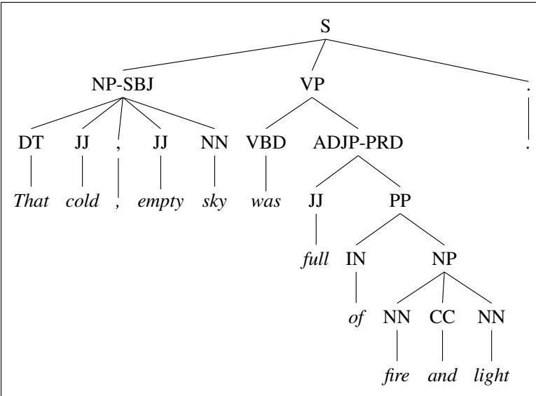

# F.4 树库

由上下文无关语法规则组成、鲁棒性足够强的语法，可以为任意句子指派一棵句法分析树。这意味着可以建立一种语料库，其中的每个句子都与相应的分析树配对。这种带有句法标注的语料库称为**树库**（treebank）。正如第 19 章将讨论的那样，树库在句法分析中作用重大；它对于句法现象的语言学研究也同样重要。

人们已经建立了各种各样的树库。一般做法是先用句法分析器（如后面几章介绍的分析器）自动分析每个句子，再由人类（语言学家）手工校正结果。宾州树库项目（其词性标注集已在第 18 章介绍）以英语的 Brown、Switchboard、ATIS 和 *Wall Street Journal* 语料库为基础建立了树库，也建立了阿拉伯语和汉语树库。还有许多树库采用第 20 章将介绍的依存表示，其中很多属于通用依存关系（Universal Dependencies）项目（Nivre et al., 2016）。

## F.4.1 示例：宾州树库项目

图 F.7 展示了宾州树库 Brown 部分和 ATIS 部分的句子。<sup>2</sup> 注意两者词性标记的格式差异；这种细小差异十分常见，在处理树库时必须妥善应对。宾州树库词性标注集已在第 18 章定义。用 LISP 风格的圆括号记法表示树非常常见，它与前面 (F.1) 所见的括号表示法类似。为方便不熟悉这种写法的读者，图 F.8 给出了标准的节点–连线树形表示。

```lisp
;; (a) Brown 语料库
(S
  (NP-SBJ (DT That) (JJ cold) (, ,) (JJ empty) (NN sky))
  (VP (VBD was)
    (ADJP-PRD (JJ full)
      (PP (IN of) (NP (NN fire) (CC and) (NN light)))))
  (. .))

;; (b) ATIS 语料库
(S
  (NP-SBJ (DT The) (NN flight))
  (VP (MD should)
    (VP (VB arrive)
      (PP-TMP (IN at) (NP (CD eleven) (RB a.m.)))
      (NP-TMP (NN tomorrow))))
  (. .))
```

**图 F.7　LDC Treebank3 版本中 (a) Brown 与 (b) ATIS 语料库的已分析句子。**



**图 F.8　上一图 Brown 语料库句子所对应的树。**

图 F.9 给出一棵来自 *Wall Street Journal* 的树。它展示了宾州树库的另一个特征：用语迹（`-NONE-` 节点）标记长距离依存或句法移位。例如，引语通常跟在 *say* 之类的引述动词之后。但在这个例子中，引语 *We would have to wait until we have collected on those assets* 出现在 *he said* 之前。一个只含 `-NONE-` 节点的空 S，标出了引语句通常在 *said* 之后出现的位置。在 Treebank II 和 III 中，这个空节点标有索引 2，句首的引语 S 也标有相同索引。这种**同标索引**（co-indexing）可以帮助某些分析器恢复如下事实：这个前置或话题化的引语是动词 *said* 的补语。类似地，另一个 `-NONE-` 节点标明动词 *to wait* 之前没有句法主语；其主语其实是前面出现的 NP *We*。二者也都共同标有索引 1。

```lisp
((S (`` ``)
  (S-TPC-2
    (NP-SBJ-1 (PRP We))
    (VP (MD would)
      (VP (VB have)
        (S
          (NP-SBJ (-NONE- *-1))
          (VP (TO to)
            (VP (VB wait)
              (SBAR-TMP (IN until)
                (S
                  (NP-SBJ (PRP we))
                  (VP (VBP have)
                    (VP (VBN collected)
                      (PP-CLR (IN on)
                        (NP (DT those) (NNS assets)))))))))))))
  (, ,) ('' '')
  (NP-SBJ (PRP he))
  (VP (VBD said)
    (S (-NONE- *T*-2)))
  (. .)))
```

**图 F.9　LDC 宾州树库 *Wall Street Journal* 部分的一个句子。注意空 `-NONE-` 节点的使用。**

Penn Treebank II 和 Treebank III 版本加入了更多信息，以便恢复谓词与论元之间的关系。某些短语带有标记，用来说明该短语的语法功能（表层主语、逻辑话题、分裂结构、非 VP 谓词）、它是否出现在特定文本类别中（新闻标题、作品标题），以及它的语义功能（时间短语、地点）（Marcus et al., 1994；Bies et al., 1995）。图 F.9 给出了 `-SBJ`（表层主语）和 `-TMP`（时间短语）标记的例子。图 F.8 还展示了 `-PRD` 标记，它用于不是 VP 的谓词（图 F.8 中的谓词是 ADJP）。第 20 章讨论依存语法和依存分析时，我们还会回到语法功能这一主题。

## F.4.2 把树库视为语法

树库中的句子隐式构成了被标注语料库所代表语言的一套语法。例如，可以从图 F.7 和图 F.9 的三个已分析句子中提取其中出现的每条 CFG 规则。为简化起见，先去掉规则后缀（`-SBJ` 等）。所得语法如图 F.10 所示。

用于分析宾州树库的语法相对扁平，因此会产生数量很多、长度很长的规则。例如，在大约 4,500 条不同的 VP 展开规则中，任意长度的 PP 序列以及动词论元的每一种可能排列都有独立规则：

```text
VP → VBD PP
VP → VBD PP PP
VP → VBD PP PP PP
VP → VBD PP PP PP PP
VP → VB ADVP PP
VP → VB PP ADVP
VP → ADVP VB PP
```

还有更长的规则，例如：

```text
VP → VBP PP PP PP PP PP ADVP PP
```

这条规则来自下句中斜体标出的 VP：

> This mostly happens because we *go from football in the fall to lifting in the winter to football again in the spring*.  
> 这主要是因为我们*从秋天踢橄榄球转到冬天举重，到春天又踢橄榄球*。

<table><tr><th>语法</th><th>词典</th></tr><tr><td><code>S → NP VP .</code></td><td><code>PRP → we | he</code></td></tr><tr><td><code>S → NP VP</code></td><td><code>DT → the | that | those</code></td></tr><tr><td><code>S → “ S ” , NP VP .</code></td><td><code>JJ → cold | empty | full</code></td></tr><tr><td><code>S → -NONE-</code></td><td><code>NN → sky | fire | light | flight | tomorrow</code></td></tr><tr><td><code>NP → DT NN</code></td><td><code>NNS → assets</code></td></tr><tr><td><code>NP → DT NNS</code></td><td><code>CC → and</code></td></tr><tr><td><code>NP → NN CC NN</code></td><td><code>IN → of | at | until | on</code></td></tr><tr><td><code>NP → CD RB</code></td><td><code>CD → eleven</code></td></tr><tr><td><code>NP → DT JJ , JJ NN</code></td><td><code>RB → a.m.</code></td></tr><tr><td><code>NP → PRP</code></td><td><code>VB → arrive | have | wait</code></td></tr><tr><td><code>NP → -NONE-</code></td><td><code>VBD → was | said</code></td></tr><tr><td><code>VP → MD VP</code></td><td><code>VBP → have</code></td></tr><tr><td><code>VP → VBD ADJP</code></td><td><code>VBN → collected</code></td></tr><tr><td><code>VP → VBD S</code></td><td><code>MD → should | would</code></td></tr><tr><td><code>VP → VBN PP</code></td><td><code>TO → to</code></td></tr><tr><td><code>VP → VB S</code></td><td></td></tr><tr><td><code>VP → VB SBAR</code></td><td></td></tr><tr><td><code>VP → VBP VP</code></td><td></td></tr><tr><td><code>VP → VBN PP</code></td><td></td></tr><tr><td><code>VP → TO VP</code></td><td></td></tr><tr><td><code>SBAR → IN S</code></td><td></td></tr><tr><td><code>ADJP → JJ PP</code></td><td></td></tr><tr><td><code>PP → IN NP</code></td><td></td></tr></table>

**图 F.10　从图 F.7 和图 F.9 的三个树库句子中可以提取出的部分 CFG 语法规则与词汇条目。**

数千条 NP 规则中的一部分包括：

```text
NP → DT JJ NN
NP → DT JJ NNS
NP → DT JJ NN NN
NP → DT JJ JJ NN
NP → DT JJ CD NNS
NP → RB DT JJ NN NN
NP → RB DT JJ JJ NNS
NP → DT JJ JJ NNP NNS
NP → DT NNP NNP NNP NNP JJ NN
NP → DT JJ NNP CC JJ JJ NN NNS
NP → RB DT JJS NN NN SBAR
NP → DT VBG JJ NNP NNP CC NNP
NP → DT JJ NNS , NNS CC NN NNS NN
NP → DT JJ JJ VBG NN NNP NNP FW NNP
NP → NP JJ , JJ “ SBAR ” NNS
```

例如，最后两条规则来自下面两个名词短语：

> [<sub>DT</sub> The] [<sub>JJ</sub> state-owned] [<sub>JJ</sub> industrial] [<sub>VBG</sub> holding] [<sub>NN</sub> company] [<sub>NNP</sub> Instituto] [<sub>NNP</sub> Nacional] [<sub>FW</sub> de] [<sub>NNP</sub> Industria]

> [<sub>NP</sub> Shearson’s] [<sub>JJ</sub> easy-to-film], [<sub>JJ</sub> black-and-white] “[<sub>SBAR</sub> Where We Stand]” [<sub>NNS</sub> commercials]

以这种方式把它看成大型语法时，约含 100 万词的 Penn Treebank III *Wall Street Journal* 语料库也含有约 100 万个非词汇规则词例，由约 17,500 种不同规则类型组成。

树库语法的一些性质（例如扁平规则数量庞大）会给概率句法分析算法造成问题。因此，从树库提取语法后，通常还要作各种修改。附录 E 将进一步讨论这些修改。

## F.4.3 中心词与中心词查找

前面曾非正式地指出，句法成分可以与一个词汇中心词相关联：N 是 NP 的中心词，V 是 VP 的中心词。为每个成分指定中心词的思想可以追溯到 Bloomfield（1914），也是第 20 章将介绍的依存语法和依存分析的核心。中心词在概率句法分析（附录 E）以及中心词驱动短语结构语法（Head-Driven Phrase Structure Grammar；Pollard and Sag, 1994）等基于成分的语法形式体系中也很重要。

在一种简单的词汇中心词模型中，每条上下文无关规则都与一个中心词相关联（Charniak, 1997；Collins, 1999）。中心词是短语中在语法上最重要的词。中心词沿句法分析树向上传递；因此，树中每个非终结符都标有一个词，即它的词汇中心词。图 F.11 给出 Collins（1999）的一棵示例树，其中每个非终结符都标注了自己的中心词。


**图 F.11　Collins（1999）的一棵词汇化树。**

要生成这样的树，每条 CFG 规则都必须扩充信息，指定右侧某个成分为**中心子节点**（head child）。随后把一个节点的中心词设为其中心子节点的中心词。在教科书示例中，选择中心子节点很简单（NN 是 NP 的中心），但对大多数短语而言却很复杂，甚至颇具争议。（不定式动词短语的中心应当是补语标记 *to*，还是动词？）现代句法理论一般都包含定义中心词的组成部分（例如 Pollard and Sag, 1994）。

大多数实际计算系统采用另一种方法查找中心词。中心词规则不在语法本身中规定，而是在具体句子的树语境中动态识别。换言之，句子完成分析后，系统遍历所得树，为每个节点标上适当的中心词。目前多数系统依赖一组简单的手写规则，例如 Collins（1999）为宾州树库语法给出的实用规则；它最初由 Magerman（1995）提出。查找 NP 中心词的规则如下（Collins, 1999, p. 238）：

- 如果最后一个词的标记是 POS，返回最后一个词。

- 否则，从右向左查找第一个类型为 NN、NNP、NNPS、NX、POS 或 JJR 的子节点。

- 否则，从左向右查找第一个类型为 NP 的子节点。

- 否则，从右向左查找第一个类型为美元符号标记、ADJP 或 PRN 的子节点。

- 否则，从右向左查找第一个类型为 CD 的子节点。

- 否则，从右向左查找第一个类型为 JJ、JJS、RB 或 QP 的子节点。

- 否则，返回最后一个词。

这组规则中的其他一些规则见图 F.12。例如，对形如 $VP\to Y_1\cdots Y_n$ 的 VP 规则，算法先从 $Y_1\cdots Y_n$ 左端开始，寻找第一个类型为 TO 的 $Y_i$；若不存在 TO，则寻找第一个 VBD；若不存在 VBD，则寻找 VBN，依此类推。更多细节见 Collins（1999）。

<table><tr><th>父节点</th><th>方向</th><th>优先级列表</th></tr><tr><td>ADJP</td><td>从左</td><td>NNS QP NN &#36; ADVP JJ VBN VBG ADJP JJR NP JJS DT FW RBR RBS SBAR RB</td></tr><tr><td>ADVP</td><td>从右</td><td>RB RBR RBS FW ADVP TO CD JJR JJ IN NP JJS NN</td></tr><tr><td>PRN</td><td>从左</td><td></td></tr><tr><td>PRT</td><td>从右</td><td>RP</td></tr><tr><td>QP</td><td>从左</td><td>&#36; IN NNS NN JJ RB DT CD NCD QP JJR JJS</td></tr><tr><td>S</td><td>从左</td><td>TO IN VP S SBAR ADJP UCP NP</td></tr><tr><td>SBAR</td><td>从左</td><td>WHNP WHPP WHADVP WHADJP IN DT S SQ SINV SBAR FRAG</td></tr><tr><td>VP</td><td>从左</td><td>TO VBD VBN MD VBZ VB VBG VBP VP ADJP NN NNS NP</td></tr></table>

**图 F.12　Collins（1999）的部分中心词规则。中心词规则也叫作中心词渗透表（head percolation table）。**
