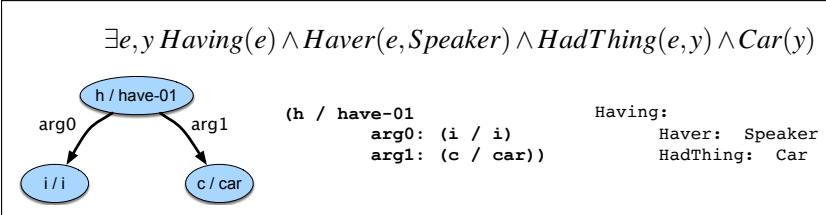

# 句子意义的逻辑表示

[原始 PDF](../../MinerU-Skill/ed3book_aug26_3a047d/split_pdf/H.pdf)

> 以实玛利：这一切肯定不会毫无意义。
>
> ——赫尔曼·梅尔维尔，《白鲸》

本附录介绍这样一种思想：语言表达式的意义可以用称为**意义表示**（meaning representation）的形式结构来捕捉。考虑一些需要某种语义处理的任务，例如通过阅读手册学习使用一款新软件、阅读菜单决定在餐厅点什么菜，或者按照食谱烹饪。完成这些任务需要把语言元素同必要的、有关世界的非语言知识联系起来的表示。阅读菜单并决定点什么、建议去哪里吃晚餐、遵循食谱以及生成新食谱，都需要有关食物及其制作方法、人们喜欢吃什么以及餐厅是什么样的知识。通过阅读手册学习使用软件，或就软件使用提供建议，则需要有关该软件及相似应用、计算机和一般用户的知识。

本附录假设，语言表达式拥有意义表示，而这些表示由表示日常世界常识所用的同类材料构成。创建这些表示并把它们赋给语言输入的过程，称为**语义解析**（semantic parsing）或**语义分析**（semantic analysis）；设计意义表示及相应语义解析器的整个研究领域，称为**计算语义学**（computational semantics）。

**图 H.1　一个符号列表、两个有向图和一个记录结构：句子 *I have a car* 的若干意义表示示例。**

图 H.1 使用四种常见的意义表示语言，给出了句子 *I have a car* 的意义表示示例。最上面一行是一个一阶逻辑句子，H.3 节将详细介绍；有向图及其对应的文本形式是抽象意义表示（Abstract Meaning Representation，AMR）的示例（Banarescu et al., 2013）；右侧则是基于框架或槽位填充的表示，H.5 节和第 21 章还会讨论。

尽管这些方法之间存在不可忽视的差异，它们都共享一个观念：意义表示由一组符号——即表示词汇表——组合而成的结构构成。适当排列后，这些符号结构就被认为对应于所表示或推理的某种事态中的对象、对象属性以及对象间关系。本例的四种表示都使用了与说话者、一辆汽车以及表示前者拥有后者的关系相对应的符号。

重要的是，在所有这些方法中，都可以从至少两个不同视角看待这些表示：它们既是特定语言输入 *I have a car* 的意义表示，也是某个世界中某种事态的表示。正是这种双重视角，使这些表示能够把语言输入同世界以及我们关于世界的知识联系起来。

接下来几节提供一些背景知识：我们对意义表示语言有哪些期望，以及如何保证这些表示确实能完成我们需要的任务——与被表示的事态建立对应关系。H.3 节将介绍一阶逻辑，它历来是研究自然语言语义的主要技术；H.4 节则说明如何用它捕捉英语事件和状态的语义。
