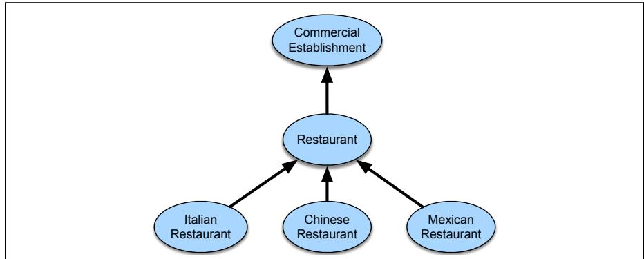
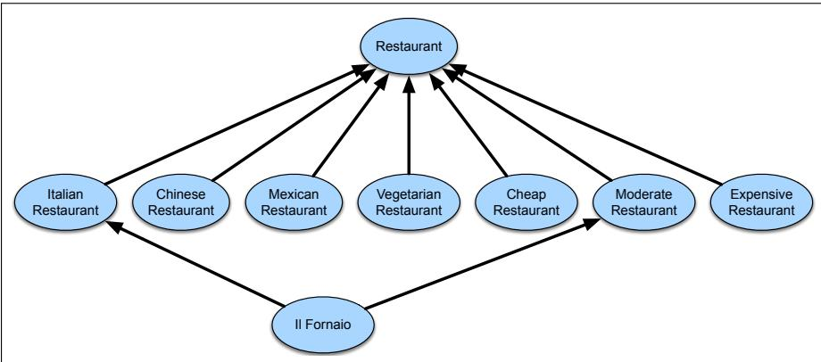

# H.5 描述逻辑

正如本附录开头所说，人们已经发明了相当多的表示方案来捕捉语言话语的含义。如今人们普遍认为，原则上，这些不同方法所表示的含义都能较容易地转换为 FOL 中的等价陈述。困难在于，其中许多方法以程序方式定义陈述的语义；也就是说，含义来自解释该陈述的系统对它所作的操作。

**描述逻辑**（Description Logics，DL）旨在更明确地规定这些早期结构化网络表示的语义，并提供一个尤其适合某些领域建模任务的概念框架。形式上，“描述逻辑”是一个逻辑方法家族，其中各方法分别对应 FOL 的不同子集。对描述逻辑表达能力施加限制，可以保证多种关键推理任务在计算上可处理。不过，这里关注的是 DL 的建模方面，而非计算复杂度问题。

使用描述逻辑为应用领域建模时，重点是表示有关**范畴**、属于这些范畴的**个体**，以及这些个体之间可能成立的**关系**的知识。构成特定应用领域的范畴或概念集合称为该领域的**术语体系**（terminology）。知识库中包含术语体系的部分传统上称为 **TBox**；与之相对，包含个体事实的部分称为 **ABox**。术语体系一般排列成一种叫作**本体**（ontology）的层级结构，用来捕捉范畴之间的子集/超集关系。

回到前面的餐饮领域，我们曾用 $Restaurant(x)$ 之类的一元谓词表示领域概念；在 DL 中，其等价形式省略变量，所以餐厅范畴直接写作 $Restaurant$。2 为捕捉某个具体领域元素（如 Frasca）是一家餐厅这一事实，我们像在 FOL 中一样断言 $Restaurant(Frasca)$。这些范畴的语义与 H.2 节介绍的方法完全相同：$Restaurant$ 这样的范畴表示领域元素中所有餐厅构成的集合。

指定特定领域中所关心的范畴后，下一步是把它们排列成层级结构。捕捉术语体系中的层级关系有两种方法：可以直接断言具有层级关系的范畴之间的关系；也可以为概念提供完整定义，再依靠推理得到层级关系。如何选择，取决于所得范畴的用途，以及能否为许多自然出现的范畴制定精确定义。这里先讨论第一种方法，本节稍后再回到定义方法。

为直接指定层级结构，可以在术语体系的适当概念之间断言**包含关系**（subsumption relation）。这一关系通常写作 $C\sqsubseteq D$，读作“C 被 D 包含”；也就是说，范畴 C 的所有成员也都是范畴 D 的成员。不出所料，该关系的形式语义由简单的集合关系给出：凡是属于 C 所指集合的领域元素，也属于 D 所指集合。

向 TBox 加入下列陈述，就断言了所有餐厅都是商业场所，而且餐厅还存在多种子类型：

$$
Restaurant\sqsubseteq CommercialEstablishment
\tag{H.47}
$$

$$
ItalianRestaurant\sqsubseteq Restaurant
\tag{H.48}
$$

$$
ChineseRestaurant\sqsubseteq Restaurant
\tag{H.49}
$$

$$
MexicanRestaurant\sqsubseteq Restaurant
\tag{H.50}
$$

这种本体通常用图 H.5 一类图示表示，其中，代表各范畴的节点之间用连线表示包含关系。

**图 H.5　餐厅领域中一组包含关系的图形网络表示。**

请注意，恰恰是这种语义网络图含义模糊，才推动了描述逻辑的发展。例如，仅凭这张图，我们无法判断给定范畴集合是否穷尽所有情况，或者各范畴是否互斥。也就是说，我们不知道这些是否就是领域内要处理的全部餐厅类型，还是还可能有其他类型；也不知道一家具体餐厅是否只能归入其中一类，还是可能同时属于两类，例如既是意大利餐厅又是中餐厅。上面的 DL 陈述含义更加透明：它们只断言范畴间的一组包含关系，不对覆盖性或互斥性作任何主张。

如果应用需要覆盖性和互斥性信息，就必须明确写出。捕捉这类信息最简单的方法是使用否定与析取运算符。例如，下列断言说明中餐厅不可能同时也是意大利餐厅：

$$
ChineseRestaurant\sqsubseteq \neg ItalianRestaurant
\tag{H.51}
$$

要指明一组子概念覆盖某个范畴，可以使用析取：

$$
Restaurant\sqsubseteq ItalianRestaurant\sqcup ChineseRestaurant
\sqcup MexicanRestaurant
\tag{H.52}
$$

仅有图 H.5 这样的层级结构，几乎没有告诉我们其中概念的实质。我们当然不知道什么性质使一家餐厅成为餐厅，更不用说什么使它成为意大利餐厅、中餐厅或昂贵餐厅。还需要加入额外断言，说明成为这些范畴成员意味着什么。在描述逻辑中，这些陈述表现为被描述概念与领域内其他概念之间的关系。由于源自结构化网络表示，描述逻辑中的关系通常是二元的，且常称为**角色**（role）或**角色关系**。

为了说明这种关系怎样工作，回看本附录前面讨论过的一些餐厅事实。我们用 `hasCuisine` 关系捕捉餐厅供应哪类食物，用 `hasPriceRange` 关系捕捉具体餐厅通常有多贵。利用这些关系，可以更具体地描述各类餐厅。先从 `ItalianRestaurant` 概念开始。作为初步近似，可以作出一个没有争议的陈述：意大利餐厅供应意大利菜。为捕捉这些概念，先向术语体系加入一些代表各种菜系的新概念：

$$
\begin{array}{lll}
MexicanCuisine\sqsubseteq Cuisine
&&ExpensiveRestaurant\sqsubseteq Restaurant\\
ItalianCuisine\sqsubseteq Cuisine
&&ModerateRestaurant\sqsubseteq Restaurant\\
ChineseCuisine\sqsubseteq Cuisine
&&CheapRestaurant\sqsubseteq Restaurant\\
VegetarianCuisine\sqsubseteq Cuisine
\end{array}
$$

接着修改先前的 `ItalianRestaurant`，加入菜系信息：

$$
ItalianRestaurant\sqsubseteq Restaurant\sqcap
\exists hasCuisine.ItalianCuisine
\tag{H.53}
$$

这个表达式的正确读法是：`ItalianRestaurant` 范畴中的个体既被 `Restaurant` 范畴包含，也被存在子句所定义的一个未命名类包含；这个未命名类就是供应意大利菜的实体集合。等价的 FOL 陈述为：

$$
\forall x\; ItalianRestaurant(x)\Rightarrow
\bigl(Restaurant(x)\land
(\exists y\; Serves(x,y)\land ItalianCuisine(y))\bigr)
\tag{H.54}
$$

这项 FOL 翻译清楚地显示了上述 DL 断言能蕴涵什么、不能蕴涵什么。尤其是，它们并没有说被归为意大利餐厅的领域实体不能参与其他关系，例如价格昂贵，甚至供应中国菜。更关键的是，它们对已知确实供应意大利菜的领域实体几乎没有作出陈述。查看 FOL 翻译便可发现，我们不能根据新实体的特征推断它属于该范畴；充其量只能对明确告知属于该范畴的餐厅推断出新事实。

当然，在给定某些特征后推断个体的范畴成员资格，是必须支持的一项常见而关键的推理任务。这让我们回到在术语体系中建立层级结构的另一种方法：以成为范畴成员的充分必要条件为形式，真正给出所建范畴的定义。在这里，可以把 `ItalianRestaurant` 明确定义为供应意大利菜的餐厅，把 `ModerateRestaurant` 定义为价格区间适中的餐厅：

$$
ItalianRestaurant\equiv Restaurant\sqcap
\exists hasCuisine.ItalianCuisine
\tag{H.55}
$$

$$
ModerateRestaurant\equiv Restaurant\sqcap
\exists hasPriceRange.ModeratePrices
\tag{H.56}
$$

先前的陈述只提供成为这些范畴成员的必要条件，而这里的陈述同时提供了充分条件和必要条件。

最后，考虑表面上相似的素食餐厅。显然，素食餐厅是供应素食菜品的餐厅。但它们不只是“会供应”素食菜品，而是**只**供应素食菜品。可以在先前对 `VegetarianRestaurant` 的描述中加入一个全称量化限制，以容纳这类约束：

$$
\begin{aligned}
VegetarianRestaurant\equiv {}&Restaurant\\
&\sqcap\exists hasCuisine.VegetarianCuisine\\
&\sqcap\forall hasCuisine.VegetarianCuisine
\end{aligned}
\tag{H.57}
$$

## 推理

描述逻辑在表示上聚焦范畴、关系和个体，与此相对应，它在处理上也聚焦逻辑推理的一个受限子集。DL 推理系统并不采用 FOL 所允许的全部推理方式，而是强调紧密相关的**包含判断**（subsumption）与**实例检查**（instance checking）问题。

包含判断作为一种推理任务，是依据术语体系中断言的事实，确定两个概念之间是否存在超集/子集关系。与之相应，实例检查则询问：根据已知的个体事实和术语体系事实，某个个体能否成为某个范畴的成员。包含判断和实例检查背后的推理机制，不能只检查术语体系中明确陈述的包含关系；它还必须显式利用针对术语体系断言的关系信息进行推理，得出适当的包含关系和成员关系。

回到餐厅领域，用下列陈述加入一种新的餐厅类型：

$$
IlFornaio\sqsubseteq ModerateRestaurant\sqcap
\exists hasCuisine.ItalianCuisine
\tag{H.58}
$$

给定这一断言，可以询问 IlFornaio 连锁餐厅能否归类为意大利餐厅或素食餐厅。更准确地说，可以向推理系统提出以下问题：

$$
IlFornaio\sqsubseteq ItalianRestaurant\;?
\tag{H.59}
$$

$$
IlFornaio\sqsubseteq VegetarianRestaurant\;?
\tag{H.60}
$$

第一个问题的答案是肯定的，因为 IlFornaio 满足我们为 `ItalianRestaurant` 范畴指定的标准：它是 `Restaurant`，因为我们明确把它归为 `ModerateRestaurant`，后者是 `Restaurant` 的子类型；它也满足 `hasCuisine` 类限制，因为我们直接断言了这一点。

第二个问题的答案是否定的。回忆一下，素食餐厅的标准包含两个要求：必须供应素食菜品，而且只能供应素食菜品。当前的 IlFornaio 定义在两方面都不满足要求：我们没有断言任何表示 IlFornaio 供应素食菜品的关系；已经断言的关系 `hasCuisine.ItalianCuisine` 又与第二项标准矛盾。

另一项相关推理任务以基本包含推理为基础：根据术语体系中有关范畴的事实，推导其隐含层级结构。这项任务大体相当于对术语体系中的概念对反复应用包含运算符。给定当前的陈述集合，可以推导出图 H.6 所示的扩展层级。读者应当自行验证：依据当前知识，这张图包含所有且仅包含应该存在的包含关系连线。

**图 H.6　根据当前 TBox 的断言集合得到的餐厅领域完整包含关系图形网络表示。**

**实例检查**是判断某个具体个体能否归为某个范畴成员的任务。这个过程取得关于给定个体的已知信息——关系和显式范畴陈述——并将其同当前术语体系的已知信息比较，随后返回该个体能够归入的最具体范畴列表。

来看一个分类问题的例子。假设我们得知某家名为 Gondolier 的机构是一家餐厅，并供应意大利菜：

$$
Restaurant(Gondolier)
$$

$$
hasCuisine(Gondolier,ItalianCuisine)
$$

这里，已知项 `Gondolier` 所指的实体是一家餐厅并供应意大利食物。根据这些新信息和当前 TBox 的内容，我们可能合理地询问：它是不是意大利餐厅，是不是素食餐厅，或者价格是否适中。

假定采用前面给出的定义性陈述，确实可以把 Gondolier 归为意大利餐厅，因为已有信息满足成为该范畴成员所需的充分必要条件。同 IlFornaio 范畴一样，这个个体也不符合 `VegetarianRestaurant` 的既定标准。最后，Gondolier 也可能是一家价格适中的餐厅，但现在还无法判断，因为我们不知道它的任何价格信息。这意味着，给定当前知识，查询 $ModerateRestaurant(Gondolier)$ 的答案将为假，因为它缺少所需的 `hasPriceRange` 关系。

包含判断、实例检查以及实际应用所需其他推理的实现，会因所用描述逻辑的表达能力而异。不过，即使对表达能力不高的描述逻辑，主要实现技术也是以可满足性方法为基础，而可满足性方法又依赖本附录前面介绍的模型论语义。

## OWL 与语义网

迄今为止，描述逻辑最引人注目的用途，是参与**语义网**（Semantic Web）的发展。语义网是一项持续推进的工作，旨在提供一种形式化规定 Web 内容语义的方法（Fensel et al., 2003）。这项工作的一项关键内容，是针对各种相关应用领域创建和部署本体。表示这类知识所用的意义表示语言是 **Web 本体语言**（Web Ontology Language，OWL；McGuiness and van Harmelen, 2004）。OWL 所体现的描述逻辑，大体对应于这里介绍的体系。
