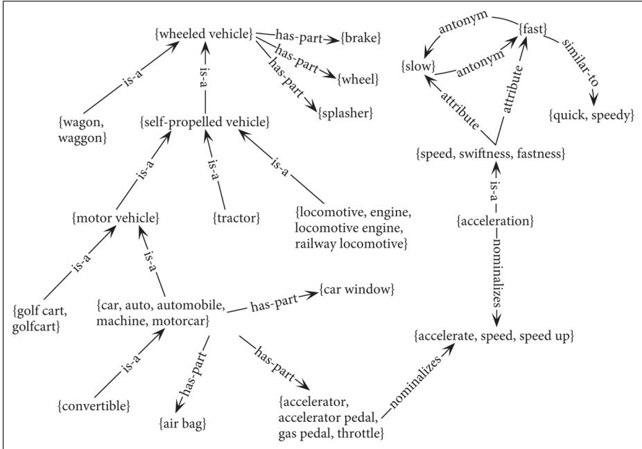

# I.3 WordNet：词汇关系数据库

对英语及许多其他语言而言，最常用的义项关系资源是 WordNet 词汇数据库（Fellbaum, 1998）。英语 WordNet 由三个彼此独立的数据库构成：一个用于名词，一个用于动词，第三个用于形容词和副词；其中不包含封闭类词。每个数据库都包含一组词元，每个词元又标注了一组义项。WordNet 3.0 版收录 117,798 个名词、11,529 个动词、22,479 个形容词和 4,481 个副词。名词平均有 1.23 个义项，动词平均有 2.16 个义项。WordNet 可以通过 Web 访问，也可以下载到本地。图 I.1 展示了名词 *bass* 的词元条目。

名词 *bass* 在 WordNet 中有 8 个义项：

1. bass<sup>1</sup>——（音域的最低部分）；
2. bass<sup>2</sup>, bass part<sup>1</sup>——（复调音乐中的最低声部）；
3. bass<sup>3</sup>, basso<sup>1</sup>——（具有最低音域的成年男歌手）；
4. sea bass<sup>1</sup>, bass<sup>4</sup>——（鮨科咸水鱼的瘦肉）；
5. freshwater bass<sup>1</sup>, bass<sup>5</sup>——（各种肉质精瘦的北美淡水鱼，尤指黑鲈属鱼类）；
6. bass<sup>6</sup>, bass voice<sup>1</sup>, basso<sup>2</sup>——（成年男性最低的歌唱声部）；
7. bass<sup>7</sup>——（某一乐器家族中音域最低的成员）；
8. bass<sup>8</sup>——（许多可食用海水及淡水棘鳍鱼的非技术性名称）。

**图 I.1　WordNet 3.0 中名词 *bass* 条目的一部分。**

请注意，这里共有八个义项；每个义项都有释义（词典式定义）和该义项的同义词列表，有时还附有用例。WordNet 不表示发音，因此不会把 bass<sup>4</sup>、bass<sup>5</sup> 和 bass<sup>8</sup> 的读音 [bæs] 与其他义项的读音 [beɪs] 区分开来。

WordNet 中某个义项的一组近义词称为**同义词集**（synset，即 synonym set）；同义词集是 WordNet 中重要的基本单位。*bass* 条目包含诸如 {bass<sup>1</sup>, deep<sup>6</sup>} 或 {bass<sup>6</sup>, bass voice<sup>1</sup>, basso<sup>2</sup>} 这样的同义词集。可以把同义词集看作对附录 H 所讨论的那类概念的表示。因此，WordNet 并不以逻辑术语表示概念，而是把概念表示成能够表达它的一组词义。例如，另一个同义词集是：

> {chump<sup>1</sup>, fool<sup>2</sup>, gull<sup>1</sup>, mark<sup>9</sup>, patsy<sup>1</sup>, fall guy<sup>1</sup>, sucker<sup>1</sup>, soft touch<sup>1</sup>, mug<sup>2</sup>}

这个同义词集的释义为：

> **释义：** 容易受骗、容易被人利用的人。

释义是同义词集的属性，因此同义词集中的每个义项都有相同的释义，都可以表达该概念。正因为共享释义，这样的同义词集才是与 WordNet 条目相关联的基本单位；所以参与 WordNet 中大多数词汇义项关系的是同义词集，而不是词形、词元或单个义项。

WordNet 还为每个同义词集标注一个取自语义场的词典编纂类别，例如图 I.2 所示的 26 个名词类别；此外还有 15 个动词类别、2 个形容词类别和 1 个副词类别。这些类别常称为**超义项**（supersense），因为它们充当粗粒度语义类别或义项分组；当词义划分过细时，这些类别很有用（Ciaramita and Johnson, 2003；Ciaramita and Altun, 2006）。研究者也为形容词（Tsvetkov et al., 2014）和介词（Schneider et al., 2018）定义了超义项。

<table><tr><th>类别</th><th>示例</th><th>类别</th><th>示例</th><th>类别</th><th>示例</th></tr><tr><td>ACT</td><td>service</td><td>GROUP</td><td>place</td><td>PLANT</td><td>tree</td></tr><tr><td>ANIMAL</td><td>dog</td><td>LOCATION</td><td>area</td><td>POSSESSION</td><td>price</td></tr><tr><td>ARTIFACT</td><td>car</td><td>MOTIVE</td><td>reason</td><td>PROCESS</td><td>process</td></tr><tr><td>ATTRIBUTE</td><td>quality</td><td>NATURAL EVENT</td><td>experience</td><td>QUANTITY</td><td>amount</td></tr><tr><td>BODY</td><td>hair</td><td>NATURAL OBJECT</td><td>flower</td><td>RELATION</td><td>portion</td></tr><tr><td>COGNITION</td><td>way</td><td>OTHER</td><td>stuff</td><td>SHAPE</td><td>square</td></tr><tr><td>COMMUNICATION</td><td>review</td><td>PERSON</td><td>people</td><td>STATE</td><td>pain</td></tr><tr><td>FEELING</td><td>discomfort</td><td>PHENOMENON</td><td>result</td><td>SUBSTANCE</td><td>oil</td></tr><tr><td>FOOD</td><td>food</td><td></td><td></td><td>TIME</td><td>day</td></tr></table>

**图 I.2　超义项：WordNet 中名词的 26 个词典编纂类别。**

## I.3.1 WordNet 中的义项关系

WordNet 表示上一节讨论过的各类义项关系，如图 I.3 和图 I.4 所示。

<table><tr><th>关系</th><th>别称</th><th>定义</th><th>示例</th></tr><tr><td>上位关系</td><td>上位词</td><td>从概念指向上位概念</td><td>breakfast<sup>1</sup> → meal<sup>1</sup></td></tr><tr><td>下位关系</td><td>下位词</td><td>从概念指向子类型</td><td>meal<sup>1</sup> → lunch<sup>1</sup></td></tr><tr><td>实例上位关系</td><td>实例</td><td>从实例指向其概念</td><td>Austen<sup>1</sup> → author<sup>1</sup></td></tr><tr><td>实例下位关系</td><td>拥有实例</td><td>从概念指向其实例</td><td>composer<sup>1</sup> → Bach<sup>1</sup></td></tr><tr><td>部分关系</td><td>拥有部分</td><td>从整体指向部分</td><td>table<sup>2</sup> → leg<sup>3</sup></td></tr><tr><td>整体关系</td><td>属于</td><td>从部分指向整体</td><td>course<sup>7</sup> → meal<sup>1</sup></td></tr><tr><td>反义关系</td><td></td><td>词元之间的语义对立</td><td>leader<sup>1</sup> ↔ follower<sup>1</sup></td></tr><tr><td>派生关系</td><td></td><td>具有相同形态词根的词元</td><td>destruction<sup>1</sup> ↔ destroy<sup>1</sup></td></tr></table>

**图 I.3　WordNet 中的部分名词关系。**

<table><tr><th>关系</th><th>定义</th><th>示例</th></tr><tr><td>上位关系</td><td>从事件指向上位事件</td><td>fly<sup>9</sup> → travel<sup>5</sup></td></tr><tr><td>方式关系（troponym）</td><td>从事件指向下位事件</td><td>walk<sup>1</sup> → stroll<sup>1</sup></td></tr><tr><td>蕴涵</td><td>从动词（事件）指向其蕴涵的动词（事件）</td><td>snore<sup>1</sup> → sleep<sup>1</sup></td></tr><tr><td>反义关系</td><td>词元之间的语义对立</td><td>increase<sup>1</sup> ↔ decrease<sup>1</sup></td></tr></table>

**图 I.4　WordNet 中的部分动词关系。**

例如，WordNet 通过直接上位和直接下位关系，把每个同义词集连接到紧邻的、更一般或更具体的同义词集，从而表示上下位关系。沿着这些关系继续前进，可以得到由越来越一般或越来越具体的同义词集构成的长链。图 I.5 给出了 bass<sup>3</sup> 和 bass<sup>7</sup> 的上位词链；越一般的同义词集缩进越深。

WordNet 有两类分类学实体：类和实例。实例是个体，即表示唯一实体的专有名词。例如，*San Francisco* 是 *city* 的一个实例；而 *city* 是一个类，是 *municipality* 的下位词，最终又是 *location* 的下位词。图 I.6 展示了 WordNet 的一个子图，其中体现了多种关系。

```text
bass³, basso（具有最低音域的成年男歌手）
=> singer, vocalist, vocalizer, vocaliser
  => musician, instrumentalist, player
    => performer, performing artist
      => entertainer
        => person, individual, someone...
          => organism, being
            => living thing, animate thing
              => whole, unit
                => object, physical object
                  => physical entity
                    => entity

bass⁷（某一乐器家族中音域最低的成员）
=> musical instrument, instrument
  => device
    => instrumentality, instrumentation
      => artifact, artefact
        => whole, unit
          => object, physical object
            => physical entity
              => entity
```

**图 I.5　词元 *bass* 两个不同义项的下位关系链。注意，两条链完全不同，直到 *whole, unit* 这一非常抽象的层级才汇合。**



**图 I.6　以图结构观察 WordNet。图引自 Navigli（2016）。**
