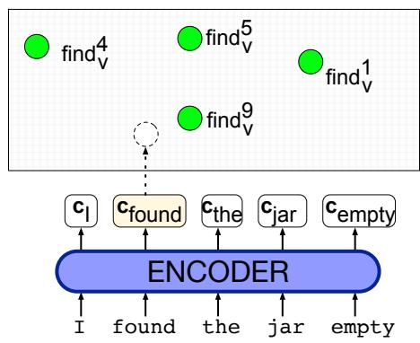

# I.4 词义消歧

为一个词选择正确义项的任务称为**词义消歧**（word sense disambiguation，WSD）。WSD 算法的输入是语境中的一个词和一份固定的候选义项清单，输出则是该词在此语境中的正确义项。

## I.4.1 WSD：任务与数据集

本节先介绍 WSD 的任务设置，再讨论算法。义项标签清单取决于具体任务。在英语到西班牙语翻译的义项标注任务中，一个英语词的义项标签清单可能就是它的各种西班牙语译法。对于医学文章自动索引，义项标签清单可能来自 MeSH（Medical Subject Headings，医学主题词表）的条目。我们也可以使用 WordNet 等资源中的义项集合；如果需要更粗粒度的集合，则可以使用超义项。图 I.7 展示了 *bass* 的一些此类示例。

<table><tr><th>WordNet 义项</th><th>西班牙语译词</th><th>WordNet 超义项</th><th>语境中的目标词</th></tr><tr><td>bass4</td><td>lubina</td><td>FOOD</td><td>... fish as Pacific salmon and striped bass and...</td></tr><tr><td>bass7</td><td>bajo</td><td>ARTIFACT</td><td>... play bass because he doesn't have to solo...</td></tr></table>

**图 I.7　*bass* 的几种候选义项标签清单。**

有些情况下，我们只需对少量词进行消歧。在这种**词汇样本任务**（lexical sample task）中，预先选定的目标词集合很小，每个词在某部词典中的候选义项清单也很小。由于词和义项的集合都很小，简单的有监督分类方法就能取得很好的效果。

但更常见的是一个更困难的问题：必须对一段文本中的所有词进行消歧。在这种**全词任务**（all-words task）中，系统得到一整段文本和一部为每个词条列出义项清单的词典，然后必须对文本中的每个词（有时仅对每个实词）进行消歧。全词任务类似词性标注，不过标签集合要大得多，因为每个词元都有自己的标签集合。标签集合庞大的一个后果就是数据稀疏。

有监督的全词消歧任务通常使用**语义索引**（semantic concordance）进行训练；这种语料库中的每个句子里，每个开放类词都依据某部特定词典或叙词表——最常见的是 WordNet——标注了词义。SemCor 语料库是 Brown Corpus 的一个子集，包含超过 226,036 个以人工方式标注 WordNet 义项的词（Miller et al., 1993；Landes et al., 1998）。SENSEVAL 和 SemEval 的 WSD 任务也构建了其他义项标注语料库，例如包含 2,282 个标注的 SENSEVAL-3 Task 1 英语全词测试数据（Snyder and Palmer, 2004），以及 SemEval-13 Task 12 数据集。荷兰语（Vossen et al., 2011）和德语（Henrich et al., 2012）等其他语言也有大型语义索引。

下面是 SemCor 语料库中的一个例子，其中显示了被标注词的 WordNet 义项编号；这里采用标准 WSD 记法，用下标标记词性（Navigli, 2009）：

> (I.12) You will find9v that avocado1n is1v unlike1 other1 fruit1n you have ever1r tasted2v.

对于人工标注测试集中的每个名词、动词、形容词或副词（例如 *fruit*），基于 SemCor 的 WSD 任务都要从 WordNet 的候选义项中选出正确义项。对 *fruit* 而言，这意味着要在正确答案 fruit1（种子植物成熟的生殖体）与另外两个义项 fruit2（产量；某种产品的数量）和 fruit3（某种努力或行动的后果）之间作出选择。图 I.8 概括了这项任务。

WSD 系统通常采用内在评估，即在留出集上将系统输出与人工义项标签对比并计算 F1；留出集可以是上面讨论的 SemCor 或 SemEval 语料库。

**图 I.8　全词 WSD 任务：把输入词（x）映射到 WordNet 义项（y）。只有名词、动词、形容词和副词会被映射；还要注意，示例中的 *guitar* 等词在 WordNet 中只有一个义项。图受 Chaplot and Salakhutdinov（2018）启发。**

一个出人意料地强的基线，是直接从有标签语料的义项中为每个词选择**最高频义项**（Gale et al., 1992a）。对 WordNet 而言，这相当于选择第一个义项，因为 WordNet 通常根据 SemCor 义项标注语料中的计数，按频率从高到低排列义项。最高频义项基线可能相当准确，因此经常被用作默认方法：当有监督算法的训练数据不足时，就用它提供词义。

第二种启发式方法称为**每篇语篇一个义项**（one sense per discourse），源自 Gale et al.（1992b）的研究。他们注意到，一个词在同一文本或语篇中多次出现时，往往采用同一个义项。对粗粒度义项，尤其是一个词的各义项互不相关时，这一启发式规律似乎更为成立，因此通常不把它用作基线。不过，各种消歧任务往往仍会加入某种偏置，倾向于在同一语篇片段中以相同方式消解同一歧义。

## I.4.2 WSD 算法：上下文嵌入

表现最佳的 WSD 算法是 Melamud et al.（2016）和 Peters et al.（2018）提出的一种简单的 1-最近邻算法，它使用上下文化词嵌入。训练时，我们让 SemCor 有标签数据集中的每个句子通过任意一种上下文嵌入模型（如 BERT），从而为 SemCor 中每个有标签词元得到一个上下文嵌入。（计算词元 $i$ 的上下文嵌入 $\mathbf{v}_i$ 有多种方法；对 BERT，常见做法是对多个层进行池化，即把 BERT 最后四层中 $i$ 的向量表示相加。）然后，对语料库中任一词的每个义项 $s$，将该义项的 $n$ 个词元的上下文表示取平均，得到 $s$ 的上下文义项嵌入 $\mathbf{v}_s$：

$$
\mathbf{v}_s=\frac{1}{n}\sum_i\mathbf{v}_i
\qquad \forall\mathbf{v}_i\in\mathrm{tokens}(s)
\tag{I.13}
$$

测试时，给定语境中的目标词词元 $t$，我们计算它的上下文嵌入 $\mathbf{t}$，并在训练集的义项中选择它的最近邻，也就是选择与 $\mathbf{t}$ 余弦相似度最高的义项嵌入：

$$
\mathrm{sense}(t)=
\underset{s\in\mathrm{senses}(t)}{\operatorname{argmax}}
\;\mathrm{cosine}(\mathbf{t},\mathbf{v}_s)
\tag{I.14}
$$

图 I.9 展示了这个模型。

**图 I.9　WSD 的最近邻算法。绿色表示为每个词的每个义项预先计算的上下文嵌入；这里仅展示 *find* 的少数义项。系统为目标词 *found* 计算上下文嵌入，然后选出最近邻义项（本例为 $\mathbf{find}^{9}_{v}$）。图受 Loureiro and Jorge（2019）启发。**

如果某个词从未出现在带义项标签的训练数据中，该怎么办？毕竟，SemCor 中出现的义项只覆盖 WordNet 词汇的一小部分。最简单的算法是退回最高频义项基线，即选取 WordNet 中的第一个义项。但这种办法并不令人满意。

Loureiro and Jorge（2019）提出了一种更强大的方法：利用 WordNet 分类体系和超义项，自底向上地**插补**缺失的义项嵌入。对于 WordNet 分类体系中的任意高层节点，可以通过其子节点嵌入的平均值得到该节点的义项嵌入：每个同义词集的嵌入是其义项嵌入的平均值；一个上位词的嵌入是其同义词集嵌入的平均值；词典编纂类别（超义项）的嵌入，则是具有该类别的大量同义词集嵌入的平均值。

更形式化地，对 WordNet 中每个缺失义项 $\hat{s}\in W$，令同一同义词集中其他成员的义项嵌入集合为 $S_{\hat{s}}$，特定于上位词的同义词集嵌入集合为 $H_{\hat{s}}$，特定于词典编纂类别（超义项）的同义词集嵌入集合为 $L_{\hat{s}}$。于是可以按下式计算 $\hat{s}$ 的义项嵌入：

$$
\mathrm{if}\quad |S_{\hat{s}}|>0,\qquad
\mathbf{v}_{\hat{s}}=\frac{1}{|S_{\hat{s}}|}\sum \mathbf{v}_s,
\quad \forall\mathbf{v}_s\in S_{\hat{s}}
\tag{I.15}
$$

$$
\mathrm{else\ if}\quad |H_{\hat{s}}|>0,\qquad
\mathbf{v}_{\hat{s}}=\frac{1}{|H_{\hat{s}}|}\sum \mathbf{v}_{syn},
\quad \forall\mathbf{v}_{syn}\in H_{\hat{s}}
\tag{I.16}
$$

$$
\mathrm{else\ if}\quad |L_{\hat{s}}|>0,\qquad
\mathbf{v}_{\hat{s}}=\frac{1}{|L_{\hat{s}}|}\sum \mathbf{v}_{syn},
\quad \forall\mathbf{v}_{syn}\in L_{\hat{s}}
\tag{I.17}
$$

由于所有超义项在 SemCor 中都有一些有标签数据，当算法回退到最一般的超义项信息时，必然能为所有候选义项得到某种表示，尽管这一表示当然非常粗糙。
