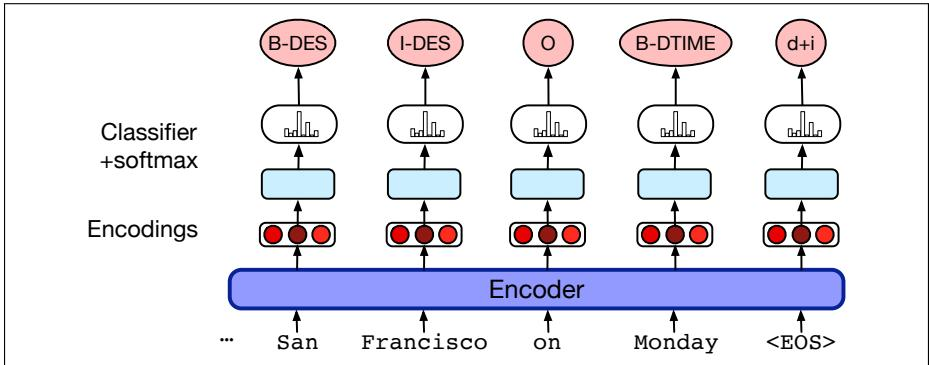

# 基于框架的对话系统

[原始 PDF](../../MinerU-Skill/ed3book_aug26_3a047d/split_pdf/K.pdf)

**任务型对话系统**（task-based dialogue system）的目标，是帮助用户完成某项具体任务，例如预订行程或购买商品。任务型对话系统以**框架**（frame）为核心；这一概念最早见于颇具影响力的旅行规划系统 GUS（Bobrow et al., 1977）。框架是一种知识结构，用于表示用户任务需求中的具体信息。每个框架包含一组**槽位**（slot），每个槽位都可以取一组可能的值。一组框架有时统称为**领域本体**（domain ontology）。

本附录介绍研究最为充分的框架式架构——**对话状态架构**（dialogue-state architecture），它由图 K.1 所示的六个组成部分构成。在解释框架概念之后，以下各节会介绍其中四个部分；语音识别和语音合成部分留到第 16 章讨论。


**图 K.1　面向任务对话的对话状态系统架构，改编自 Williams 等人（2016）。**

## K.0.1 框架与槽位填充

任务型对话系统中的框架及其槽位，规定了系统为了完成任务需要知道哪些信息。酒店预订系统需要日期和地点，闹钟系统需要时间。系统的目标是，用用户意图中的填充值填满框架槽位，再替用户执行相应操作，例如回答问题或预订航班。

图 K.2 给出一个预订航空旅行的示例框架，并列出用于填充槽位的一些问题。在最简单的框架式系统中——直到不久前，大多数商业助手都属于这一类——这些问题是预先写好的模板；较复杂的系统则会即时生成问题。槽位填充值通常受特定语义类型约束，例如类型 `CITY` 可取 San Francisco 或 Hong Kong 等值，其他类型还有 `DATE`、`AIRLINE` 和 `TIME`。

<table><tr><th>槽位</th><th>类型</th><th>示例问题</th></tr><tr><td>ORIGIN CITY</td><td>city</td><td>“您从哪个城市出发？”</td></tr><tr><td>DESTINATION CITY</td><td>city</td><td>“您要去哪里？”</td></tr><tr><td>DEPARTURE TIME</td><td>time</td><td>“您想什么时候出发？”</td></tr><tr><td>DEPARTURE DATE</td><td>date</td><td>“您想哪一天出发？”</td></tr><tr><td>ARRIVAL TIME</td><td>time</td><td>“您想什么时候抵达？”</td></tr><tr><td>ARRIVAL DATE</td><td>date</td><td>“您想哪一天抵达？”</td></tr></table>

**图 K.2　框架式对话系统中的一个框架，展示每个槽位的类型以及用于填充该槽位的示例问题。**

许多领域都需要多个框架。除了汽车或酒店预订框架外，还可能需要一般路线信息等其他框架，例如回答“哪些航空公司有从 Boston 飞往 San Francisco 的航班？”这意味着系统必须能够消除歧义，判断给定输入应当填入哪个框架的哪个槽位。

槽位填充通常与另外两项任务结合使用，从每条用户话语中抽取三类信息。第一类是**领域分类**（domain classification）：用户是在谈论航空旅行、设置闹钟，还是处理日历？第二类是**用户意图判定**（user intent determination）：用户想完成的总体任务或目标是什么？例如，任务可能是“查找电影”“显示航班”或“删除日历日程”。领域分类和意图判定共同决定当前要填充哪个框架。最后才是槽位填充本身：根据用户意图，从话语中抽取系统需要理解的具体槽位及填充值。例如，对于用户话语：

> Show me morning flights from Boston to San Francisco on Tuesday

系统可能构建如下表示：

```text
DOMAIN: AIR-TRAVEL
INTENT: SHOW-FLIGHTS
ORIGIN-CITY: Boston
DEST-CITY: San Francisco
ORIGIN-DATE: Tuesday
ORIGIN-TIME: morning
```

类似地，话语：

> Wake me tomorrow at 6

应得到如下意图表示：

```text
DOMAIN: ALARM-CLOCK
INTENT: SET-ALARM
TIME: 2017-07-01 0600
```

最简单的对话系统使用手写规则进行槽位填充，例如用下面的正则表达式识别 `SET-ALARM` 意图：

```text
wake me (up) | set (the|an) alarm | get me up
```

不过，大多数系统使用监督式机器学习：训练集中的每个句子都标注槽位、领域和意图，再由序列模型把输入词映射为槽位填充值、领域和意图。例如，我们会得到一组句子，它们既标有领域 `AIRLINE` 和意图 `SHOW-FLIGHT`，又用 BIO 表示标注槽位及填充值。（回想第 18 章，在 BIO 标注中，每种槽位标签都配有开始标签 B 和内部标签 I，任何槽位之外的词元则标为 O。）

图 K.3 展示一种典型的推理架构。输入词 $w_1\ldots w_n$ 首先通过预训练语言模型编码器，随后在每个词元位置经过前馈层，并以 softmax 在可能的 BIO 标签上进行分类，输出 BIO 标签序列 $s_1\ldots s_n$。通常还会把领域分类、意图抽取与槽位填充结合起来：将“领域＋意图”作为最终 EOS 词元的目标输出。



**图 K.3　槽位填充：输入词先通过编码器，再由线性层或前馈层及 softmax 生成 BIO 标签序列。图中还在最终状态输出了领域与意图的拼接结果。**

序列标注器给用户话语加上标签后，就能从标签中为每个槽位抽取填充值字符串（例如 “San Francisco”）。随后，可利用把 SF、SFO 和 San Francisco 规定为同义表达的词典，将这些字符串规范化为本体中的正确形式，例如机场代码 `SFO`。在工业场景中，这些组成部分往往会结合规则和机器学习方法。

只需在槽位抽取器外包一小段控制代码，就能构建一个非常简单的框架式对话系统。系统不断询问用户，直到所有槽位都已填满；然后查询数据库，并利用手工编写的句子模板向用户报告结果。

## K.0.2 任务型对话的评估

评估任务型系统时，可以计算**任务错误率**（task error rate）或**任务成功率**（task success rate），即系统正确预订航班或正确创建日历日程的比例。一种粒度更细、但外在性较弱的指标是**槽位错误率**（slot error rate），即槽位未被正确填值的比例：

$$
\text{句子的槽位错误率}=\frac{\text{插入、删除或替换的槽位数}}{\text{句子的参考槽位总数}}\tag{K.1}
$$

例如，假设系统从下面的句子中抽取出所示槽位结构：

> (K.2) Make an appointment with Chris at 10:30 in Gates 104

<table><tr><th>槽位</th><th>填充值</th></tr><tr><td>PERSON</td><td>Chris</td></tr><tr><td>TIME</td><td>11:30 a.m.</td></tr><tr><td>ROOM</td><td>Gates 104</td></tr></table>

由于 `TIME` 的值错误，该系统的槽位错误率为 $1/3$。除错误率外，也可以使用槽位精确率、召回率和 F 分数。还可以衡量效率成本，例如以秒数或对话轮次数表示的对话长度。

