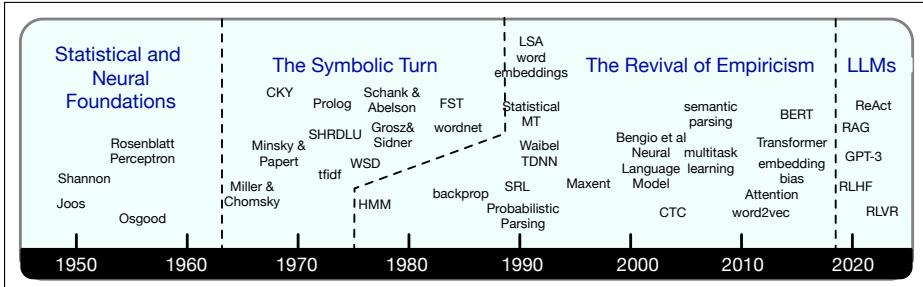

## 1.4 A Brief History of Speech and Language Processing

The central ideas of the modern language model that we have now introduced— the power of word prediction, and its implementation via neural networks and embeddings— (and indeed the roots of the entire field of NLP and computational linguistics) all lie in the intellectually fertile periods of the late 1940s, 1950s and early 1960s. Shannon (1951) had developed his intuitions about word prediction. Labs at Cornell and Stanford were applying small neural networks to computational tasks. The intuition of what we now call embeddings emerged across many fields: psychologists like Osgood et al. (1957) proposed that the meaning of a word could be modeled as a

point in space, and similarity as the distance between two words; linguists like Zellig Harris and Martin Joos proposed that a word’s meaning is related to its context; and CS work on information retrieval began to define words in terms of vectors.

  
Figure 1.6 Four stages in the history of NLP.

Following these initial statistical and neural tools, the field had three more big inflection points, as shown in Fig. 1.6. The first was the 1960s movement toward modeling language based on symbolic structure. Influential arguments by Chomsky (Chomsky, 1957; Miller and Chomsky, 1963) against statistical modeling of language and by Minsky and Papert (1969) against neural models led to a sharp shift in computer science, AI, and the linguistic and cognitive sciences. These fields moved away from early directions in neural and statistical modeling and toward symbolic reasoning and explicit symbolic structures. Symbolic approaches dominated AI, NLP, and cognitive science roughly from 1965 til the early 1990s.

The second point was what has been called the long revival of empiricism when the field moved back toward statistical and neural models, beginning various times between 1975 and 1988 and lasting until 2017. This period began with work in speech recognition from Fred Jelinek and colleagues at the IBM Thomas J. Watson Research Center between 1975 and 1985. Jelinek and his group invented the term ‘language model’ and developed n-gram language models and algorithms for training and inference of statistical models for speech recognition. Soon afterwards, improved algorithms for neural network training based on error backpropagation became widespread (Rumelhart et al., 1986), leading to a cognitive science paradigm of neural networks called connectionist or parallel distributed processing. By the late 1980s statistical methods had begun to spread from speech researchers to NLP researchers working on text. It became the norm in NLP to use statistical classifiers for NLP tasks like parsing or coreference resolution. Neural models began to be used more successfully for speech recognition, using special hardware because computers were too slow (Morgan and Bourlard, 1990). By the first decade of the 2000s, improvements in computer hardware (in particular the use of GPUs which had been developed for graphics) made it possible to train very large and deep networks for both speech and text (Hinton et al., 2006), and the neural language model was proposed (Bengio et al. 2003) and extended and applied to NLP tasks (Collobert and Weston, 2008). By 2013-2017 this line of work culminated in general neural architectures, most famously the transformer architecture (Vaswani et al., 2017), which, although invented for machine translation, quickly became a general-purpose neural architecture that could be used for many tasks.

The third large inflection point was the development of prompting in 2019 (Radford et al., 2019). Up until then, the dominant paradigm of the field was statistical classification based on machine learning. To solve a problem, you labeled training data to train a classifier to assign a label to some data. The new method of instead just prompting LLMs was a revolution: given an algorithm that could predict words, you could just type in a question and append something like “the answer is” and it would predict the answer completely. The field of natural language processing shifted completely away from its historical focus on algorithms for parsing or interpreting text. Once prompted language models became the center of the field, NLP began to be about generation. The use of computational models to generate text, code, speech, and images, constitutes the important new area called generative AI.

Advances in this NLP era include the realization of the enormous power of scale (with its positive and negative consequences), the development of instruction tuning, preference alignment, RL for reasoning, enormous work on efficiency gains, and now the power of agents.
