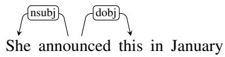
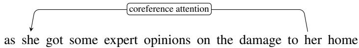

## 1.5 Linguistic Structure and Interpretability

An understanding of human language and its linguistic properties and structures plays a central role in studying speech and language processing. Consider, for example, two kinds of linguistic structure. Syntactic structure (Chapter 20) describes abstract grammatical relationships between words or phrases, like the fact that verbs have subjects and direct objects, like the verb announced in this example:

(1.6)

Detecting these syntactic dependency relationships (Chapter 20) a task called parsing, is one of the oldest tasks in NLP.

A second kind of linguistic structure is coreference (Chapter 24). When a text talks about a person, it refers to them in many ways. Consider the sentence

Victoria Chen, CFO of Megabucks Banking, saw her pay jump to \$2.3

million, as the 38-year-old became the company’s president.

Here Victoria is referred to by many different phrases: “Victoria Chen”, “CFO of Megabucks Banking”, “her”, and “the 38-year-old”. We say that these phrases corefer, meaning that they all refer to the same entity in our mental model of the world.

In the early history of NLP, automatically parsing input text into these kinds of linguistic structures was a crucial step in building models for extracting meaning. This is no longer the main role for linguistic structures and properties. Instead, in modern NLP, linguistic structure and knowledge are crucial for LLM interpretability and analysis, and for cognitive and social science applications.

Interpretability helps us understand how LLMs work by uncovering the model’s internal linguistic structures or computation. Interpretability studies have shown that language model embeddings and networks implicitly represent syntactic parse trees, semantic information, and coreference information (Hewitt and Manning, 2019) and at which neural levels these structures are represented (Tenney et al., 2019; Acevedo et al., 2026). For example Manning et al. (2020) showed that attention heads (Chapter 7) are sensitive to grammatical structure, with attention heads for direct objects attending to their verbs:

(1.7)

it goes on to plug a few diversified mutual funds while other attention heads for a mention of an entity attend to a previous coreferent mention of the same entity (its antecedent):

(1.8)

Linguistic structure can also help in analysis of linguistic interaction between language models and users. Let’s consider a third kind of linguistic structure relevant in conversational interaction. In human-human conversation people try to establish mutual understanding with each other, what we call their common ground (Clark, 1996). People do this by grounding, which means linguistically signaling understanding or lack of understanding. For example if a person doesn’t understand what the other person said, they might ask a clarification question, as B does in the following dialogue:

## (1.9) A: Can you hand me the box? [in a context with two boxes] B: Which one?

Linguistic analysis of these structures in conversation has shown that current language models are not good at grounding. For example LLMs avoid asking clarification questions (Shaikh et al., 2024), with the result that LMs make incorrect assumptions about what the users they are interacting with want them to do. Linguistic analysis of interaction can also help identify language model problems like sycophancy (Cheng et al., 2026) and overconfidence (Zhou et al., 2024b).

The second key use for linguistic structure is for applications of NLP to questions from other areas—cognitive or social sciences like linguistics, psychology, political science, or others—that have a theoretical question that requires analyzing text, and for which linguistic structure can help improve the analysis.

For example a political scientist might use NLP tools to study speeches by politicians, to see how they talk about different groups of people. Card et al. (2022) parsed political speeches to understand how US politicians talk about different immigrant groups, for example to understand when they frame immigrants as contributing to society (with adjectives like hardworking or worthy or verbs like contribute) versus when they talk about excluding them (with verbs like deport or reject).

Finally, computation of linguistic structure is an important tool for answering questions about language itself, a research area called computational linguistics that is sometimes distinguished from natural language processing. To answer linguistic questions about how language changes over time or across individuals we’ll need to be able, for example, to parse entire documents from different time periods. Or computational tools for labeling linguistic structure can help in annotating large corpora of parents talking to children, for seeing the role of different kinds of conversational or grammatical structures in language learning.

Many researchers have also used LLMs as tools for generating theoretical insights about linguistic structure. For example Papadimitriou and Jurafsky (2023) and Kallini et al. (2024) use artificial languages with particular syntactic structures to study what kinds of languages are easier or harder for LLMs to learn. Such lines of research have goal of suggesting novel scientific understandings about how language learning might work similarly or differently in humans.
