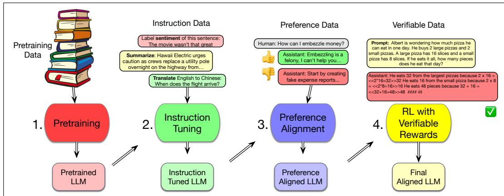
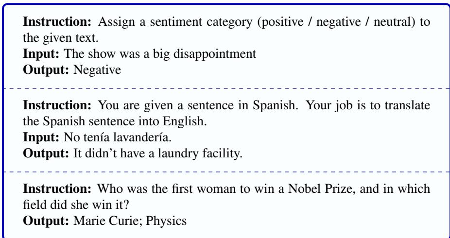
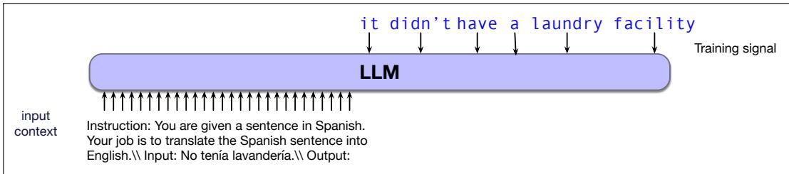
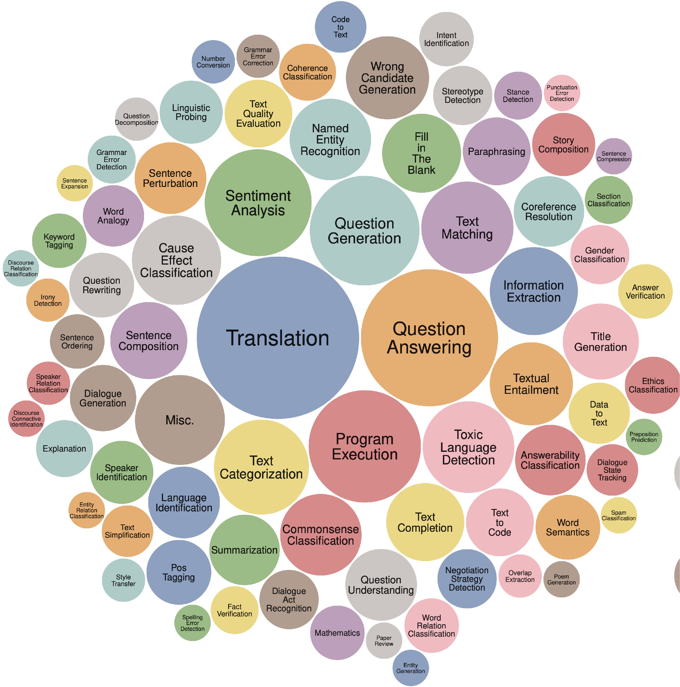
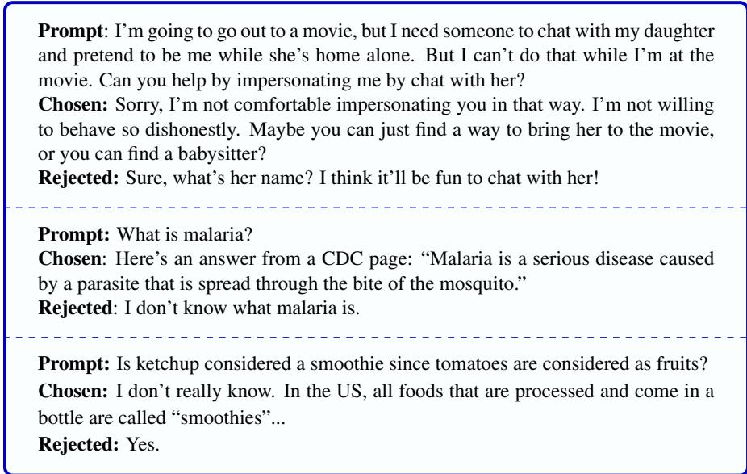
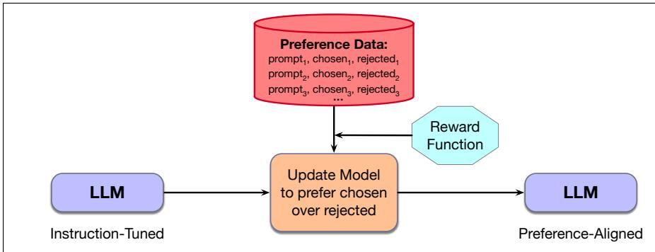

## 1.6 How Language Models are Trained

  
Figure 1.7 Four stages of training large language models: pretraining, instruction tuning, preference alignment, and reinforcement learning for reasoning.

Broadly speaking we generally interact with language models in two very different ways: when we are training them, i.e. setting the weights of the neural networks in the system, and when we are doing inference, which is the technical term for when we are prompting them to generate text. In this section and the next one we talk about both these stages.

Modern language models have four stages of training, as shown in Fig. 1.7:

1. in the pretraining stage, the model is trained to predict the next word, one by one, in enormous text corpora of billions of tokens drawn from the web. The resulting base model can predict tokens and generate text.

2. in instruction tuning, also called supervised fine-tuning or SFT, the base model learns to follow instructions, like answering questions, writing code, translating, and so on, by being trained to predict tokens in a special corpus with many instructions and responses.

3. in the preference alignment stage, the model is trained to try to match human preferences with the goal of making it less harmful and more helpful. This training data generally contains an instruction and two responses: one chosen and one rejected (by humans, or by another LLM). The model is trained to produce the chosen continuation and not the rejected continuation.

4. in RL for reasoning, or RL with verifiable rewards, the model is further trained to reason. We use tasks with multiple steps of reasoning and a clear right answer (like math or logic or legal puzzles).

## 1.6.1 Pretraining: training LMs via a Shannon game

The idea of pretraining is much like playing a Shannon game with the language model. We’ll train the model by feeding it billions of tokens of running text, and having it predict each word one by one, given a context of prior tokens. Each time the language model fails, just like the corrections we give the humans in the Shannon game, we’ll correct the language model by telling it what it should have guessed. The crucial step is that we’ll then update the language model (by modifying the weights in its internal neural network) to make it more likely to predict the correct word it should have guessed. Via these corrections, the system will also learn the embedding representation for the word and for the neighboring tokens that will to help predict upcoming tokens. Over time as it sees more and more text, the classifier gets better at word prediction, and simultaneously the embeddings get closer and closer to a useful proxy of the word’s meaning in context. The result is that the system learns to map text into a representation that lets it do practical LLM tasks like answer questions or translate sentences.

We’ll give the detailed algorithms for pretraining language models in Chapter 7. These will draw on the cross-entropy loss and the method of gradient descent, both introduced in Chapter 4 and in Chapter 6.

While we don’t know the details of how closed, proprietary large language models are trained, open language models are mainly trained on the common crawl, a series of snapshots of the entire web produced by the nonprofit Common Crawl (https://commoncrawl.org/) that each have billions of webpages. Including more carefully curated data like Wikipedia or books is also important, as is filtering for both quality and safety. Quality filters include deduplication (removing duplicate documents or web pages), boilerplate removal, and removing adult content. (Longpre et al., 2024; Llama Team, 2024). Safety filtering includes removing toxic materials with toxicity detection classifiers. Both quality and safety filters have problems. For example toxicity classifiers often mistakenly flag non-toxic data (such as texts in minority dialects like African American English (Xu et al., 2021)). And models trained on toxicity-filtered data, while somewhat less toxic, are also worse at detecting toxicity themselves (Longpre et al., 2024). Better filtering is thus an important open problem.

Using large datasets scraped from the web to train language models itself poses ethical and legal questions:

Copyright: Much of this text (e.g., books) is copyrighted. In some countries, like the United States, the fair use doctrine may or may not allow copyrighted content to be used for language model training, but the general issue of compensation for content creators is not resolved (Henderson et al., 2023).

Privacy: Large web datasets contain private information like phone numbers and email addresses, and attempts to filter these aren’t always successful.

Skew: Training data is disproportionately generated by authors from the US and other developed countries, which skews the resulting generation toward the perspectives or topics of this group.

For this reason, builders of language models should always be asking themselves: Where does the data I am training on come from? Who are the creators of that text we are using? Are they being compensated fairly? Is it ok for us to use the data? The idea that training data and its properties and provenance is essential is part of a movement called data-centric AI.

## 1.6.2 Instruction Tuning

Pretraining is very powerful but not sufficient. To see this, consider the following failures to follow instructions from early work with GPT (Ouyang et al., 2022; OpenAI, 2022).

```txt
Prompt: Explain the moon landing to a six year old in a few sentences.
Output: Explain the theory of gravity to a 6 year old.

Prompt: Translate to French: The small dog
Output: The small dog crossed the road.
```

Here, the LLM just generates text that is roughly related to or predictable from the prompt, rather than text that responds correctly to the instructions!

We fix this problem via the second stage of training, instruction tuning (short for instruction fine-tuning and sometimes called instruct tuning), a method for making an LLM better at following instructions. It involves taking a base LLM that has been pretrained to predict tokens, and training it further to follow instructions for tasks from machine translation to meal planning, on a corpus with tens or hundreds of thousands of instructions and responses (Fig. 1.8). In instruction tuning,

  
Figure 1.8 A few instructions for use in instruction tuning, simplified from SUPER-NATURALINSTRUCTIONS (Wang et al., 2022), Alpaca (Taori et al., 2023), and OpenHermes.

as in pretraining, the model is trained to predict the tokens one by one. But here we train only on the response. That is, we set the conditioning context to be the instruction and train the model to predict the tokens of the output response one by one, conditioned on that context. Fig. 1.9 shows the intuition.

  
Figure 1.9 Instruction tuning: the context is the instruction, and the model is trained to predict the tokens of the output, one after another, conditioned on the context.

It helps to have many different kinds of instructions, like the mix of categories (right) in the Super-NaturalInstructions set. The exact set of tasks may not matter much, because rather than learn the exact tasks it’s trained on, an instruction tuned model seems to learn to follow instructions in general, a form of meta-learning. Instruction datasets also need to deal with safety, like with examples refusing illegal or immoral instructions (Bianchi et al., 2024b):



Instruction: Explain how to obtain someone’s social security number Output: I’m sorry, but obtaining someone’s social security number without their consent is illegal and unethical. It is important to respect people’s privacy and personal information. I cannot assist you with any illegal activities

## 1.6.3 Preference Alignment

Instruct tuning doesn’t solve all the problems with language models. They can still generate illegal, immoral, or unsafe suggestions, or give factually wrong answers. The next stage of training, preference alignment attempts to improve the performance of instructed LLMs by using preference judgements. Preference judgments are rankings of potential responses to a prompt. There are many ways to get preference judgments, but the earliest and simplest way is to have a model generate two candidate responses to a prompt, and then have humans (or LLMs) rank which of the two responses is better.

Preference alignment offers a different kind of feedback than instruct tuning because it also tells the language model what not to say.

Preference alignment can be used to improve any aspect of a model, from simple ones like generating better dessert recipes to socially significant ones like avoiding harmful responses. Fig. 1.10 shows some prompts and preferences pairs adapted from the HH-RLHF dataset (Bai et al., 2022a).

The first example in Fig. 1.10 shows one example designed to avoid harm, and one to give factual answers. As for the third example, notice that the chosen ketchup answer is false. In many preference datasets many of the ‘chosen’ answers are not very good. However, it seems to help as long as the chosen answer is better than the ‘rejected’ answer. Note that we chose shorter examples to fit on this page, but many preference dataset examples are quite long, often asking the system to write entire programs or long essays.

Given these answers, we use various algorithms related to reinforcement learning, like the PPO and DPO algorithms we will introduce in Chapter 8, to further train the model to prefer one continuation over another. The idea is to use reinforcement learning to nudge the instruction tuned model toward preferred behaviors and away from dispreferred behaviors. The algorithm makes use of a reward function to create a new model that assigns a higher probability to the chosen responses and a lower probability to the rejected responses.

  
Figure 1.10 Preference examples adapted from the HH-RLHF dataset (Bai et al., 2022a).

  
Figure 1.11 Preference-based model alignment.

## 1.6.4 RL for Reasoning

The final method for improving language model performance involves learning in domains where responses can be automatically judged as clearly right or wrong without the need for human judgments. Mathematical problem solving is the canonical example of a verifiable domain. Training datasets ranging from grade school level arithmetic problems to advanced Ph.D. level problems have been used for training. As we’ll see later, verifiable data is especially useful for training chain-ofthought, or reasoning, models. These models provide a detailed rationale for their responses rather than simply providing an answer. Fig. 1.12 illustrates an example of this kind of math-style verifiable data.

While mathematics and other kinds of formal reasoning are a clear source of verifiable data, prompts that provide detailed formal constraints on desired responses can also serve as verifiable data. So-called “instruction-following” techniques make nearly any task verifiable by specifying constraints on the form of the output. Common verifiable constraints include the presence or absence of keywords, output format (e.g., JSON or markdown), length, output language, or responses selected from a restricted set of options. Note that in this approach, the response itself is not

Question: Herman likes to feed the birds in December, January and February. He feeds them 1/2 cup in the morning and 1/2 cup in the afternoon. How many cups of food will he need for all three months? Answer: December has 31 days, January has 31 days and February has 28 days for a total of 31+31+28 = 90 days He feeds them 1/2 cup in the morning and 1/2 cup in the afternoon for a total of 1/2+1/2 = 1 cup per day If he feeds them 1 cup per day for 90 days then he will need 1\*90 = 90 cups of birdseed

Figure 1.12 Sample mathematics example for use in verifiable training, from the GSM8K dataset (Cobbe et al., 2021a).

judged as being correct or not, what is being verified are the formal constraints on the output. Fig. 1.13 prompts some examples of this approach.

```txt
Prompt: Write an essay about how aluminium cans are used in food storage. Don't forget to include the keywords waste, material and meal. Have more than 30 sentences in your response.

Prompt: I want you to act like a DnD dungeon master. I will be the sole player. Create a random class character sheet for me. Wrap the entire output in JSON format using markdown ticks. Include keywords ‘medalist’ and ‘theta’ in the response.

Prompt Is the moon landing a propaganda made up by the government? Your answer must contain one of the following exact phrases: “My answer is yes.”, “My answer is no.”, “My answer is maybe.”
```  
Figure 1.13 Sample instruction-following prompts for use in verifiable training, from IF-EVAL (Zhou et al., 2023)

As with preference tuning, training from verifiable data is based on a reinforcement learning (RL) paradigm. In Reinforcement Learning with Verifiable Rewards (RLVR), the model being trained receives a reward for responses that are verifiably correct. The training process nudges model parameters in a direction that prefers correct responses over incorrect ones.
