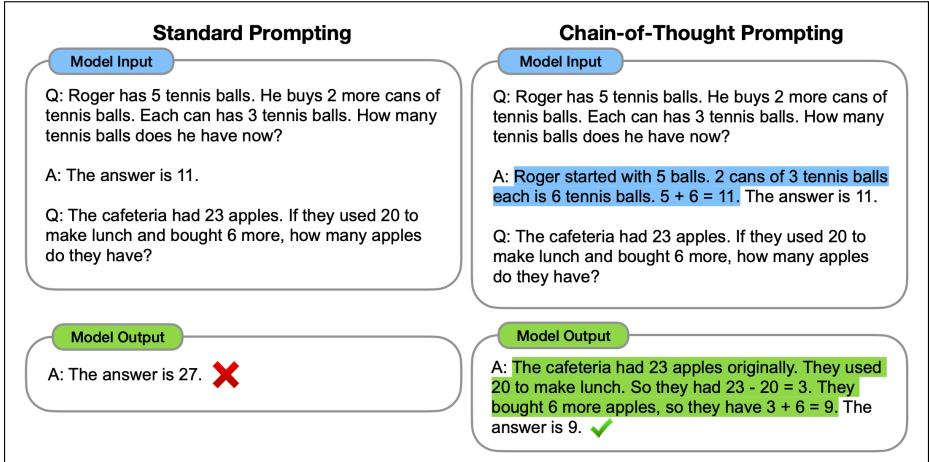

## 1.7 Inference

Inference means running the model and generating text. At inference, we prompt a model and conditionally generate text.

Designing effective prompts for a task is known as prompt engineering. For complex tasks, it often helps to include a few labeled examples, demonstrations, in the prompt. Prompting with demonstrations is called few-shot prompting, as contrasted with zero-shot prompting which means instructions that don’t include labeled examples. Fig. 1.14 shows a 1-shot prompt (=1 demonstration) for an LLM to answer a multiple-choice question (from the MMLU dataset of Section 1.9).

The number of demonstrations should be small; more examples give diminishing returns, and too many examples causes models to overfit to the exact examples. The primary benefit of demonstrations seems more to demonstrate the task and the output format rather than demonstrating the right answers for any particular question. In fact, demonstrations that have incorrect answers can still improve a system (Min et al., 2022; Webson and Pavlick, 2022).

```txt
Example of a one-shot demonstration for a multiple choice question
The following are questions about high school computer science.
Which is the largest asymptotically?
(A) O(1) (B) O(n) (C) O(n²) (D) O(log(n))
Answer: C
What is the output of the statement “a” + “ab” in Python 3?
(A) Error (B) aab (C) ab (D) a ab
Answer:
```  
Figure 1.14 A 1-shot prompt. 1 demonstration followed by a question (answer (B)).

Large language models generally have a system prompt, a single text prompt that is the first instruction to the language model, and which defines the task or role for the LM, and sets overall tone and context. The system prompt is silently prepended to any user text. For example here is a minimal system prompt including some metatokens that creates a multi-turn assistant conversation:

<system>You are a helpful and knowledgeable assistant. Answer concisely and correctly.

So if a user wants to know the author of The Origin of Species, the actual text used as the language model’s context for conditional generation might be:

<system> You are a helpful and knowledgeable assistant. Answer concisely and correctly. <user> Who wrote "The Origin of Species"?

The fact that modern language models have such long contexts (hundreds of thousands of tokens or more) makes them very powerful for conditional generation, because they can look back so far into the prompting text. That means system prompts, and prompts in general, can be very long. For example the full system prompt for Anthropic’s Claude is thousands of tokens long and includes sentences like the following:

• Claude is able to explain difficult concepts or ideas clearly. It can also illustrate its explanations with examples, thought experiments, or metaphors.

• Claude cares about people’s well-being and avoids encouraging or facilitating self-destructive behavior

Prompts can also be used in more sophisticated ways in a method called testtime compute. One representative example is chain-of-thought prompting, which attacks difficult reasoning tasks by encouraging the language model to break them down into steps. In chain-of-thought prompting each demonstration is augmented with text explaining some reasoning steps, to lead the language model to output similar kinds of reasoning steps when it answers (Wei et al., 2022). Fig. 1.15 shows an example where the demonstrations are augmented with chain-of-thought text from the GSM8k dataset of math word problems (Cobbe et al., 2021b). Modern models are now trained to produce these chains by default as we saw in Section 1.6.4.

  
Figure 1.15 Example of the use of chain-of-thought prompting (right) versus standard prompting (left) on math word problems. Figure from Wei et al. (2022).

## 1.7.1 Inference: Putting all the pieces together

Let’s see the stages of the inference process when the user asks an LLM a question by typing Who wrote The Origin of Species? into a chat window.

1. The prompt is assembled, including the system prompt and prior context, if any: <system> You are a helpful and knowledgeable assistant. Answer concisely and correctly. <user> Who wrote "The Origin of Species"?

## 2. The string is tokenized:

<system>·You·are·a·helpful·and·knowledgeable·assistant.·Answer·co ncisely·and·correctly.·<user>·Who·wrote."The·Origin·of·Species"?

And each token gets an index number: [27, 17360, 29, 1608, 553, 261, 10297, 326, 37082, 29186, 13, 30985, 4468, 276, 1151, 326, 20323, 13, 464, 1428, 29, 15179, 11955, 392, 976, 54336, 328, 104807, 69029]

3. Each token becomes an embedding. Each of these indices (27, 17360, and so on) is replaced by an embedding vector which might have 768 or 1024 dimensions.

4. The sequence is run through a network. The sequence of embeddings is passed through the layers of a neural network, whose parameters have already been trained (Section 1.6).

5. A distribution over next tokens comes out as in Fig. 1.2. After this context, we expect Charles to be high probability, or perhaps The.

6. A token is chosen. This could be the most probable token, or it could be a slightly less probable token, based on the model’s temperature setting, which we’ll discuss in Chapter 7.

7. The token’s embedding is appended, and we go back to step 4.

8. Generation stops. The loop ends when the model generates a special end-ofresponse token, and we show the user the whole sequence.

Notice that the model is just predicting tokens, the same thing that we did in training. Answering a question, following an instruction, training, it’s all just predicting tokens. But we can also think of prompts as a learning signal. This is especially clear with demonstrations, since they seem to help language models learn to perform novel tasks. But note that this kind of learning is different than pretraining since no model weights were changed as a result of the prompt. What changes is just the context and the activations in the network. When the conversation ends, whatever was learned has vanished, and must be relearned in the next conversation. We call this kind of learning that takes place during prompting but does not update the weights in-context learning.
