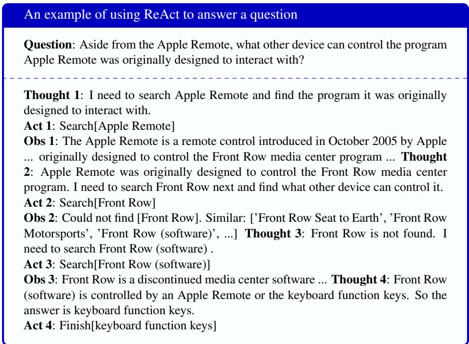

## 1.8 Agents

agent An agent is an LLM that has the power to autonomously act in the world, by calling other programs. For example an LLM can call a search engine to get up-to-date information, a calendar to compute free slots, a calculator to do math, a database to look something up, or an API from a supplier to order supplies. It does this having a set of actions like SEARCH() or CALENDAR() or CALCULATOR() that it can generate in its output.

The shift from LMs that act only as conversational assistants to autonomous agents that execute tasks is a large one, and LLM agents have great promise and also many potential safety risks. The intuition, however, is exactly the same as regular language models: token prediction. The technical difference is only that the set of actions in the world are added to the set of possible tokens to generate.

  
Figure 1.16 Sample trace from Yao et al. (2023) of a ReAct loop answering a question by reasoning and repeatedly calling web search. This figure abridges the observation returned from the search engine.

Let’s sketch one popular agent architecture called ReAct (Yao et al., 2023). In the ReAct framework, we prompt LLMs to generate actions interleaved with reasoning traces, allowing the model to reason about plans for acting, and about the responses it gets from the external world with the results of the actions.

Fig. 1.16 shows the general architecture. Given a user prompt, the model continuously loops over three stages, Reason-Action-Observation, until it solves the user problem. The model first reasons about the user’s goals, then takes relevant actions by calling tools, then observes the external results of the action. All this history is then treated as textual context, and the model loops again, reasoning, acting, and observing, until the user’s task is accomplished. Fig. 1.17 shows how to implement ReAct with a simple prompt that defines the different actions.

## The original ReAct prompt for the simplified task in the example above

Solve a question answering task with interleaving Thought, Action, Observation steps. Thought can reason about the current situation, and Action can be three types: (1) Search[entity], which searches the exact entity on Wikipedia and returns the first paragraph if it exists. If not, it will return some similar entities to search.

(2) Lookup[keyword], which returns the next sentence containing keyword in the current passage.

(3) Finish[answer], which returns the answer and finishes the task.

Here are some examples. [examples here]

Figure 1.17 A sample ReAct prompt that defines 3 simple actions.
