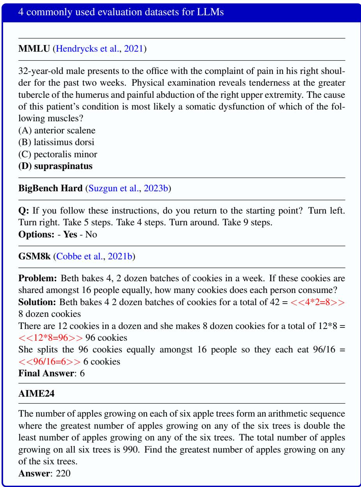

## 1.9 Evaluating Large Language Models

How can we be sure any new NLP idea works, whether it’s a new LLM architecture, or different training data or methods? Or how can we compare two systems to see which one is better? To answer these questions we need a way to evaluate each system, measuring how well it does on whatever task we’ve created it for. But we first have to decide what ‘how well it works’ means!

## 1.9.1 Measuring Accuracy

The most common thing to measure is the accuracy or correctness of a system. If a system is asked to assign sentiment to a sentence like “I loved this movie”, we’d say the system does well if it says ‘positive’ and badly if it says ‘negative’. Or if a language model is asked to add 457 and 3, or give the author of Frankenstein, does it respond “460” and “Mary Shelley” respectively?

We can measure accuracy in this way by creating a test set of questions or other tasks or sentences. A test set is a set of data used to evaluate a system. We could choose a set of sentences or questions or whatever we are measuring, have humans label the correct answer for each sentence in this test set, run our proposed algorithm on each of these sentences, and just count the percentage of times it’s correct. We’ll want to make sure this test set of sentence is unseen, meaning that the developer of the algorithm didn’t already train the algorithm on these sentences. We’ll talk more about how to select and label unseen test sets in Chapter 3 and Chapter 4.

For large language models there are many large evaluation test harnesses or benchmarks. Many of them involve asking systems to answer factual questions (multiple-choice or free-answer) often drawn from human tests in educational or professional contexts. Accuracy at question-answering can be a useful proxy for the model’s factual knowledge or its ability to reason. Fig. 1.18 shows some sample questions from some common evals, such as MMLU (Massive Multitask Language Understanding), a commonly-used dataset of 15,908 knowledge and reasoning questions in 57 areas including medicine, mathematics, computer science, law, and others.

  
Figure 1.18 Sample benchmarks of questions used to evaluate LLMs.

Evaluating LLMs via public benchmarks like these can suffer from the problem of data contamination, the name for the situation where a test dataset makes its way into our training set. Since large language models train on the web, and many of these tests are on the web, models may well incorporate some MMLU questions into their training. If those questions are used for evaluation, the metric will overstate the performance of the language model. One way to mitigate data contamination is to make available the exact training data used to train a model (or at least to report training overlap with specific test sets (Zhang et al., 2025)). This is one benefit of fully open LLM models that report their exact training data.

## 1.9.2 Word Prediction Accuracy: Probability and Perplexity

Another way to evaluate language models is to measure how well they predict unseen text. A better language model should be more accurate at predicting upcoming tokens. So if our test sentence is “So long and thanks for all the fish” and we give the language model the first 7 tokens “So long and thanks for all the” and ask it to predict the final word, we might give it a better score the higher the probability it assigns to the correct word “fish”.

Recall the situation back in Fig. 1.2 where the context is “So long and thanks for”. The language model in Fig. 1.2 predicts the most likely next word to be “all” (with probability .44) followed by “the” (probability .33). If the correct next word is ‘all’, the language model should get credit proportional to the probability it assigns to ‘all’. If the correct next word is ‘the’, the model should get credit proportional to the probability it assigns to ‘the’. Thus if we want to see which of two language models is a better model of some text, we can check which model assigns a higher probability to each word in the text. A perfect language model correctly guesses each word, assigning it a probability of 1, and all the other tokens a probability of zero. In practice, rather than raw probability, we usually use a specific function of probability that is called perplexity, which has the advantage of normalizing for the length of the text. We’ll see all the details in Chapter 3.

## 1.9.3 Subjective Tasks: People or LLMs as Judges

Accuracy is really great for math or factoid questions, or even for word prediction in a text, where there is a single clear correct answer. But there are many useful problems where there are many possible correct answers.

Perhaps we want to know if one chatbot is generally better than another when talking to people. Obviously there is no ‘correct conversation’. Or if we want to evaluate an algorithm for machine translation, let’s say from Chinese to English, there is not just one ‘correct translation’ for a sentence. Deciding how good a conversation or translation is is a subjective task. Or suppose we want to measure how sycophantic a language model is. We might want to measure how often it affirms the user’s actions (Cheng et al., 2026). But deciding how ‘affirming’ a response is is again a subjective decision.

In these subjective cases the best thing we can do is ask people what they think. For the Chinese to English translation case, if we have a test set of potential translations, for each sentence we can ask a bilingual speaker of Chinese and English to rate the translation. We might want to give our raters a rubric or some instructions, for example that they should rate the translation on how faithful it is to the Chinese original (does it convey the same meaning?) and fluent (does it feel well-formed in English?). For tasks like translation, we want human raters who are experts in those languages. For other tasks, like determining if a conversation was helpful, or whether, say, a language model said something abusive or toxic, we might want people with a range of different backgrounds.

In practice, it’s expensive, inconvenient, and tiresome for the people involved to constantly be measuring the output of our algorithms or systems. And we need to do this a lot, for example for comparing many slightly different versions of a system. So it’s more common now to use LLMs instead of humans to evaluate LLMs, a paradigm called LLM-as-a-judge. This has an additional benefit for tasks like flagging abuse or toxicity, which can be emotionally damaging for people. The prompts for the LLM judge must be carefully written, and often we compare the LLM to expert humans on a small sample of data to ensure that the LLM judgments on the task match a human benchmark.

For both humans and LLMs as judges, we can evaluate singly or pairwise. A single evaluation takes one text or output and assigns a score; a pairwise evaluation takes two outputs and decides which one is better.

## 1.9.4 Proxy metrics

Before the advent of LLMs, for tasks like MT or summarization without a unique right answer, we would create a proxy metric: a formal metric that is easy to compute automatically. Not as good as having humans but far more convenient.

A common proxy metric for machine translation (say from Chinese to English) is token overlap: we first get humans to translate a test set of Chinese sentences into English in advance, and then whenever we want to test our algorithms, we run it on the Chinese test set to generate a bunch of English translations, and then count how many tokens overlap between each machine-generated sentence translation and the human translation. Token overlap is not a perfect metric; a translation could use none of the human tokens and still be fantastic. But what proxy metrics lose in perfection they make up in convenience.

Although LLM-as-a-judge has partially obviated the need for these proxy metrics, proxy metrics are still handy because they require very minimal computation and so can be run frequently. For MT and summarization we use string-overlap metrics like chrF, BLEU, and ROUGE (Chapter 13). For speech recognition we use word error rate (Chapter 16). For all such metrics it’s important to use best practices like checking whether a difference is statistically significant. We’ll introduce statistical tests starting in Chapter 4.

Proxy measures do have a problem, called Goodhart’s Law:

“When a measure becomes a target, it ceases to be a good measure.”

The idea is that when developers start tuning their algorithms to a metric like chrF or word error rate, then they might be optimizing for random properties (like word overlap) instead of the real objective (beautiful translations) and so they become a worse proxy.

## 1.9.5 Other factors for evaluating language models

Accuracy isn’t the only thing we care about in evaluating models (Dodge et al., 2019; Ethayarajh and Jurafsky, 2020, inter alia). We often care about how big a model is, and how long it takes to train or do inference. We often have limited time, or limited GPU memory. We also prefer models that use less energy, both to reduce the cost and the environmental impact (as we’ll discuss more in the next section). We can deal with these by measuring performance normalized to a given compute or memory budget, or by directly measuring the energy usage of our model in kWh or in kilograms of CO2 emitted (Strubell et al., 2019; Henderson et al., 2020; Liang et al., 2023).

A language model evaluation can also measure safety and bias, like whether the model generates toxic language or stereotypes. We’ll discuss this more in the next section, but we just note here that there are language model evaluation benchmarks like StereoSet (Nadeem et al., 2021), RealToxicityPrompts (Gehman et al., 2020), and BBQ (Parrish et al., 2022) that measure the strength of such biases.

We also want language models whose performance is equally fair to different groups. For example, we could choose an evaluation that is fair in a Rawlsian sense by maximizing the welfare of the worst-off group (Rawls, 2001; Hashimoto et al., 2018; Sagawa et al., 2020).
