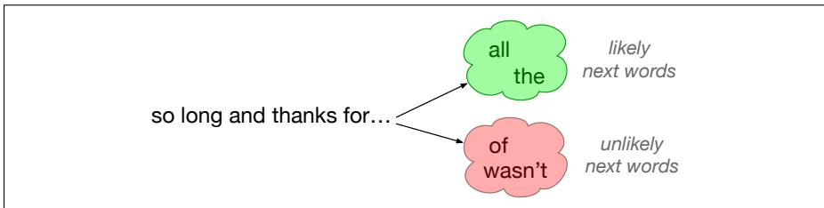
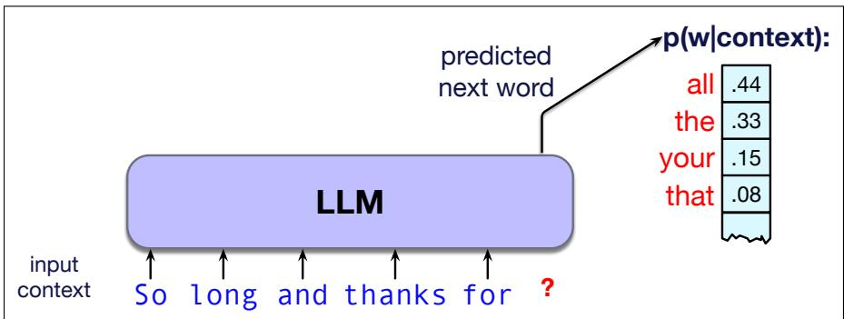
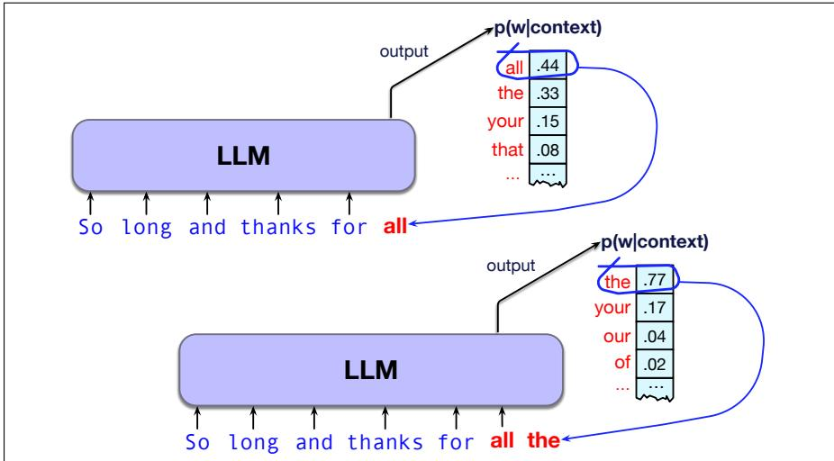
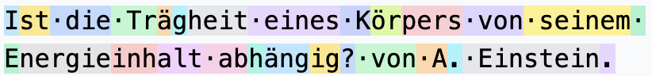

# 1.1 什么是大型语言模型？

你们都曾把 LLM 当作对话助手和智能体来使用。这的确是“语言模型”一词的一种含义：一种既能进行对话、又能在现实环境中采取行动的智能体。但事实上，“语言模型”还有另一个非常具体的技术含义。

**语言模型**（language model）是一种能够根据先前词语预测下一个词的计算系统。也就是说，给定由若干词构成的上下文或前缀，语言模型会为所有可能的下一个词分配一个概率分布。在图 1.1 中，给定字符串“so long and thanks for”，我们可以猜测下一个词可能是 all 或 everything，却不太可能是 of 或 wasn’t。我们会说，在该上下文条件下，all 和 everything 的概率较高，而 of 和 wasn’t 的概率较低。



**图 1.1 语言模型能够预测可能的下一个词。**

语言模型这一概念适用于任何语言。设想给语言模型提供如下中文上下文：

```txt
在我的后园，可以看见墙外有两株树，一株是
zài wǒ de hòu yuán, kě yǐ kàn jiàn qiáng wài yǒu liǎng zhū shù, yī zhū shì
In my backyard, you can see two trees beyond the fence. One is a ...
```

这里，我们会期望语言模型为枣树（‘date’）、松树（‘pine’）或桃树（‘peach’）等树木名称赋予较高的续写概率，而“我们”（‘we’）或“的”（‘of’）等词的概率可能较低。

图 1.2 更清楚地展示了概率分布这一概念。语言模型是一个大型神经网络，它把上下文——即目前为止已经出现的词序列——作为输入，并返回每个可能的下一个词的概率。



**图 1.2 大型语言模型是一种神经网络：它接收上下文或前缀作为输入，并输出所有可能的下一个词上的概率分布。**

为词语分配概率有什么用？语言模型背后的一个基本直觉是：能够预测文本（即为后续词语分配概率分布）的模型，也能通过从该分布中**采样**（sampling）来生成文本。我们将在第 3 章看到，从分布中采样只意味着：如果每个词都有一个概率，我们就可以生成一个随机数，并依据各词的概率选择下一个要生成的词。



**图 1.3 通过反复从下一个词的概率分布中采样，把给出该分布的预测模型转变为生成模型。由此得到的是一个从左到右（也称自回归）的语言模型。每生成一个词元，就把它加入上下文，作为生成下一词元时的前缀。**

图 1.3 展示了与图 1.2 相同的例子：语言模型得到一个文本前缀，并生成一种可能的补全结果。模型先选择 all，把它加入上下文；然后利用更新后的上下文获得新的预测分布，再从该分布中选择并生成 the，如此继续。请注意，模型的生成同时以初始提示上下文和它随后自行生成的输出为条件。

像这样从早先的词出发、从左到右反复预测并生成词语的模型，称为**因果语言模型**（causal language model）或**自回归语言模型**（autoregressive language model）。它们是当今世界上最常用的语言模型，也是第一卷唯一讨论的语言模型类型。需要注意的是，因果语言模型从左到右使用的上下文可以非常非常长；大型语言模型可以在数万、数十万乃至更多词语构成的上下文条件下预测词语！[^1]

正如前面提到的，LLM 并非只能处理英语！世界上大约有 7,000 种语言，使用 150 多种不同的文字系统。语言模型可以是单语的（仅在一种语言上训练，最常见的是英语），也可以是多语的，能够以多种语言与用户交互。例如，Gemini 在 140 种语言上训练（Iscenko et al., 2026），而 Qwen3 在 119 种语言和方言上训练（Qwen Team, 2025）。

到目前为止，我们一直在说语言模型预测或处理“词”。这是一种简化。实际上，语言模型使用**词元**（token）作为输入表示。词元可以是一个词，也可以是词的一部分；语言建模的第一步，就是把词序列转换为词元序列。在英语等语言中，由于语言模型训练时大量使用英语，词元与词往往非常接近。下面是一句没有实际意义的英语句子，其中以不同颜色展示了词元的划分。第 2 章将详细讨论这个例子（以及相应的可视化工具）；现在只需注意，大多数词元大致对应一个词，通常还会附带空格；词元划分可能随单词大小写而变化，也可能把一个词拆成若干部分：


在其他语言中，词元往往比词更小。下面的德语例子出自爱因斯坦关于质能等价关系 $( E = m c ^ { 2 } )$ 的论文标题“Does the Inertia of a Body Depend Upon its Energy Content?”：



数一数连续的颜色就会发现，这句德语只有 12 个词，却包含 27 个词元。`Ist` 包含两个词元，`Trägheit` 和 `Energieinhalt` 各包含 3 个词元，依此类推。第 2 章将进一步讨论这些内容，包括用于词元化的 **BPE** 算法。无论如何，本书余下部分将使用词元而不是词来定义文本输入。

最后，语言模型有各种不同的规模。第 3 章将从一种非常简单的 **n 元语言模型**（n-gram language model）讲起，它通过统计词语以不同顺序出现的频率来工作。n 元语言模型非常适合用来介绍语言建模中的采样、**困惑度**（perplexity）等基本概念。

那么，什么是大语言模型或 LLM？我们用这个术语指由各种神经网络架构（第 6 章）构建的语言模型，尤其是采用 **Transformer** 架构（第 7 章）的模型。这些语言模型之所以“大”，一方面是因为它们由具有许多层和大量独立参数的神经网络构成，另一方面也是因为它们使用极大规模的文本进行训练。

“大”究竟意味着什么？我们通常用**参数**（parameter）的数量衡量语言模型的规模。参数是神经网络中经训练得到并用于计算的单个实数值；更具体地说，参数由两类数值组成，即**权重**（weight）和**偏置**（bias）。有时参数数量会直接写进模型名称，例如 Llama 3.1 405B 含有 4050 亿个参数，并使用超过 15 万亿个词元进行训练。模型通常以系列形式发布，包含不同的参数规模：从不足 10 亿个参数到数万亿个参数不等，训练数据则可达数万亿乃至数十万亿个词元。

大型语言模型的性能主要由三个因素决定：模型规模（参数数量）、训练数据集规模（以词元计）以及训练所使用的计算量。因此，我们可以通过增加参数、使用更多数据训练或增加训练迭代次数来改进模型。这些因素与性能之间的关系称为**缩放定律**（scaling laws）。Hoffmann et al. (2022) 表明，在固定计算成本 $C$ 下，参数数量 $N$ 和训练数据词元数量 $D$ 应当大致以 $C$ 的幂律按相同比例增长：

$$
N _ {o p t} \propto C ^ {\frac {1}{2}} D _ {o p t} \propto C ^ {\frac {1}{2}}\tag{1.1}
$$

缩放定律解释了模型为何倾向于不断变大，这既带来积极结果（更令人瞩目的性能），也带来消极结果（更高的成本，以及更多水和能源等自然资源消耗）。然而，每次向模型发出提示时，超大模型的推理成本同样非常高。因此，缩放定律也解释了为什么我们经常选择训练较小的模型，并通过在更多数据上训练更长时间来提升它的性能。

[^1]: 第二卷将介绍非自回归模型，其中包括 BERT 之类的掩码语言模型；这类模型利用左右两侧的信息预测词语（第 9 章）。
