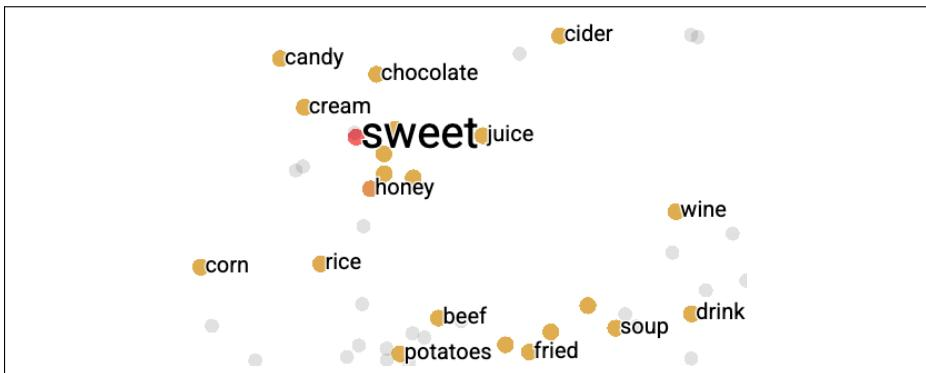
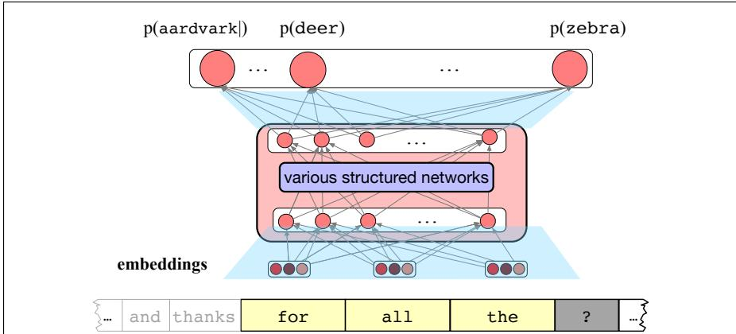

# 1.3 基础：神经网络与嵌入

现代语言模型的实现建立在两个重要思想之上：

1. **神经网络**（neural network）：能够从数据中训练的机器学习系统，作为基本计算机制

2. **嵌入**（embedding）：在网络内部表示词元和概念意义的向量

神经网络是语言处理的基本计算工具。我们称其为“神经”网络只是出于历史原因：它起源于 McCulloch-Pitts 神经元（McCulloch and Pitts, 1943）。这是 20 世纪 40 年代提出的一种简化数学模型，把人类神经元视为一种可用命题逻辑描述的计算单元。这个人类神经元模型，以及人类神经元连接成大型网络的方式，为现代神经网络提供了最早的灵感。不过，本书介绍的现代语言处理神经网络已经不再依赖这些早期的生物学启发。

现代神经网络其实就是一个由小型计算单元构成的网络。每个单元接收一个输入值向量（即一个列表），将其中各值乘以特定权重，并产生一个输出值。神经网络的特殊之处在于，它拥有一种基于**梯度下降**（gradient descent，第 4 章）、效率很高的学习算法；第 6 章将进一步介绍其细节。

一个神经网络可以由它的权重来描述；权重就是所有计算单元中各项数值的集合。我们经常区分两类模型：**开放权重模型**（open-weight model），其创建者公开模型的全部权重，使任何人都能在自己的机器上运行模型；以及**闭合权重模型**（closed-weight model）或**专有模型**（proprietary model），其创建者不公开权重，只允许人们通过网页、应用程序或 API 接口与模型交互。

嵌入是神经网络中近似表示意义的方式。嵌入是一个向量，也就是一组数值，在网络中用来表示上下文里词元、短语和句子的意义。嵌入有许多可视化方式，但我们通常把它理解为高维空间中的一个点或向量。如果你的线性代数知识有些生疏，可以把向量简单理解为一组实数，每个维度对应一个数。下面是一个 50 维向量：
$$
\begin{aligned}
&[0.2638\quad-0.3183\quad-1.095\quad1.330\quad0.2476\quad0.04531\quad-0.3950\quad-0.5210\quad-0.01679\quad0.3317\quad-0.5325\quad0.4326\\
&1.230\quad-0.3696\quad0.1598\quad-0.43\quad-0.2976\quad0.76\quad0.7125\quad-0.8567\quad-0.07695\quad-1.028\quad0.933\quad0.2496\quad-0.1398\\
&1.031\quad-0.1580\quad0.8051\quad0.5053\quad-0.5055\quad1.123\quad-0.4508\quad-0.2755\quad1.353\quad0.355\quad0.3940\quad-1.121\quad0.02792\\
&0.5758\quad-0.6361\quad-0.5350\quad-0.08018\quad-0.7802\quad-1.159\quad1.031\quad0.9433\quad0.02638\quad-0.9683\quad0.5449\quad-0.16479]
\end{aligned}
$$
嵌入使 LLM 可以把词元等符号表示为连续空间中的点，同时还提供了一个几何隐喻：两个词元之间的意义相似度可以用这些点之间的距离来建模，从而使我们能够计算相似度等意义函数。这两个思想都是心理学家 Charles Osgood 在 20 世纪 50 年代提出的（Osgood et al., 1957），下一节将对此加以讨论。图 1.4 展示了这种空间直觉。

图 1.5 展示了这两个思想如何结合。语言建模首先接收由词元构成的输入字符串，将其转换为一串嵌入，每个嵌入表示一个词元。随后，我们让这串嵌入通过一个结构复杂的神经网络，最终得到对下一个词的预测。我们用海量的连续文本训练这个网络（包括来自网络的数十亿词语），然后用它回应用户：接收用户输入的提示，把提示视为上下文，再生成词元。

**图 1.4 用二维空间直观展示表示词元意义相似度的嵌入。请注意，sweet 靠近 honey、juice 和 candy，却离 fried 或 soup 更远。可视化由 TensorBoard Embedding Projector https://projector.tensorflow.org/ 创建（第 5 章）。**

**图 1.5 LLM 由一个结构化神经网络构成（第 7 章将介绍流行的 Transformer 网络所采用的各种结构），并在内部以向量表示词元和概念。**
