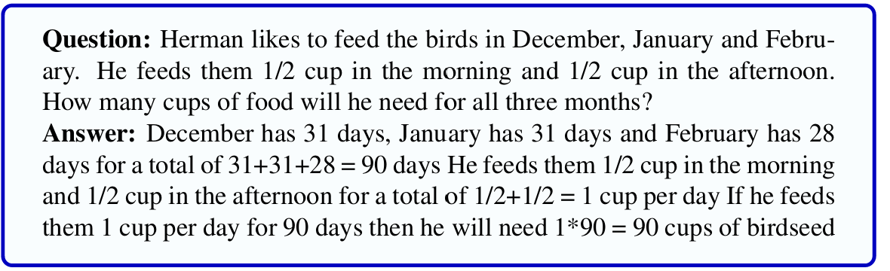
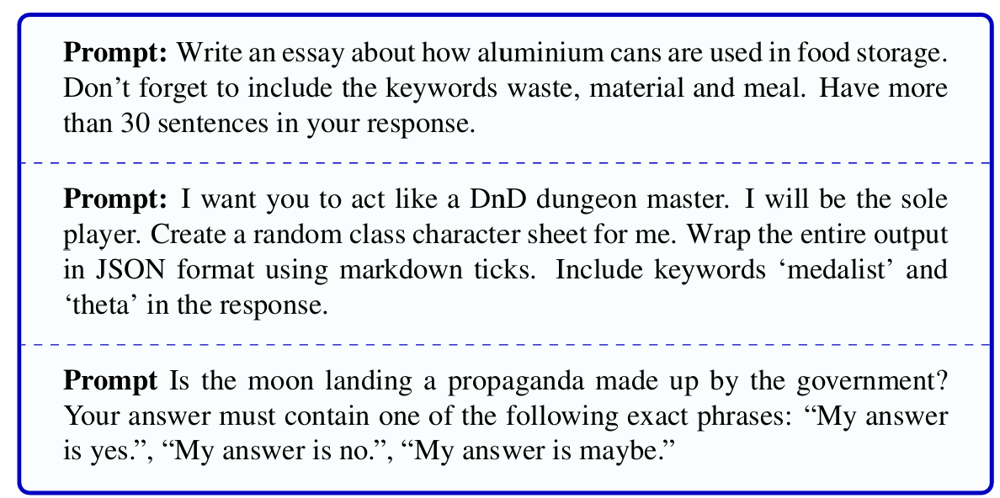

# 1.6 语言模型如何训练


**图 1.7 大型语言模型训练的四个阶段：预训练、指令微调、偏好对齐，以及用于推理的强化学习。**

概括来说，我们通常以两种截然不同的方式与语言模型打交道：一种是训练模型，也就是设置系统中神经网络的权重；另一种是进行**推理**（inference），这是通过提示让模型生成文本这一过程的技术术语。本节和下一节将分别讨论这两个阶段。

如图 1.7 所示，现代语言模型的训练分为四个阶段：

1. 在**预训练**（pretraining）阶段，模型从网络获取的、包含数十亿词元的庞大文本语料库中逐个学习预测下一个词。由此得到的**基础模型**（base model）能够预测词元并生成文本。

2. 在**指令微调**（instruction tuning）阶段——也称**监督式微调**（supervised fine-tuning，SFT）——基础模型在包含大量指令与响应的专用语料库中接受训练，通过预测其中的词元，学会遵循回答问题、编写代码、翻译等指令。

3. 在**偏好对齐**（preference alignment）阶段，模型接受训练以尽量符合人类偏好，其目标是减少危害并提高帮助性。训练数据通常包含一条指令和两个响应：一个被选中，另一个被拒绝（判断可由人类或另一个 LLM 作出）。模型会被训练成生成选中的后续内容，而不生成被拒绝的后续内容。

4. 在用于推理的**强化学习**（reinforcement learning，RL）阶段——也称采用可验证奖励的强化学习——模型接受进一步训练以学会推理。我们使用需要多步推理、并且存在明确正确答案的任务，例如数学、逻辑或法律谜题。

## 1.6.1 预训练：通过香农游戏训练语言模型

预训练的思想很像与语言模型玩香农游戏。我们向模型输入包含数十亿词元的连续文本，并要求它在给定先前词元上下文的条件下，逐个预测每一个词，从而训练模型。每当语言模型预测失败时，就像我们纠正香农游戏中的人类玩家一样，我们会告诉语言模型它本应猜出什么。关键的一步是，随后还要更新语言模型（修改其内部神经网络的权重），使它今后更有可能预测出本应猜到的正确词语。通过这些纠正，系统还会学到该词及其相邻词元的嵌入表示，而这些表示将有助于预测后续词元。随着时间推移，系统看到越来越多的文本，分类器会越来越擅长词预测；与此同时，嵌入也会越来越接近词语在上下文中意义的有效近似表示。最终，系统学会把文本映射为一种表示，使它能够执行回答问题、翻译句子等实际 LLM 任务。

第 7 章将给出预训练语言模型的详细算法。这些算法会用到**交叉熵损失**（cross-entropy loss）和梯度下降方法，二者将在第 4 章和第 6 章介绍。

我们并不知道闭合式专有大型语言模型训练过程的具体细节，但开放语言模型主要使用 Common Crawl 进行训练。Common Crawl 是非营利组织 [Common Crawl](https://commoncrawl.org/) 定期生成的一系列全网快照，每份快照都包含数十亿个网页。加入 Wikipedia 或图书等经过更精心筛选的数据也很重要，同时还需要从质量和安全两个方面进行过滤。质量过滤包括去重（删除重复文档或网页）、移除模板化内容以及删除成人内容（Longpre et al., 2024; Llama Team, 2024）。安全过滤包括使用毒性检测分类器删除有害材料。不过，质量过滤和安全过滤都存在问题。例如，毒性分类器经常把无毒数据误判为有毒数据，其中包括非裔美国人英语等少数群体方言文本（Xu et al., 2021）。而且，使用经过毒性过滤的数据训练的模型虽然毒性略低，自身检测毒性的能力也会变差（Longpre et al., 2024）。因此，如何实现更好的过滤仍是一个重要的开放问题。

使用从网络抓取的大型数据集训练语言模型，本身也会引发伦理和法律问题：

版权：这些文本中有很大一部分（例如图书）受版权保护。在美国等一些国家，合理使用原则可能允许、也可能不允许将受版权保护的内容用于语言模型训练；但如何补偿内容创作者这一总体问题尚未解决（Henderson et al., 2023）。

隐私：大型网络数据集包含电话号码和电子邮件地址等私人信息，而过滤这些信息的尝试并不总能成功。

偏斜：训练数据有不成比例的部分来自美国及其他发达国家的作者，使最终生成的内容偏向这一群体的视角或话题。

因此，语言模型的构建者应当始终追问：我的训练数据来自哪里？我们所使用文本的创作者是谁？他们是否获得了公平补偿？我们使用这些数据是否合适？强调训练数据及其属性和来源至关重要的思想，属于一场称为**以数据为中心的** AI（data-centric AI）的运动。

## 1.6.2 指令微调

预训练非常强大，但并不足够。早期 GPT 研究中的以下例子展示了模型无法遵循指令的情况（Ouyang et al., 2022; OpenAI, 2022）。

```txt
提示：用几句话向一个六岁孩子解释登月。
输出：向一个六岁孩子解释引力理论。

提示：翻译成法语：The small dog
输出：The small dog crossed the road.
```

这里，LLM 只是生成了与提示大致相关或根据提示可以预测的文本，而没有正确响应指令！

我们通过第二个训练阶段——指令微调——解决这个问题。该名称是“**指令式微调**”（instruction fine-tuning）的简称，有时也称 instruct tuning；这种方法可以使 LLM 更善于遵循指令。具体做法是：取得一个已经通过预训练学会预测词元的基础 LLM，再使用包含数万或数十万条指令与响应的语料库继续训练，使其能够遵循从机器翻译到膳食规划等各种任务的指令（图 1.8）。


**图 1.8 用于指令微调的若干指令，简化自 SUPER-NATURALINSTRUCTIONS（Wang et al., 2022）、Alpaca（Taori et al., 2023）和 OpenHermes。**

在指令微调中，模型与预训练时一样接受逐个预测词元的训练。不过，这里只针对响应部分进行训练。也就是说，我们把条件上下文设为指令，并训练模型在该上下文条件下逐个预测输出响应的词元。图 1.9 展示了这一过程的直观原理。


**图 1.9 指令微调：上下文是指令，模型接受训练，在该上下文条件下依次预测输出中的词元。**

使用许多不同类型的指令会很有帮助，例如 Super-NaturalInstructions 数据集（下图）混合了多个类别。


具体包含哪些任务可能并不十分重要，因为指令微调模型似乎并非只学会训练时的特定任务，而是学会一般性地遵循指令；这是一种**元学习**（meta-learning）。指令数据集还需要处理安全问题，例如加入拒绝执行违法或不道德指令的样例（Bianchi et al., 2024b）：
> 指令：说明如何获得他人的社会保障号码。  
> 输出：抱歉，在未经本人同意的情况下获取他人的社会保障号码是违法且不道德的。尊重他人的隐私与个人信息十分重要。我不能协助你从事任何违法活动。

## 1.6.3 偏好对齐

指令微调并不能解决语言模型的所有问题。模型仍可能生成违法、不道德或不安全的建议，也可能给出事实错误的答案。下一个训练阶段——偏好对齐——尝试使用**偏好判断**（preference judgment）来提高指令式 LLM 的表现。偏好判断是对某个提示的多个候选响应进行排序。获取偏好判断的方法很多，最早也最简单的方法是让模型针对一个提示生成两个候选响应，再让人类（或 LLM）判断两者中哪一个更好。

偏好对齐提供了与指令微调不同的反馈，因为它还会告诉语言模型什么内容不应当说。

偏好对齐可以用来改进模型的任何方面：从生成更好的甜点食谱等简单能力，到避免有害响应等具有社会重要性的能力。图 1.10 展示了若干根据 HH-RLHF 数据集改编的提示及偏好对（Bai et al., 2022a）。


**图 1.10 根据 HH-RLHF 数据集改编的偏好样例（Bai et al., 2022a）。**

图 1.10 的第一个例子旨在避免危害，另一个例子旨在给出符合事实的答案。对于第三个例子，请注意，被选中的番茄酱答案其实是错误的。许多偏好数据集里，大量“被选中”的答案并不是很好。不过，只要被选答案优于“被拒绝”的答案，似乎就能对训练有所帮助。还要注意，为了放进本页，我们选择了较短的例子；偏好数据集中的许多例子其实很长，经常要求系统编写完整程序或长篇文章。

得到这些答案后，我们使用与强化学习相关的各种算法——例如第 8 章将介绍的 PPO 和 DPO——继续训练模型，使其偏好一种后续内容而不是另一种。其思想是利用强化学习把经过指令微调的模型推向受偏好的行为，并使其远离不受偏好的行为。算法使用**奖励函数**（reward function）创建一个新模型，让它为被选中的响应分配更高概率，为被拒绝的响应分配更低概率。


**图 1.11 基于偏好的模型对齐。**

## 1.6.4 用于推理的强化学习

改进语言模型性能的最后一种方法，是让模型在无需人类判断、响应便能被自动判定为明确正确或错误的领域中学习。数学问题求解是**可验证领域**（verifiable domain）的典型例子。从小学算术题到博士阶段的高级问题，各种训练数据集都已被用于训练。我们稍后将看到，可验证数据特别适合训练**思维链**（chain-of-thought）模型或推理模型。这类模型不会只给出答案，而会为响应提供详细的推理依据。图 1.12 展示了一条此类数学风格的可验证数据。



**图 1.12 用于可验证训练的一条数学样例，来自 GSM8K 数据集（Cobbe et al., 2021a）。**

数学和其他形式推理是明确的可验证数据来源；此外，对期望响应施加详细形式约束的提示也可以充当可验证数据。所谓“**指令遵循**”（instruction-following）技术通过指定输出形式上的约束，使几乎所有任务都变得可验证。常见的可验证约束包括：是否存在某些关键词、输出格式（例如 JSON 或 Markdown）、长度、输出语言，或者响应是否选自一组受限选项。请注意，在这种方法中，并不判断响应内容本身正确与否；验证的是输出是否满足形式约束。图 1.13 展示了这种方法的若干提示样例。



**图 1.13 用于可验证训练的指令遵循提示样例，来自 IF-EVAL（Zhou et al., 2023）。**

与偏好微调一样，使用可验证数据训练也建立在**强化学习**（RL）范式之上。在**采用可验证奖励的强化学习**（Reinforcement Learning with Verifiable Rewards，RLVR）中，正在训练的模型会因生成可验证为正确的响应而获得奖励。训练过程会推动模型参数朝着偏好正确响应、而非错误响应的方向变化。
