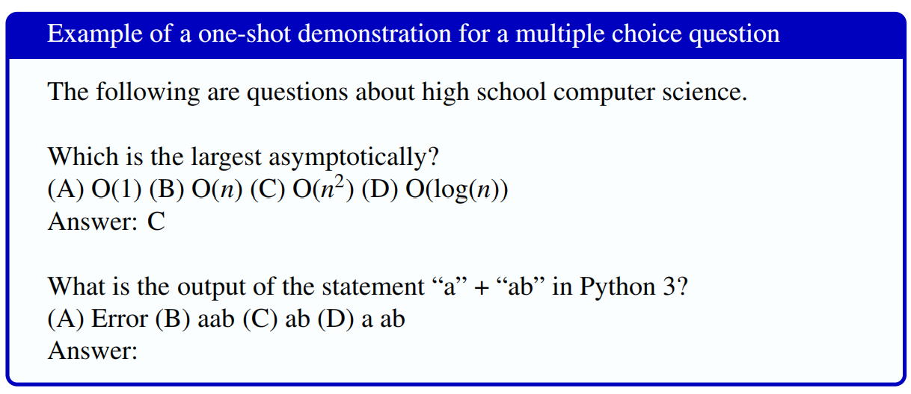
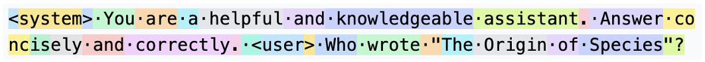

# 1.7 推理

**推理**（inference）是指运行模型并生成文本。在推理阶段，我们向模型发出提示，让它进行条件文本生成。

为某项任务设计有效提示称为**提示工程**（prompt engineering）。对于复杂任务，在提示中加入少量带标签的示例，也就是**演示**（demonstration），通常会有所帮助。带演示的提示称为**少样本提示**（few-shot prompting）；与之相对，**零样本提示**（zero-shot prompting）是指不包含带标签示例的指令。图 1.14 展示了一个让 LLM 回答多项选择题的**单样本提示**（1-shot prompt，即含 1 个演示）；题目来自第 1.9 节介绍的 MMLU 数据集。

演示数量应当较少；增加示例所带来的收益会逐渐递减，而示例过多会使模型过拟合于这些具体示例。演示的主要作用似乎是说明任务及输出格式，而不是展示某道特定问题的正确答案。事实上，即使演示中的答案是错误的，也仍然可以改善系统（Min et al., 2022; Webson and Pavlick, 2022）。

**图 1.14 单样本提示：一个演示后接一个问题（答案为 (B)）。**

大语言模型通常具有**系统提示**（system prompt）：这是发送给语言模型的第一条文本指令，用来定义语言模型的任务或角色，并设定整体语气和上下文。系统提示会被静默地添加在所有用户文本之前。例如，下面是一条包含若干元词元、用于创建多轮助手对话的最简系统提示：

> \<system\> 你是一位乐于助人且知识渊博的助手。请简洁准确地作答。

因此，如果用户想知道《物种起源》的作者，语言模型用于条件生成的实际上下文文本可能是：

> \<system\> You are a helpful and knowledgeable assistant. Answer concisely and correctly. \<user\> Who wrote "The Origin of Species"?

现代语言模型具有很长的上下文（可达数十万乃至更多词元），因此在条件生成方面能力非常强，因为它们能够回看提示文本中很久以前的内容。这也意味着系统提示以及一般提示都可以很长。例如，Anthropic 的 Claude 所使用的完整系统提示长达数千词元，其中包含如下句子：

> Claude 能够清楚地解释困难的概念或思想。它还可以使用例子、思想实验或隐喻来说明自己的解释。

> Claude 关心人们的福祉，避免鼓励或协助自我毁灭行为。

在一种称为**测试时计算**（test-time compute）的方法中，提示还能以更复杂的方式使用。其中一个代表性例子是**思维链提示**（chain-of-thought prompting）：它鼓励语言模型把困难的推理任务分解为多个步骤。思维链提示会在每个演示中加入解释若干推理步骤的文本，引导语言模型在回答时输出类似的推理步骤（Wei et al., 2022）。图 1.15 展示了一个例子，其中的演示加入了来自数学应用题数据集 GSM8K 的思维链文本（Cobbe et al., 2021b）。正如第 1.6.4 节所述，现代模型如今已经接受训练，默认就会生成这些推理链。

**图 1.15 在数学应用题上使用思维链提示（右）与标准提示（左）的示例。图片来自 Wei et al.（2022）。**

## 1.7.1 推理：把所有环节组合起来

假设用户在聊天窗口中输入 Who wrote The Origin of Species? 向 LLM 提问。下面来看推理过程的各个阶段。

1. 组装提示，其中包括系统提示和已有的先前上下文：\<system\> You are a helpful and knowledgeable assistant. Answer concisely and correctly. \<user\> Who wrote "The Origin of Species"?

2. 对字符串进行词元化：

并为每个词元分配索引编号：[27, 17360, 29, 1608, 553, 261, 10297, 326, 37082, 29186, 13, 30985, 4468, 276, 1151, 326, 20323, 13, 464, 1428, 29, 15179, 11955, 392, 976, 54336, 328, 104807, 69029]

3. 每个词元变成一个嵌入。每个索引（27、17360 等）都被替换为一个嵌入向量，其维度可能是 768 或 1024。

4. 让序列通过网络。嵌入序列穿过神经网络的各层；网络参数已经预先训练完成（第 1.6 节）。

5. 得到下一个词元上的概率分布，如图 1.2 所示。在这段上下文之后，我们预期 Charles 的概率很高，The 也可能具有较高概率。

6. 选择一个词元。可以选择概率最高的词元，也可以根据模型的**温度**（temperature）设置选择一个概率略低的词元；第 7 章将讨论温度。

7. 添加该词元的嵌入，然后回到步骤 4。

8. 停止生成。当模型生成一个特殊的响应结束词元时，循环结束，随后向用户显示完整序列。

请注意，模型所做的只是预测词元，与训练期间所做的完全相同。回答问题、遵循指令、训练——这一切都只是词元预测。不过，我们也可以把提示看作一种学习信号。演示尤其清楚地体现了这一点，因为它们似乎能帮助语言模型学会执行新任务。但需要注意，这种学习与预训练不同，因为模型权重并不会因提示而改变；改变的只有上下文和网络中的激活值。对话结束时，刚才学到的一切都会消失，下一次对话中必须重新学习。我们把这种发生在提示期间、但不更新权重的学习称为**上下文学习**（in-context learning）。
