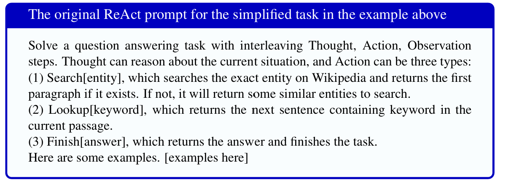

# 1.8 智能体

**智能体**（agent）是能够通过调用其他程序在现实环境中自主采取行动的 LLM。例如，LLM 可以调用搜索引擎获取最新信息，调用日历计算空闲时段，调用计算器完成数学运算，调用数据库查找内容，或者调用供应商的 API 订购物资。它之所以能做到这些，是因为它拥有一组可以在输出中生成的动作，例如 SEARCH()、CALENDAR() 或 CALCULATOR()。

从只充当对话助手的语言模型转变为执行任务的自主智能体，是一次巨大跨越。LLM 智能体前景广阔，同时也存在许多潜在安全风险。不过，其背后的直觉与普通语言模型完全相同：词元预测。技术上的唯一区别，是把现实环境中的动作加入可生成词元的集合。

**图 1.16 Yao et al.（2023）给出的一段 ReAct 循环轨迹：系统通过推理并反复调用网络搜索来回答问题。本图删节了搜索引擎返回的观察结果。**

下面简要介绍一种流行的智能体架构 **ReAct**（Yao et al., 2023）。在 ReAct 框架中，我们提示 LLM 交替生成动作与推理轨迹，使模型能够推理行动计划，也能根据动作结果推理从外部世界获得的响应。

图 1.16 展示了其总体架构。给定用户提示后，模型会不断循环执行三个阶段——**推理**（Reason）、**行动**（Action）和**观察**（Observation）——直至解决用户的问题。模型首先推理用户的目标，然后通过调用工具采取相关行动，接着观察该行动在外部产生的结果。全部历史记录随后都被视为文本上下文，模型再次开始循环，继续推理、行动和观察，直到完成用户的任务。图 1.17 展示了如何使用一条定义不同动作的简单提示实现 ReAct。

**图 1.17 一条定义了 3 个简单动作的 ReAct 提示样例。**
