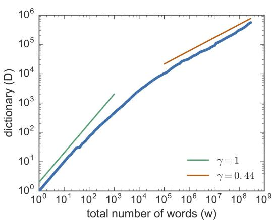

# Words and Tokens

User: I need some help, that much seems certain. ELIZA: WHAT WOULD IT MEAN TO YOU IF YOU GOT SOME HELP User: Perhaps I could learn to get along with my mother. ELIZA: TELL ME MORE ABOUT YOUR FAMILY User: My mother takes care of me. ELIZA: WHO ELSE IN YOUR FAMILY TAKES CARE OF YOU User: My father. ELIZA: YOUR FATHER User: You are like my father in some ways.

Weizenbaum (1966)

The dialogue above is from ELIZA, an early natural language processing system that could carry on a limited conversation with a user by imitating the responses of a Rogerian psychotherapist (Weizenbaum, 1966). ELIZA is a surprisingly simple program that uses pattern matching on words to recognize phrases like “I need X” and change the words into suitable outputs like “What would it mean to you if you got X?”. ELIZA’s mimicry of human conversation, while very crude by modern standards, was remarkably successful: many people who interacted with ELIZA came to believe that it really understood them. As a result, this work led researchers to first think about the impacts of chatbots on their users (Weizenbaum, 1976).

Of course modern chatbots don’t use the simple pattern-based mimicry that ELIZA pioneered. Yet the pattern-based approach to words instantiated in ELIZA is still relevant today in the context of tokenization, the task of separating out or tokenizing words and word parts from running text. Tokenization, the first step in modern NLP, includes pattern-based approaches that date back to ELIZA.

To understand tokenization we first need to ask: What is a word? Is um a word? What about New York? Is the nature of words similar across languages? Some languages, like Vietnamese or Cantonese, have very short words while others, like Turkish, have very long words. We also need to think about how to represent words in terms of characters. We’ll introduce Unicode, the modern system for representing characters, and the UTF-8 text encoding. And we’ll introduce the morpheme, the meaningful subpart of words (like the morpheme -er in the word longer).

The standard way to tokenize text is to use the input characters to guide us. So once we understand the possible subparts of words, we’ll introduce the standard Byte-Pair Encoding (BPE) algorithm that automatically breaks up input text into tokens. This algorithm uses simple statistics of letter sequences to induce a vocabulary of subword tokens. All tokenization systems also depend on regular expressions as a processing step. The regular expression is a language for formally specifying and manipulating text strings, an important tool in all modern NLP systems. We’ll introduce regular expressions and show examples of their use.

Finally, we’ll introduce a metric called edit distance that measures how similar two words or strings are based on the number of edits (insertions, deletions, substitutions) it takes to change one string into the other. Edit distance plays a role in NLP whenever we need to compare two words or strings, for example in the crucial word error rate metric for automatic speech recognition.

## 2.1 Words

How many words are in the following sentence?

They picnicked by the pool, then lay back on the grass and looked at the stars.

This sentence has 16 words if we don’t count punctuation as words, 18 if we count punctuation. Whether we treat period (“.”), comma (“,”), and so on as words depends on the task. Punctuation is critical for finding boundaries of things (commas, periods, colons) and for identifying some aspects of meaning (question marks, exclamation marks, quotation marks). Large language models generally count punctuation as separate words.

Spoken language introduces other complications with regard to defining words. What about this utterance from a spoken conversation? (Utterance is the technical linguistic term for the spoken correlate of a sentence).

## I do uh main- mainly business data processing

This utterance has two kinds of disfluencies. The broken-off word main- is called a fragment. Words like uh and um are called fillers or filled pauses. Should we consider these to be words? Again, it depends on the application. If we are building a speech transcription system, we might want to eventually strip out the disfluencies. But we also sometimes keep disfluencies around. Disfluencies like uh or um are actually helpful in speech recognition in predicting the upcoming word, because they may signal that the speaker is restarting the clause or idea, and so for speech recognition they are treated as regular words. Because different people use different disfluencies they can also be a cue to speaker identification. In fact Clark and Fox Tree (2002) showed that uh and um have different meanings in English. What do you think they are?

Perhaps most important, in thinking about what is a word, we need to distinguish two ways of talking about words that will be useful throughout the book. Let’s consider a sentence. If we ignore punctuation, this sentence has 16 words, but only 14 unique words (because the occurs 3 times).

They picnicked by the pool, then lay back on the grass and looked at the stars.

We call the set of unique words in a corpus the word types. So the sentence above has 14 word types, and if the vocabulary of a whole language (the set of possible words in the language) is V, the number of types is the vocabulary size V . We call word instances the number N of running words, so 16 in the example above.<sup>1</sup>

We still have decisions to make! For example, should we consider a capitalized string (like They) and one that is uncapitalized (like they) to be the same word type? The answer is that it depends on the task! They and they might be lumped together as the same type in some tasks where we care less about the formatting, while for other tasks, capitalization is a useful feature and is retained. Sometimes we keep around two versions of a particular NLP model, one with capitalization and one without capitalization.

So far we have been talking about orthographic words: words based on our English writing system. But there are many other possible ways to define words.

<table><tr><td>Corpus</td><td>Types = |V|</td><td>Instances = N</td></tr><tr><td>Shakespeare</td><td>29 thousand</td><td>884 thousand</td></tr><tr><td>Brown corpus</td><td>38 thousand</td><td>1 million</td></tr><tr><td>Switchboard telephone conversations</td><td>20 thousand</td><td>2.4 million</td></tr><tr><td>COCA</td><td>2 million</td><td>440 million</td></tr><tr><td>Google n-grams</td><td>13 million</td><td>1 trillion</td></tr></table>

Figure 2.1 Rough numbers of wordform types and instances for some English language corpora. The largest, the Google n-grams corpus, contains 13 million types, but this count only includes types appearing 40 or more times, so the true number would be much larger.

For example, while orthographically I’m is one word, grammatically it functions as two words: the subject pronoun I and the verb ’m, short for am.

The distinctions get even harder to make once we start to think about other languages. For example the writing systems of languages like Chinese, Japanese, and Thai simply don’t have orthographic words at all! That is, they don’t use spaces to mark potential word-boundaries. In Chinese, for example, words are composed of characters (called hanzi in Chinese). Each character generally represents a single unit of meaning (called a morpheme, introduced below) and is pronounceable as a single syllable. Words are roughly between 1.5 and 1.9 characters long on average, depending on how you measure. But since Chinese has no orthographic words, deciding what counts as a word in Chinese is complex. For example, consider the following sentence:

(2.1) 姚明进入总决赛 yao m ´ ´ıng j\`ın ru z \` ong ju ˇ e s ´ ai\` “Yao Ming reaches the finals”

As Chen et al. (2017b) point out, this could be treated as 3 words (a definition of words called the ‘Chinese Treebank’ definition, in which Chinese names (family name followed by personal names) are treated as a single word):

(2.2) 姚明 进入 总决赛YaoMing reaches finals

But the same sentence could be treated as 5 words (‘Peking University’ standard), in which names are separated into their own units and some adjectives appear as distinct words:

(2.3) 姚 明 进入 总 决赛

Yao Ming reaches overall finals

Finally, it is possible in Chinese simply to ignore words altogether and use characters as the basic elements, treating the sentence as a series of 7 characters, which works pretty well for Chinese since characters are at a reasonable semantic level for most applications (Li et al., 2019):

(2.4) 姚 明 进 入 总 决 赛

Yao Ming enter enter overall decision game

But that method doesn’t work for Japanese and Thai, where the individual character is too small a unit.

These issues with defining words make it hard to use words as the basis for tokenizing text in NLP across languages.

But there’s another problem with words. There are too many of them!!! How many words are there in English? When we speak about the number of words in the language, we are generally referring to word types. Fig. 2.1 shows the rough numbers of types and instances computed from some English corpora.

You will notice that the larger the corpora we look $\mathrm { a t , }$ the more word types we find! That suggests that there is not a clear answer to how many words there are; the answer keeps growing as we see more data! We can see this fact mathematically because the relationship between the number of types $| V |$ and number of instances $N$ is called Herdan’s Law (Herdan, 1960) or Heaps’ Law (Heaps, 1978) after its discoverers (in linguistics and information retrieval respectively). It is shown in Eq. 2.5, where k and $\beta$ are positive constants, and $0 < \beta < 1$

$$
| V | = k N ^ {\beta}\tag{2.5}
$$

The value of $\beta$ depends on the corpus size and the genre; numbers from 0.44 to 0.56 or even higher have often been reported. Roughly we can say that the vocabulary size for a text goes up a little faster than the square root of its length in words.

There are also variants of the law, which capture the fact that we can distinguish roughly two classes of words. One is function words, the grammatical words like English a and $^ { o f , }$ that tend not to grow indefinitely (a language tends to have a fixed number of these). The other is content words: nouns, adjectives and verbs that tend to have meanings about people and places and events. Nouns, and especially particular nouns like names and technical terms do tend to grow indefinitely. So models that are sensitive to this difference between function words and content words have one value of $\beta$ for the initial part of the corpus where all words are still appearing, and then a second $\beta$ afterwards for when only the content words are still appearing. Fig. 2.2 shows an example from Tria et al. (2018) showing two values of $\beta$ (called $\gamma$ in their figure) for Heaps law computed on the Gutenberg corpus of books.

  
Figure 2.2 The thick blue line shows Vocabulary size V (called $D$ in their figure) as a function of text length (their w), computed on the Gutenberg corpus of publicly available books. Note that at the beginning of the corpus, we see both common and function words and the relationship between corpus size and vocabulary is roughly linear (green line, $\gamma = 1 )$ . Later, after the function words have mainly appeared, the number $\mathrm { o f }$ new words slows down and is closer to the square root of the corpus size. Figure from Tria et al. (2018).

The fact that words grow without end leads to a problem for any computational model. No matter how big our vocabulary, we will never have a vocabulary that captures all the possible words that might occur! That means that our computational model will constantly see unknown words: words that it has never seen before. This is a huge problem for machine learning models.

Because of these two problems (first, that many languages don’t have orthographic words, and defining them post-hoc is challenging and second, that the number of words grows without bound), language models and other NLP models don’t tend to use words as their unit of processing. Instead, they use smaller units called subwords that can be recombined to model new words that our model has never seen before. To think about defining subwords, we first need to talk about units that are smaller than words; morphemes and characters.

## 2.2 Morphemes: Parts of Words

Words have parts. At the level of characters, this is obvious. The word cats is composed of four characters, ‘c’, ‘a’, ‘t’, ‘s’. But this is also true at a more subtle level: words have components that themselves have coherent meanings. These components are called morphemes, and the study of morphemes is called morphology. A morpheme is a minimal meaning-bearing unit in a language. So, for example, the wordfox consists of one morpheme (the morphemefox) while the word cats consists of two: the morpheme cat and the morpheme -s that indicates plural.

Here’s a sentence in English segmented into morphemes with hyphens:

(2.6) Doc work-ed care-ful-ly wash-ing the glass-es

As we mentioned above, in Chinese, conveniently, the writing system is set up so that each character mainly describes a morpheme. Here’s a sentence in Mandarin Chinese with each morpheme character glossed, followed by the translation:

(2.7) 梅 干 菜 用 清 水 泡 软 ，捞 出 后 ，沥 干plum dry vegetable use clear water soak soft , remove out after , drip dry切 碎

chop fragment

Soak the preserved vegetable in water until soft, remove, drain, and chop

We generally distinguish two broad classes of morphemes: roots—the central morpheme of the word, supplying the main meaning—and affixes—adding “additional” meanings of various kinds. In the English example above, for the word worked, work is a root and -ed is an affix; similarly for glasses, glass is a root and -es an affix.

Affixes themselves fall into two classes, or more correctly a continuum between two poles. At one end, inflectional morphemes are grammatical morphemes that tend to play a syntactic role, such as marking agreement. For example, English has the inflectional morpheme -s (or -es) for marking the plural on nouns and the inflectional morpheme -ed for marking the past tense on verbs. Inflectional morphemes tend to be productive and often obligatory and their meanings tend to be predictable. Derivational morphemes are more idiosyncratic in their application and meaning. Usually they apply only to a specific subclass of words and result in a word of a different grammatical class than the root, often with a meaning hard to predict exactly. In the example above, the word care (a noun) can be combined with the derivational affix -ful to produce an adjective (careful), and another derivational affix -ly to result in an adverb (carefully).

There is another class of morphemes: clitics. A clitic is a morpheme that acts syntactically like a word but is reduced in form and attached (phonologically and sometimes orthographically) to another word. For example the English morpheme ’ve in the word I’ve is a clitic; it has the grammatical meaning of the word have, but in form it cannot appear alone (you can’t just have “’ve” alone in a sentence). The English possessive morpheme ’s in the phrase the teacher’s book is a clitic. French definite article l’ in the word l’opera´ is a clitic, as are prepositions in Arabic like b ‘by/with’ and conjunctions like w ‘and’.

The study of how languages vary in their morphology, i.e., how words break up into their parts, is called morphological typology. While morphologies of languages can differ along many dimensions, two dimensions are particularly relevant for computational word tokenization.

The first dimension is the number of morphemes per word. In some languages, like Vietnamese and to a lesser extent Cantonese, each word on average has just over one morpheme. We call languages at this end of the scale isolating or analytic languages. For example each word in the following Cantonese sentence has one morpheme (and one syllable):

(2.8) keoi5 waa6 cyun4 gwok3 zeoi3 daai6 gaan1 uk1 hai6 ni1 gaan1 he say entire country most big building house is this building

“He said the biggest house in the country was this one”

Alternatively, in languages like Koryak, a Chukotko-Kamchatkan language spoken in the northern part of the Kamchatka peninsula in Russia, a single word may have very many morphemes, corresponding to a whole sentence in English (Arkadiev, 2020; Kurebito, 2017). We call such languages synthetic languages, and the very end of the scale polysynthetic languages.

(2.9) t-@-nk’e-mejN-@-jetem@-nni-k

1SG.S-E-midnight-big-E-yurt.cover-E-sew-1SG.S[PFV]

“I sewed a lot ofyurt covers in the middle ofa night.”

(Koryak, Chukotko-Kamchatkan, Russia; Kurebito (2017, 844))

Fig. 2.3 shows an early computation of morphemes per words on a few languages by the linguistic typologist Joseph Greenberg (1960).

  
Figure 2.3 An early estimate of morphemes per word by Joseph Greenberg (1960)

The second dimension is the degree to which morphemes are easily segmentable, ranging from agglutinative languages like Turkish, in which morphemes have relatively clean boundaries, to fusion languages like Russian, in which a single affix may conflate multiple morphemes, like -om in the word stolom (table-SG-INSTR-DECL1), which fuses the distinct morphological categories instrumental, singular, and first declension.

The English -s suffix in She reads the article is an example of fusion, since the suffix means both third person singular but also means present tense, and there’s no way to divide up the meaning to different parts of the -s.

Although we have loosely talked about these properties (analytic, polysynthetic, fusional, agglutinative) as if they are properties of languages, in fact languages can make use of different morphological systems so it would be more accurate to talk about these as general tendencies.

Nonetheless, the fact morphemes can be hard to define, and that many languages can have complex morphemes that aren’t easy to break up into pieces makes it very difficult to use morphemes as a standard for tokenization cross-lingually.

## 2.3 Unicode

Another option we could consider for tokenization is the level of the individual character. How do we even represent characters across languages and writing systems? The Unicode standard is a method for representing text written using any character in any script of the languages of the world (including dead languages like Sumerian cuneiform, and invented languages like Klingon).

Let’s start with a brief historical note about an English-specific subset of Unicode (technically called ‘Basic Latin’ in Unicode, and commonly referred to as ASCII). Starting in the 1960s, the Latin characters used to write English (like the ones used in this sentence), were represented with a code called ASCII (American Standard Code for Information Interchange). ASCII represented each character with a single byte. A byte can represent 256 different characters, but ASCII only used 128 of them; the high-order bit of ASCII bytes is always set to 0. (Actually it only used 95 of them and the rest were control codes for an obsolete machine called a teletype). Here’s a few ASCII characters with their representation in hex and decimal:

<table><tr><td>Ch</td><td>Hex</td><td>Dec</td><td>Ch</td><td>Hex</td><td>Dec</td><td></td><td>Ch</td><td>Hex</td><td>Dec</td><td>Ch</td><td>Hex</td><td>Dec</td></tr><tr><td>&lt;</td><td>3C</td><td>60</td><td>@</td><td>40</td><td>64</td><td>...</td><td>\</td><td>5C</td><td>92</td><td>‘</td><td>60</td><td>96</td></tr><tr><td>=</td><td>3D</td><td>61</td><td>A</td><td>41</td><td>65</td><td>...</td><td>]</td><td>5D</td><td>93</td><td>a</td><td>61</td><td>97</td></tr><tr><td>&gt;</td><td>3E</td><td>62</td><td>B</td><td>42</td><td>66</td><td>...</td><td>^</td><td>5E</td><td>94</td><td>b</td><td>62</td><td>98</td></tr><tr><td>?</td><td>3F</td><td>63</td><td>C</td><td>43</td><td>67</td><td>...</td><td>_</td><td>5F</td><td>95</td><td>c</td><td>63</td><td>99</td></tr></table>

Figure 2.4 Some selected ASCII codes for some English letters, with the codes shown both in hexadecimal and decimal.

But ASCII is of course insufficient since there are lots of other characters in the world’s writing systems! Even for scripts that use Latin characters, there are many more than the 95 in ASCII. For example, this Spanish phrase (meaning “Sir, replied Sancho”) has two non-ASCII characters, n and˜ o:´

(2.10) —Senor —respondi ˜ o Sancho—´

And lots of languages aren’t based on Latin characters at all! The Devanagari script is used for 120 languages (including Hindi, Marathi, Nepali, Sindhi, and Sanskrit). Here’s a Devanagari example from the Hindi text of the Universal Declaration of Human Rights:

Chinese has about 100,000 Chinese characters in Unicode (including overlapping and non-overlapping variants used in Chinese, Japanese, Korean, and Vietnamese, collectively referred to as CJKV).

All in all there are more than 150,000 characters and 168 different scripts supported in Unicode 16.0. Even though many scripts from around the world have yet to be added to Unicode, there are so many there, from scripts used by modern languages (Chinese, Arabic, Hindi, Cherokee, Ethiopic, Khmer, N’Ko, Turkish, Spanish) to scripts of ancient languages (Cuneiform, Ugaritic, Egyptian Hieroglyph, Pahlavi), as well as mathematical symbols, emojis, currency symbols, and more.

## 2.3.1 Code Points

How does it work? Unicode assigns a unique id, called a code point, for each one of these 150,000 characters.

The code point is an abstract representation of the character, and each code point is represented by a number, traditionally written in hexadecimal, from number 0 through 0x10FFFF (which is 1,114,111 decimal). Having over a million code points means there is a lot of room for new characters. It is traditional to represent these code points with the prefix “U+” (which just means “the following is a Unicode hex representation of a code point”). So the code point for the character a is U+0061 which is the same as 0x0061. (Note that Unicode was designed to be backwards compatible with ASCII, which means that the first 128 code points, including the code for a, are identical with ASCII.) Here are some sample code points; some (but not all) come with descriptions:

<table><tr><td>U+0061</td><td>a</td><td>LATIN SMALL LETTER A</td></tr><tr><td>U+0062</td><td>b</td><td>LATIN SMALL LETTER B</td></tr><tr><td>U+0063</td><td>c</td><td>LATIN SMALL LETTER C</td></tr><tr><td>U+00F9</td><td>ù</td><td>LATIN SMALL LETTER U WITH GRAVE</td></tr><tr><td>U+00FA</td><td>ú</td><td>LATIN SMALL LETTER U WITH ACUTE</td></tr><tr><td>U+00FB</td><td>û</td><td>LATIN SMALL LETTER U WITH CIRCUMFLEX</td></tr><tr><td>U+00FC</td><td>ü</td><td>LATIN SMALL LETTER U WITH DIAERESIS</td></tr><tr><td>U+8FDB</td><td>进</td><td></td></tr><tr><td>U+8FDC</td><td>远</td><td></td></tr><tr><td>U+8FDD</td><td>违</td><td></td></tr><tr><td>U+8FDE</td><td>连</td><td></td></tr><tr><td>U+1F600</td><td>😊</td><td>GRINNING FACE</td></tr><tr><td>U+1F00E</td><td>八萬</td><td>MAHJONG TILE EIGHT OF CHARACTERS</td></tr></table>

Note that a code point does not specify the glyph, the visual representation of a character. Glyphs are stored in typefaces. The code point U+0061 is an abstract representation of a. There can be an indefinite number of visual representations, for example in different typefaces like Times Roman (a) or Courier (a), or different font styles like boldface (a) or italic (a). But all of them are represented by the same code point U+0061.

## 2.3.2 UTF-8 Encoding

While the code point (the unique id) is the abstract Unicode representation of the character, we don’t just stick that id in a text file.

Instead, whenever we need to represent a character in a text string, we write an encoding of the character. There are many different possible encoding methods, but the encoding method called UTF-8 is by far the most frequent (for example almost the entire web is encoded in UTF-8).

Let’s talk about encodings. The Unicode representation of the word hello consists of the following sequence of 5 code points:

U+0068 U+0065 U+006C U+006C U+006F

We can imagine a very simple encoding method: just write the code point id in a file. Since there are more than 1 million characters, 16 bits (2 bytes) isn’t enough, so we’ll need to use 4 bytes (32 bit) to capture the 21 bits we need to represent 1.1 million characters. (We could fit it in 3 bytes but it’s inconvenient to use multiples of 3 for bytes.)

With this 4-byte representation the word hello would be encoded as the following set of bytes:

00 00 00 68 00 00 00 65 00 00 00 6C 00 00 00 6C 00 00 00 6F

But we don’t use this encoding (which is technically called UTF-32) because it makes every file 4 times longer than it would have been in ASCII, making files really big and full of zeros. Also those zeros cause another problem: it turns out that having any byte that is completely zero messes things up for backwards compatibility for ASCII-based systems that historically used a 0 byte as an end-of-string marker.

Instead, the most common encoding standard is UTF-8 (Unicode Transformation Format 8), which represents characters efficiently (using fewer bytes on average) by writing some characters using fewer bytes and some using more bytes. UTF-8 is thus a variable-length encoding.

For some characters (the first 128 code points, i.e. the set of ASCII characters), UTF-8 encodes them as a single byte, so the UTF-8 encoding of hello is :

68 65 6C 6C 6F

This conveniently means that files encoded in ASCII are also valid UTF-8 encodings!

But UTF-8 is a variable length encoding, meaning that code points 128 are encoded as a sequence of two, three, or four bytes. Each of these bytes are between 128 and 255, so they won’t be confused with ASCII, and each byte indicates in the first few bits whether it’s a 2-byte, 3-byte, or 4-byte encoding.

<table><tr><td colspan="2">Code Points</td><td colspan="4">UTF-8 Encoding</td></tr><tr><td>From - To</td><td>Bit Value</td><td>Byte 1</td><td>Byte 2</td><td>Byte 3</td><td>Byte 4</td></tr><tr><td>U+0000-U+007F</td><td>0xxxxxxx</td><td>0xxxxxxx</td><td></td><td></td><td></td></tr><tr><td>U+0080-U+07FF</td><td>00000yyy yyxxxxxx</td><td>110yyyyy</td><td>10xxxxxx</td><td></td><td></td></tr><tr><td>U+0800-U+FFFF</td><td>zzzzyyyy yyxxxxxx</td><td>1110zzzz</td><td>10yyyyyy</td><td>10xxxxxx</td><td></td></tr><tr><td>U+010000-U+10FFFF</td><td>000uuuuu zzzzyyyy yyxxxxxx</td><td>11110uuu</td><td>10uuzzzz</td><td>10yyyyyy</td><td>10xxxxxx</td></tr></table>

Figure 2.5 Mapping from Unicode code point to the variable length UTF-8 encoding. For a given code point in the From-To range, the bit value in column 2 is packed into 1, 2, 3, or 4 bytes. Figure adapted from Unicode 16.0 Core Spec Chapter 3 Table 3-6.

Fig. 2.5 shows how this mapping occurs. For example these rules explain what to do with the character ˜n, which has code point U+00F1. We look on the second row because U+00F1 is between U+0080 and U+07FF. Then we take the bit sequence corresponding to U+00F1, and map it into the y and x values in the second column. In this case it looks like 00000000 11110001, (where blue indicates the sequence yyyyy and red the sequence xxxxxx). Finally, the right side of the table shows how this bit sequence is encoded into the two-byte bit sequence 11000011 10110001, which corresponds to 0xC3B1. As a result of these rules, the first 127 characters (ASCII) are mapped to one byte, most remaining characters in European,

Middle Eastern, and African scripts map to two bytes, most Chinese, Japanese, and Korean characters map to three bytes, and rarer CJKV characters and emojis and some symbols map to 4 bytes.

UTF-8 has a number of advantages. It’s relatively efficient, using fewer bytes for commonly-encountered characters, it doesn’t use zero bytes (except when literally representing the NULL character which is U+0000), it’s backwards compatible with ASCII, and it’s self-synchronizing, meaning that if a file is corrupted, it’s always possible to find the start of the next or prior character just by moving up to 3 bytes left or right.

Unicode and Python: Starting with Python 3, all Python strings are stored internally as Unicode, each string a sequence of Unicode code points. Thus string functions and regular expressions all apply natively to code points. For example, functions like len() of a string return its length in characters, i.e., code points, not its length in bytes.

When reading or writing from a file, however, the code points need to be encoded and decoded using a method like UTF-8. That is, every file is encoded in some encoding. If it’s not UTF-8, it’s an older encoding method like ASCII or Latin-1 (iso 8859 1). There is no such thing as a text file without an encoding. The encoding method is specified in Python when opening a file for reading and writing.

## 2.4 Subword Tokenization: Byte-Pair Encoding

Tokenization, the first stage of natural language processing, is the process of segmenting the running input text into tokens.

We’ve seen three candidates for tokens: words, morphemes and characters. But each has problems as a unit. Words and morphemes seem approximately at the right level for NLP processing, since they tend to have consistent meanings, but they are challenging to define formally. Characters are clearer to define, but seem too small a unit to choose for tokens.

In this section we introduce what we do in practice for NLP: use a data-driven approach to define tokens that will generally result in units about the size of morphemes or words, but occasionally use units as small as characters.

Why tokenize the input? One reason is that converting an input to a deterministic fixed set of units means that different algorithms and systems can agree on simple questions. For example, How long is this text? (How many units are in it?). Or: Is don’t or New York one token or two? Standardizing is thus essential for replicability in NLP experiments, and many algorithms that we introduce in this book (like the perplexity metric for language models) assume that all texts have a fixed tokenization.

Tokenization algorithms that include smaller tokens for morphemes and letters also eliminate the problem of unknown words. What are these? As we will see in the next chapter, NLP algorithms often learn some facts about language from one corpus (a training corpus) and then use these facts to make decisions about a separate test corpus and its language. Thus if our training corpus contains, say the words low, new, and newer, but not lower, then if the word lower appears in our test corpus, our system will not know what to do with it.

To deal with this unknown word problem, modern tokenizers automatically induce sets of tokens that include tokens smaller than words, called subwords. Subwords can be arbitrary substrings, or they can be meaning-bearing units like the morphemes -est or -er. In modern tokenization schemes, many tokens are words, but other tokens are frequently occurring morphemes or other subwords like -er. Every unseen word can thus be represented by some sequence of known subword units. For example, if we had happened not to ever see the word lower, when it appears we could segment it successfully into low and er which we had already seen. In the worst case, a really unusual word (perhaps an acronym like GRPO) could be tokenized as a sequence of individual letters if necessary.

Two tokenization algorithms are widely used in modern language models: bytepair encoding (BPE) (Sennrich et al., 2016), and unigram language modeling (ULM) (Kudo, 2018).<sup>2</sup> In this section we introduce the byte-pair encoding or BPE algorithm (Sennrich et al., 2016; Gage, 1994); see Fig. 2.6.

Like most tokenization schemes, the BPE algorithm has two parts: a training phase, and the encoder phase. In general in the token training phase the tokenizer takes a raw training corpus (usually roughly pre-separated into words, for example by whitespace) and induces a vocabulary, a set of tokens. Then in the encoding phase the tokenizer takes a raw test sentence and encodes it into the tokens in the vocabulary that were learned in training.

## 2.4.1 BPE training

The BPE training algorithm iteratively merges frequent neighboring tokens to create longer and longer tokens. The algorithm begins with a vocabulary that is just the set of all individual characters. It then examines the training corpus, and finds the two characters that are most frequently adjacent. Imagine our original corpus is 10 characters long, using a vocabulary of 5 characters, A, B, C, D, E :

## A B D C A B E C A B

The most frequent neighboring pair of characters is “A B” so we merge those, add a new merged token ‘AB’ to the vocabulary, and replace every adjacent ‘A’ ‘B’ in the corpus with the new ‘AB’:

## AB D C AB E C AB

Now we have a vocabulary of 6 possible tokens A, B, C, D, E, AB , and the corpus has length 7. And now the most frequent pair of tokens is “C AB”, so we merge those, leading to a vocabulary with 7 tokens A, B, C, D, E, AB, CAB , and the corpus has length 5.

## AB D CAB E CAB

The algorithm continues to count and merge, creating new longer and longer character strings, until k merges have been done creating k novel tokens; k is thus a parameter of the algorithm. The resulting vocabulary consists of the original set of characters plus k new symbols. That’s the core of the algorithm.

The only additional complication is that in practice, instead of running on the raw sequence of characters, the algorithm is usually run only inside words. That is, the algorithm does not merge across word boundaries. To do this, the input corpus is often first separated at white space and punctuation (using the regular expressions that we define later in the chapter). This gives a starting set of strings, each corresponding to the characters of a word, (with the white space usually attached to the start of the word), together with the counts of the words. Then while counts come from a corpus, merges are only allowed within the strings.

Let’s see how the full algorithm thus works on this tiny synthetic corpus, where we’ve explicitly marked the spaces between words:<sup>3</sup>

## (2.11) set new new renew reset renew

First, we’ll break up the corpus into words, with leading whitespace, together with their counts; no merges will be allowed to go beyond these word boundaries. The result looks like the following list of 4 words and a starting vocabulary of 7 characters:

```csv
corpus vocabulary
2 □ new □, e, n, r, s, t, w
2 □ renew
1 set
1 □ reset
```

The BPE training algorithm first counts all pairs of adjacent symbols: the most frequent is the pair n e because it occurs in new (frequency of 2) and renew (frequency of 2) for a total of 4 occurrences. We then merge these symbols, treating ne as one symbol, and count again:

```csv
corpus vocabulary
2 □ ne w □, e, n, r, s, t, w, ne
2 □ r e ne w
1 set
1 □ reset
```

Now the most frequent pair is ne w (total count=4), which we merge.

```csv
corpus vocabulary
2 □ new □, e, n, r, s, t, w, ne, new
2 □ re new
1 set
1 □ reset
```

Next r (total count of 3) gets merged to r, and then r e (total count 3) gets merged to re. The system has essentially induced that there is a word-initial prefix re-:

```csv
corpus vocabulary
2 □ new □, e, n, r, s, t, w, ne, new, □r, □re
2 □re new
1 set
1 □reset
```

If we continue, the next merges are:

```txt
merge current vocabulary
(_, new) _, e, n, r, s, t, w, ne, new, _r, _re, _new
(_re, new) _, e, n, r, s, t, w, ne, new, _r, _re, _new, _renew
(s, e) _, e, n, r, s, t, w, ne, new, _r, _re, _new, _renew, se
(se, t) _, e, n, r, s, t, w, ne, new, _r, _re, _new, _renew, se, set
```

<div class="mineru-algorithm" style="white-space: pre-wrap; font-family:monospace;">
function BYTE-PAIR ENCODING(strings C, number of merges k) returns vocab V
V← all unique characters in C # initial set of tokens is characters
for i = 1 to k do # merge tokens k times
 $t_{L}, t_{R} \leftarrow$ Most frequent pair of adjacent tokens in C
 $t_{NEW} \leftarrow t_{L} + t_{R}$  # make new token by concatenating
 $V \leftarrow V + t_{NEW}$  # update the vocabulary
Replace each occurrence of  $t_{L}, t_{R}$  in C with  $t_{NEW}$  # and update the corpus
return V
</div>

Figure 2.6 The training part of the BPE algorithm for taking a corpus broken up into individual characters or bytes, and learning a vocabulary by iteratively merging tokens. Figure adapted from Bostrom and Durrett (2020).

## 2.4.2 BPE encoder

Once we’ve learned our vocabulary, the BPE encoder is used to tokenize a test sentence. The encoder just runs on the test data the merges we have learned from the training data. It runs them in the order we learned them (i.e., greedily, meaning starting from the most frequent in the training data). The frequencies in the test data don’t play a role, just the frequencies in the training data. So first we segment each test sentence word into characters. Then we apply the first rule: replace every instance of n e in the test corpus with ne, and then the second rule: replace every instance of ne w in the test corpus with new, and so on. By the end of course many of the merges simply recreated words in the training set. But the merges also created knowledge of morphemes like the re- prefix (that might appear in perhaps unseen combinations like revisit or rearrange), or the morpheme new without an initial space (hence word-internal) that might appear at the start of sentences or in words unseen in training like anew.

Of course in real settings BPE is run with tens of thousands of merges on a very large input corpus, to produce vocabulary sizes of 50,000, 100,000, or even 200,000 tokens. The result is that most words can be represented as single tokens, and only the rarer words (and unknown words) will have to be represented by multiple tokens. At least for English. For multilingual systems, the tokens can be dominated by English, leaving fewer tokens for other languages, as we’ll discuss below.

## 2.4.3 BPE in practice

The example above just showed simple BPE learning from sequences of ASCII bytes. How does BPE work with Unicode input? We normally run BPE on the individual bytes of UTF-8-encoded text. That is, we take a Unicode representation of text as a series of code points, encode it in bytes using UTF-8, and we treat each of these individual bytes as the input to BPE. Thus BPE likely begins by rediscovering the 2-byte and common 3-byte sequences that UTF-8 uses to encode various code points. Again, running BPE only inside presegmented words helps avoid problems. Because there are only 256 possible values of a byte, there will be no unknown tokens, although it’s possible that BPE will learn some illegal UTF-8 sequences across character boundaries. These will be very rare, and can be eliminated with a filter.

Let’s see some examples of the industrial application of the BPE tokenizer used in large systems like OpenAI GPT-4o. This tokenizer has 200K tokens, which is a comparatively large number. We can use Tat Dat Duong’s Tiktokenizer visualizer (https://tiktokenizer.vercel.app/) to see the number of tokens in a given sentence. For example here’s the tokenization of a nonsense sentence we made up; the visualizer uses a center dot to indicate a space:

## Anyhow,·she's·seen·Jane's·224123·flowers·anyhow!

The visualization shows colors to separate out words, but of course the true output of the tokenizer is simply a sequence of unique token ids. (In case you’re interested, they were the following 13 tokens: 11865, 8923, 11, 31211, 6177, 23919, 885, 220, 19427, 7633, 18887, 147065, 0)

Notice that most words are their own token, usually including the leading space. Clitics like ’s are segmented off when they appear on proper nouns like Jane, but are counted as part of a word for frequent words like she’s. Numbers tend to be segmented into chunks of 3 digits. And some words (like anyhow) are segmented differently if they appear capitalized sentence-initially (two tokens, Any and how), than if they appear after a space, lower case (one token anyhow).

Some of these are related to preprocessing steps. As we mentioned briefly above, language models usually create their tokens in a pretokenization stage that first segments the input using regular expressions, for example breaking the input at spaces and punctuation, stripping off clitics, and breaking numbers into sets of digits. We’ll see how to use regular expressions in Section 2.6.

It’s possible to change this pretokenization to allow BPE tokens to span multiple words. For example the SuperBPE (Liu et al., 2025) and BoundlessBPE (Schmidt et al., 2025) algorithms first induce regular BPE subword tokens by enforcing pretokenization. They then run a second stage of BPE allowing merges across spaces and punctuation. The result is a large set of tokens that can be more efficient (Fig. 2.7).

<table><tr><td>BPE:</td><td>By the way, I am a fan of the Milky Way.</td></tr><tr><td>SuperBPE:</td><td>By the way, I am a fan of the Milky Way.</td></tr></table>

Figure 2.7 The SuperBPE algorithm creating larger tokens by allowing a second stage of merging across spaces. Figure from Liu et al. (2025).

Many of the tokenizers used in practice for large language models are multilingual, trained on many languages. But because the training data for large language models is vastly dominated by English text, these multilingual BPE tokenizers tend to use most of the tokens for English, leaving fewer of them for other languages. The result is that they do a better job of tokenizing English, and the other languages tend to get their words split up into shorter tokens. For example let’s look at a Spanish sentence from a recipe for plantains, together with an English translation.

The English version has 19 tokens, with 13 of the 14 words as tokens, and only nutmeg split into 2 tokens (plus 3 commas and the final period).

In·a·deep·bowl,·mix·the·orange·juice·with·the·sugar,·g

inger,·and·nutmeg.

By contrast, the original 16 words in Spanish have been encoded into 33 tokens, a much larger number. Notice that many basic words have been broken into pieces. For example hondo, ‘deep’, has been segmented into h and ondo. Similarly for jugo, ‘juice’, nuez, ‘nut’ and jengibre ‘ginger’):

En·un·recipiente·hondo,·mezclar·el·jugo·de·naranja·con ·el·azúcar,·jengibre,·y·nuez·moscada.

Spanish is not a low-resource language; this oversegmenting can be even more serious in lower resource languages, often down to individual characters. Oversegmenting into these tiny tokens can cause various problems for the downstream processing of the language. As will become more clear once we introduce transformer models in Chapter 7, such fragmentation can lead to poor representations of meaning, the need for longer contexts, and higher costs to train models (Rust et al., 2021; Ahia et al., 2023).

## 2.5 Corpora

Words don’t appear out of nowhere. Any particular piece of text that we study is produced by one or more specific speakers or writers, in a specific dialect of a specific language, at a specific time, in a specific place, for a specific function.

Perhaps the most important dimension of variation is the language. NLP algorithms are most useful when they apply across many languages. The world has 7097 languages at the time of this writing, according to the online Ethnologue catalog (Simons and Fennig, 2018). It is important to test algorithms on more than one language, and particularly on languages with different properties; by contrast there is an unfortunate current tendency for NLP algorithms to be developed or tested just on English (Bender, 2019). Even when algorithms are developed beyond English, they tend to be developed for the official languages of large industrialized nations (Chinese, Spanish, Japanese, German etc.), but we don’t want to limit tools to just these few languages. Furthermore, most languages also have multiple varieties, often spoken in different regions or by different social groups. Thus, for example, if we’re processing text that uses features of African American English (AAE) or African American Vernacular English (AAVE)—the variations of English that can be used by millions of people in African American communities (King 2020)—we must use NLP tools that function with features of those varieties. Twitter posts might use features often used by speakers of African American English, such as constructions like iont (I don’t in Mainstream American English (MAE)), or talmbout corresponding to MAE talking about, both examples that influence word segmentation (Blodgett et al. 2016, Jones 2015).

It’s also quite common for speakers or writers to use multiple languages in a single utterance, a phenomenon called code switching. Code switching is enormously common across the world; here are examples showing Spanish and (transliterated) Hindi code switching with English (Solorio et al. 2014, Jurgens et al. 2017):

(2.12) Por primera vez veo a @username actually being hateful! it was beautiful:) [For the first time I get to see @username actually being hateful! it was beautiful:) ]

(2.13) dost tha or ra- hega ... dont wory ... but dherya rakhe

[“he was and will remain afriend ... don’t worry ... but havefaith”]

We are focusing on text in this chapter (we’ll turn to speech in Chapter 15), but it’s important to note that many languages are primarily or exclusively oral. Speakers of these languages are often diglossic in a particular way, using an oral vernacular for family or local communication and another vehicular language, which is likely to have a written form, for participating in the larger economy or society or nation-state (Bird, 2020).

Another dimension of variation is the genre. The text that our algorithms must process might come from newswire, fiction or non-fiction books, scientific articles, Wikipedia, or religious texts. It might come from spoken genres like telephone conversations, business meetings, police body-worn cameras, medical interviews, or transcripts of television shows or movies. It might come from work situations like doctors’ notes, legal text, or parliamentary or congressional proceedings.

Text also reflects the demographic characteristics of the writer (or speaker): their age, gender, race, socioeconomic class can all influence the linguistic properties of the text we are processing.

And finally, time matters too. Language changes over time, and for some languages we have good corpora of texts from different historical periods.

Because language is so situated, when developing computational models for language processing from a corpus, it’s important to consider who produced the language, in what context, for what purpose. How can a user of a dataset know all these details? The best way is for the corpus creator to build a datasheet (Gebru et al., 2020) or data statement (Bender et al., 2021a) for each corpus. A datasheet specifies properties of a dataset like:

Motivation: Why was the corpus collected, by whom, and who funded it?

Situation: When and in what situation was the text written/spoken? For example, was there a task? Was the language originally spoken conversation, edited text, social media communication, monologue vs. dialogue?

Language variety: What language (including dialect/region) was the corpus in? Speaker demographics: What was, e.g., the age or gender of the text’s authors?

Collection process: How big is the data? If it is a subsample how was it sampled? Was the data collected with consent? How was the data pre-processed, and what metadata is available?

Annotation process: What are the annotations, what are the demographics of the annotators, how were they trained, how was the data annotated?

Distribution: Are there copyright or other intellectual property restrictions?

## 2.6 Regular Expressions

One of the most useful tools for text processing in computer science is the regular expression (or regex), a language for specifying text strings. Regexes are used in every computer language, in text processing tools like Unix grep, and in editors like vim or Emacs. And they play an important role in the pre-tokenization step for tokenization algorithms like BPE. Formally, a regular expression is an algebraic notation for characterizing a set of strings. Practically, we can use a regex to search for a string in a text and to specify how to change the string, both of which are key to tokenization.

We use regular expressions to search for a pattern in a string which can be a single line or a longer text. For example, the Python function

re.search(pattern,string)

scans through the string and returns the first match inside it for the pattern. In the following examples we generally highlight the exact string that matches the regular expression and show only the first match. We’ll use Python syntax, expressing the regex as a raw string (with the Python raw prefix r, delimited by double quotes: r"regex"). The term raw strings means for example that backslashes are treated as literal characters, which can affect how regular expressions are written, as we will discuss later.

Regular expressions come in different variants, so using an online regex tester can help make sure your regex does what you think it’s doing.

## 2.6.1 Character Disjunction: The Square Bracket

The simplest kind of regular expression is a sequence of simple characters. The pattern r"Buttercup" matches the substring Buttercup in any string (like the string I’m called little Buttercup). But often we need to use special characters. For example, we might want to match either some character or another. For example, regular expressions are generally case sensitive: $\mathbf { r } " \mathbf { s } "$ matches a lower case s but not an upper case S. To match both s and S we can use the character disjunction operator, the square brackets [ and ]. The string of characters inside the brackets specifies a disjunction of characters to match. For example, Fig. 2.8 shows that the pattern r"[mM]" matches patterns containing either m or M.

<table><tr><td>Pattern</td><td>Match</td><td>String</td></tr><tr><td>r&quot; [mM] ary&quot;</td><td>Mary or mary</td><td>“Mary Ann stopped by Mona’s”</td></tr><tr><td>r&quot; [abc]&quot;</td><td>‘a’, ‘b’, or ‘c’</td><td>“In uomini, in soldati”</td></tr><tr><td>r&quot; [1234567890]&quot;</td><td>any one digit</td><td>“plenty of 7 to 5”</td></tr></table>

Figure 2.8 The use of the brackets [] to specify a disjunction of characters.

The regular expression $\mathbf { r } " [ 1 2 3 4 5 6 7 8 9 0 ] "$ specifies any single digit. This can get awkward (imagine typing r"[ABCDEFGHIJKLMNOPQRSTUVWXYZ]" to mean an uppercase letter) so the brackets can also be used with a dash (-) to specify any one character in a range. The pattern $\mathbf { r } " [ 2 - 5 ] "$ specifies any one of the characters 2, 3, 4, or 5. The pattern $\mathbf { r } " [ \mathsf { b } - \mathsf { g } ] "$ specifies one of the characters b, c, d, e,f, or g. Some other examples are shown in Fig. 2.9.

<table><tr><td>Regex</td><td>Match</td><td>Example Patterns Matched</td></tr><tr><td>r&quot; [A-Z]&quot;</td><td>an upper case letter</td><td>“we should call it ‘Drenched Blossoms’”</td></tr><tr><td>r&quot; [a-z]&quot;</td><td>a lower case letter</td><td>“my beans were impatient to be hoed!”</td></tr><tr><td>r&quot; [0-9]&quot;</td><td>a single digit</td><td>“Chapter 1: Down the Rabbit Hole”</td></tr></table>

Figure 2.9 The use of the brackets [] plus the dash - to specify a range.

The square brackets can also be used to specify what a single character cannot be, by use of the caret ˆ. If the caret ˆ is the first symbol after the open square bracket [, the resulting pattern is negated. For example, the pattern $\mathbf { r } " [ \mathbf { \hat { \mu } { a } } ] "$ matches any single character (including special characters) except a. This is only true when the caret is the first symbol after the open square bracket. If it occurs anywhere else, it usually stands for a caret; Fig. 2.10 shows some examples.

<table><tr><td>Regex</td><td>Match (single characters)</td><td>Example Patterns Matched</td></tr><tr><td>r&quot;[^A-Z]&quot;</td><td>not an upper case letter</td><td>“Oyfn pripetchik”</td></tr><tr><td>r&quot;[^Ss]&quot;</td><td>neither ‘S’ nor ‘s’</td><td>“I have no exquisite reason for’t”</td></tr><tr><td>r&quot;[^.]&quot;</td><td>not a period</td><td>“our resident Djinn”</td></tr><tr><td>r&quot;[e^]”</td><td>either ‘e’ or ‘^’</td><td>“look up ^ now”</td></tr><tr><td>r&quot;a^b&quot;</td><td>the pattern ‘a^b’</td><td>“look up ab now”</td></tr></table>

Figure 2.10 The caret ˆ for negation or just to mean ˆ. See below re: the backslash for escaping the period.

## 2.6.2 Counting, Optionality, and Wildcards

How can we talk about optional elements, like an optional s if we want to match both koala and koalas? We can’t use the square brackets, because while they allow us to say “s or S”, they don’t allow us to say “s or nothing”. For this we use the question mark r"?", which means “the preceding character or nothing”. So r"colou?r" matches both color and colour, and r"koalas?" matches koala or koalas.

There’s another way to talk about elements that may or may not occur. Consider the language of certain sheep, which consists of strings that look like the following:

baa!

baaa!

baaaa!

This sheep language consists of strings with a b, followed by at least two (and arbitrarily more) a’s, followed by an exclamation point. To represent this language, we’ll use a useful operator that is represented by the asterisk or \*, called the Kleene \* (generally pronounced “cleany star”). The Kleene star means “zero or more occurrences of the immediately previous character or regular expression”. So r"a\*" means “any string of zero or more as”.

Could r"ba\*" represent the sheep language? It will correctly match ba or baaaaaa, but there’s a problem! It will also match b, with no a, or ba with only one a. That’s because Kleene star means “zero or more occurrences”. Instead, for the sheep language we’ll want r"baaa\*", meaning b followed by aa followed by zero or more additional as. More complex patterns can also be repeated. So r"[ab]\*" means “zero or more a’s or b’s” (not “zero or more right square brackets”). This will match strings like aaaa or ababab or bbbb, as well as the empty string. For specifying an integer (a string of digits) we can use ${ \bf r } " [ 0 - 9 ] [ 0 - 9 ] \cdots$ . (Why isn’t it just r"[0-9]\*"?)

There is a slightly shorter way to specify “at least one” of some character: the Kleene +, which means “one or more occurrences of the immediately preceding character or regular expression”. So $\mathbf { r } " [ \pmb { \emptyset } - \pmb { 9 } ] + "$ is the normal way to specify “a sequence of digits”, and we could also specify the sheep language as r"baa+!".

Besides the Kleene \* and Kleene + we can also use explicit numbers as counters, by enclosing them in curly brackets. The operator r"{3}" means “exactly 3 occurrences of the previous character or expression”. So r"ax{10}z" will match a followed by exactly 10 x’s followed by z.

An important special character is the period (r"."), a wildcard expression that matches any single character (except a newline).

The wildcard is often used together with the Kleene star to mean “any string of characters”. For example, suppose we want to find any line in which a particular word, for example, rose, appears twice. We can specify this with the regular expression r"rose.\*rose", meaning two roses, with a sequence of zero or more characters (of any kind) between them. Fig. 2.11 summarizes.

## 2.6.3 Anchors and Boundaries

Anchors are special characters that anchor regular expressions to particular places in a string. The most common anchors are the caret ˆ and the dollar sign \$. The caret ˆ matches the start of a line. The pattern r"ˆThe" matches the word The only at the start of a line. Thus, the caret ˆ has three uses: to match the start of a line, to indicate a negation inside of square brackets, and just to mean a caret. (What are the contexts that allow the system to know which function a given caret is supposed to have?) The dollar sign \$ matches the end of a line. So the pattern ␣\$ is a useful pattern for matching a space at the end of a line, and r"ˆThe dog\.\$" matches a line that contains only the phrase The dog. with a final period.

<table><tr><td>Regex</td><td>Match</td></tr><tr><td>*</td><td>zero or more occurrences of the previous char or expression</td></tr><tr><td>+</td><td>one or more occurrences of the previous char or expression</td></tr><tr><td>?</td><td>zero or one occurrence of the previous char or expression</td></tr><tr><td>{n}</td><td>exactly n occurrences of the previous char or expression</td></tr><tr><td>.</td><td>any single char</td></tr><tr><td>.*</td><td>any string of zero or more chars</td></tr></table>

Figure 2.11 Counting and wildcards.

Note that we have to use the backslash in the prior example since we want the . to mean “period” and not the wildcard. By contrast, the regular expression r"ˆThe dog.\$" would match The dog. but also The dog! and The dogo. As we’ll discuss below, all the special characters we’ve defined so far (\* + ? . [ ]) need to be backslashed when we mean to use them literally.

<table><tr><td>Regex</td><td>Match</td></tr><tr><td>^</td><td>start of line</td></tr><tr><td>$</td><td>end of line</td></tr><tr><td>\b</td><td>word boundary</td></tr><tr><td>\B</td><td>non-word boundary</td></tr></table>

Figure 2.12 Anchors in regular expressions.

There are other anchors: \b matches a word boundary, and \B matches a non word-boundary. Thus, r"\bthe\b" matches the word the but not the word other. A “word” for the purposes of a regex is defined (based on words in programming languages) as a sequence of digits, underscores, or letters. Thus r"\b99\b" will match the string 99 in There are 99 bottles of beer on the wall (because 99 follows a space) but not 99 in There are 299 bottles of beer on the wall (since 99 follows a number). But it will match 99 in \$99 (since 99 follows a dollar sign (\$), which is not a digit, underscore, or letter).

Note that all these anchors and boundary operators technically match the empty string, meaning that they don’t eat up any characters of the string. The caret in the pattern r"ˆThe" matches the start of "The" but doesn’t actually advance over the first character T. And the pattern r"the\b the" matches the the; the \b is aware of the fact that the space is a boundary, but it matches the empty string right before the space, not the space, so that the space character is available to be matched.

## 2.6.4 Disjunction, Grouping, and Precedence

Suppose we need to search for texts about pets; perhaps we are particularly interested in cats and dogs. In such a case, we might want to search for either the string cat or the string dog. Since we can’t use the square brackets to search for “cat or dog” (why wouldn’t r"[catdog]" do the right thing?), we need a new operator, the disjunction operator, also called the pipe symbol |. The pattern r"cat|dog" matches either the string cat or the string dog.

Sometimes we need to use this disjunction operator in the midst of a larger sequence. For example, suppose I want to search for mentions of pet fish. How can

I specify both guppy and guppies? We cannot simply say r"guppy|ies", because that would match only the strings guppy and ies. This is because sequences like guppy take precedence over the disjunction operator |. To make the disjunction operator apply only to a specific pattern, we need to use the parenthesis operators ( and ). Enclosing a pattern in parentheses makes it act like a single character for the purposes of neighboring operators like the pipe | and the Kleene\*. So the pattern r"gupp(y|ies)" would specify that we meant the disjunction only to apply to the suffixes y and ies.

The parenthesis operator ( is also useful when we are using counters like the Kleene\*. Unlike the | operator, the Kleene\* operator applies by default only to a single character, not to a whole sequence. Suppose we want to match repeated instances of a string. Perhaps we have a line that has column labels of the form Column 1 Column 2 Column 3. The expression r"Column␣ $[ 0 - 9 ] + \ldots ^ { * }$ will not match our intended meaning of any number of Columns; instead, it will match a single instance of Column followed by any number of spaces! The star here applies only to the space ␣ that precedes it, not to the whole sequence. With the parentheses, we could write the expression $\mathbf { r } " ( \mathsf { C o l u m n \_ } [ \boldsymbol { \Theta } - \boldsymbol { 9 } ] + \mathbf { \mu _ { \omega } } + \mathsf { ) } \cdots$ to match the word Column, followed by a number and spaces, the whole pattern repeated zero or more times.

This idea that one operator may take precedence over another, requiring us to sometimes use parentheses to specify what we mean, is formalized by the operator precedence hierarchy for regular expressions. The following table gives the order of operator precedence, from highest precedence to lowest precedence.

<table><tr><td>Parenthesis</td><td>()</td></tr><tr><td>Counters</td><td>* + ? {}</td></tr><tr><td>Sequences and anchors</td><td>the ^my end$</td></tr><tr><td>Disjunction</td><td>|</td></tr></table>

Thus, because counters have a higher precedence than sequences, r"the\*" matches theeeee but not thethe. Because sequences have a higher precedence than disjunction, r"the|any" matches the or any but not thany or theny.

Patterns can be ambiguous in another way. Consider the expression $\mathbf { r } " [ \mathsf { a } \mathsf { - } \mathsf { z } ] \cdots$ when matching against the text once upon a time. Since $\mathbf { r } " [ \mathsf { a } \mathsf { - } \mathsf { z } ] \cdots$ matches zero or more letters, this expression could match nothing, or just the first letter o, on, onc, or once. In these cases regular expressions always match the largest string they can; we say that patterns are greedy, expanding to cover as much of a string as they can.

There are, however, ways to enforce non-greedy matching, using another meaning of the ? qualifier. The operator \*? is a Kleene star that matches as little text as possible. The operator +? is a Kleene plus that matches as little text as possible.

## 2.6.5 A Simple Example

Suppose we wanted to write a regex to find cases of the English article the. A simple (but incorrect) pattern might be:

$$
\mathbf {r} ^ {\prime \prime} \text {the} ^ {\prime \prime}\tag{2.14}
$$

One problem is that this pattern will miss the word when it begins a sentence and hence is capitalized (i.e., The). This might lead us to the following pattern:

$$
\mathbf {r} ^ {\prime \prime} [ t T ] \mathbf {h e} ^ {\prime \prime}\tag{2.15}
$$

But we will still overgeneralize, incorrectly returning texts with the embedded in other words (e.g., other or there). So we need to specify that we want instances with a word boundary on both sides:

$$
\mathbf {r} ^ {\prime \prime} \backslash \mathbf {b} [ t T ] \mathbf {h e} \backslash \mathbf {b} ^ {\prime \prime}\tag{2.16}
$$

The simple process we just went through was based on fixing two kinds of errors: false positives, strings that we incorrectly matched like other or there, and false negatives, strings that we incorrectly missed, like The. Addressing these two kinds of errors comes up again and again in language processing. Reducing the overall error rate for an application thus involves two antagonistic efforts:

• Increasing precision (minimizing false positives)

• Increasing recall (minimizing false negatives)

We’ll come back to precision and recall with more precise definitions in Chapter 4.

## 2.6.6 More Operators

Figure 2.13 shows some useful aliases for common ranges:

<table><tr><td>Regex</td><td>Expansion</td><td>Match</td><td>First Matches</td></tr><tr><td>\d</td><td>[0-9]</td><td>any digit</td><td>Party_of_5</td></tr><tr><td>\D</td><td>[^0-9]</td><td>any non-digit</td><td>Blue_moon</td></tr><tr><td>\w</td><td>[a-zA-Z0-9_]</td><td>any alphanumeric/underscore</td><td>Daiyu</td></tr><tr><td>\W</td><td>[^\w]</td><td>a non-alphanumeric</td><td>!!!!</td></tr><tr><td>\s</td><td>[\r\t\n\f]</td><td>whitespace (space, tab)</td><td>in_Concord</td></tr><tr><td>\S</td><td>[^\s]</td><td>Non-whitespace</td><td>in_Concord</td></tr></table>

Figure 2.13 Aliases for common sets of characters.

Finally, certain special characters are referred to by special notation based on the backslash (\) (see Fig. 2.14). The most common of these are the newline character \n and the tab character \t.

How do we refer to characters that are special themselves (like ., \*, -, [, and \) when we mean them literally, not in their special usage? That is, if we are trying to match a period, or a star, or a bracket or paren? To get the literal meaning of a special character, we need to precede them with a backslash, $( \mathrm { i . e . , } \ \mathbf { r " } \ \backslash \ \cdot \ ^ { \ " } , \ \mathbf { r " } \ \backslash \ \cdots$ r"\[", and $\mathbf { r } " \setminus " )$ .

<table><tr><td>Regex</td><td>Match</td><td>First Patterns Matched</td></tr><tr><td>\*</td><td>an asterisk “*”</td><td>“K*A*P*L*A*N”</td></tr><tr><td>\.</td><td>a period “.”</td><td>“Dr. Livingstone, I presume”</td></tr><tr><td>\?</td><td>a question mark</td><td>“Why don’t they come and lend a hand?”</td></tr><tr><td>\n</td><td>a newline</td><td></td></tr><tr><td>\t</td><td>a tab</td><td></td></tr></table>

Figure 2.14 Some characters that need to be escaped (via backslash).

## 2.6.7 Substitutions and Capture Groups

An important use of regular expressions is in substitutions, where we want to replace one string with another. Regular expression can help us specify the string to be replaced as well as the replacement. In Python we use the function re.sub() (similar functions exist in other languages and environments).

re.sub(pattern, repl, string) takes three arguments: a pattern to search for, a replacement to replace it with, and a string in which to do the search and replacing. We could for example change every instance of cherry to apricot in string:

re.sub(r"cherry", r"apricot", string)

Or we could convert to upper case all the instances of a particular name:

re.sub(r"janet", r"Janet", string)

More often, however, the substitution depends in a more complex way on the string that matched the pattern. For example, suppose we have a document in which all the dates are in US format (mm/dd/yyyy) and we want to change them into the format used in the EU and many other regions: (dd-mm-yyyy). The pattern r"\d{2}/\d{2}/\d{4}" will match a date. But how do we specify in the replacement that we want to swap the date and month values?

The tool in regular expression for this is the capture group. A capture group uses parentheses to capture (store) the values that we matched in the search, so we can reuse them in the replacement. We put a set of parentheses around the part of the pattern we want to capture, and it will get stored in a numbered group (groups are numbered from left to right). Then in the repl, we refer back to that group with a number command.

Consider the following expression:

$$
\text { re.sub } (r ^ {\prime \prime} (\backslash d \{2 \}) / (\backslash d \{2 \}) / (\backslash d \{4 \})", r ^ {\prime \prime} \backslash 2 - \backslash 1 - \backslash 3", \text { string })
$$

We’ve put parentheses ( and ) around the two month digits, the two day digits, and the four year digits, thus storing the first 2 digits in group 1, the second 2 digits in group 2, and the final digits in group 3. Then in the repl string, we use number operators \1, \2, and \3, to refer back to the first, second, and third registers. The result would take a string like

The date is 10/15/2011

and convert it to

The date is 15-10-2011

Capture groups can be useful even if we are not doing substitutions. For example we can use them to find repetitions, something we often need in text processing. For example, to find a repeated word in a string, we can use this pattern which searches for a word, captures it in a group, and then refers back to it after whitespace:

r"\b([A-Za-z]+)\s+\1\b"

Parentheses thus have a double function in regular expressions; they are used to group terms for specifying the order in which operators should apply, and they are used to capture the match. Occasionally we need parentheses for grouping, but don’t want to capture the resulting pattern. In that case we use a non-capturing group, which is specified by putting the special commands ?: after the open parenthesis, in the form (?: pattern ). Non-capture groups are usually used when we are trying to capture only part of a long or complex pattern. Perhaps we are matching a sequence of dates (\d\d/\d\d/\d\d\d\d) separated by spaces and we want to extract only the 15th one. We need to use parentheses in order to use the counting operator on the first 14, but we don’t want to store all the useless information. The following pattern only stores the 15th date in group 1:

$$
r ^ {\prime \prime} (\text { ? }: \backslash d \backslash d / \backslash d \backslash d / \backslash d \backslash d \backslash d \backslash s +) \{1 4 \} (\backslash d \backslash d / \backslash d \backslash d / \backslash d \backslash d \backslash d \backslash d)\tag{2.17}
$$

Substitutions and capture groups are also useful for implementing historically important chatbots like ELIZA (Weizenbaum, 1966). Recall that ELIZA simulates a Rogerian psychologist by carrying on conversations like the following:

User<sub>2</sub>: They’re always bugging us about something or other.

EL $\mathrm { { I Z A } } _ { 2 } \colon$ CAN YOU THINK OF A SPECIFIC EXAMPLE

User<sub>3</sub>: Well, my boyfriend made me come here.

$\mathrm { E L I Z A } _ { 3 }$ : YOUR BOYFRIEND MADE YOU COME HERE

$\mathrm { U s e r } _ { 4 } \mathrm { : }$ He says I’m depressed much of the time.

$\mathrm { E L I Z A } _ { 4 } \mathrm { : }$ I AM SORRY TO HEAR YOU ARE DEPRESSED

ELIZA works by having a series or cascade of regex substitutions each of which matches and changes some part of the input lines. After the input is uppercased, substitutions change all instances of MY to YOUR, and $\tt { T } ^ { \prime } \tt { M }$ to YOU ARE, and so on. That way when ELIZA repeats back part of the user utterance, it will seem to be referring correctly to the user. The next set of substitutions matches and replaces other patterns in the input, turning the input into a complete response. Here are some examples:

re.sub $( \mathbf { r } " \cdot \mathbf { \^ { * } }$ YOU ARE (DEPRESSED|SAD) $\mathbf { \nabla } \cdot \mathbf { \vec { \tau } } ^ { \mathsf { m } } , \mathbf { r } ^ { \mathsf { m } } \mathbb { I }$ AM SORRY TO HEAR YOU ARE $\setminus 1 "$ ,input) re.sub $( \mathbf { r } " \cdot \mathbf { \^ { * } }$ ALWAYS .\*",r"CAN YOU THINK OF A SPECIFIC $\boldsymbol { \mathrm { E X A M P L E } } "$ ,input)

## 2.6.8 Lookahead Assertions

Finally, there will be times when we need to predict the future: look ahead in the text to see if some pattern matches, but not yet advance the pointer we always keep to where we are in the text, so that we can then deal with the pattern if it occurs, but if it doesn’t we can check for something else instead.

These lookahead assertions make use of the (? syntax that we saw in the previous section for non-capture groups. The operator (?= pattern) is true if pattern occurs, but is zero-width, i.e. the match pointer doesn’t advance, just as we saw with anchors and boundary markers like \b. The operator (?! pattern) only returns true if a pattern does not match, but again is zero-width and doesn’t advance the pointer. Negative lookahead is commonly used when we are parsing some complex pattern but want to rule out a special case. For example suppose we want to capture the first word on the line, but only if it doesn’t start with the letter T. We can use negative lookahead to do this:

$$
r ^ {\prime \prime} (\text {?! } [ t T ]) (\backslash w +) \backslash b ^ {\prime \prime}\tag{2.18}
$$

The first negative lookahead says that the line must not start with a t or T, but matches the empty string, not moving the match pointer. Then the capture group captures the first word.

## 2.6.9 Regular Expressions for BPE pre-tokenization

We described in Section 2.4 how before we run a BPE tokenization algorithm on a corpus we first pre-tokenize, splitting the corpus roughly by whitespace. Then the BPE tokenization algorithm builds up tokens from sequences of characters inside words and doesn’t tokenize across word boundaries.

Here’s the regular expression used to do this pretokenization that is used for one influential language model, the GPT-2 language model (Radford et al., 2019):

```python
>>> import regex as re
>>> pat = re.compile(
... # Contractions: 't and 'm are tokens
...    r"'s|'t|'re|'ve|'m|'ll|'d"
... # Words: sequence of Unicode letters (after optional space)
...    r" ?\p{L}+1"
... #Number: sequence of digits (after optional space)
...    r" ?\p{N}+1"
... # Punctuation: sequence of non-alphanumeric/non-space
...    #(after optional space)
...    r" ?[^\s\p{L}\p{N}]+1"
... # whitespace
...    r"\s+(?!\S)|\s+"
... )
>>> text = "We're 350 dogs! Um, lunch?"
>>> print(pat.findall(text))
['We', "'re", '350', 'dogs', '!', 'Um', ','', 'lunch', '?']
>>>
```

Figure 2.15 The GPT-2 pre-tokenizer regular expression, used to split (roughly) on whitespace before running the BPE algorithm.

$$
r ^ {\prime \prime} s | ^ {\prime} t | ^ {\prime} r e | ^ {\prime} v e | ^ {\prime} m | ^ {\prime} l l | ^ {\prime} d |? \backslash p \{L \} + |? \backslash p \{N \} + |? [ ^ {\wedge} \backslash s \backslash p \{L \} \backslash p \{N \} ] + | \backslash s + (\ref {e q : 1}) | \backslash s +
$$

This is quite a complex regular expression, and also makes use of some advanced Unicode-related features we haven’t described yet. These features are part of a popular external Python 3 library called regex (which is more powerful than the internal Python 3 library called re).

For example the regex library has special \p and \P operators that can match if the current character has particular Unicode codepoint properties. For example \p{L} matches any Unicode letter, \P{L} matches any non-letter, \p{N} matches any number, and \P{N} matches any non-number.

Fig. 2.15 annotates the regular expression more clearly, and also shows the output of running the GPT-2 tokenizer on the sentence We’re 350 dogs! Um, lunch?.

Note that the tokenizer splits We’re into We and ’re, that punctuation is split off from dogs and lunch, and that some tokens like dogs start with a space, and others like We and ! do not.

## 2.7 Simple Unix Tools for Word Tokenization

For English it is possible to do simple naive word tokenization and frequency computation in a single Unix command-line. As Church (1994) points out, this can be useful when we need quick information about a text corpus. We’ll make use of some Unix commands: tr, used to systematically change particular characters in the input; sort, which sorts input lines in alphabetical order; and uniq, which collapses and counts adjacent identical lines.

For example let’s begin with the ‘complete words’ of Shakespeare in one file, sh.txt. We can use tr to tokenize the words by changing every sequence of non-alphabetic characters to a newline $( \mathbf { \omega } ^ { , } \mathbf { A } { - } Z \mathbf { a } { - } \mathbf { \omega } ^ { , } $ means alphabetic and the -c option complements (hence from alphabetic to non-alphabetic), so together this selects every non-alphabetic character, which the tr changes into a newline. The -s (‘squeeze’) option is used to replace the result of multiple consecutive changes into a single output, so a series of non-alphabetic characters in a row would all be ‘squeezed’ into a single newline):

```txt
THE
SONNETS
by
William
Shakespeare
From
fairest
creatures
...
```

```powershell
tr -sc 'A-Za-z' '\n' < sh.txt
```

The output of this command will be:

Now that there is one word per line, we can sort the lines, and pass them to uniq -c which will collapse and count them:

```shell
tr -sc 'A-Za-z' '\n' < sh.txt | sort | uniq -c with the following output:
1945 A
72 AARON
19 ABBESS
25 Aaron
6 Abate
1 Abates
```

Alternatively, we can collapse all the upper case to lower case:

```shell
tr -sc 'A-Za-z' '\n' < sh.txt | tr A-Z a-z | sort | uniq -c whose output is
14725 a
97 aaron
1 abaissiez
10 abandon
2 abandoned
2 abase
1 abash
14 abate
```

Now we can sort again to find the frequent words. The -n option to sort means to sort numerically rather than alphabetically, and the -r option means to sort in reverse order (highest-to-lowest):

```txt
tr -sc 'A-Za-z' '\n' < sh.txt | tr A-Z a-z | sort | uniq -c | sort -n -r
```

The results show that the most frequent words in Shakespeare, as in any other corpus, are the short function words like articles, pronouns, prepositions:

```txt
27378 the
26084 and
22538 i
19771 to
17481 of
14725 a
13826 you
...
```

Unix tools of this sort can be very handy in building quick word count statistics for any corpus in English. For anything more complex, we generally turn to the more sophisticated tokenization algorithms we’ve discussed above.

## 2.8 Rule-based Tokenization

While data-based tokenization like BPE is the most common way of doing tokenization, there are also situations where we want to constrain our tokens to be words and not subwords. This might be useful if we are running parsing algorithms for English where the parser might need grammatical words as input. Or it can be useful for any linguistic application where we have some a priori definition of the token that we are interested in studying. Or it can be useful for social science applications where orthographic words are useful domains of study.

In rule-based tokenization, we pre-define a standard and implement rules to implement that kind of tokenization. Let’s explore this for English word tokenization.

We have some desiderata for English. We often want to break off punctuation as a separate token; commas are a useful piece of information for parsers, and periods help indicate sentence boundaries. But we’ll often want to keep the punctuation that occurs word internally, in examples like m.p.h., Ph.D., AT&T, and cap’n. Special characters and numbers will need to be kept in prices (\$45.55) and dates (01/02/06); we don’t want to segment that price into separate tokens of “45” and “55”. And there are URLs (https://www.stanford.edu), Twitter hashtags (#nlproc), or email addresses (someone@cs.colorado.edu).

Number expressions introduce complications; in addition to appearing at word boundaries, commas appear inside numbers in English, every three digits: 555,500.50. Tokenization differs by language; languages like Spanish, French, and German, for example, use a comma to mark the decimal point, and spaces (or sometimes periods) where English puts commas, for example, 555 500,50.

A rule-based tokenizer can also be used to expand clitic contractions that are marked by apostrophes, converting what’re to the two tokens what are, and we’re to we are. A clitic is a part of a word that can’t stand on its own, and can only occur when it is attached to another word. Such contractions occur in other alphabetic languages, including French pronouns (j’ai) and articles (l’homme).

Depending on the application, tokenization algorithms may also tokenize multiword expressions like New York or rock ’n’ roll as a single token, which requires a multiword expression dictionary of some sort. Rule-based tokenization is thus intimately tied up with named entity recognition, the task of detecting names, dates, and organizations (Chapter 18).

One commonly used tokenization standard is known as the Penn Treebank tokenization standard, used for the parsed corpora (treebanks) released by the Linguistic Data Consortium (LDC), the source of many useful datasets. This standard separates out clitics (doesn’t becomes does plus n’t), keeps hyphenated words together, and separates out all punctuation (to save space we’re showing visible spaces ‘ ’ between tokens, although newlines are a more common output):

Input: "The San Francisco-based restaurant," they said,

"doesn’t charge \$10".

Output: " The San Francisco-based restaurant , " they said ,

" does n’t charge \$ 10 " .

In practice, since tokenization is run before any other language processing, it needs to be very fast. For rule-based word tokenization we generally use deterministic algorithms based on regular expressions compiled into efficient finite state automata. For example, Fig. 2.16 shows a basic regular expression that can be used to tokenize English with the nltk.regexp tokenize function of the Python-based Natural Language Toolkit (NLTK) (Bird et al. 2009; https://www.nltk.org).

```python
>>> text = 'That U.S.A. poster-print costs $12.40...'
>>> pattern = r'''(?x)    # set flag to allow verbose regexps
...    (?:[A-Z]\.)+    # abbreviations, e.g. U.S.A.
...    | \w+(?::-\w+)*    # words with optional internal hyphens
...    | \$?\d+(?::\.\d+)%%?    # currency, percentages, e.g. $12.40, 82%
...    | \.\.\.    # ellipsis
...    | [][.,;""?():_-']    # these are separate tokens; includes ], [
...    '''
>>> nltk.regexp_tokenize(text, pattern)
['That', 'U.S.A.', 'poster-print', 'costs', '$12.40', '...']
```

Figure 2.16 A Python trace of regular expression tokenization in the NLTK Python-based natural language processing toolkit (Bird et al., 2009), commented for readability; the (?x) verbose flag tells Python to strip comments and whitespace. Figure from Chapter 3 of Bird et al. (2009).

Carefully designed deterministic algorithms can deal with the ambiguities that arise, such as the fact that the apostrophe needs to be tokenized differently when used as a genitive marker (as in the book’s cover), a quotative as in ‘The other class’, she said, or in clitics like they’re.

## 2.8.1 Sentence Segmentation

Rule-based segmentation is commonly used for another kind of tokenization process: the sentence. Sentence segmentation is a step that can be optionally applied in text processing. It is especially important when applying NLP algorithms to tasks of detecting structure, like parse structure.

Sentence segmentation depends on the language and the genre. The most useful cues for segmenting a text into sentences in English written text tend to be punctuation, like periods, question marks, and exclamation points. Question marks and exclamation points are relatively unambiguous markers of sentence boundaries, and simple rules can segment sentences when they appear.

The period character “.”, on the other hand, is ambiguous between a sentence boundary marker and a marker of abbreviations like Dr. or Inc. The previous sentence that you just read showed an even more complex case of this ambiguity, in which the final period of Inc. marked both an abbreviation and the sentence boundary marker. For this reason, sentence tokenization and word tokenization can be addressed jointly.

Many English sentence tokenization methods work by first deciding (often based on deterministic rules, but sometimes via machine learning) whether a period is part of the word or is a sentence-boundary marker. An abbreviation dictionary can help determine whether the period is part of a commonly used abbreviation; the dictionaries can be hand-built or machine-learned (Kiss and Strunk, 2006), as can the final sentence splitter. In the Stanford CoreNLP toolkit (Manning et al., 2014), for example sentence splitting is rule-based, a deterministic consequence of tokenization; a sentence ends when a sentence-ending punctuation (., !, or ?) is not already grouped with other characters into a token (such as for an abbreviation or number), optionally followed by additional final quotes or brackets.

## 2.9 Minimum Edit Distance

We often need a way to compare how similar two words or strings are. As we’ll see in later chapters, this comes up most commonly in tasks like automatic speech recognition or machine translation, where we want to know how similar the sequence of words is to some reference sequence of words.

Edit distance gives us a way to quantify these intuitions about string similarity. More formally, the minimum edit distance between two strings is defined as the minimum number of editing operations (operations like insertion, deletion, substitution) needed to transform one string into another. In this section we’ll introduce edit distance for single words, but the algorithm applies equally to entire strings.

The gap between intention and execution, for example, is 5 (delete an i, substitute e for n, substitute x for t, insert c, substitute u for n). It’s much easier to see this by looking at the most important visualization for string distances, an alignment between the two strings, shown in Fig. 2.17. Given two sequences, an alignment is a correspondence between substrings of the two sequences. Thus, we say I aligns with the empty string, N with E, and so on. Beneath the aligned strings is another representation; a series of symbols expressing an operation list for converting the top string into the bottom string: d for deletion, s for substitution, i for insertion.

## I N T E \* N T I O N \* E X E C U T I O N

<sup>d</sup> <sup>s</sup> <sup>s</sup> <sup>i</sup> <sup>s</sup> Figure 2.17 Representing the minimum edit distance between two strings as an alignment. The final row gives the operation list for converting the top string into the bottom string: d for deletion, s for substitution, i for insertion.

We can also assign a particular cost or weight to each of these operations. The Levenshtein distance between two sequences is the simplest weighting factor in which each of the three operations has a cost of 1 (Levenshtein, 1966)—we assume that the substitution of a letter for itself, for example, t for t, has zero cost. The Levenshtein distance between intention and execution is 5. Levenshtein also proposed an alternative version of his metric in which each insertion or deletion has a cost of 1 and substitutions are not allowed. (This is equivalent to allowing substitution, but giving each substitution a cost of 2 since any substitution can be represented by one insertion and one deletion). Using this version, the Levenshtein distance between intention and execution is 8.

## 2.9.1 The Minimum Edit Distance Algorithm

How do we find the minimum edit distance? We can think of this as a search task, in which we are searching for the shortest path—a sequence of edits—from one string to another.

  
Figure 2.18 Finding the edit distance viewed as a search problem

The space of all possible edits is enormous, so we can’t search naively. However, lots of distinct edit paths will end up in the same state (string), so rather than recomputing all those paths, we could just remember the shortest path to a state each time we saw it. We can do this by using dynamic programming. Dynamic programming is the name for a class of algorithms, first introduced by Bellman (1957), that apply a table-driven method to solve problems by combining solutions to subproblems. Some of the most commonly used algorithms in natural language processing make use of dynamic programming, such as the Viterbi algorithm (Chapter 18) and the CKY algorithm for parsing (Chapter 19).

The intuition of a dynamic programming problem is that a large problem can be solved by properly combining the solutions to various subproblems. Consider the shortest path of transformed words that represents the minimum edit distance between the strings intention and execution shown in Fig. 2.19.

$$
\begin{array}{l l} \text {intention} & \leftarrow \text {delete i} \\ \text {ntention} & \leftarrow \text {substitute n by e} \\ \text {etention} & \leftarrow \text {substitute t by x} \\ \text {exention} & \leftarrow \text {insert u} \\ \text {exenution} & \leftarrow \text {substitute n by c} \\ \text {execution} & \end{array}
$$

Figure 2.19 Path from intention to execution.

Imagine some string (perhaps it is exention) that is in this optimal path (whatever it is). The intuition of dynamic programming is that if exention is in the optimal operation list, then the optimal sequence must also include the optimal path from intention to exention. Why? If there were a shorter path from intention to exention, then we could use it instead, resulting in a shorter overall path, and the optimal sequence wouldn’t be optimal, thus leading to a contradiction.

The minimum edit distance algorithm was named by Wagner and Fischer (1974) but independently discovered by many people (see the Historical Notes section of Chapter 18).

Let’s first define the minimum edit distance between two strings. Given two strings, the source string X of length n, and target string Y of length m, we’ll define $D [ i , j ]$ as the edit distance between $X [ 1 . . i ]$ and $Y [ 1 . . j ] , \mathrm { i . e . }$ ., the first i characters of X and the first j characters of Y. The edit distance between X and Y is thus $D [ n , m ]$

We’ll use dynamic programming to compute $D [ n , m ]$ bottom up, combining solutions to subproblems. In the base case, with a source substring of length i but an empty target string, going from i characters to 0 requires i deletes. With a target substring of length j but an empty source going from 0 characters to j characters requires j inserts. Having computed $D [ i , j ]$ for small $i , j$ we then compute larger $D [ i , j ]$ based on previously computed smaller values. The value of $D [ i , j ]$ is computed by taking the minimum of the three possible paths through the matrix which arrive there:

$$
D [ i, j ] = \min \left\{ \begin{array}{l} D [ i - 1, j ] + \operatorname{del-cost} (s o u r c e [ i ]) \\ D [ i, j - 1 ] + \operatorname{ins-cost} (t a r g e t [ j ]) \\ D [ i - 1, j - 1 ] + \operatorname{sub-cost} (s o u r c e [ i ], t a r g e t [ j ]) \end{array} \right.\tag{2.19}
$$

We mentioned above two versions of Levenshtein distance, one in which substitutions cost 1 and one in which substitutions cost $2 \ ( \mathrm { i . e . }$ , are equivalent to an insertion plus a deletion). Let’s here use that second version of Levenshtein distance in which the insertions and deletions each have a cost of $\mathbf { \sigma } ( \operatorname { i n s - c o s t } ( \cdot ) = \operatorname* { d e l - c o s t } ( \cdot ) = 1 )$ , and substitutions have a cost of 2 (except substitution of identical letters has zero cost). Under this version of Levenshtein, the computation for $D [ i , j ]$ becomes:

$$
D [ i, j ] = \min \left\{ \begin{array}{l l} D [ i - 1, j ] + 1 \\ D [ i, j - 1 ] + 1 \\ D [ i - 1, j - 1 ] + \left\{ \begin{array}{l l} 2; & \text { if   source } [ i ] \neq t a r g e t [ j ] \\ 0; & \text { if   source } [ i ] = t a r g e t [ j ] \end{array} \right. \end{array} \right.\tag{2.20}
$$

The algorithm is summarized in Fig. 2.21; Fig. 2.20 shows the results of applying the algorithm to the distance between intention and execution with the version of Levenshtein in Eq. 2.20.

<table><tr><td>Src\Tar</td><td>#</td><td>e</td><td>x</td><td>e</td><td>c</td><td>u</td><td>t</td><td>i</td><td>o</td><td>n</td></tr><tr><td>#</td><td>0</td><td>1</td><td>2</td><td>3</td><td>4</td><td>5</td><td>6</td><td>7</td><td>8</td><td>9</td></tr><tr><td>i</td><td>1</td><td>2</td><td>3</td><td>4</td><td>5</td><td>6</td><td>7</td><td>6</td><td>7</td><td>8</td></tr><tr><td>n</td><td>2</td><td>3</td><td>4</td><td>5</td><td>6</td><td>7</td><td>8</td><td>7</td><td>8</td><td>7</td></tr><tr><td>t</td><td>3</td><td>4</td><td>5</td><td>6</td><td>7</td><td>8</td><td>7</td><td>8</td><td>9</td><td>8</td></tr><tr><td>e</td><td>4</td><td>3</td><td>4</td><td>5</td><td>6</td><td>7</td><td>8</td><td>9</td><td>10</td><td>9</td></tr><tr><td>n</td><td>5</td><td>4</td><td>5</td><td>6</td><td>7</td><td>8</td><td>9</td><td>10</td><td>11</td><td>10</td></tr><tr><td>t</td><td>6</td><td>5</td><td>6</td><td>7</td><td>8</td><td>9</td><td>8</td><td>9</td><td>10</td><td>11</td></tr><tr><td>i</td><td>7</td><td>6</td><td>7</td><td>8</td><td>9</td><td>10</td><td>9</td><td>8</td><td>9</td><td>10</td></tr><tr><td>o</td><td>8</td><td>7</td><td>8</td><td>9</td><td>10</td><td>11</td><td>10</td><td>9</td><td>8</td><td>9</td></tr><tr><td>n</td><td>9</td><td>8</td><td>9</td><td>10</td><td>11</td><td>12</td><td>11</td><td>10</td><td>9</td><td>8</td></tr></table>

Figure 2.20 Computation of minimum edit distance between intention and execution with the algorithm of Fig. 2.21, using Levenshtein distance with cost of 1 for insertions or deletions, 2 for substitutions.

<div class="mineru-algorithm" style="white-space: pre-wrap; font-family:monospace;">
function MIN-EDIT-DISTANCE(source, target) returns min-distance

 $n \leftarrow$  LENGTH(source)

 $m \leftarrow$  LENGTH(target)

Create a distance matrix  $D[n+1,m+1]$ 

# Initialization: the zeroth row and column is the distance from the empty string
 $D[0,0]=0$ 

for each row i from 1 to n do

 $D[i,0] \leftarrow D[i-1,0] + del-cost(source[i])$ 

for each column j from 1 to m do

 $D[0,j] \leftarrow D[0,j-1] + ins-cost(target[j])$ 

# Recurrence relation:
for each row i from 1 to n do

for each column j from 1 to m do

 $D[i,j] \leftarrow \text{MIN}(D[i-1,j] + del-cost(source[i]), D[i-1,j-1] + sub-cost(source[i], target[j]), D[i,j-1] + ins-cost(target[j]))$ 

# Termination

return D[n,m]
</div>

Figure 2.21 The minimum edit distance algorithm, an example of the class of dynamic programming algorithms. The various costs can either be fixed (e.g., x,ins-cost(x) = 1) or can be specific to the letter (to model the fact that some letters are more likely to be inserted than others). We assume that there is no cost for substituting a letter for itself (i.e., sub-cost(x,x) = 0).

Alignment Knowing the minimum edit distance is useful for algorithms like finding potential spelling error corrections. But the edit distance algorithm is important in another way; with a small change, it can also provide the minimum cost alignment between two strings. Aligning two strings is useful throughout speech and language processing. In speech recognition, minimum edit distance alignment is used to compute the word error rate (Chapter 16). Alignment plays a role in machine translation, in which sentences in a parallel corpus (a corpus with a text in two languages) need to be matched to each other.

To extend the edit distance algorithm to produce an alignment, we can start by visualizing an alignment as a path through the edit distance matrix. Figure 2.22 shows this path with boldfaced cells. Each boldfaced cell represents an alignment of a pair of letters in the two strings. If two boldfaced cells occur in the same row, there will be an insertion in going from the source to the target; two boldfaced cells in the same column indicate a deletion.

Figure 2.22 also shows the intuition of how to compute this alignment path. The computation proceeds in two steps. In the first step, we augment the minimum edit distance algorithm to store backpointers in each cell. The backpointer from a cell points to the previous cell (or cells) that we came from in entering the current cell. We’ve shown a schematic of these backpointers in Fig. 2.22. Some cells have multiple backpointers because the minimum extension could have come from multiple previous cells. In the second step, we perform a backtrace. In a backtrace, we start from the last cell (at the final row and column), and follow the pointers back through the dynamic programming matrix. Each complete path between the final cell and the initial cell is a minimum distance alignment. Exercise 2.10 asks you to modify the

minimum edit distance algorithm to store the pointers and compute the backtrace to output an alignment.

<table><tr><td></td><td>#</td><td>e</td><td>x</td><td>e</td><td>c</td><td>u</td><td>t</td><td>i</td><td>o</td><td>n</td></tr><tr><td>#</td><td>0</td><td>← 1</td><td>← 2</td><td>← 3</td><td>← 4</td><td>← 5</td><td>← 6</td><td>← 7</td><td>← 8</td><td>← 9</td></tr><tr><td>i</td><td>↑ 1</td><td>↖←↑ 2</td><td>↖←↑ 3</td><td>↖←↑ 4</td><td>↖←↑ 5</td><td>↖←↑ 6</td><td>↖←↑ 7</td><td>↖ 6</td><td>← 7</td><td>← 8</td></tr><tr><td>n</td><td>↑ 2</td><td>↖←↑ 3</td><td>↖←↑ 4</td><td>↖←↑ 5</td><td>↖←↑ 6</td><td>↖←↑ 7</td><td>↖←↑ 8</td><td>↑ 7</td><td>↖←↑ 8</td><td>↖ 7</td></tr><tr><td>t</td><td>↑ 3</td><td>↖←↑ 4</td><td>↖←↑ 5</td><td>↖←↑ 6</td><td>↖←↑ 7</td><td>↖←↑ 8</td><td>↖ 7</td><td>←↑ 8</td><td>↖←↑ 9</td><td>↑ 8</td></tr><tr><td>e</td><td>↑ 4</td><td>↖ 3</td><td>← 4</td><td>↖← 5</td><td>← 6</td><td>← 7</td><td>←↑ 8</td><td>↖←↑ 9</td><td>↖←↑ 10</td><td>↑ 9</td></tr><tr><td>n</td><td>↑ 5</td><td>↑ 4</td><td>↖←↑ 5</td><td>↖←↑ 6</td><td>↖←↑ 7</td><td>↖←↑ 8</td><td>↖←↑ 9</td><td>↖←↑ 10</td><td>↖←↑ 11</td><td>↖↑ 10</td></tr><tr><td>t</td><td>↑ 6</td><td>↑ 5</td><td>↖←↑ 6</td><td>↖←↑ 7</td><td>↖←↑ 8</td><td>↖←↑ 9</td><td>↖ 8</td><td>← 9</td><td>← 10</td><td>←↑ 11</td></tr><tr><td>i</td><td>↑ 7</td><td>↑ 6</td><td>↖←↑ 7</td><td>↖←↑ 8</td><td>↖←↑ 9</td><td>↖←↑ 10</td><td>↑ 9</td><td>↖ 8</td><td>← 9</td><td>← 10</td></tr><tr><td>o</td><td>↑ 8</td><td>↑ 7</td><td>↖←↑ 8</td><td>↖←↑ 9</td><td>↖←↑ 10</td><td>↖←↑ 11</td><td>↑ 10</td><td>↑ 9</td><td>↖ 8</td><td>← 9</td></tr><tr><td>n</td><td>↑ 9</td><td>↑ 8</td><td>↖←↑ 9</td><td>↖←↑ 10</td><td>↖←↑ 11</td><td>↖←↑ 12</td><td>↑ 11</td><td>↑ 10</td><td>↑ 9</td><td>↖ 8</td></tr></table>

Figure 2.22 When entering a value in each cell, we mark which of the three neighboring cells we came from with up to three arrows. After the table is full we compute an alignment (minimum edit path) by using a backtrace, starting at the 8 in the lower-right corner and following the arrows back. The sequence of bold cells represents one possible minimum cost alignment between the two strings, again using Levenshtein distance with cost of 1 for insertions or deletions, 2 for substitutions. Diagram design after Gusfield (1997).

While we worked our example with simple Levenshtein distance, the algorithm in Fig. 2.21 allows arbitrary weights on the operations. For spelling correction, for example, substitutions are more likely to happen between letters that are next to each other on the keyboard. The Viterbi algorithm is a probabilistic extension of minimum edit distance. Instead of computing the “minimum edit distance” between two strings, Viterbi computes the “maximum probability alignment” of one string with another. We’ll discuss this more in Chapter 18.

## 2.10 Summary

This chapter introduced the fundamental concepts of tokens and tokenization in language processing. We discussed the linguistic levels of words, morphemes, and characters, introduced Unicode code points and the UTF-8 encoding, introduced the BPE algorithm for tokenization, and introduced the regular expression and the minimum edit distance algorithm for comparing strings. Here’s a summary of the main points we covered about these ideas:

• Words and morphemes are useful units of representation, but difficult to define formally.

• Unicode is a system for representing characters in the many scripts used to write the languages of the world.

• Each character is represented internally with a unique id called a code point, and can be encoded in a file via encoding methods like UTF-8, which is a variable-length encoding.

• Byte-Pair Encoding or BPE is the standard way to induce tokens in a datadriven way. It is the first step in most large language models.

• BPE tokens are often roughly word or morpheme-sized, although they can be as small as single characters.

• The regular expression language is a powerful tool for pattern-matching.

• Basic operations in regular expressions include disjunction of symbols ([, ], |), counters (\*, +, and {n,m}), anchors (ˆ, \$), capture groups ((,)), and substitutions.

• The minimum edit distance between two strings is the minimum number of operations it takes to edit one into the other. Minimum edit distance can be computed by dynamic programming, which also results in an alignment of the two strings.

## Historical Notes

For more on Herdan’s law and Heaps’ Law, see Herdan (1960, p. 28), Heaps (1978), Egghe (2007) and Baayen (2001).

Unicode drew on ASCII and ISO character encoding standards. Early drafts were worked out in discussions between engineers from Xerox and Apple. An early draft standard was published in 1988, with a more formal release of the Unicode Standard in 1991. What became UTF-8 began with ISO drafts in 1989, with various extensions. The self-synchronizing aspects were famously outlined on a placemat in a New Jersey diner in 1992 by Ken Thompson with Rob Pike.

Word tokenization and other text normalization algorithms have been applied since the beginning of the field. These include stemming, like the widely used stemmer of Lovins (1968), and applications to the digital humanities like those by Packard (1973), who built an affix-stripping morphological parser for Ancient Greek. BPE, originally a text compression method proposed by Gage (1994), was applied to subword tokenization in the context of early neural machine translation by Sennrich et al. (2016). It was then taken up in OpenAI’s GPT-2 (Radford et al., 2019) as the default tokenization method, and also included in the open-source SentencePiece library (Kudo and Richardson, 2018). There is a nice public implementation, minbpe, https://github.com/karpathy/minbpe, by Andrej Karpathy, who also has a popular lecture introducing BPE (https://www.youtube.com/ watch?v=zduSFxRajkE).

Kleene 1951; 1956 first defined regular expressions and the finite automaton, based on the McCulloch-Pitts neuron. Ken Thompson was one of the first to build regular expressions compilers into editors for text searching (Thompson, 1968). His editor ed included a command “g/regular expression/p”, or Global Regular Expression Print, which later became the Unix grep utility.

NLTK is an essential tool that offers both useful Python libraries (https:// www.nltk.org) and textbook descriptions (Bird et al., 2009) of many algorithms including text normalization and corpus interfaces.

For more on edit distance, see Gusfield (1997). Our example measuring the edit distance from ‘intention’ to ‘execution’ was adapted from Kruskal (1983). There are various publicly available packages to compute edit distance, including Unix diff and the NIST sclite program (NIST, 2005).

In his autobiography Bellman (1984) explains how he originally came up with the term dynamic programming:

“...The 1950s were not good years for mathematical research. [the] Secretary of Defense ...had a pathological fear and hatred of the word, research... I decided therefore to use the word, “programming”. I wanted to get across the idea that this was dynamic, this was multistage... I thought, let’s ... take a word that has an absolutely precise meaning, namely dynamic... it’s impossible to use the word, dynamic, in a pejorative sense. Try thinking of some combination that will possibly give it a pejorative meaning. It’s impossible. Thus, I thought dynamic programming was a good name. It was something not even a Congressman could object to.”

## Exercises

2.1 Translate a sentence from one language you know to another. Now tokenize both sentences, for example using Tat Dat Duong’s Tiktokenizer visualizer (https://tiktokenizer.vercel.app/) and see if you see differences in the token count.

2.2 Tokenize a long number, a URL, and a chemical formula. Why might a large language model be bad at arithmetic given what you see?

2.3 Using Fig. 2.5, encode the following into UTF-8 by hand, showing the bit manipulation: (a) the character e (U+00E9), and (b) the character´ 进(U+8FDB). How many bytes does each take?

2.4 Write regular expressions for the following languages.

1. the set of all alphabetic strings;

2. the set of all lower case alphabetic strings ending in a b;

3. the set of all strings from the alphabet a,b such that each a is immediately preceded by and immediately followed by a b;

2.5 Write regular expressions for the following languages. By “word”, we mean an alphabetic string separated from other words by whitespace, any relevant punctuation, line breaks, and so forth.

1. the set of all strings with two consecutive repeated words (e.g., “Humbert Humbert” and “the the” but not “the bug” or “the big bug”);

2. all strings that start at the beginning of the line with an integer and that end at the end of the line with a word;

3. all strings that have both the word grotto and the word raven in them (but not, e.g., words like grottos that merely contain the word grotto);

4. write a pattern that places the first word of an English sentence in a register. Deal with punctuation.

2.6 Implement an ELIZA-like program, using substitutions such as those described on page 55. You might want to choose a different domain than a Rogerian psychologist, although keep in mind that you would need a domain in which your program can legitimately engage in a lot of simple repetition.

2.7 Compute the edit distance (using insertion cost 1, deletion cost 1, substitution cost 1) of “leda” to “deal”. Show your work (using the edit distance grid).

2.8 Figure out whether drive is closer to brief or to divers and what the edit distance is to each. You may use any version of distance that you like.

2.9 Now implement a minimum edit distance algorithm and use your hand-computed results to check your code.

2.10 Augment the minimum edit distance algorithm to output an alignment; you will need to store pointers and add a stage to compute the backtrace.