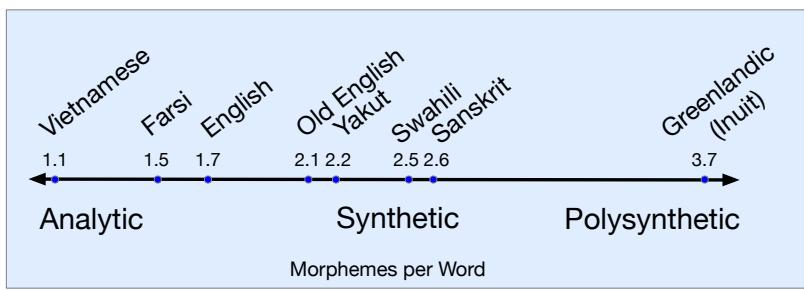

## 2.2 Morphemes: Parts of Words

Words have parts. At the level of characters, this is obvious. The word cats is composed of four characters, ‘c’, ‘a’, ‘t’, ‘s’. But this is also true at a more subtle level: words have components that themselves have coherent meanings. These components are called morphemes, and the study of morphemes is called morphology. A morpheme is a minimal meaning-bearing unit in a language. So, for example, the wordfox consists of one morpheme (the morphemefox) while the word cats consists of two: the morpheme cat and the morpheme -s that indicates plural.

Here’s a sentence in English segmented into morphemes with hyphens:

(2.6) Doc work-ed care-ful-ly wash-ing the glass-es

As we mentioned above, in Chinese, conveniently, the writing system is set up so that each character mainly describes a morpheme. Here’s a sentence in Mandarin Chinese with each morpheme character glossed, followed by the translation:

(2.7) 梅 干 菜 用 清 水 泡 软 ，捞 出 后 ，沥 干plum dry vegetable use clear water soak soft , remove out after , drip dry切 碎

chop fragment

Soak the preserved vegetable in water until soft, remove, drain, and chop

We generally distinguish two broad classes of morphemes: roots—the central morpheme of the word, supplying the main meaning—and affixes—adding “additional” meanings of various kinds. In the English example above, for the word worked, work is a root and -ed is an affix; similarly for glasses, glass is a root and -es an affix.

Affixes themselves fall into two classes, or more correctly a continuum between two poles. At one end, inflectional morphemes are grammatical morphemes that tend to play a syntactic role, such as marking agreement. For example, English has the inflectional morpheme -s (or -es) for marking the plural on nouns and the inflectional morpheme -ed for marking the past tense on verbs. Inflectional morphemes tend to be productive and often obligatory and their meanings tend to be predictable. Derivational morphemes are more idiosyncratic in their application and meaning. Usually they apply only to a specific subclass of words and result in a word of a different grammatical class than the root, often with a meaning hard to predict exactly. In the example above, the word care (a noun) can be combined with the derivational affix -ful to produce an adjective (careful), and another derivational affix -ly to result in an adverb (carefully).

There is another class of morphemes: clitics. A clitic is a morpheme that acts syntactically like a word but is reduced in form and attached (phonologically and sometimes orthographically) to another word. For example the English morpheme ’ve in the word I’ve is a clitic; it has the grammatical meaning of the word have, but in form it cannot appear alone (you can’t just have “’ve” alone in a sentence). The English possessive morpheme ’s in the phrase the teacher’s book is a clitic. French definite article l’ in the word l’opera´ is a clitic, as are prepositions in Arabic like b ‘by/with’ and conjunctions like w ‘and’.

The study of how languages vary in their morphology, i.e., how words break up into their parts, is called morphological typology. While morphologies of languages can differ along many dimensions, two dimensions are particularly relevant for computational word tokenization.

The first dimension is the number of morphemes per word. In some languages, like Vietnamese and to a lesser extent Cantonese, each word on average has just over one morpheme. We call languages at this end of the scale isolating or analytic languages. For example each word in the following Cantonese sentence has one morpheme (and one syllable):

(2.8) keoi5 waa6 cyun4 gwok3 zeoi3 daai6 gaan1 uk1 hai6 ni1 gaan1 he say entire country most big building house is this building

“He said the biggest house in the country was this one”

Alternatively, in languages like Koryak, a Chukotko-Kamchatkan language spoken in the northern part of the Kamchatka peninsula in Russia, a single word may have very many morphemes, corresponding to a whole sentence in English (Arkadiev, 2020; Kurebito, 2017). We call such languages synthetic languages, and the very end of the scale polysynthetic languages.

(2.9) t-@-nk’e-mejN-@-jetem@-nni-k

1SG.S-E-midnight-big-E-yurt.cover-E-sew-1SG.S[PFV]

“I sewed a lot ofyurt covers in the middle ofa night.”

(Koryak, Chukotko-Kamchatkan, Russia; Kurebito (2017, 844))

Fig. 2.3 shows an early computation of morphemes per words on a few languages by the linguistic typologist Joseph Greenberg (1960).

  
Figure 2.3 An early estimate of morphemes per word by Joseph Greenberg (1960)

The second dimension is the degree to which morphemes are easily segmentable, ranging from agglutinative languages like Turkish, in which morphemes have relatively clean boundaries, to fusion languages like Russian, in which a single affix may conflate multiple morphemes, like -om in the word stolom (table-SG-INSTR-DECL1), which fuses the distinct morphological categories instrumental, singular, and first declension.

The English -s suffix in She reads the article is an example of fusion, since the suffix means both third person singular but also means present tense, and there’s no way to divide up the meaning to different parts of the -s.

Although we have loosely talked about these properties (analytic, polysynthetic, fusional, agglutinative) as if they are properties of languages, in fact languages can make use of different morphological systems so it would be more accurate to talk about these as general tendencies.

Nonetheless, the fact morphemes can be hard to define, and that many languages can have complex morphemes that aren’t easy to break up into pieces makes it very difficult to use morphemes as a standard for tokenization cross-lingually.
