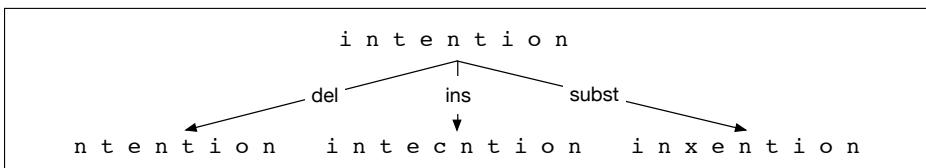

## 2.9 Minimum Edit Distance

We often need a way to compare how similar two words or strings are. As we’ll see in later chapters, this comes up most commonly in tasks like automatic speech recognition or machine translation, where we want to know how similar the sequence of words is to some reference sequence of words.

Edit distance gives us a way to quantify these intuitions about string similarity. More formally, the minimum edit distance between two strings is defined as the minimum number of editing operations (operations like insertion, deletion, substitution) needed to transform one string into another. In this section we’ll introduce edit distance for single words, but the algorithm applies equally to entire strings.

The gap between intention and execution, for example, is 5 (delete an i, substitute e for n, substitute x for t, insert c, substitute u for n). It’s much easier to see this by looking at the most important visualization for string distances, an alignment between the two strings, shown in Fig. 2.17. Given two sequences, an alignment is a correspondence between substrings of the two sequences. Thus, we say I aligns with the empty string, N with E, and so on. Beneath the aligned strings is another representation; a series of symbols expressing an operation list for converting the top string into the bottom string: d for deletion, s for substitution, i for insertion.

## I N T E \* N T I O N \* E X E C U T I O N

d s s i s Figure 2.17 Representing the minimum edit distance between two strings as an alignment. The final row gives the operation list for converting the top string into the bottom string: d for deletion, s for substitution, i for insertion.

We can also assign a particular cost or weight to each of these operations. The Levenshtein distance between two sequences is the simplest weighting factor in which each of the three operations has a cost of 1 (Levenshtein, 1966)—we assume that the substitution of a letter for itself, for example, t for t, has zero cost. The Levenshtein distance between intention and execution is 5. Levenshtein also proposed an alternative version of his metric in which each insertion or deletion has a cost of 1 and substitutions are not allowed. (This is equivalent to allowing substitution, but giving each substitution a cost of 2 since any substitution can be represented by one insertion and one deletion). Using this version, the Levenshtein distance between intention and execution is 8.

## 2.9.1 The Minimum Edit Distance Algorithm

How do we find the minimum edit distance? We can think of this as a search task, in which we are searching for the shortest path—a sequence of edits—from one string to another.

  
Figure 2.18 Finding the edit distance viewed as a search problem

The space of all possible edits is enormous, so we can’t search naively. However, lots of distinct edit paths will end up in the same state (string), so rather than recomputing all those paths, we could just remember the shortest path to a state each time we saw it. We can do this by using dynamic programming. Dynamic programming is the name for a class of algorithms, first introduced by Bellman (1957), that apply a table-driven method to solve problems by combining solutions to subproblems. Some of the most commonly used algorithms in natural language processing make use of dynamic programming, such as the Viterbi algorithm (Chapter 18) and the CKY algorithm for parsing (Chapter 19).

The intuition of a dynamic programming problem is that a large problem can be solved by properly combining the solutions to various subproblems. Consider the shortest path of transformed words that represents the minimum edit distance between the strings intention and execution shown in Fig. 2.19.

$$
\begin{array}{l l} \text {intention} & \leftarrow \text {delete i} \\ \text {ntention} & \leftarrow \text {substitute n by e} \\ \text {etention} & \leftarrow \text {substitute t by x} \\ \text {exention} & \leftarrow \text {insert u} \\ \text {exenution} & \leftarrow \text {substitute n by c} \\ \text {execution} & \end{array}
$$

Figure 2.19 Path from intention to execution.

Imagine some string (perhaps it is exention) that is in this optimal path (whatever it is). The intuition of dynamic programming is that if exention is in the optimal operation list, then the optimal sequence must also include the optimal path from intention to exention. Why? If there were a shorter path from intention to exention, then we could use it instead, resulting in a shorter overall path, and the optimal sequence wouldn’t be optimal, thus leading to a contradiction.

The minimum edit distance algorithm was named by Wagner and Fischer (1974) but independently discovered by many people (see the Historical Notes section of Chapter 18).

Let’s first define the minimum edit distance between two strings. Given two strings, the source string X of length n, and target string Y of length m, we’ll define $D [ i , j ]$ as the edit distance between $X [ 1 . . i ]$ and $Y [ 1 . . j ] , \mathrm { i . e . }$ ., the first i characters of X and the first j characters of Y. The edit distance between X and Y is thus $D [ n , m ]$

We’ll use dynamic programming to compute $D [ n , m ]$ bottom up, combining solutions to subproblems. In the base case, with a source substring of length i but an empty target string, going from i characters to 0 requires i deletes. With a target substring of length j but an empty source going from 0 characters to j characters requires j inserts. Having computed $D [ i , j ]$ for small $i , j$ we then compute larger $D [ i , j ]$ based on previously computed smaller values. The value of $D [ i , j ]$ is computed by taking the minimum of the three possible paths through the matrix which arrive there:

$$
D [ i, j ] = \min \left\{ \begin{array}{l} D [ i - 1, j ] + \operatorname{del-cost} (s o u r c e [ i ]) \\ D [ i, j - 1 ] + \operatorname{ins-cost} (t a r g e t [ j ]) \\ D [ i - 1, j - 1 ] + \operatorname{sub-cost} (s o u r c e [ i ], t a r g e t [ j ]) \end{array} \right.\tag{2.19}
$$

We mentioned above two versions of Levenshtein distance, one in which substitutions cost 1 and one in which substitutions cost $2 \ ( \mathrm { i . e . }$ , are equivalent to an insertion plus a deletion). Let’s here use that second version of Levenshtein distance in which the insertions and deletions each have a cost of $\mathbf { \sigma } ( \operatorname { i n s - c o s t } ( \cdot ) = \operatorname* { d e l - c o s t } ( \cdot ) = 1 )$ , and substitutions have a cost of 2 (except substitution of identical letters has zero cost). Under this version of Levenshtein, the computation for $D [ i , j ]$ becomes:

$$
D [ i, j ] = \min \left\{ \begin{array}{l l} D [ i - 1, j ] + 1 \\ D [ i, j - 1 ] + 1 \\ D [ i - 1, j - 1 ] + \left\{ \begin{array}{l l} 2; & \text { if   source } [ i ] \neq t a r g e t [ j ] \\ 0; & \text { if   source } [ i ] = t a r g e t [ j ] \end{array} \right. \end{array} \right.\tag{2.20}
$$

The algorithm is summarized in Fig. 2.21; Fig. 2.20 shows the results of applying the algorithm to the distance between intention and execution with the version of Levenshtein in Eq. 2.20.

<table><tr><td>Src\Tar</td><td>#</td><td>e</td><td>x</td><td>e</td><td>c</td><td>u</td><td>t</td><td>i</td><td>o</td><td>n</td></tr><tr><td>#</td><td>0</td><td>1</td><td>2</td><td>3</td><td>4</td><td>5</td><td>6</td><td>7</td><td>8</td><td>9</td></tr><tr><td>i</td><td>1</td><td>2</td><td>3</td><td>4</td><td>5</td><td>6</td><td>7</td><td>6</td><td>7</td><td>8</td></tr><tr><td>n</td><td>2</td><td>3</td><td>4</td><td>5</td><td>6</td><td>7</td><td>8</td><td>7</td><td>8</td><td>7</td></tr><tr><td>t</td><td>3</td><td>4</td><td>5</td><td>6</td><td>7</td><td>8</td><td>7</td><td>8</td><td>9</td><td>8</td></tr><tr><td>e</td><td>4</td><td>3</td><td>4</td><td>5</td><td>6</td><td>7</td><td>8</td><td>9</td><td>10</td><td>9</td></tr><tr><td>n</td><td>5</td><td>4</td><td>5</td><td>6</td><td>7</td><td>8</td><td>9</td><td>10</td><td>11</td><td>10</td></tr><tr><td>t</td><td>6</td><td>5</td><td>6</td><td>7</td><td>8</td><td>9</td><td>8</td><td>9</td><td>10</td><td>11</td></tr><tr><td>i</td><td>7</td><td>6</td><td>7</td><td>8</td><td>9</td><td>10</td><td>9</td><td>8</td><td>9</td><td>10</td></tr><tr><td>o</td><td>8</td><td>7</td><td>8</td><td>9</td><td>10</td><td>11</td><td>10</td><td>9</td><td>8</td><td>9</td></tr><tr><td>n</td><td>9</td><td>8</td><td>9</td><td>10</td><td>11</td><td>12</td><td>11</td><td>10</td><td>9</td><td>8</td></tr></table>

Figure 2.20 Computation of minimum edit distance between intention and execution with the algorithm of Fig. 2.21, using Levenshtein distance with cost of 1 for insertions or deletions, 2 for substitutions.

function MIN-EDIT-DISTANCE(source, target) returns min-distance

 $n \leftarrow$  LENGTH(source)

 $m \leftarrow$  LENGTH(target)

Create a distance matrix  $D[n+1,m+1]$ 

# Initialization: the zeroth row and column is the distance from the empty string
 $D[0,0]=0$ 

for each row i from 1 to n do

 $D[i,0] \leftarrow D[i-1,0] + del-cost(source[i])$ 

for each column j from 1 to m do

 $D[0,j] \leftarrow D[0,j-1] + ins-cost(target[j])$ 

# Recurrence relation:
for each row i from 1 to n do

for each column j from 1 to m do

 $D[i,j] \leftarrow \text{MIN}(D[i-1,j] + del-cost(source[i]), D[i-1,j-1] + sub-cost(source[i], target[j]), D[i,j-1] + ins-cost(target[j]))$ 

# Termination

return D[n,m]

Figure 2.21 The minimum edit distance algorithm, an example of the class of dynamic programming algorithms. The various costs can either be fixed (e.g., x,ins-cost(x) = 1) or can be specific to the letter (to model the fact that some letters are more likely to be inserted than others). We assume that there is no cost for substituting a letter for itself (i.e., sub-cost(x,x) = 0).

Alignment Knowing the minimum edit distance is useful for algorithms like finding potential spelling error corrections. But the edit distance algorithm is important in another way; with a small change, it can also provide the minimum cost alignment between two strings. Aligning two strings is useful throughout speech and language processing. In speech recognition, minimum edit distance alignment is used to compute the word error rate (Chapter 16). Alignment plays a role in machine translation, in which sentences in a parallel corpus (a corpus with a text in two languages) need to be matched to each other.

To extend the edit distance algorithm to produce an alignment, we can start by visualizing an alignment as a path through the edit distance matrix. Figure 2.22 shows this path with boldfaced cells. Each boldfaced cell represents an alignment of a pair of letters in the two strings. If two boldfaced cells occur in the same row, there will be an insertion in going from the source to the target; two boldfaced cells in the same column indicate a deletion.

Figure 2.22 also shows the intuition of how to compute this alignment path. The computation proceeds in two steps. In the first step, we augment the minimum edit distance algorithm to store backpointers in each cell. The backpointer from a cell points to the previous cell (or cells) that we came from in entering the current cell. We’ve shown a schematic of these backpointers in Fig. 2.22. Some cells have multiple backpointers because the minimum extension could have come from multiple previous cells. In the second step, we perform a backtrace. In a backtrace, we start from the last cell (at the final row and column), and follow the pointers back through the dynamic programming matrix. Each complete path between the final cell and the initial cell is a minimum distance alignment. Exercise 2.10 asks you to modify the

minimum edit distance algorithm to store the pointers and compute the backtrace to output an alignment.

<table><tr><td></td><td>#</td><td>e</td><td>x</td><td>e</td><td>c</td><td>u</td><td>t</td><td>i</td><td>o</td><td>n</td></tr><tr><td>#</td><td>0</td><td>← 1</td><td>← 2</td><td>← 3</td><td>← 4</td><td>← 5</td><td>← 6</td><td>← 7</td><td>← 8</td><td>← 9</td></tr><tr><td>i</td><td>↑ 1</td><td>↖←↑ 2</td><td>↖←↑ 3</td><td>↖←↑ 4</td><td>↖←↑ 5</td><td>↖←↑ 6</td><td>↖←↑ 7</td><td>↖ 6</td><td>← 7</td><td>← 8</td></tr><tr><td>n</td><td>↑ 2</td><td>↖←↑ 3</td><td>↖←↑ 4</td><td>↖←↑ 5</td><td>↖←↑ 6</td><td>↖←↑ 7</td><td>↖←↑ 8</td><td>↑ 7</td><td>↖←↑ 8</td><td>↖ 7</td></tr><tr><td>t</td><td>↑ 3</td><td>↖←↑ 4</td><td>↖←↑ 5</td><td>↖←↑ 6</td><td>↖←↑ 7</td><td>↖←↑ 8</td><td>↖ 7</td><td>←↑ 8</td><td>↖←↑ 9</td><td>↑ 8</td></tr><tr><td>e</td><td>↑ 4</td><td>↖ 3</td><td>← 4</td><td>↖← 5</td><td>← 6</td><td>← 7</td><td>←↑ 8</td><td>↖←↑ 9</td><td>↖←↑ 10</td><td>↑ 9</td></tr><tr><td>n</td><td>↑ 5</td><td>↑ 4</td><td>↖←↑ 5</td><td>↖←↑ 6</td><td>↖←↑ 7</td><td>↖←↑ 8</td><td>↖←↑ 9</td><td>↖←↑ 10</td><td>↖←↑ 11</td><td>↖↑ 10</td></tr><tr><td>t</td><td>↑ 6</td><td>↑ 5</td><td>↖←↑ 6</td><td>↖←↑ 7</td><td>↖←↑ 8</td><td>↖←↑ 9</td><td>↖ 8</td><td>← 9</td><td>← 10</td><td>←↑ 11</td></tr><tr><td>i</td><td>↑ 7</td><td>↑ 6</td><td>↖←↑ 7</td><td>↖←↑ 8</td><td>↖←↑ 9</td><td>↖←↑ 10</td><td>↑ 9</td><td>↖ 8</td><td>← 9</td><td>← 10</td></tr><tr><td>o</td><td>↑ 8</td><td>↑ 7</td><td>↖←↑ 8</td><td>↖←↑ 9</td><td>↖←↑ 10</td><td>↖←↑ 11</td><td>↑ 10</td><td>↑ 9</td><td>↖ 8</td><td>← 9</td></tr><tr><td>n</td><td>↑ 9</td><td>↑ 8</td><td>↖←↑ 9</td><td>↖←↑ 10</td><td>↖←↑ 11</td><td>↖←↑ 12</td><td>↑ 11</td><td>↑ 10</td><td>↑ 9</td><td>↖ 8</td></tr></table>

Figure 2.22 When entering a value in each cell, we mark which of the three neighboring cells we came from with up to three arrows. After the table is full we compute an alignment (minimum edit path) by using a backtrace, starting at the 8 in the lower-right corner and following the arrows back. The sequence of bold cells represents one possible minimum cost alignment between the two strings, again using Levenshtein distance with cost of 1 for insertions or deletions, 2 for substitutions. Diagram design after Gusfield (1997).

While we worked our example with simple Levenshtein distance, the algorithm in Fig. 2.21 allows arbitrary weights on the operations. For spelling correction, for example, substitutions are more likely to happen between letters that are next to each other on the keyboard. The Viterbi algorithm is a probabilistic extension of minimum edit distance. Instead of computing the “minimum edit distance” between two strings, Viterbi computes the “maximum probability alignment” of one string with another. We’ll discuss this more in Chapter 18.
