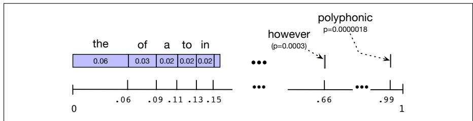

# 3.4 从语言模型中采样句子

要直观了解语言模型包含何种知识，一种重要方法是从中进行**采样**（sampling）。从一个分布中采样，就是根据各个点的可能性随机选择点。因此，从表示句子分布的语言模型中采样，就是按照模型定义的句子概率生成句子。模型认为概率较高的句子更可能生成，概率较低的句子则较少生成。

通过采样把语言模型可视化的技术，很早就由 Shannon（1948）以及 Miller and Selfridge（1950）提出。使用一元模型最容易说明其工作原理。设想英语中的所有词覆盖 0 到 1 之间的数轴，每个词覆盖的区间与其频率成比例。图 3.3 使用根据本书文本计算的一元语言模型给出了这种可视化。我们在 0 与 1 之间随机选择一个值，在概率数轴上找到这个点，再输出其所在区间对应的词。接着继续选择随机数并生成词，直到随机生成句末词元 `</s>`。

**图 3.3 通过反复采样一元语法生成句子时，采样分布的可视化。蓝色条表示每个词的相对频次（图中按频率从高到低排列，但顺序可以任意选择），数轴表示累积概率。在 0 与 1 之间选择一个随机数，它会落入某个词对应的区间。随机数落在高频词（the、of、a）的较大区间内的期望，远高于落在罕见词（polyphonic）的较小区间内的期望。**

同一种技术也可以用来生成二元语法。首先根据二元概率随机生成一个以 `<s>` 开头的二元语法；假设它的第二个词是 $w$，接着再随机选择一个以 $w$ 开头的二元语法（同样依据相应二元概率抽取），依此类推。
