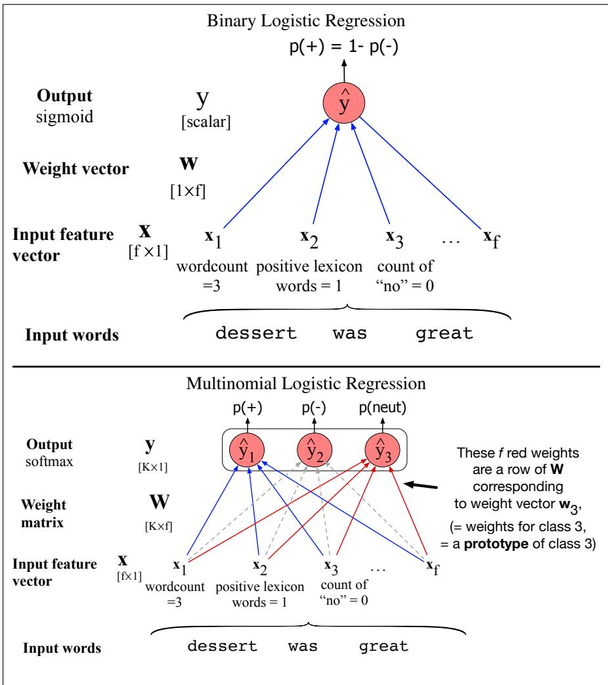
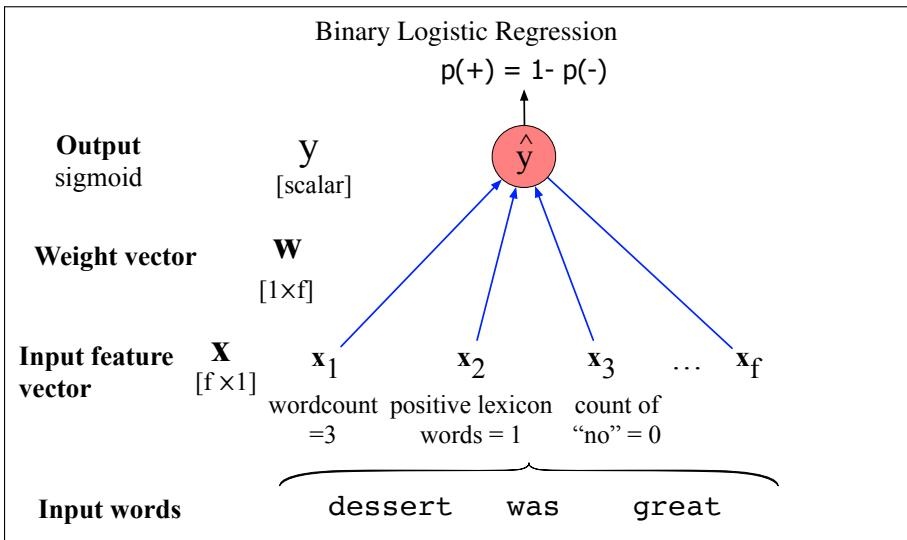

## 4.7 Multinomial logistic regression

Sometimes we need more than two classes. Perhaps we might want to do 3-way sentiment classification (positive, negative, or neutral). Or we could be assigning some of the labels we will introduce in Chapter 18, like the part of speech of a word (choosing from 10, 30, or even 50 different parts of speech), or the named entity type of a phrase (choosing from tags like person, location, organization). Or, for large language models, we’ll be predicting the next word out of the $| V |$ possible words in the vocabulary, so it’s V -way classification.

In such cases we use multinomial logistic regression, also called softmax regression (in older NLP literature you will sometimes see the name maxent classifier). In multinomial logistic regression we want to label each observation with a class k from a set of K classes, under the stipulation that only one of these classes is the correct one (sometimes called hard classification; an observation can not be in multiple classes). Let’s use the following representation: the output y for each input x will be a vector of length K. If class c is the correct class, we’ll set $y _ { c } = 1$ , and set all the other elements of y to be $0 , \mathrm { i . e . , } y _ { c } = 1$ and $y _ { j } = 0 \forall j \neq c . \mathrm { ~ A ~ }$ vector like this y, with one value=1 and the rest 0, is called a one-hot vector. The job of the classifier is to produce an estimate vector ˆy. For each class $k ,$ the value $\hat { y } _ { k }$ will be the classifier’s estimate of the probability $P ( y _ { k } = 1 | \mathbf { x } )$

## 4.7.1 Softmax

The multinomial logistic classifier uses a generalization of the sigmoid, called the softmax function, to compute $p ( y _ { k } = 1 | \mathbf { x } )$ . The softmax function takes a vector $\pmb { z } = [ z _ { 1 } , z _ { 2 } , . . . , z _ { K } ]$ of K arbitrary values and maps them to a probability distribution, with each value in the range [0,1], and all the values summing to 1. Like the sigmoid, it is an exponential function.

For a vector z of dimensionality K, the softmax is defined as:

$$
\operatorname{softmax} \left(z _ {i}\right) = \frac {\exp \left(z _ {i}\right)}{\sum_ {j = 1} ^ {K} \exp \left(z _ {j}\right)} 1 \leq i \leq K\tag{4.33}
$$

The softmax of an input vector $\pmb { z } = [ z _ { 1 } , z _ { 2 } , . . . , z _ { K } ]$ is thus a vector itself:

$$
\operatorname{softmax} (\mathbf {z}) = \left[ \frac {\exp (z _ {1})}{\sum_ {i = 1} ^ {K} \exp (z _ {i})}, \frac {\exp (z _ {2})}{\sum_ {i = 1} ^ {K} \exp (z _ {i})}, \dots , \frac {\exp (z _ {K})}{\sum_ {i = 1} ^ {K} \exp (z _ {i})} \right]\tag{4.34}
$$

The denominator $\textstyle \sum _ { i = 1 } ^ { K } \exp ( \pmb { z } _ { i } )$ is used to normalize all the values into probabilities. Thus for example given a vector:

$$
\mathbf {z} = [ 0. 6, 1. 1, - 1. 5, 1. 2, 3. 2, - 1. 1 ]
$$

the resulting (rounded) softmax(z) is

$$
[ 0. 0 5, 0. 0 9, 0. 0 1, 0. 1, 0. 7 4, 0. 0 1 ]
$$

Like the sigmoid, the softmax has the property of squashing values toward 0 or 1. Thus if one of the inputs is larger than the others, it will tend to push its probability toward 1, and suppress the probabilities of the smaller inputs.

Finally, note that, just as for the sigmoid, we refer to z, the vector of scores that is the input to the softmax, as logits (see Eq. 4.7).

## 4.7.2 Applying softmax in logistic regression

When we apply softmax for logistic regression, the input will (just as for the sigmoid) be the dot product between a weight vector w and an input vector x (plus a bias). But now we’ll need separate weight vectors $\boldsymbol { \mathsf { w } } _ { k }$ and bias $b _ { k }$ for each of the K classes. The probability of each of our output classes $\hat { y } _ { k }$ can thus be computed as:

$$
P (y _ {k} = 1 | \mathbf {x}) = \frac {\exp \left(\mathbf {w} _ {k} \cdot \mathbf {x} + b _ {k}\right)}{\sum_ {j = 1} ^ {K} \exp \left(\mathbf {w} _ {j} \cdot \mathbf {x} + b _ {j}\right)}\tag{4.35}
$$

The form of Eq. 4.35 makes it seem that we would compute each output separately. Instead, it’s more common to set up the equation for more efficient computation by modern vector processing hardware. We’ll do this by representing the set of K weight vectors as a weight matrix W and a bias vector b. Each row k of W corresponds to the vector of weights $w _ { k }$ . W thus has shape $[ K \times f ]$ , for K the number of output classes and $f$ the number of input features. The bias vector b has one value for each of the K output classes. If we represent the weights in this way, we can compute $\hat { \mathbf { y } } ,$ the vector of output probabilities for each of the K classes, by a single elegant equation:

$$
\hat {\mathbf {y}} = \operatorname{softmax} (\mathbf {W x} + \mathbf {b})\tag{4.36}
$$

If you work out the matrix arithmetic, you can see that the estimated score of the first output class $\hat { y } _ { 1 }$ (before we take the softmax) will correctly turn out to be $\mathbf { w } _ { 1 } \cdot \mathbf { x } + b _ { 1 }$

One helpful interpretation of the weight matrix W is to see each row $\boldsymbol { \mathsf { w } } _ { k }$ as a prototype of class $k .$ The weight vector ${ \pmb w } _ { k }$ that is learned represents the class as a kind of template. Since two vectors that are more similar to each other have a higher dot product with each other, the dot product acts as a similarity function. Logistic regression is thus learning a prototype representation for each class, such that incoming vectors are assigned the class k they are most similar to from the K classes (Doumbouya et al., 2025).

Fig. 4.6 shows the difference between binary and multinomial logistic regression by illustrating the weight vector versus weight matrix in the computation of the output class probabilities.

## 4.7.3 Features in Multinomial Logistic Regression

Features in multinomial logistic regression act like features in binary logistic regression, with the difference mentioned above that we’ll need separate weight vectors and biases for each of the K classes. Recall our binary exclamation point feature x5 from page 97:

$$
x _ {5} = \left\{ \begin{array}{l l} 1 & \text { if   ``!" } \in \text { doc } \\ 0 & \text { otherwise } \end{array} \right.
$$

In binary classification a positive weight w on a feature influences the classifier toward $y = 1$ (positive sentiment) and a negative weight influences it toward $y = 0$ (negative sentiment) with the absolute value indicating how important the feature is. For multinomial logistic regression, by contrast, with separate weights for each class, a feature can be evidence for or against each individual class.

In 3-way multiclass sentiment classification, for example, we must assign each document one of the 3 classes $+ , - , \mathrm { o r } 0$ (neutral). Now a feature related to exclamation marks might have a negative weight for 0 documents, and a positive weight for + or documents:

$$
\text { Feature } \quad \text { Definition } \quad w _ {5, +} \quad w _ {5, -} \quad w _ {5, 0}   f _ {5} (x) \quad \left\{ \begin{array}{l l} 1 & \text { if   ``!'' } \in \text { doc } \\ 0 & \text { otherwise } \end{array} \right. \quad 3. 5 \quad 3. 1 \quad - 5. 3
$$

Because these feature weights are dependent both on the input text and the output class, we sometimes make this dependence explicit and represent the features themselves as $f ( x , y )$ : a function of both the input and the class. Using such a notation $f _ { 5 } ( x )$ above could be represented as three features $f _ { 5 } ( x , + ) , f _ { 5 } ( x , - )$ , and $f _ { 5 } ( x , 0 )$ . each of which has a single weight. We’ll use this kind of notation in our description of the CRF in Chapter 18.

  
Figure 4.6 Binary versus multinomial logistic regression. Binary logistic regression uses a single weight vector w, and has a scalar output ${ \hat { y } } .$ In multinomial logistic regression we have $K$ separate weight vectors corresponding to the K classes, all packed into a single weight matrix W, and a vector output yˆ. We omit the biases from both figures for clarity.
