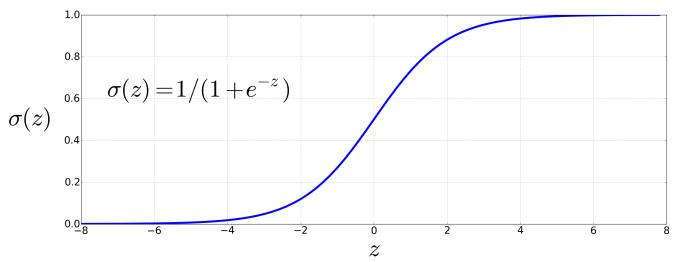

## 4.2 sigmoid 函数

二元逻辑回归的目标是训练一个分类器，对新输入观测的类别作出二元决定。本节介绍帮助作出这种决定的 sigmoid 分类器。

考虑单项输入观测 $x$，把它表示成特征向量 $[x_1,x_2,\ldots,x_n]$；下一节将展示具体特征。分类器输出 $y$ 可以是 1，表示观测属于该类别，也可以是 0，表示观测不属于该类别。我们希望知道观测属于该类别的概率 $P(y=1|x)$。例如，决定可能是“正面情感”还是“负面情感”，特征表示文档中各词的计数；$P(y=1|x)$ 是文档具有正面情感的概率，$P(y=0|x)$ 则是具有负面情感的概率。

逻辑回归通过训练集学习一个权重向量和一个偏置项。每个权重 $w_i$ 都是实数，并与一项输入特征 $x_i$ 相关联。权重 $w_i$ 表示该输入特征对分类决定有多重要。它可以为正，提供实例属于正类的证据；也可以为负，提供实例属于负类的证据。因此，在情感任务中，awesome 的权重应当很高且为正，而 abysmal 的权重应当很低且为负。**偏置项**（bias）也称**截距**（intercept），是另一个加到加权输入上的实数。

训练时学到权重后，为测试实例作决定时，分类器首先把每个 $x_i$ 乘以相应权重 $w_i$，对加权特征求和，再加上偏置项 $b$。所得单个数值 $z$ 表示支持该类别之证据的加权总和：

$$
z = \left(\sum_ {i = 1} ^ {n} w _ {i} x _ {i}\right) + b\tag{4.2}
$$

本书其余部分会使用线性代数中的点积记法表示这种求和。向量 $\mathbf a$ 和 $\mathbf b$ 的点积写作 $\mathbf a\cdot\mathbf b$，等于两个向量对应元素乘积之和。因此，式 4.2 等价于：

$$
z = \mathbf {w} \cdot \mathbf {x} + b\tag{4.3}
$$

然而，式 4.3 并不保证 $z$ 是合法概率，即位于 0 与 1 之间。由于权重是实数，输出甚至可能为负；$z$ 的取值范围是 $-\infty$ 到 $+\infty$。

为了得到概率，把 $z$ 传入 **sigmoid 函数** $\sigma(z)$。该函数因形状像字母 s 而得名，也称**逻辑函数**（logistic function）；逻辑回归的名称正源于此。sigmoid 的公式如下，图 4.1 展示了其图像：

$$
\sigma (z) = \frac {1}{1 + e ^ {- z}} = \frac {1}{1 + \exp (- z)}\tag{4.4}
$$

本书后文用 $\exp(x)$ 表示 $e^x$。sigmoid 有许多优点：它把实数映射到区间 $(0,1)$，正好满足概率的要求；它在 0 附近接近线性，但在两端逐渐变平，因此会把异常值压向 0 或 1；它还可以求导，而第 4.15 节会看到，这一点有利于学习。

  
**图 4.1 sigmoid 函数 $\sigma(z)=\frac{1}{1+e^{-z}}$ 把实数映射到区间 $(0,1)$。它在 0 附近接近线性，但会把异常值压向 0 或 1。**

把 sigmoid 应用于加权特征之和，就会得到一个介于 0 与 1 之间的数。要把它变成概率，只需保证 $P(y=1)$ 与 $P(y=0)$ 之和为 1：

$$
\begin{array}{r c l} P (y = 1) & = & \sigma (\mathbf {w} \cdot \mathbf {x} + b) \\ & = & \frac {1}{1 + \exp (- (\mathbf {w} \cdot \mathbf {x} + b))} \end{array}
$$

$$
\begin{array}{r c l} P (y = 0) & = & 1 - \sigma (\mathbf {w} \cdot \mathbf {x} + b) \\ & = & 1 - \frac {1}{1 + \exp (- (\mathbf {w} \cdot \mathbf {x} + b))} \\ & = & \frac {\exp (- (\mathbf {w} \cdot \mathbf {x} + b))}{1 + \exp (- (\mathbf {w} \cdot \mathbf {x} + b))} \end{array}\tag{4.5}
$$

sigmoid 函数具有以下性质：

$$
1 - \sigma (x) = \sigma (- x)\tag{4.6}
$$

所以，也可以把 $P(y=0)$ 写成 $\sigma(-(\mathbf w\cdot\mathbf x+b))$。

最后说明两个术语。第一，sigmoid 函数的输入，即式 4.3 的分数 $z=\mathbf w\cdot\mathbf x+b$，通常称为 **logit**。这是因为 **logit 函数**是 sigmoid 的反函数；它等于优势比 $p/(1-p)$ 的对数：

$$
\operatorname{logit} (p) = \sigma^ {- 1} (p) = \ln {\frac {p}{1 - p}}\tag{4.7}
$$

把 $z$ 称为 logit，是为了提醒我们：使用 sigmoid 把取值范围为 $-\infty$ 到 $+\infty$ 的 $z$ 转换成概率时，隐式地把 $z$ 解释为一个对数优势，而不只是任意实数。

第二，在二元分类中，为方便起见，把 sigmoid 输出 $\sigma(\mathbf w\cdot\mathbf x+b)$——也就是 $P(y=1)$——记作 $\hat y$，读作“y hat”。因此，$\hat y$ 表示“输入观测属于正类的概率”。第 4.7 节介绍多项或 softmax 逻辑回归时，会把 $\hat y$ 扩展为所有输出类别上的概率向量；二元分类中只需保留一个标量概率，因为缺少的概率总能由 $P(y=0)=1-P(y=1)$ 算出。
