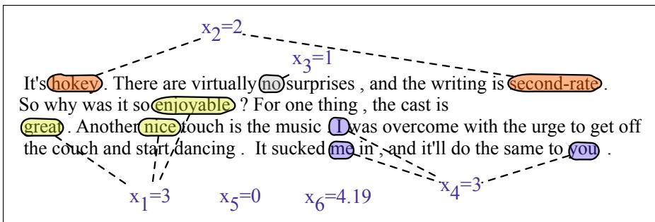

## 4.3 使用逻辑回归进行分类

上一节的 sigmoid 函数为我们提供了一种方法：给定实例 $x$，计算概率 $P(y=1\mid x)$。

那么，如何决定测试实例 $x$ 应属于哪个类别？对于给定的 $x$，若 $P(y=1\mid x)>.5$，就预测为“是”，否则预测为“否”。我们把 .5 称为**决策边界**（decision boundary）：

$$
\operatorname{decision}(x)=\left\{\begin{array}{ll}1&\text{if }P(y=1\mid x)>0.5\\0&\text{otherwise}\end{array}\right.
$$

下面来看几个将逻辑回归用作语言任务分类器的例子。

### 4.3.1 情感分类

假设我们要对电影评论进行二元情感分类，判断评论文档 $doc$ 应被标为正面（+）还是负面（−）。我们用下表中的 6 个特征 $x_1\ldots x_6$ 表示每个输入观测；图 4.2 展示了一篇简短测试文档中的特征。

<table><tr><td>变量</td><td>定义</td><td>图 4.2 中的值</td></tr><tr><td>$x_1$</td><td>count(文档中的正面词典词)</td><td>3</td></tr><tr><td>$x_2$</td><td>count(文档中的负面词典词)</td><td>2</td></tr><tr><td>$x_3$</td><td>$\left\{\begin{array}{ll}1&\text{if “no”出现在文档中}\\0&\text{otherwise}\end{array}\right.$</td><td>1</td></tr><tr><td>$x_4$</td><td>count(文档中的第一、第二人称代词)</td><td>3</td></tr><tr><td>$x_5$</td><td>$\left\{\begin{array}{ll}1&\text{if “!”出现在文档中}\\0&\text{otherwise}\end{array}\right.$</td><td>0</td></tr><tr><td>$x_6$</td><td>ln(文档的词与标点总数)</td><td>ln(66) = 4.19</td></tr></table>

  
**图 4.2 一篇简短测试文档，以及从中提取出的向量 $\mathbf{x}$ 的特征。**

暂且假设我们已经学到了每个特征对应的实数权重。这 6 个权重为 $[2.5,-5.0,-1.2,0.5,2.0,0.7]$，且 $b=0.1$（下一节将讨论如何学习权重）。例如，$w_1$ 表示正面词典词（great、nice、enjoyable 等）的数量对正面判断有多重要，而 $w_2$ 表示负面词典词的重要性。注意，$w_1=2.5$ 为正，而 $w_2=-5.0$ 为负；这说明负面词与正面判断负相关，而且其重要性约为正面词的两倍。

给定这 6 个特征和输入评论 $x$，可以利用式 4.5 计算 $P(+\mid x)$ 和 $P(-\mid x)$：

$$
\begin{array}{rl}P(+\mid x)=P(y=1\mid x)&=\sigma(\mathbf w\cdot\mathbf x+b)\\&=\sigma([2.5,-5.0,-1.2,0.5,2.0,0.7]\cdot[3,2,1,3,0,4.19]+0.1)\\&=\sigma(.833)\\&=0.70\\P(-\mid x)=P(y=0\mid x)&=1-\sigma(\mathbf w\cdot\mathbf x+b)\\&=0.30\end{array}\tag{4.8}
$$

### 4.3.2 其他分类任务与特征

逻辑回归可用于各种 NLP 任务，输入的任何属性都可以成为特征。以**句点消歧**（period disambiguation）为例：我们要判断一个句点是句末标记还是单词的一部分，因此把每个句点分为 EOS（句子结束）和非 EOS 两类。可以使用如下特征：$x_1$ 表示当前词为小写，其权重可能为正；$x_2$ 表示当前词位于缩写词典（如“Prof.”）中，其权重可能为负。特征也可以表示多个属性的组合。例如，全大写词后的句点很可能是 EOS；但若该词是 $St.$，且前一个词首字母大写，那么这个句点很可能属于街道名称后 street 的缩写。

$$
\begin{array}{l}x_1=\left\{\begin{array}{ll}1&\text{if ``Case}(w_i)=\text{Lower''}\\0&\text{otherwise}\end{array}\right.\\x_2=\left\{\begin{array}{ll}1&\text{if ``}w_i\in\text{AcronymDict''}\\0&\text{otherwise}\end{array}\right.\\x_3=\left\{\begin{array}{ll}1&\text{if ``}w_i=St.~\&~\text{Case}(w_{i-1})=\text{Upper''}\\0&\text{otherwise}\end{array}\right.\end{array}
$$

**设计特征与学习特征：**在经典模型中，人们会结合语言学直觉和已有文献检查训练集，并根据系统早期版本在训练集上的错误分析，手工设计特征。还可以考虑**特征交互**（feature interactions），即由较简单特征组合而成的复杂特征。上面的句点消歧就包含一个例子：当单词为 St. 且前一个词首字母大写时，该句点更不可能是句末。

也可以借助**特征模板**（feature templates）自动创建特征，即以抽象规则描述一类特征。例如，句点消歧的二元语法模板可以为训练集中句点前出现的每一对单词创建特征。这样得到的特征空间是稀疏的，因为只有某个 n 元语法确实在训练集的相应位置出现时才需要创建特征。通常会将特征的字符串描述散列为唯一整数；例如，用户描述 `bigram(American breakfast)` 会被散列为唯一整数 $i$，成为特征编号 $f_i$。

显然，手工设计特征需要大量人力。因此，现代 NLP 系统通常避免手工特征，转而关注**表示学习**（representation learning）：以无监督方式从输入中自动学习特征。第 5 章和第 6 章将介绍表示学习方法。

**缩放输入特征：**当不同输入特征的取值范围差异很大时，通常会对它们重新缩放，使其范围可比。我们可以将输入值**标准化**（standardize），使其均值为 0、标准差为 1；这种变换有时称为 **z 分数**（z-score）。若 $\mu_i$ 是输入数据集 $m$ 个观测中特征 $x_i$ 的均值，$\sigma_i$ 是该特征的标准差（注意它不是 sigmoid 函数），则可将 $x_i$ 替换为：

$$
\begin{array}{c}\mu_i=\frac1m\sum_{j=1}^m x_i^{(j)}\\x_i'=\frac{x_i-\mu_i}{\sigma_i}\end{array}\qquad \sigma_i=\sqrt{\frac1m\sum_{j=1}^m\left(x_i^{(j)}-\mu_i\right)^2}\tag{4.9}
$$

也可以将输入特征**归一化**（normalize）到 0 与 1 之间：

$$
x_i'=\frac{x_i-\min(x_i)}{\max(x_i)-\min(x_i)}\tag{4.10}
$$

当不同特征的取值范围可比时，跨特征比较会更容易。数据缩放对大型神经网络尤其重要，因为它有助于加快梯度下降。对于自然语言数据，另一种常见缩放方法是取对数，例如对词频、二元语法计数或其他服从齐普夫分布的量取对数。

### 4.3.3 一次处理多个样本

前面给出的逻辑回归方程只针对单个样本，但实际中通常要处理包含许多样本的完整测试集。假设测试集包含 $m$ 个待分类样本。继续沿用第 94 页的记号：括号中的上标表示数据集（训练集或测试集）中的样本索引。因此，每个测试样本 $x^{(i)}$ 都有特征向量 $\mathbf{x}^{(i)}$，其中 $1\le i\le m$（仍用粗体表示向量和矩阵）。

计算 $\hat y^{(i)}$（即 $P(y^{(i)}=1)$）的一种方法，是使用循环逐个处理测试样本：

$$
\begin{array}{cc}x^{(i)}&\text{in input }[x^{(1)},x^{(2)},\ldots,x^{(m)}]\\\hat y^{(i)}=P(y^{(i)}=1)&=\sigma(\mathbf w\cdot\mathbf x^{(i)}+b)\end{array}\tag{4.11}
$$

例如，前三个测试样本的预测概率分别为：

$$
\begin{array}{rcl}\hat y^{(1)}&=&\sigma(\mathbf w\cdot\mathbf x^{(1)}+b)\\\hat y^{(2)}&=&\sigma(\mathbf w\cdot\mathbf x^{(2)}+b)\\\hat y^{(3)}&=&\sigma(\mathbf w\cdot\mathbf x^{(3)}+b)\end{array}
$$

不过，只需稍微修改式 4.5，便能更高效地完成计算：使用矩阵运算，一次矩阵操作即可为所有样本赋予类别。

首先，把每个输入 $x$ 的特征向量装入一个输入矩阵 $\mathbf X$。第 $i$ 行是样本 $x^{(i)}$ 的特征行向量 $\mathbf x^{(i)}$。若每个样本有 $f$ 个特征，$\mathbf X$ 的形状就是 $[m\times f]$：

$$
\mathbf X=\left[\begin{array}{cccc}x_1^{(1)}&x_2^{(1)}&\ldots&x_f^{(1)}\\x_1^{(2)}&x_2^{(2)}&\ldots&x_f^{(2)}\\x_1^{(3)}&x_2^{(3)}&\ldots&x_f^{(3)}\\\ldots\end{array}\right]\tag{4.12}
$$

再引入长度为 $m$ 的向量 $\mathbf b=[b,b,\ldots,b]$，即将标量偏置 $b$ 重复 $m$ 次；令 $\hat{\mathbf y}=[\hat y^{(1)},\hat y^{(2)},\ldots,\hat y^{(m)}]$ 为输出向量，并把权重向量 $\mathbf w$ 写成列向量。于是，一次矩阵乘法和一次加法就能得到全部输出：

$$
\hat{\mathbf y}=\sigma(\mathbf X\mathbf w+\mathbf b)\tag{4.13}
$$

这里的 $\sigma$ 按元素作用于向量，因此 $\sigma([z_1,z_2,z_3])=[\sigma(z_1),\sigma(z_2),\sigma(z_3)]$。式 4.13 与式 4.11 中的循环计算相同。例如，输出向量的第一项为：

$$
\hat y^{(1)}=\sigma\left([x_1^{(1)},x_2^{(1)},\ldots,x_f^{(1)}]\cdot[w_1,w_2,\ldots,w_f]+b\right)\tag{4.14}
$$

为了使矩阵乘法的维度匹配，这里将 $\mathbf X$ 和 $\mathbf w$ 的顺序与式 4.5 相比进行了调整。标出形状后，式 4.13 为：

$$
\begin{array}{c}\hat{\mathbf y}=\sigma(\mathbf X\quad\mathbf w+\mathbf b)\\(m\times1)\qquad(m\times f)(f\times1)(m\times1)\end{array}\tag{4.15}
$$

现代编译器和计算硬件能高效执行这种矩阵运算，因此在大型数据集上训练或测试时，它会显著加快计算。

顺便说，如果把 $\mathbf X$ 定义为由列向量组成的矩阵——每个输入样本对应一列——那么它的形状为 $[f\times m]$，此时也可以保留式 4.5 中 $\mathbf X$ 与 $\mathbf w$ 的原始顺序。不过，惯例是把输入样本表示为行。
