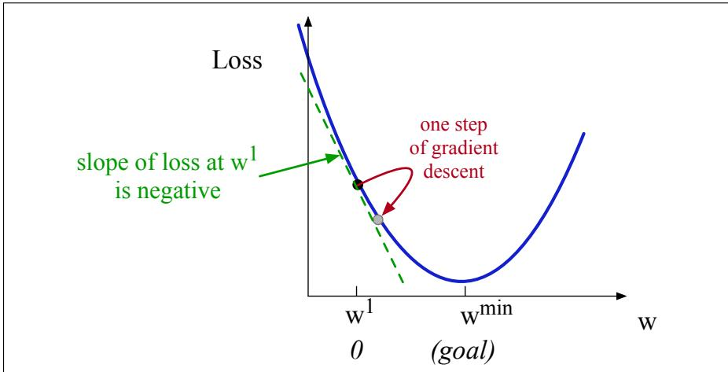
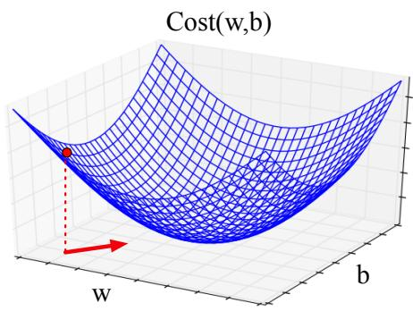

# 4.6 梯度下降

梯度下降的目标是找到最优权重，即最小化为模型定义的损失函数。在式 4.21 中，我们明确表示交叉熵损失 $L_{\mathrm{CE}}$ 由权重参数化。机器学习中通常用 $\theta$ 表示待学习参数；对逻辑回归而言，$\theta=\{\mathbf w,b\}$。因此，将 $\hat y^{(i)}$ 写成 $f(x^{(i)};\theta)$，以凸显它对 $\theta$ 的依赖。我们的目标是找到使所有样本平均损失最小的参数：

$$
\hat\theta=\underset\theta{\operatorname{argmin}}\frac1m\sum_{i=1}^mL_{\mathrm{CE}}(f(x^{(i)};\theta),y^{(i)})\tag{4.21}
$$

怎样找到这个或任何损失函数的最小值？**梯度下降**（gradient descent）先确定函数在参数空间中上升最快的方向，再向相反方向移动，从而寻找函数的最小值。直观地说，就像身处峡谷、想尽快下到谷底河边：环顾四周，找到地面最陡的方向，然后沿下坡走去。

逻辑回归的损失函数恰好是**凸函数**（convex function）。凸函数至多有一个最小值，不存在会使算法受困的局部最小值，因此从任意点出发的梯度下降都能找到该最小值。相比之下，多层神经网络的损失是非凸的，训练时梯度下降可能陷入局部最小值，无法找到全局最优解。

虽然算法和梯度概念是为方向向量设计的，先来看图 4.3 所示的单标量参数 $w$ 情形。随机将 $w$ 初始化为 $w^1$，并假设损失函数 $L$ 具有图中的形状。算法需要判断下一步应向左移动（使 $w^2<w^1$）还是向右移动（使 $w^2>w^1$），才能到达最小值。

梯度下降通过求损失函数在当前点的梯度，并沿相反方向移动来回答这个问题。多变量函数的**梯度**（gradient）是指向函数增长最快方向的向量，是斜率在多变量情形下的推广。对图 4.3 这样的单变量函数，可把梯度直观地理解为斜率。图中虚线表示 $w=w^1$ 处的斜率，它为负，因此要寻找最小值就应沿相反方向，即向 $w$ 增大的方向移动。

移动量由斜率 $\frac d{dw}L(f(x;w),y)$ 与**学习率**（learning rate）$\eta$ 的乘积决定。学习率越高，每一步对 $w$ 的改变量越大：

$$
w^{t+1}=w^t-\eta\frac d{dw}L(f(x;w),y)\tag{4.22}
$$

现在把这种直觉从一个标量推广到多个变量。我们不仅要判断向左或向右，还要决定在构成 $\theta$ 的 $N$ 个参数所形成的 $N$ 维空间中向哪里移动。梯度正是这样的向量：它给出沿每个维度的最陡斜率分量。若只有两个权重维度（例如权重 $w$ 和偏置 $b$），梯度就是包含两个正交分量的向量，分别表示地面沿 $w$ 和 $b$ 维度的斜率。图 4.4 展示了红点处二维梯度向量的值。

**图 4.3 迭代寻找损失函数最小值的第一步：沿函数斜率的反方向移动 $w$。斜率为负，因此需要向右、即 $w$ 的正方向移动。这里上标表示学习步骤，$w^1$ 是 $w$ 的初始值（0），$w^2$ 是第二步的值，依此类推。**

实际逻辑回归中的参数向量 $\mathbf w$ 远不止一两个元素，因为输入特征向量 $\mathbf x$ 可能很长，每个 $x_i$ 都需要一个权重 $w_i$。对 $\mathbf w$ 中的每个维度 $w_i$（以及偏置 $b$），梯度都有一个分量表示相对于该变量的斜率。沿 $w_i$ 维度的斜率写成损失函数的偏导数 $\frac{\partial}{\partial w_i}$；它回答的是：“变量 $w_i$ 的微小变化会在多大程度上影响总损失 $L$？”

形式上，多变量函数 $f$ 的梯度是一个向量，每个分量都是 $f$ 对某个变量的偏导数。我们用倒三角符号 $\nabla$ 表示梯度，并将 $\hat y$ 写成 $f(x;\theta)$：

**图 4.4 红点处关于 $w$ 和 $b$ 的二维梯度向量。红色箭头表示寻找最小值时要移动的方向，即梯度的反方向（梯度指向函数增大而非减小的方向）。**

$$
\nabla L(f(x;\boldsymbol\theta),y)=\left[\begin{array}{c}\frac{\partial}{\partial w_1}L(f(x;\boldsymbol\theta),y)\\\frac{\partial}{\partial w_2}L(f(x;\boldsymbol\theta),y)\\\vdots\\\frac{\partial}{\partial w_n}L(f(x;\boldsymbol\theta),y)\\\frac{\partial}{\partial b}L(f(x;\boldsymbol\theta),y)\end{array}\right]\tag{4.23}
$$

因此，根据梯度更新 $\theta$ 的最终方程为：

$$
\theta^{t+1}=\theta^t-\eta\nabla L(f(x;\theta),y)\tag{4.24}
$$

## 4.6.1 逻辑回归的梯度

要更新 $\theta$，需要定义梯度 $\nabla L(f(x;\theta),y)$。回顾逻辑回归的交叉熵损失：

$$
L_{\mathrm{CE}}(\hat y,y)=-[y\log\sigma(\mathbf w\cdot\mathbf x+b)+(1-y)\log(1-\sigma(\mathbf w\cdot\mathbf x+b))]\tag{4.25}
$$

对单个观测向量 $\mathbf x$，该函数的导数为式 4.26（推导见第 4.15 节）：

$$
\begin{array}{rcl}\frac{\partial L_{\mathrm{CE}}(\hat y,y)}{\partial w_j}&=&[\sigma(\mathbf w\cdot\mathbf x+b)-y]x_j\\&=&(\hat y-y)x_j\end{array}\tag{4.26}
$$

也常写成等价形式：

$$
\frac{\partial L_{\mathrm{CE}}(\hat y,y)}{\partial w_j}=-(y-\hat y)x_j\tag{4.27}
$$

这个结果很直观：对单个权重 $w_j$ 的梯度，等于真实值 $y$ 与估计值 $\hat y=\sigma(\mathbf w\cdot\mathbf x+b)$ 之差，再乘以对应输入值 $x_j$。对偏置 $b$ 的偏导数为：

$$
\begin{array}{rl}\frac{\partial L_{\mathrm{CE}}(\hat y,y)}{\partial b}&=\sigma(\mathbf w\cdot\mathbf x+b)-y\\&=\hat y-y\end{array}\tag{4.28}
$$

## 4.6.2 随机梯度下降算法

**随机梯度下降**（stochastic gradient descent, SGD）是一种在线算法：处理每个训练样本后都计算损失函数的梯度，并将 $\theta$ 沿正确方向（梯度的反方向）微调。**在线算法**（online algorithm）逐个处理输入样本，而不等待全部输入到齐。SGD 之所以称为“随机”，是因为它每次随机选择一个样本；第 4.6.4 节将讨论一次成批处理多个样本的版本。算法见图 4.5。

function STOCHASTIC GRADIENT DESCENT(L(), f(), x, y) returns $\theta$

# L：损失函数
# f：由 $\theta$ 参数化的函数
# x：训练输入集合 $x^{(1)},x^{(2)},\ldots,x^{(m)}$
# y：训练输出（标签）集合 $y^{(1)},y^{(2)},\ldots,y^{(m)}$
$\theta\leftarrow0$  #（或较小的随机值）

repeat til done  # 见图注
    For each training tuple $(x^{(i)},y^{(i)})$ (in random order)
        1. 可选（用于报告）：
           Compute $\hat y^{(i)}=f(x^{(i)};\theta)$
           Compute the loss $L(\hat y^{(i)},y^{(i)})$
        2. $g\leftarrow\nabla_\theta L(f(x^{(i)};\theta),y^{(i)})$
        3. $\theta\leftarrow\theta-\eta g$
return $\theta$

**图 4.5 随机梯度下降算法。第 1 步（计算损失）主要用于报告当前样本上的表现；计算梯度并不要求先计算损失。算法可在收敛（梯度范数 $<\epsilon$）时终止，也可在进展停止时终止（例如留出集上的损失开始上升）。逻辑回归的权重初始化为 0；神经网络则初始化为较小的随机值，第 6 章将对此加以说明。**

学习率 $\eta$ 是需要调节的**超参数**（hyperparameter）。学习率过高时，每一步过大，会越过损失函数的最小值；过低时，每一步太小，到达最小值所需时间过长。常见做法是以较高学习率开始，随后缓慢降低，使其成为训练迭代次数 $k$ 的函数；可用 $\eta_k$ 表示第 $k$ 次迭代的学习率。

第 6 章将更详细地讨论超参数。简言之，它们是一类特殊的模型参数：普通参数（如 $\mathbf w$ 和 $b$）由算法从训练集学得，而超参数由算法设计者选择，用来影响算法的运行方式。

## 4.6.3 完整推演一个例子

下面演示梯度下降的一次更新。使用图 4.2 的简化版本：单个观测 $x$ 的正确标签为 $y=1$（正面评论），特征向量 $\mathbf x=[x_1,x_2]$ 包含：

$$
\begin{array}{ll}x_1=3&\text{（正面词典词的数量）}\\x_2=2&\text{（负面词典词的数量）}\end{array}
$$

假设 $\theta^0$ 中的初始权重和偏置均为 0，初始学习率为 0.1：

$$
\begin{array}{rl}w_1=w_2=b&=0\\\eta&=0.1\end{array}
$$

一次更新需要计算梯度并乘以学习率：

$$
\theta^{t+1}=\theta^t-\eta\nabla_\theta L(f(x^{(i)};\theta),y^{(i)})
$$

这个小例子有 $w_1,w_2,b$ 三个参数，因此梯度向量有三个维度：

$$
\nabla_{w,b}L=\left[\begin{array}{c}(\sigma(\mathbf w\cdot\mathbf x+b)-y)x_1\\(\sigma(\mathbf w\cdot\mathbf x+b)-y)x_2\\\sigma(\mathbf w\cdot\mathbf x+b)-y\end{array}\right]=\left[\begin{array}{c}(\sigma(0)-1)x_1\\(\sigma(0)-1)x_2\\\sigma(0)-1\end{array}\right]=\left[\begin{array}{c}-1.5\\-1.0\\-0.5\end{array}\right]
$$

有了梯度，就沿其反方向移动 $\theta^0$，得到新参数向量 $\theta^1$：

$$
\theta^1=\left[\begin{array}{c}w_1\\w_2\\b\end{array}\right]-\eta\left[\begin{array}{c}-1.5\\-1.0\\-0.5\end{array}\right]=\left[\begin{array}{c}.15\\.1\\.05\end{array}\right]
$$

一次梯度下降后，权重变为 $w_1=.15$、$w_2=.1$，偏置为 $b=.05$。注意，这个观测恰好是正例；看到更多负面词计数较高的负例后，可以预期权重 $w_2$ 会转为负值。

## 4.6.4 小批量训练

SGD 每次随机选择一个样本，并调整权重以改善该样本上的表现，因而移动轨迹可能十分跳跃。实践中通常对一批训练实例而非单个实例计算梯度。

在**批量训练**（batch training）中，梯度基于整个数据集计算。大量样本可以非常准确地估计权重的移动方向，代价是每次都要处理训练集中的全部样本。

折中方案是**小批量训练**（mini-batch training）：每次使用少于整个数据集的一组 $m$ 个样本（如 512 或 1024 个）。若 $m$ 等于数据集大小，就是批量梯度下降；若 $m=1$，就回到了随机梯度下降。小批量训练还有计算效率上的优势：可以根据计算资源选择批量大小，并轻松地向量化，同时并行处理一个小批量中的所有样本，再累积损失。

下面把第 4.5 节的交叉熵损失和第 4.6.1 节的梯度扩展到小批量。仍用 $x^{(i)}$ 和 $y^{(i)}$ 表示第 $i$ 个训练特征和标签，并假设训练样本彼此独立：

$$
\begin{array}{l}\log p(\text{training labels})=\log\prod_{i=1}^m p(y^{(i)}\mid x^{(i)})\\=\sum_{i=1}^m\log p(y^{(i)}\mid x^{(i)})\\=-\sum_{i=1}^mL_{\mathrm{CE}}(\hat y^{(i)},y^{(i)})\end{array}\tag{4.29}
$$

含 $m$ 个样本的小批量代价函数就是各样本损失的平均值：

$$
\begin{array}{l}\operatorname{Cost}(\hat y,y)=\frac1m\sum_{i=1}^mL_{\mathrm{CE}}(\hat y^{(i)},y^{(i)})\\=-\frac1m\sum_{i=1}^m[y^{(i)}\log\sigma(\mathbf w\cdot\mathbf x^{(i)}+b)+(1-y^{(i)})\log(1-\sigma(\mathbf w\cdot\mathbf x^{(i)}+b))]\end{array}\tag{4.30}
$$

小批量梯度是式 4.26 中各样本梯度的平均值：

$$
\frac{\partial\operatorname{Cost}(\hat y,y)}{\partial w_j}=\frac1m\sum_{i=1}^m[\sigma(\mathbf w\cdot\mathbf x^{(i)}+b)-y^{(i)}]x_j^{(i)}\tag{4.31}
$$

还可沿用第 100 页的向量化写法，以形状为 $[m\times f]$ 的矩阵 $\mathbf X$ 表示批内 $m$ 个输入，以形状为 $[m\times1]$ 的向量 $\mathbf y$ 表示正确输出，从而更高效地计算：

$$
\begin{array}{rcl}\frac{\partial\operatorname{Cost}(\hat y,y)}{\partial\mathbf w}&=&\frac1m(\hat{\mathbf y}-\mathbf y)^T\mathbf X\\&=&\frac1m(\sigma(\mathbf X\mathbf w+\mathbf b)-\mathbf y)^T\mathbf X\end{array}\tag{4.32}
$$
