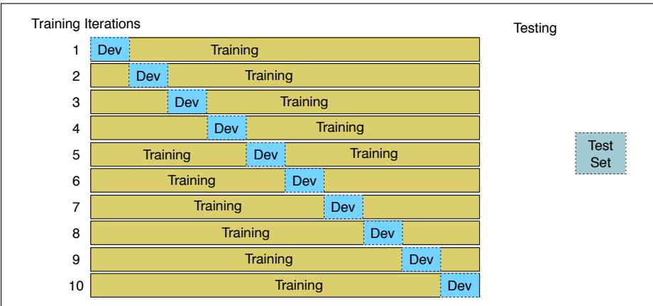

## 4.10 测试集与交叉验证

文本分类的训练和测试流程与语言模型（第 3.2 节）相同：先用训练集训练模型，再用**开发测试集**（development test set，简称 **devset**）调节某些参数，并总体上决定哪个模型最好。确定最佳模型后，才在此前从未见过的测试集上运行并报告性能。

开发集能避免对测试集过拟合，但固定划分训练集、开发集和测试集又会带来另一个问题：为了给训练保留大量数据，测试集（或开发集）可能太小，不具代表性。如果既能用全部数据训练，又能用全部数据测试，岂不是更好？**交叉验证**（cross-validation）可以做到这一点。

在交叉验证中，选择整数 $k$，把数据划分为 $k$ 个互不相交的子集，称为**折**（fold）。每次选择一折作为测试集，用剩余 $k-1$ 折训练分类器，再计算测试集上的错误率。依次让每一折充当测试集，共重复 $k$ 次，最后对 $k$ 次测试错误率取平均。若 $k=10$，就会训练 10 个不同模型（每个使用 90% 的数据）、测试 10 次并取平均，这称为 **10 折交叉验证**（10-fold cross-validation）。

交叉验证的问题是：既然所有数据都会用于测试，整个语料库都必须保持盲测状态。我们不能通过检查任何数据来设计特征或了解数据情况，否则就等于偷看测试集，会高估系统表现。但查看语料、理解数据对设计 NLP 系统又十分重要。因此，常见做法是先建立固定的训练集和测试集，只在训练集内部进行 10 折交叉验证，最后仍按常规方式在测试集上计算错误率，如图 4.10 所示。

  
**图 4.10 10 折交叉验证。**
