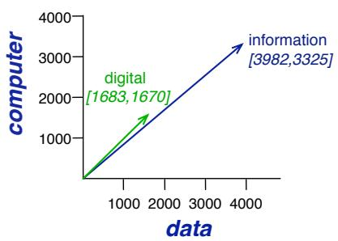

## 5.3 Simple count-based embeddings

“The most important attributes of a vector in 3-space are Location, Location, Location ” Randall Munroe, the hover from https://xkcd.com/2358/

Let’s now introduce the first way to compute word vector embeddings. This simplest vector model of meaning is based on the co-occurrence matrix, a way of representing how often words co-occur. We’ll define a particular kind of co-occurrence matrix, the word-context matrix, in which each row in the matrix represents a word in the vocabulary and each column represents how often each other word in the vocabulary appears nearby. This matrix is thus of dimensionality V  V and each cell records the number of times the row (target) word and the column (context) word co-occur nearby in some training corpus.

What do we mean by ‘nearby’? We could implement various methods, but let’s start with a very simple one: a context window around the word, let’s say of 4 words to the left and 4 words to the right. If we do that, each cell will represent the number of times (in some training corpus) the column word occurs in such a 4-word window around the row word.

Let’s see how this works for 4 words: cherry, strawberry, digital, and information. For each word we took a single instance from a corpus, and we show the 4 word window from that instance:

is traditionally followed by cherry pie, a traditional dessert often mixed, such as strawberry rhubarb pie. Apple pie computer peripherals and personal digital assistants. These devices usually a computer. This includes information available on the internet

If we then take every occurrence of each word in a large corpus and count the context words around it, we get a word-context co-occurrence matrix. The full wordcontext co-occurrence matrix is very large, because for each word in the vocabulary (of size V ) we have to count how often it occurs with every other word in the vocabulary, hence dimensionality $| V | \times | V |$ . Let’s therefore instead sketch the process on a smaller scale. Imagine that we are going to look at only the 4 words, and only consider the following 3 context words: $^ { a , }$ computer, and $p i e$ . Furthermore let’s assume we only count occurrences in the mini-corpus above.

So before looking at Fig. 5.2, compute by hand the counts for these 3 context words for the four words cherry, strawberry, digital, and information.

<table><tr><td></td><td>a</td><td>computer</td><td>pie</td></tr><tr><td>cherry</td><td>1</td><td>0</td><td>1</td></tr><tr><td>strawberry</td><td>0</td><td>0</td><td>2</td></tr><tr><td>digital</td><td>0</td><td>1</td><td>0</td></tr><tr><td>information</td><td>1</td><td>1</td><td>0</td></tr></table>

Figure 5.2 Co-occurrence vectors for four words with counts from the 4 windows above, showing just 3 of the potential context word dimensions. The vector for cherry is outlined in red. Note that a real vector would have vastly more dimensions and thus be even sparser.

Hopefully your count matches what is shown in Fig. 5.2, so that each cell represents the number of times a particular word (defined by the row) occurs in a particular context (defined by the word column).

Each row, then, is a vector representing a word. To review some basic linear algebra, a vector is, at heart, just a list or array of numbers. So cherry is represented as the list [1,0,1] (the first row vector in Fig. 5.2) and information is represented as the list [1,1,0] (the fourth row vector).

A vector space is a collection of vectors, and is characterized by its dimension. Vectors in a 3-dimensional vector space have an element for each dimension of the space. We will loosely refer to a vector in a 3-dimensional space as a 3-dimensional vector, with one element along each dimension. In the example in Fig. 5.2, we’ve chosen to make the word vectors of dimension 3, just so they fit on the page; in real word-word matrices, the vectors would have dimensionality V , the vocabulary size.

The ordering of the numbers in a vector space indicates the different dimensions on which words vary. The third dimension for all these vectors corresponds to the number of times pie occurs in the context. The second dimension for all of them corresponds to the number of times the word computer occurs. Notice that the vectors for information and digital have the same value (1) for this “computer” dimension.

In reality, we don’t compute word vectors on a single context window. Instead, we compute them over an entire corpus. Let’s see what some real counts look like. Let’s look at some vectors computed in this way. Fig. 5.3 shows a subset of the word-word co-occurrence matrix for these four words, where, again because it’s impossible to visualize all V possible context words on the page of this textbook, we show a subset of 6 of the dimensions, with counts computed from the Wikipedia corpus (Davies, 2015).

Note in Fig. 5.3 that the two words cherry and strawberry are more similar to each other (both pie and sugar tend to occur in their window) than they are to other words like digital; conversely, digital and information are more similar to each other than, say, to strawberry.

<table><tr><td></td><td>aardvark</td><td>...</td><td>computer</td><td>data</td><td>result</td><td>pie</td><td>sugar</td><td>...</td></tr><tr><td>cherry</td><td>0</td><td>...</td><td>2</td><td>8</td><td>9</td><td>442</td><td>25</td><td>...</td></tr><tr><td>strawberry</td><td>0</td><td>...</td><td>0</td><td>0</td><td>1</td><td>60</td><td>19</td><td>...</td></tr><tr><td>digital</td><td>0</td><td>...</td><td>1670</td><td>1683</td><td>85</td><td>5</td><td>4</td><td>...</td></tr><tr><td>information</td><td>0</td><td>...</td><td>3325</td><td>3982</td><td>378</td><td>5</td><td>13</td><td>...</td></tr></table>

Figure 5.3 Co-occurrence vectors for four words in the Wikipedia corpus, showing six of the dimensions (hand-picked for pedagogical purposes). The vector for digital is outlined in red. Note that a real vector would have vastly more dimensions and thus be much sparser, i.e. would have zero values in most dimensions.

We can think of the vector for a word as a point in V -dimensional space; thus the words in Fig. 5.3 are points in 6-dimensional space. Fig. 5.4 shows a spatial visualization in 2 dimensions.

  
Figure 5.4 A spatial visualization of word vectors for digital and information, showing just two of the dimensions, corresponding to the words data and computer.

Note that V , the dimensionality of the vector, is generally the size of the vocabulary, often between 10,000 and 50,000 words (using the most frequent words in the training corpus; keeping words after about the most frequent 50,000 or so is generally not helpful). Since most of these numbers are zero these are sparse vector representations; there are efficient algorithms for storing and computing with sparse matrices.

It’s also possible to apply various kinds of weighting functions to the counts in these cells. The most popular such weighting is tf-idf, which we’ll introduce in Chapter 11, but there have historically been a wide variety of other weightings.

Now that we have some intuitions, let’s move on to examine the details of computing word similarity.
