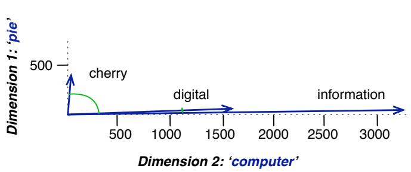

## 5.4 Cosine for Measuring Similarity

To measure similarity between two target words v and w, we need a metric that takes two vectors (of the same dimensionality, either both with words as dimensions, hence of length V , or both with documents as dimensions, of length D ) and gives a measure of their similarity. By far the most common similarity metric is the cosine of the angle between the vectors.

The cosine—like most measures for vector similarity used in NLP—is based on the dot product operator from linear algebra, also called the inner product:

$$
\text { dot   product } (\mathbf {v}, \mathbf {w}) = \mathbf {v} \cdot \mathbf {w} = \sum_ {i = 1} ^ {N} v _ {i} w _ {i} = v _ {1} w _ {1} + v _ {2} w _ {2} + \dots + v _ {N} w _ {N}\tag{5.7}
$$

The dot product acts as a similarity metric because it will tend to be high just when the two vectors have large values in the same dimensions. Alternatively, vectors that have zeros in different dimensions—orthogonal vectors—will have a dot product of 0, representing their strong dissimilarity.

This raw dot product, however, has a problem as a similarity metric: it favors long vectors. The vector length is defined as

$$
| \mathbf {v} | = \sqrt {\sum_ {i = 1} ^ {N} v _ {i} ^ {2}}\tag{5.8}
$$

The dot product is higher if a vector is longer, with higher values in each dimension. More frequent words have longer vectors, since they tend to co-occur with more words and have higher co-occurrence values with each of them. The raw dot product thus will be higher for frequent words. But this is a problem; we’d like a similarity metric that tells us how similar two words are regardless of their frequency.

We modify the dot product to normalize for the vector length by dividing the dot product by the lengths of each of the two vectors. This normalized dot product turns out to be the same as the cosine of the angle between the two vectors, following from the definition of the dot product between two vectors a and b:

$$
\begin{array}{r c l} \mathbf {a} \cdot \mathbf {b} & = & | \mathbf {a} | | \mathbf {b} | \cos \theta \\ \frac {\mathbf {a} \cdot \mathbf {b}}{| \mathbf {a} | | \mathbf {b} |} & = & \cos \theta \end{array}\tag{5.9}
$$

The cosine similarity metric between two vectors v and w thus can be computed as:

$$
\cos \left(\mathbf {v}, \mathbf {w}\right) = \frac {\mathbf {v} \cdot \mathbf {w}}{| \mathbf {v} | | \mathbf {w} |} = \frac {\sum_ {i = 1} ^ {N} v _ {i} w _ {i}}{\sqrt {\sum_ {i = 1} ^ {N} v _ {i} ^ {2}} \sqrt {\sum_ {i = 1} ^ {N} w _ {i} ^ {2}}}\tag{5.10}
$$

For some applications we pre-normalize each vector, by dividing it by its length, creating a unit vector of length 1. Thus we could compute a unit vector from a by dividing it by a . For unit vectors, the dot product is the same as the cosine.

The cosine value ranges from 1 for vectors pointing in the same direction, through 0 for orthogonal vectors, to -1 for vectors pointing in opposite directions. But since raw frequency values are non-negative, the cosine for these vectors ranges from 0–1.

Let’s see how the cosine computes which of the words cherry or digital is closer in meaning to information, just using raw counts from the following shortened table:

<table><tr><td></td><td>pie</td><td>data</td><td>computer</td></tr><tr><td>cherry</td><td>442</td><td>8</td><td>2</td></tr><tr><td>digital</td><td>5</td><td>1683</td><td>1670</td></tr><tr><td>information</td><td>5</td><td>3982</td><td>3325</td></tr></table>

$$
\begin{array}{l} \cos (\text { cherry,information}) = \frac {4 4 2 * 5 + 8 * 3 9 8 2 + 2 * 3 3 2 5}{\sqrt {4 4 2 ^ {2} + 8 ^ {2} + 2 ^ {2}} \sqrt {5 ^ {2} + 3 9 8 2 ^ {2} + 3 3 2 5 ^ {2}}} = . 0 1 8 \\ \cos (\text { digital,information }) = \frac {5 * 5 + 1 6 8 3 * 3 9 8 2 + 1 6 7 0 * 3 3 2 5}{\sqrt {5 ^ {2} + 1 6 8 3 ^ {2} + 1 6 7 0 ^ {2}} \sqrt {5 ^ {2} + 3 9 8 2 ^ {2} + 3 3 2 5 ^ {2}}} = . 9 9 6 \end{array}
$$

The model decides that information is way closer to digital than it is to cherry, a result that seems sensible. Fig. 5.5 shows a visualization.

  
Figure 5.5 A (rough) graphical demonstration of cosine similarity, showing vectors for three words (cherry, digital, and information) in the two dimensional space defined by counts of the words computer and pie nearby. The figure doesn’t show the cosine, but it highlights the angles; note that the angle between digital and information is smaller than the angle between cherry and information. When two vectors are more similar, the cosine is larger but the angle is smaller; the cosine has its maximum (1) when the angle between two vectors is smallest (0◦); the cosine of all other angles is less than 1.

Cosine similarity can be used to estimate word similarity, for tasks like finding word paraphrases, tracking changes in word meaning, or automatically discovering meanings of words in different corpora. For example, we can find the 10 most similar words to any target word w by computing the cosines between w and each of the $| V | - 1$ other words, sorting, and looking at the top 10.
