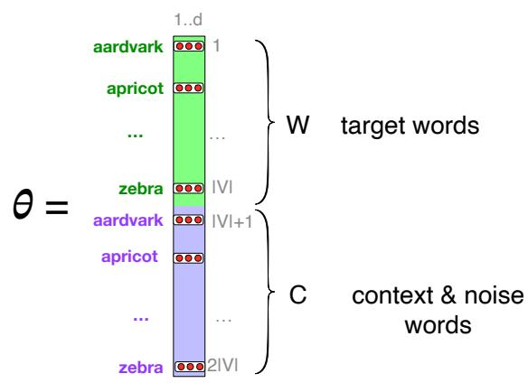
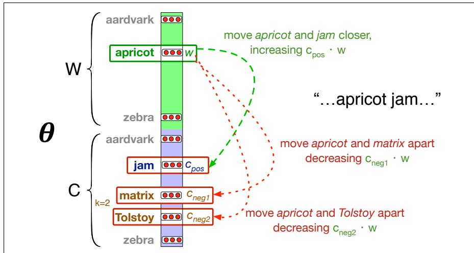

## 5.5 Word2vec

In the previous sections we saw how to represent a word as a sparse, long vector with dimensions corresponding to words in the vocabulary. We now introduce a more powerful word representation: embeddings, short dense vectors. Unlike the vectors we’ve seen so far, embeddings are short, with number of dimensions d ranging from 50-1000, rather than the much larger vocabulary size V . These d dimensions don’t have a clear interpretation. And the vectors are dense: instead of vector entries being sparse, mostly-zero counts or functions of counts, the values will be realvalued numbers that can be negative.

It turns out that dense vectors work better in every NLP task than sparse vectors. While we don’t completely understand all the reasons for this, we have some intuitions. Representing words as 300-dimensional dense vectors requires our classifiers to learn far fewer weights than if we represented words as 50,000-dimensional vectors, and the smaller parameter space possibly helps with generalization and avoiding overfitting. Dense vectors may also do a better job of capturing synonymy. For example, in a sparse vector representation, dimensions for synonyms like car and automobile are distinct and unrelated; sparse vectors may thus fail to capture the similarity between a word with car as a neighbor and a word with automobile as a neighbor.

In this section we introduce one method for computing embeddings: skip-gram with negative sampling, sometimes called SGNS. The skip-gram algorithm is one of two algorithms in a software package called word2vec, and so sometimes the algorithm is loosely referred to as word2vec (Mikolov et al. 2013a, Mikolov et al. 2013b). The word2vec methods are fast, efficient to train, and easily available online with code and pretrained embeddings. Word2vec embeddings are static embeddings, meaning that the method learns one fixed embedding for each word in the vocabulary. In Chapter 9 we’ll introduce methods for learning dynamic contextual embeddings like the popular family of BERT representations, in which the vector for each word is different in different contexts.

The intuition of word2vec is that instead of counting how often each context word c occurs near, say, apricot, we’ll instead train a classifier on a binary prediction task: “Is word c likely to show up near apricot?” We don’t actually care about this prediction task; instead we’ll take the learned classifier weights as the word embeddings.

The revolutionary intuition here is that we can just use running text as implicitly supervised training data for such a classifier; a word c that occurs near the target word apricot acts as gold ‘correct answer’ to the question “Is word c likely to show up near apricot?” This method, often called self-supervision, avoids the need for any sort of hand-labeled supervision signal. This idea was first proposed in the task of neural language modeling, when Bengio et al. (2003) and Collobert et al. (2011) showed that a neural language model (a neural network that learned to predict the next word from prior words) could just use the next word in running text as its supervision signal, and could be used to learn an embedding representation for each word as part of doing this prediction task.

We’ll see how to do neural networks in the next chapter, but word2vec is a much simpler model than the neural network language model, in two ways. First, word2vec simplifies the task (making it binary classification instead of word prediction). Second, word2vec simplifies the architecture (training a logistic regression classifier instead of a multi-layer neural network with hidden layers that demand more sophisticated training algorithms). The intuition of skip-gram is:

1. Treat the target word and a neighboring context word as positive examples.

2. Randomly sample other words in the lexicon to get negative samples.

3. Use logistic regression to train a classifier to distinguish those two cases.

4. Use the learned weights as the embeddings.

## 5.5.1 The classifier

Let’s start by thinking about the classification task, and then turn to how to train. Imagine a sentence like the following, with a target word apricot, and assume we’re using a window of 2 context words:

$$
\begin{array}{c c c c c} \dots \text {   lemon, } & \text { a   [tablespoon   of   apricot   jam, } & & \text { a]   pinch   ... } \\ & \text { c1 } & \text { c2 } & \text { w } & \text { c3 } \\ & & & & \text { c4 } \end{array}
$$

Our goal is to train a classifier such that, given a tuple (w,c) of a target word w paired with a candidate context word c (for example (apricot, jam), or perhaps (apricot, aardvark)) it will return the probability that c is a real context word (true for jam, false for aardvark):

$$
P (+ | w, c)\tag{5.11}
$$

The probability that word $c$ is not a real context word for $w$ is just 1 minus Eq. 5.11:

$$
P (- | w, c) = 1 - P (+ | w, c)\tag{5.12}
$$

How does the classifier compute the probability $P ?$ The intuition of the skipgram model is to base this probability on embedding similarity: a word is likely to occur near the target if its embedding vector is similar to the target embedding. To compute similarity between these dense embeddings, we rely on the intuition that two vectors are similar if they have a high dot product (after all, cosine is just a normalized dot product). In other words:

$$
\text { Similarity } (w, c) \approx \mathbf {c} \cdot \mathbf {w}\tag{5.13}
$$

The dot product c  w is not a probability, it’s just a number ranging from ∞ to ∞ (since the elements in word2vec embeddings can be negative, the dot product can be negative). To turn the dot product into a probability, we’ll use the logistic or sigmoid function $\sigma ( x )$ , the fundamental core of logistic regression:

$$
\sigma (x) = \frac {1}{1 + \exp (- x)}\tag{5.14}
$$

We model the probability that word c is a real context word for target word w as:

$$
P (+ | w, c) = \sigma (\mathbf {c} \cdot \mathbf {w}) = \frac {1}{1 + \exp (- \mathbf {c} \cdot \mathbf {w})}\tag{5.15}
$$

The sigmoid function returns a number between 0 and 1, but to make it a probability we’ll also need the total probability of the two possible events (c is a context word, and c isn’t a context word) to sum to 1. We thus estimate the probability that word c is not a real context word for w as:

$$
\begin{array}{r c l} P (- | w, c) & = & 1 - P (+ | w, c) \\ & = & \sigma (- \mathbf {c} \cdot \mathbf {w}) = \frac {1}{1 + \exp (\mathbf {c} \cdot \mathbf {w})} \end{array}\tag{5.16}
$$

Equation 5.15 gives us the probability for one word, but there are many context words in the window. Skip-gram makes the simplifying assumption that all context words are independent, allowing us to just multiply their probabilities:

$$
P (+ | w, c _ {1: L}) = \prod_ {i = 1} ^ {L} \sigma (\mathbf {c _ {i}} \cdot \mathbf {w})\tag{5.17}
$$

$$
\log P (+ | w, c _ {1: L}) = \sum_ {i = 1} ^ {L} \log \sigma (\mathbf {c _ {i}} \cdot \mathbf {w})\tag{5.18}
$$

In summary, skip-gram trains a probabilistic classifier that, given a test target word w and its context window of L words $c _ { 1 : L }$ , assigns a probability based on how similar this context window is to the target word. The probability is based on applying the logistic (sigmoid) function to the dot product of the embeddings of the target word with each context word. To compute this probability, we just need embeddings for each target word and context word in the vocabulary.

  
Figure 5.6 The embeddings learned by the skipgram model. The algorithm stores two embeddings for each word, the target embedding (sometimes called the input embedding) and the context embedding (sometimes called the output embedding). The parameter θ that the algorithm learns is thus a matrix of 2 V vectors, each of dimension d, formed by concatenating two matrices, the target embeddings W and the context+noise embeddings C.

Fig. 5.6 shows the intuition of the parameters we’ll need. Skip-gram actually stores two embeddings for each word, one for the word as a target, and one for the word considered as context. Thus the parameters we need to learn are two matrices W and C, each containing an embedding for every one of the V words in the vocabulary $V . ^ { 2 }$ Let’s now turn to learning these embeddings (which is the real goal of training this classifier in the first place).

## 5.5.2 Learning skip-gram embeddings

The learning algorithm for skip-gram embeddings takes as input a corpus of text, and a chosen vocabulary size N. It begins by assigning a random embedding vector for each of the N vocabulary words, and then proceeds to iteratively shift the embedding of each word w to be more like the embeddings of words that occur nearby in texts, and less like the embeddings of words that don’t occur nearby. Let’s start by considering a single piece of training data:

<table><tr><td colspan="5">... lemon, a [tablespoon of apricot jam, a] pinch ...</td></tr><tr><td></td><td>c1</td><td>c2</td><td>w</td><td>c3</td></tr></table>

This example has a target word w (apricot), and 4 context words in the $L = \pm 2$ window, resulting in 4 positive training instances (on the left below):

<table><tr><td colspan="2">positive examples +</td><td colspan="4">negative examples -</td></tr><tr><td>w</td><td> $c_{\text{pos}}$ </td><td>w</td><td> $c_{\text{neg}}$ </td><td>w</td><td> $c_{\text{neg}}$ </td></tr><tr><td>apricot</td><td>tablespoon</td><td>apricot</td><td>aardvark</td><td>apricot</td><td>seven</td></tr><tr><td>apricot</td><td>of</td><td>apricot</td><td>my</td><td>apricot</td><td>forever</td></tr><tr><td>apricot</td><td>jam</td><td>apricot</td><td>where</td><td>apricot</td><td>dear</td></tr><tr><td>apricot</td><td>a</td><td>apricot</td><td>coaxial</td><td>apricot</td><td>if</td></tr></table>

For training a binary classifier we also need negative examples. In fact skipgram with negative sampling (SGNS) uses more negative examples than positive examples (with the ratio between them set by a parameter $k )$ . So for each of these $\left( w , c _ { p o s } \right)$ training instances we’ll create k negative samples, each consisting of the target w plus a ‘noise word’ $c _ { n e g }$ . A noise word is a random word from the lexicon, constrained not to be the target word w. The table right above shows the setting where $k = 2$ , so we’ll have 2 negative examples in the negative training set for each positive example $w , c _ { p o s }$

The noise words are chosen according to their weighted unigram probability $p _ { \alpha } ( w )$ , where α is a weight. If we were sampling according to unweighted probability $P ( w )$ , it would mean that with unigram probability $P ( ^ { \bullet } t h e ^ { \prime \prime } )$ we would choose the word the as a noise word, with unigram probability $P ( ^ { \ast } a a r d \nu a r k ^ { \ast } )$ we would choose aardvark, and so on. But in practice it is common to set $\alpha = 0 . 7 5$ , i.e. use the weighting $P _ { \frac { 3 } { 4 } } \left( w \right)$

$$
P _ {\alpha} (w) = \frac {\operatorname{count} (w) ^ {\alpha}}{\sum_ {w ^ {\prime}} \operatorname{count} \left(w ^ {\prime}\right) ^ {\alpha}}\tag{5.19}
$$

Setting $\alpha = . 7 5$ gives better performance because it gives rare noise words slightly higher probability: for rare words, $P _ { \alpha } ( w ) > P ( w )$ . To illustrate this intuition, it might help to work out the probabilities for an example with $\alpha = . 7 5$ and two events, $P ( a ) = 0 . 9 9$ and $P ( b ) = 0 . 0 1$

$$
\begin{array}{l} P _ {\alpha} (a) = \frac {. 9 9 ^ {. 7 5}}{. 9 9 ^ {. 7 5} + . 0 1 ^ {. 7 5}} = 0. 9 7 \\ P _ {\alpha} (b) = \frac {. 0 1 ^ {. 7 5}}{. 9 9 ^ {. 7 5} + . 0 1 ^ {. 7 5}} = 0. 0 3 \end{array}\tag{5.20}
$$

Thus using $\alpha = . 7 5$ increases the probability of the rare event b from 0.01 to 0.03.

Given the set of positive and negative training instances, and an initial set of embeddings, the goal of the learning algorithm is to adjust those embeddings to

• Maximize the similarity of the target word, context word pairs $\left( w , c _ { p o s } \right)$ drawn from the positive examples

• Minimize the similarity of the $\left( w , c _ { n e g } \right)$ pairs from the negative examples.

If we consider one word/context pair $\left( w , c _ { p o s } \right)$ ) with its k noise words $c _ { n e g _ { 1 } } . . . c _ { n e g _ { k } } .$ we can express these two goals as the following loss function L to be minimized (hence the ); here the first term expresses that we want the classifier to assign the real context word $c _ { p o s }$ a high probability of being a neighbor, and the second term expresses that we want to assign each of the noise words $c _ { n e g _ { i } }$ a high probability of being a non-neighbor, all multiplied because we assume independence:

$$
\begin{array}{l} L (w, c _ {p o s}, c _ {n e g ^ {*}}) = - \log \left[ P (+ | w, c _ {p o s}) \prod_ {i = 1} ^ {k} P (- | w, c _ {n e g _ {i}}) \right] \\ = - \left[ \log P (+ | w, c _ {p o s}) + \sum_ {i = 1} ^ {k} \log P (- | w, c _ {n e g _ {i}}) \right] \\ = - \left[ \log P (+ | w, c _ {p o s}) + \sum_ {i = 1} ^ {k} \log \left(1 - P (+ | w, c _ {n e g _ {i}})\right) \right] \\ = - \left[ \log \sigma (c _ {p o s} \cdot w) + \sum_ {i = 1} ^ {k} \log \sigma (- c _ {n e g _ {i}} \cdot w) \right] \end{array}\tag{5.21}
$$

That ${ \mathrm { i s } } ,$ we want to maximize the dot product of the word with the actual context words, and minimize the dot products of the word with the k negative sampled nonneighbor words.

We minimize this loss function using stochastic gradient descent. Fig. 5.7 shows the intuition of one step of learning.

  
Figure 5.7 Intuition of one step of gradient descent. The skip-gram model tries to shift embeddings so the target embeddings (here for apricot) are closer to (have a higher dot product with) context embeddings for nearby words (here jam) and further from (lower dot product with) context embeddings for noise words that don’t occur nearby (here Tolstoy and matrix).

To get the gradient, we need to take the derivative of Eq. 5.21 with respect to the different embeddings. It turns out the derivatives are the following (we leave the proof as an exercise at the end of the chapter):

$$
\frac {\partial L}{\partial c _ {p o s}} = [ \boldsymbol {\sigma} (\mathbf {c} _ {p o s} \cdot \mathbf {w}) - 1 ] \mathbf {w}\tag{5.22}
$$

$$
\frac {\partial L}{\partial c _ {n e g _ {i}}} = [ \pmb {\sigma} (\pmb {\mathbf {c}} _ {n e g _ {i}} \cdot \pmb {\mathbf {w}}) ] \pmb {\mathbf {w}}\tag{5.23}
$$

$$
\frac {\partial L}{\partial w} = [ \boldsymbol {\sigma} (\mathbf {c} _ {p o s} \cdot \mathbf {w}) - 1 ] \mathbf {c} _ {p o s} + \sum_ {i = 1} ^ {k} [ \boldsymbol {\sigma} (\mathbf {c} _ {n e g _ {i}} \cdot \mathbf {w}) ] \mathbf {c} _ {n e g _ {i}}\tag{5.24}
$$

The update equations going from time step t to $t + 1$ in stochastic gradient descent are thus:

$$
\mathbf {c} _ {p o s} ^ {t + 1} = \mathbf {c} _ {p o s} ^ {t} - \eta [ \sigma (\mathbf {c} _ {p o s} ^ {t} \cdot \mathbf {w} ^ {t}) - 1 ] \mathbf {w} ^ {t}\tag{5.25}
$$

$$
\mathbf {c} _ {n e g _ {i}} ^ {t + 1} = \mathbf {c} _ {n e g _ {i}} ^ {t} - \eta [ \sigma (\mathbf {c} _ {n e g _ {i}} ^ {t} \cdot \mathbf {w} ^ {t}) ] \mathbf {w} ^ {t}\tag{5.26}
$$

$$
\mathbf {w} ^ {t + 1} = \mathbf {w} ^ {t} - \eta \left[ [ \boldsymbol {\sigma} (\mathbf {c} _ {p o s} ^ {t} \cdot \mathbf {w} ^ {t}) - 1 ] \mathbf {c} _ {p o s} ^ {t} + \sum_ {i = 1} ^ {k} [ \boldsymbol {\sigma} (\mathbf {c} _ {\mathrm{neg} _ {i}} ^ {t} \cdot \mathbf {w} ^ {t}) ] \mathbf {c} _ {\mathrm{neg} _ {i}} ^ {t} \right]\tag{5.27}
$$

Just as in logistic regression, then, the learning algorithm starts with randomly initialized W and C matrices, and then walks through the training corpus using gradient descent to move W and C so as to minimize the loss in Eq. 5.21 by making the updates in (Eq. 5.25)-(Eq. 5.27).

Recall that the skip-gram model learns two separate embeddings for each word i: the target embedding wi and the context embedding $\mathbf { c } _ { i } ,$ stored in two matrices, the target matrix W and the context matrix C. It’s common to just add them together, representing word i with the vector $\pmb { \mathsf { w } } _ { i } + \pmb { \mathsf { c } } _ { i }$ . Alternatively we can throw away the C matrix and just represent each word i by the vector wi.

As with the simple count-based methods like tf-idf, the context window size affects the performance of skip-gram embeddings, and experiments often tune the context window size parameter on a devset.

## 5.5.3 Other kinds of static embeddings

There are many kinds of static embeddings. An extension of word2vec, fasttext (Bojanowski et al., 2017), addresses a problem with word2vec as we have presented it so far: it has no good way to deal with unknown words—words that appear in a test corpus but were unseen in the training corpus. A related problem is word sparsity, such as in languages with rich morphology, where some of the many forms for each noun and verb may only occur rarely. Fasttext deals with these problems by using subword models, representing each word as itself plus a bag of constituent n-grams, with special boundary symbols < and > added to each word. For example, with n = 3 the word where would be represented by the sequence <where> plus the character n-grams:

## <wh, whe, her, ere, re>

Then a skipgram embedding is learned for each constituent n-gram, and the word where is represented by the sum of all of the embeddings of its constituent n-grams. Unknown words can then be represented only by the sum of the constituent n-grams. Modeling Word Meaning Using Lexical Co-Occurrence A fasttext open-source library, including pretrained embeddings for 157 languages, is available at https://fasttext.cc.

Another very widely used static embedding model is GloVe (Pennington et al., 2014), short for Global Vectors, because the model is based on capturing globalCHINA FRANCE corpus statistics. GloVe is based on ratios of probabilities from the word-word co-EUROPEASIA occurrence matrix.

It turns out that dense embeddings like word2vec actually have an elegant math-MOSCOW ematical relationship with count-based embeddings, in which word2vec can be seen as implicitly optimizing a function of a count matrix with a particular (PPMI) weight-TOKYO ing (Levy and Goldberg, 2014c).
