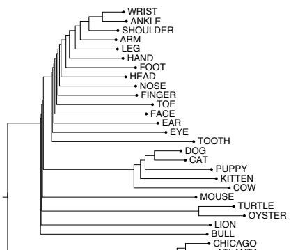

## 5.6 Visualizing EmbeddingsDOGCAT

## “I see well in many dimensions as long as the dimensions are around two.” The late economist Martin Shubik

Visualizing embeddings is an important goal in helping understand, apply, andaling for three noun classes. improve these models of word meaning. But how can we visualize a (for example) 100-dimensional vector?

The simplest way to visualize the meaning of a word w embedded in a space is to list the most similar words to w by sorting the vectors for all words in the vocabulary by their cosine with the vector for w. For example the 7 closest words to frog using a particular set of embeddings computed with the GloVe algorithm are: frogs, toad, litoria, leptodactylidae, rana, lizard, and eleutherodactylus (Pennington et al., 2014).

Yet another visualization method is to use a clustering algorithm to show a hierarchical representation of which words are similar to others in the embedding space. The figure on the left uses hierarchical clustering of some embedding vectors for nouns as a visualization method (Rohde et al., 2006).

Probably the most common visualization method, however, is to project the 100 dimensions of a word down into 2 dimensions. Fig. 5.1 showed one such visualization, as does Fig. 5.10, using a projection method called t-SNE (van der

Maaten and Hinton, 2008).
