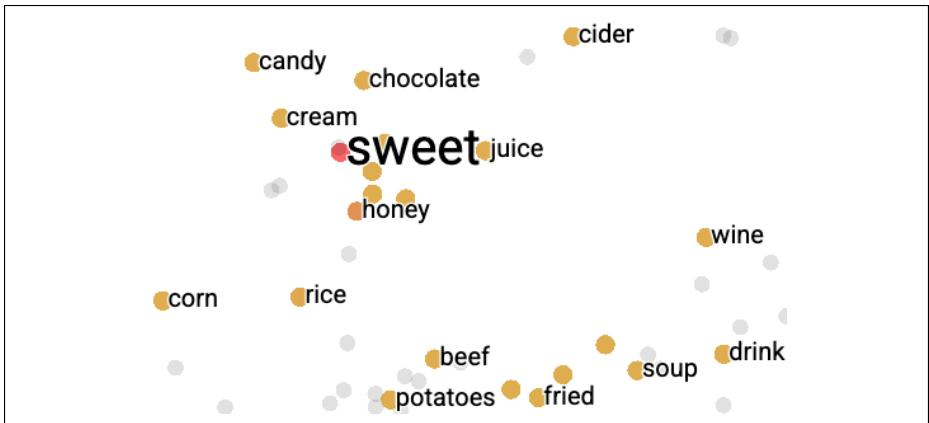

# 5.2 向量语义学：直觉

**向量语义学**（vector semantics）是 NLP 表示词义的标准方式，可以建模上一节所述的许多词义侧面。该模型源自 20 世纪 50 年代两种思想的汇合：Osgood（1957）提出以三维空间中的点表示词的情感内涵；Joos（1950）、Harris（1954）和 Firth（1957）等语言学家则主张根据词在语言使用中的分布——即相邻词或语法环境——定义其意义。他们认为，分布非常相似（邻近词相似）的两个词，意义也相似。

假设你不知道粤语新借词 ongchoi 的含义，却在以下语境中看到它：

> (5.1) Ongchoi is delicious sauteed with garlic.  
> (5.2) Ongchoi is superb over rice.  
> (5.3) ...ongchoi leaves with salty sauces...

又假设你在其他语境见过许多相同的上下文词：

> (5.4) ...spinach sauteed with garlic over rice...  
> (5.5) ...chard stems and leaves are delicious...  
> (5.6) ...collard greens and other salty leafy greens

ongchoi 与 rice、garlic、delicious、salty 等词共同出现，而 spinach、chard、collard greens 也如此，这会暗示 ongchoi 是与它们相似的叶菜。计算上可以用同样的直觉：只需统计 ongchoi 语境中的词。

**图 5.1 一些与 sweet 接近的词的 200 维 word2vec 嵌入，经 t-SNE 降到二维后的可视化。意义相近的词在空间中彼此靠近。图使用 TensorBoard Embedding Projector（https://projector.tensorflow.org/）生成。**

向量语义学的核心，是把词表示为多维语义空间中的点；该空间以本章将介绍的不同方法从相邻词分布中导出。用于表示词的向量称为**嵌入**（embeddings）。embedding 一词在历史上源于其数学含义，即从一个空间或结构到另一个空间或结构的映射，尽管后来其含义发生了变化；参见本章末尾。

图 5.1 展示 word2vec 算法学到的嵌入：从 200 维空间降到二维后，sweet 的最近邻包括 honey、candy、juice、chocolate 等语义相关词。相似词在高维空间中彼此相邻，这一思想为语言模型和其他 NLP 应用带来了强大能力。例如，第 4 章的情感分类器依赖同一个词同时出现在训练集和测试集中；若把词表示为嵌入，只要测试中出现与训练词意义相近的词，分类器也能判断情感。此类向量语义模型还可以从文本中自动、无监督地学习。

本章先介绍一个教学用的简单嵌入模型：用附近词的计数向量定义某个词的意义。它有助于理解向量概念，以及向量如何表示词义；第 11 章将介绍更复杂而重要的 tf-idf 模型。简单计数方法会产生很长的**稀疏向量**（sparse vectors），即大部分元素为零，因为多数词从不出现在其他词的语境中。随后将介绍 word2vec 模型族，用来构造更短、更**稠密**（dense）且语义性质更有用的向量。

本章还将介绍**余弦**（cosine）：利用嵌入计算两个词、句子或文档之间语义相似度的标准方法，也是实际应用中的重要工具。
