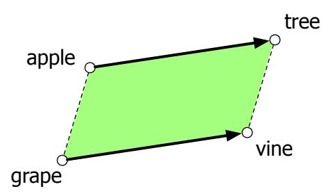
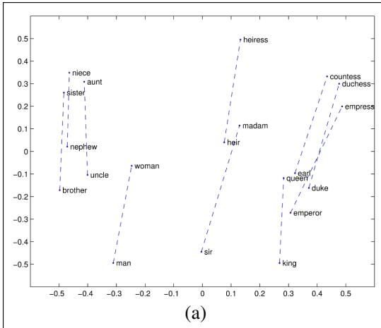
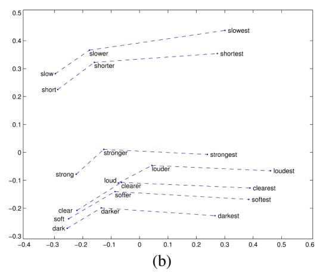
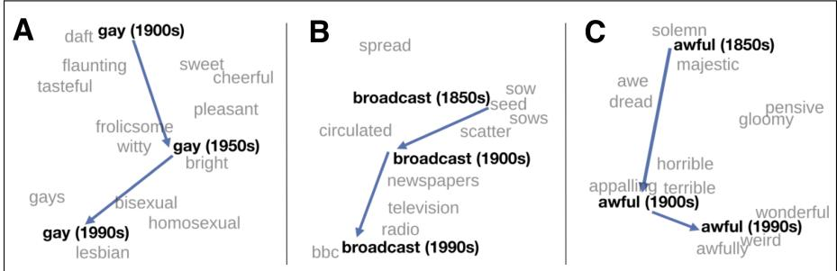

# 5.7 嵌入的语义性质

本节简要概述研究者考察过的若干嵌入语义性质。

## 不同类型的相似与关联

向量语义模型的一个参数是收集计数时使用的语境窗口大小，通常为目标词左右各 1 到 10 个词，总语境长度为 2 到 20 个词。

窗口选择取决于表示目标。较短窗口的信息来自紧邻词，因而表示往往更偏句法；用短窗口计算向量时，目标词 $w$ 的最相似词通常是词性相同、语义相似的词。使用长窗口时，与 $w$ 余弦最高的词更倾向于主题相关，而非意义相似。

例如，Levy and Goldberg（2014a）发现，skip-gram 使用大小为 2 的窗口时，Hogwarts 的最相似词是其他虚构学校名，如《吸血鬼猎人巴菲》中的 Sunnydale 或某吸血鬼系列中的 Evernight；窗口大小为 5 时，最相似词则是与《哈利·波特》主题相关的 Dumbledore、Malfoy 和 half-blood。

区分词之间两类相似或关联也很有用（Schütze and Pedersen, 1993）。如果两个词通常彼此邻近，就具有**一阶共现**（first-order co-occurrence），也称**组合关联**（syntagmatic association）；例如 wrote 与 book 或 poem 是一阶关联词。如果两个词具有相似的邻词，就具有**二阶共现**（second-order co-occurrence），也称**聚合关联**（paradigmatic association）；例如 wrote 与 said、remarked 是二阶关联词。

## 类比与关系相似度

嵌入的另一种语义性质，是捕捉关系意义的能力。Rumelhart and Abrahamson（1973）在早期认知向量空间模型中提出**平行四边形模型**（parallelogram model），解决“$a$ 之于 $b$，如同 $a^*$ 之于什么？”这类简单类比题。例如 apple:tree::grape:? 要填 vine。模型将 apple 指向 tree 的向量 $\overrightarrow{tree}-\overrightarrow{apple}$ 加到 grape 向量上，并返回离所得点最近的词。

**图 5.8 类比问题的平行四边形模型（Rumelhart and Abrahamson, 1973）：用 tree 减去 apple，再加上 grape，即可找到 vine 的位置。**

早期稀疏嵌入研究已经证明向量意义模型可以解决类比题（Turney and Littman, 2005）；word2vec 和 GloVe 向量的成功使平行四边形方法再次受到关注（Mikolov et al., 2013c；Levy and Goldberg, 2014b；Pennington et al., 2014）。例如，$king-man+woman$ 得到接近 queen 的向量，$Paris-France+Italy$ 得到接近 Rome 的向量。嵌入模型似乎由此提取了“男性—女性”“首都—所属国家”，乃至比较级/最高级等关系的表示。

**图 5.9 将向量投影到二维后展示的 GloVe 向量空间关系性质。（a）$king-man+woman$ 接近 queen；（b）向量偏移似乎能捕捉比较级和最高级的形态关系（Pennington et al., 2014）。**

对 $\mathbf a:\mathbf b::\mathbf a^*:\mathbf b^*$，算法给定 $\mathbf a$、$\mathbf b$、$\mathbf a^*$，寻找 $\mathbf b^*$。平行四边形方法为：

$$
\hat{\mathbf b}^*=\underset{\mathbf x}{\operatorname{argmin}}\ \operatorname{distance}(\mathbf x,\mathbf b-\mathbf a+\mathbf a^*)\tag{5.28}
$$

距离函数可以使用欧氏距离。

该方法有若干限制。在 word2vec 或 GloVe 空间中，返回的最近值通常并非真正的 $b^*$，而是三个输入词之一或其形态变体；例如 cherry:red::potato:x 可能返回 potato 或 potatoes，而非 brown，因此必须显式排除输入词。嵌入空间在涉及高频词、短距离和某些关系（如国家—首都、动词/名词—屈折形式）时表现良好，但对其他关系效果较差（Linzen, 2016；Gladkova et al., 2016；Schluter, 2018；Ethayarajh et al., 2019a）。Peterson et al.（2020）甚至认为，平行四边形方法总体上过于简单，无法模拟人类形成此类类比的认知过程。

## 5.7.1 嵌入与历史语义学

通过为不同时期的文本分别构建多个嵌入空间，嵌入还可用于研究意义随时间的变化。图 5.10 展示过去两个世纪英语词义的变化；研究者根据 Google n-grams（Lin et al., 2012b）和《美国历史英语语料库》（Davies, 2012）等历史语料，为每十年分别构建嵌入空间。

**图 5.10 使用 word2vec 向量对三个英语词的语义变化进行 t-SNE 可视化。每个词的现代词义及灰色语境词来自最近时期的嵌入空间，较早的点来自相应历史时期。图中展示：gay 从“快乐、嬉戏”相关意义转为指同性恋；broadcast 从“撒播种子”的原义发展出随广播电视兴起而形成的“传输信号”义；awful 则发生贬义化，从“充满敬畏”转为“糟糕、骇人”（Hamilton et al., 2016b）。**
