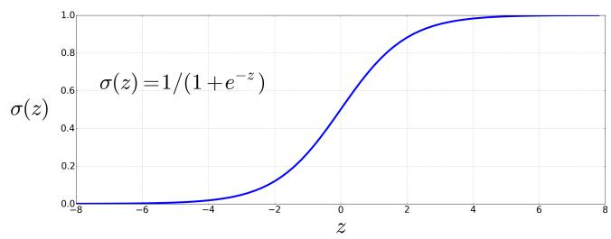
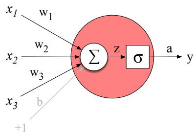
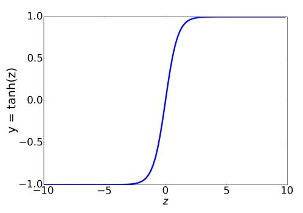
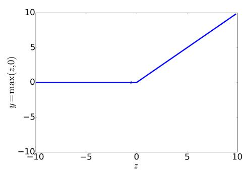

## 6.1 Units

The building block of a neural network is a single computational unit. A unit takes a set of real valued numbers as input, performs some computation on them, and produces an output.

At its heart, a neural unit is taking a weighted sum of its inputs, with one additional term in the sum called a bias term. Given a set of inputs $x _ { 1 } . . . x _ { n } ,$ a unit has a set of corresponding weights $w _ { 1 } . . . w _ { n }$ and a bias b, so the weighted sum z can be represented as:

$$
z = b + \sum_ {i} w _ {i} x _ {i}\tag{6.1}
$$

Often it’s more convenient to express this weighted sum using vector notation; recall from linear algebra that a vector is, at heart, just a list or array of numbers. Thus we’ll talk about z in terms of a weight vector w, a scalar bias $^ { b , }$ and an input vector x, and we’ll replace the sum with the convenient dot product:

$$
z = \mathbf {w} \cdot \mathbf {x} + b\tag{6.2}
$$

As defined in Eq. 6.2, z is just a real valued number.

Finally, instead of using z, a linear function of x, as the output, neural units apply a non-linear function f to z. We will refer to the output of this function as the activation value for the unit, a. Since we are just modeling a single unit, the activation for the node is in fact the final output of the network, which we’ll generally call y. So the value y is defined as:

$$
y = a = f (z)
$$

We’ll discuss three popular non-linear functions f below (the sigmoid, the tanh, and the rectified linear unit or ReLU) but it’s pedagogically convenient to start with the sigmoid function since we saw it in Chapter 4:

$$
y = \sigma (z) = \frac {1}{1 + e ^ {- z}}\tag{6.3}
$$

The sigmoid (shown in Fig. 6.1) has a number of advantages; it maps the output into the range (0,1), which is useful in squashing outliers toward 0 or 1. And it’s differentiable, which as we saw in Section 4.15 will be handy for learning.

  
Figure 6.1 The sigmoid function takes a real value and maps it to the range (0,1). It is nearly linear around 0 but outlier values get squashed toward 0 or 1.

Substituting Eq. 6.2 into Eq. 6.3 gives us the output of a neural unit:

$$
y = \sigma (\mathbf {w} \cdot \mathbf {x} + b) = \frac {1}{1 + \exp (- (\mathbf {w} \cdot \mathbf {x} + b))}\tag{6.4}
$$

Fig. 6.2 shows a final schematic of a basic neural unit. In this example the unit takes 3 input values $x _ { 1 } , x _ { 2 } .$ , and $x _ { 3 } ,$ , and computes a weighted sum, multiplying each value by a weight $( w _ { 1 } , w _ { 2 } .$ , and $w _ { 3 } ,$ respectively), adds them to a bias term $^ { b , }$ and then passes the resulting sum through a sigmoid function to result in a number between 0 and 1.

  
Figure 6.2 A neural unit, taking 3 inputs $x _ { 1 } , x _ { 2 }$ , and $x _ { 3 }$ (and a bias b that we represent as a weight for an input clamped at +1) and producing an output ${ \bf y } .$ We include some convenient intermediate variables: the output of the summation, $z ,$ and the output of the sigmoid, a. In this case the output of the unit y is the same as a, but in deeper networks we’ll reserve y to mean the final output of the entire network, leaving a as the activation of an individual node.

Let’s walk through an example just to get an intuition. Let’s suppose we have a unit with the following weight vector and bias:

$$
\begin{array}{l} \mathbf {w} = [ 0. 2, 0. 3, 0. 9 ] \\ b = 0. 5 \end{array}
$$

What would this unit do with the following input vector:

$$
\mathbf {x} = [ 0. 5, 0. 6, 0. 1 ]
$$

The resulting output y would be:

$$
y = \sigma (\mathbf {w} \cdot \mathbf {x} + b) = \frac {1}{1 + e ^ {- (\mathbf {w} \cdot \mathbf {x} + b)}} = \frac {1}{1 + e ^ {- (. 5 * . 2 + . 6 * . 3 + . 1 * . 9 + . 5)}} = \frac {1}{1 + e ^ {- 0 . 8 7}} = . 7 0
$$

In practice, the sigmoid is not commonly used as an activation function. A function that is very similar but almost always better is the tanh function shown in Fig. 6.3a; tanh is a variant of the sigmoid that ranges from -1 to +1:

$$
y = \tanh (z) = \frac {e ^ {z} - e ^ {- z}}{e ^ {z} + e ^ {- z}}\tag{6.5}
$$

The simplest activation function, and perhaps the most commonly used, is the rectified linear unit, also called the ReLU, shown in Fig. 6.3b. It’s just the same as z when z is positive, and 0 otherwise:

$$
y = \operatorname{ReLU} (z) = \max (z, 0)\tag{6.6}
$$

These activation functions have different properties that make them useful for different language applications or network architectures. For example, the tanh function has the nice properties of being smoothly differentiable and mapping outlier values toward the mean. The rectifier function, on the other hand, has nice properties that result from it being very close to linear. In the sigmoid or tanh functions, very high values of z result in values of y that are saturated, i.e., extremely close to 1, and have derivatives very close to 0. Zero derivatives cause problems for learning, because as we’ll see in Section 6.6, we’ll train networks by propagating an error signal backwards, multiplying gradients (partial derivatives) from each layer of the network; gradients that are almost 0 cause the error signal to get smaller and smaller until it is too small to be used for training, a problem called the vanishing gradient problem. Rectifiers don’t have this problem, since the derivative of ReLU for high values of z is 1 rather than very close to 0.

  
(a)

  
(b)  
Figure 6.3 The tanh and ReLU activation functions.
