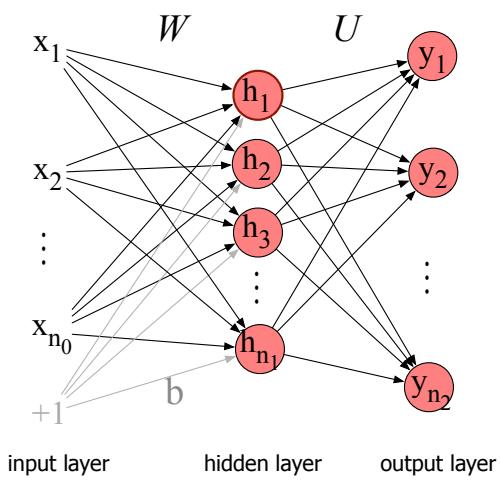
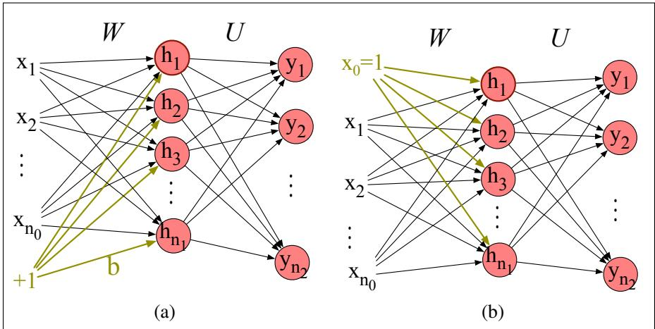

## 6.3 Feedforward Neural Networks

Let’s now walk through a slightly more formal presentation of the simplest kind of neural network, the feedforward network. A feedforward network is a multilayer network in which the units are connected with no cycles; the outputs from units in each layer are passed to units in the next higher layer, and no outputs are passed back to lower layers. (In Chapter 14 we’ll introduce networks with cycles, called recurrent neural networks.)

For historical reasons multilayer networks, especially feedforward networks, are sometimes called multi-layer perceptrons (or MLPs); this is a technical misnomer, since the units in modern multilayer networks aren’t perceptrons (perceptrons have a simple step-function as their activation function, but modern networks are made up of units with many kinds of non-linearities like ReLUs and sigmoids), but at some point the name stuck.

Simple feedforward networks have three kinds of nodes: input units, hidden units, and output units.

Fig. 6.8 shows a picture. The input layer x is a vector of simple scalar values just as we saw in Fig. 6.2.

The core of the neural network is the hidden layer h formed of hidden units hi, each of which is a neural unit as described in Section 6.1, taking a weighted sum of its inputs and then applying a non-linearity. In the standard architecture, each layer is fully-connected, meaning that each unit in each layer takes as input the outputs from all the units in the previous layer, and there is a link between every pair of units from two adjacent layers. Thus each hidden unit sums over all the input units.

Recall that a single hidden unit has as parameters a weight vector and a bias. We represent the parameters for the entire hidden layer by combining the weight vector and bias for each unit i into a single weight matrix W and a single bias vector b for the whole layer (see Fig. 6.8). Each element $\boldsymbol { \mathsf { W } } _ { j i }$ of the weight matrix W represents the weight of the connection from the ith input unit xi to the jth hidden unit $h _ { j }$

The advantage of using a single matrix W for the weights of the entire layer is that now the hidden layer computation for a feedforward network can be done very efficiently with simple matrix operations. In fact, the computation only has three steps: multiplying the weight matrix by the input vector x, adding the bias vector b, and applying the activation function $g$ (such as the sigmoid, tanh, or ReLU activation function defined above).

  
Figure 6.8 A simple 2-layer feedforward network, with one hidden layer, one output layer, and one input layer (the input layer is usually not counted when enumerating layers).

The output of the hidden layer, the vector $\mathbf { h } ,$ is thus the following (for this example we’ll use the sigmoid function σ as our activation function):

$$
\mathbf {h} = \sigma (\mathbf {W x} + \mathbf {b})\tag{6.8}
$$

Notice that we’re applying the σ function here to a vector, while in Eq. 6.3 it was applied to a scalar. We’re thus allowing $\sigma ( \cdot )$ , and indeed any activation function $g ( \cdot )$ , to apply to a vector element-wise, so $g [ z _ { 1 } , z _ { 2 } , z _ { 3 } ] = [ g ( z _ { 1 } ) , g ( z _ { 2 } ) , g ( z _ { 3 } ) ]$

Let’s introduce some constants to represent the dimensionalities of these vectors and matrices. We’ll refer to the input layer as layer 0 of the network, and have $n _ { 0 }$ represent the number of inputs, so x is a vector of real numbers of dimension n0, or more formally $\mathbf { x } \in \mathbb { R } ^ { n _ { 0 } }$ , a column vector of dimensionality $[ n _ { 0 } \times 1 ]$ . Let’s call the hidden layer layer 1 and the output layer layer 2. The hidden layer has dimensionality $n _ { 1 } ,$ so $\mathbf { h } \in \mathbb { R } ^ { n _ { 1 } }$ and also b $\mathbf { \Psi } \in \mathbb { R } ^ { n _ { 1 } }$ (since each hidden unit can take a different bias value). And the weight matrix W has dimensionality $\boldsymbol { \mathsf { W } } \in \mathbb { R } ^ { n _ { 1 } \times n _ { 0 } }$ , i.e. $[ n _ { 1 } \times n _ { 0 } ]$

Take a moment to convince yourself that the matrix multiplication in Eq. 6.8 will compute the value of each $\mathbf { h } _ { j }$ as $\begin{array} { r } { \sigma \left( \sum _ { i = 1 } ^ { n _ { 0 } } \mathbf { W } _ { j i } \mathbf { x } _ { i } + \mathbf { b } _ { j } \right) } \end{array}$ .

As we saw in Section $6 . 2$ , the resulting value h (for hidden but also for hypothesis) forms a representation of the input. The role of the output layer is to take this new representation h and compute a final output. This output could be a realvalued number, but in many cases the goal of the network is to make some sort of classification decision, and so we will focus on the case of classification.

If we are doing a binary task like sentiment classification, we might have a single output node, and its scalar value y is the probability of positive versus negative sentiment. If we are doing multinomial classification, such as assigning a part-ofspeech tag, we might have one output node for each potential part-of-speech, whose output value is the probability of that part-of-speech, and the values of all the output nodes must sum to one. The output layer is thus a vector y that gives a probability distribution across the output nodes.

Let’s see how this happens. Like the hidden layer, the output layer has a weight matrix (let’s call it U), but some models don’t include a bias vector b in the output layer, so we’ll simplify by eliminating the bias vector in this example. The weight matrix is multiplied by its input vector (h) to produce the intermediate output z:

$$
z = U h
$$

There are n2 output nodes, so $\mathbf { z } \in \mathbb { R } ^ { n _ { 2 } }$ , weight matrix U has dimensionality $\mathbf { U } \in$ $\mathbb { R } ^ { n _ { 2 } \times n _ { 1 } }$ , and element $\mathbf { U } _ { i j }$ is the weight from unit j in the hidden layer to unit i in the output layer.

However, z can’t be the output of the classifier, since it’s a vector of real-valued numbers, while what we need for classification is a vector of probabilities. There is a convenient function for normalizing a vector of real values, by which we mean converting it to a vector that encodes a probability distribution (all the numbers lie between 0 and 1 and sum to 1): the softmax function that we saw on page 109 of Chapter 4. More generally for any vector z of dimensionality $d ,$ the softmax is defined as:

$$
\operatorname{softmax} \left(\mathbf {z} _ {i}\right) = \frac {\exp \left(\mathbf {z} _ {i}\right)}{\sum_ {j = 1} ^ {d} \exp \left(\mathbf {z} _ {j}\right)} 1 \leq i \leq d\tag{6.9}
$$

Thus for example given a vector

$$
\mathbf {z} = [ 0. 6, 1. 1, - 1. 5, 1. 2, 3. 2, - 1. 1 ],\tag{6.10}
$$

the softmax function will normalize it to a probability distribution (shown rounded):

$$
\operatorname{softmax} (\mathbf {z}) = [ 0. 0 5 5, 0. 0 9 0, 0. 0 0 6 7, 0. 1 0, 0. 7 4, 0. 0 1 0 ]\tag{6.11}
$$

You may recall that we used softmax to create a probability distribution from a vector of real-valued numbers (computed from summing weights times features) in the multinomial version of logistic regression in Chapter 4.

That means we can think of a neural network classifier with one hidden layer as building a vector h which is a hidden layer representation of the input, and then running standard multinomial logistic regression on the features that the network develops in h. By contrast, in Chapter 4 the features were mainly designed by hand via feature templates. So a neural network is like multinomial logistic regression, but (a) with many layers, since a deep neural network is like layer after layer of logistic regression classifiers; (b) with those intermediate layers having many possible activation functions (tanh, ReLU, sigmoid) instead of just sigmoid (although we’ll continue to use σ for convenience to mean any activation function); (c) rather than forming the features by feature templates, the prior layers of the network induce the feature representations themselves.

Here are the final equations for a feedforward network with a single hidden layer, which takes an input vector $\mathbf { x } ,$ outputs a probability distribution y, and is parameterized by weight matrices W and U and a bias vector b:

$$
\begin{array}{l l} \mathbf {h} = & \sigma (\mathbf {W x} + \mathbf {b}) \\ \mathbf {z} = & \mathbf {U h} \\ \mathbf {y} = & \text { softmax } (\mathbf {z}) \end{array}\tag{6.12}
$$

And just to remember the shapes of all our variables, $\mathbf { x } \in \mathbb { R } ^ { n _ { 0 } } , \mathbf { h } \in \mathbb { R } ^ { n _ { 1 } } , \mathbf { b } \in \mathbb { R } ^ { n _ { 1 } }$ $\mathbf { W } \in \mathbb { R } ^ { n _ { 1 } \times n _ { 0 } } , \mathbf { U } \in \mathbb { R } ^ { n _ { 2 } \times n _ { 1 } }$ , and the output vector $\mathbf { y } \in \mathbb { R } ^ { n _ { 2 } }$ . We’ll call this network a 2- layer network (we traditionally don’t count the input layer when numbering layers, but do count the output layer). So by this terminology logistic regression is a 1-layer network.

## 6.3.1 More details on feedforward networks

Let’s now set up some notation to make it easier to talk about deeper networks of depth more than 2. We’ll use superscripts in square brackets to mean layer numbers, starting at 0 for the input layer. So $\boldsymbol { \mathsf { W } } ^ { [ 1 ] }$ will mean the weight matrix for the (first) hidden layer, and $\mathbf { b } ^ { [ 1 ] }$ will mean the bias vector for the (first) hidden layer. $n _ { j }$ will mean the number of units at layer $j .$ We’ll use $g ( \cdot )$ to stand for the activation function, which will tend to be ReLU or tanh for intermediate layers and softmax for output layers. We’ll use $\mathbf { a } ^ { [ i ] }$ to mean the output from layer $i ,$ and $\pmb { z } ^ { [ i ] }$ to mean the combination of previous layer output, weights and biases $\mathbf { \dot { \boldsymbol { w } } } ^ { [ i ] } \mathbf { \dot { \boldsymbol { a } } } ^ { [ i - 1 ] } + \mathbf { \boldsymbol { b } } ^ { [ i ] }$ . The 0th layer is for inputs, so we’ll refer to the inputs x more generally as $\mathbf { a } ^ { [ 0 ] }$

Thus we can re-represent our 2-layer net from Eq. 6.12 as follows:

$$
\begin{array}{r c l} \mathbf {z} ^ {[ 1 ]} & = & \mathbf {W} ^ {[ 1 ]} \mathbf {a} ^ {[ 0 ]} + \mathbf {b} ^ {[ 1 ]} \\ \mathbf {a} ^ {[ 1 ]} & = & g ^ {[ 1 ]} (\mathbf {z} ^ {[ 1 ]}) \\ \mathbf {z} ^ {[ 2 ]} & = & \mathbf {W} ^ {[ 2 ]} \mathbf {a} ^ {[ 1 ]} + \mathbf {b} ^ {[ 2 ]} \\ \mathbf {a} ^ {[ 2 ]} & = & g ^ {[ 2 ]} (\mathbf {z} ^ {[ 2 ]}) \\ \hat {\mathbf {y}} & = & \mathbf {a} ^ {[ 2 ]} \end{array}\tag{6.13}
$$

Note that with this notation, the equations for the computation done at each layer are the same. The algorithm for computing the forward step in an n-layer feedforward network, given the input vector $a ^ { [ 0 ] }$ is thus simply:

$$
\begin{array}{l} \text { for } i \text { in } 1,..., n \\ \mathbf {z} ^ {[ i ]} = \mathbf {W} ^ {[ i ]} \mathbf {a} ^ {[ i - 1 ]} + \mathbf {b} ^ {[ i ]} \\ \mathbf {a} ^ {[ i ]} = g ^ {[ i ]} (\mathbf {z} ^ {[ i ]}) \\ \hat {\mathbf {y}} = \mathbf {a} ^ {[ n ]} \end{array}
$$

It’s often useful to have a name for the final set of activations right before the final softmax. So however many layers we have, we’ll generally call the unnormalized values in the final vector $\pmb { z } ^ { [ n ] }$ , the vector of scores right before the final softmax, the logits (see Eq. 4.7).

The need for non-linear activation functions One of the reasons we use nonlinear activation functions for each layer in a neural network is that if we did not, the resulting network is exactly equivalent to a single-layer network. Let’s see why this is true. Imagine the first two layers of such a network of purely linear layers:

$$
\begin{array}{r c l} \mathbf {z} ^ {[ 1 ]} & = & \mathbf {W} ^ {[ 1 ]} \mathbf {x} + \mathbf {b} ^ {[ 1 ]} \\ \mathbf {z} ^ {[ 2 ]} & = & \mathbf {W} ^ {[ 2 ]} \mathbf {z} ^ {[ 1 ]} + \mathbf {b} ^ {[ 2 ]} \end{array}
$$

We can rewrite the function that the network is computing as:

$$
\begin{array}{r c l} \mathbf {z} ^ {[ 2 ]} & = & \mathbf {W} ^ {[ 2 ]} \mathbf {z} ^ {[ 1 ]} + \mathbf {b} ^ {[ 2 ]} \\ & = & \mathbf {W} ^ {[ 2 ]} (\mathbf {W} ^ {[ 1 ]} \mathbf {x} + \mathbf {b} ^ {[ 1 ]}) + \mathbf {b} ^ {[ 2 ]} \\ & = & \mathbf {W} ^ {[ 2 ]} \mathbf {W} ^ {[ 1 ]} \mathbf {x} + \mathbf {W} ^ {[ 2 ]} \mathbf {b} ^ {[ 1 ]} + \mathbf {b} ^ {[ 2 ]} \\ & = & \mathbf {W} ^ {\prime} \mathbf {x} + \mathbf {b} ^ {\prime} \end{array}\tag{6.14}
$$

This generalizes to any number of layers. So without non-linear activation functions, a multilayer network is just a notational variant of a single layer network with a different set of weights, and we lose all the representational power of multilayer networks.

Replacing the bias unit In describing networks, we will sometimes use a slightly simplified notation that represents exactly the same function without referring to an explicit bias node b. Instead, we add a dummy node ${ \bf a } _ { 0 }$ to each layer whose value will always be 1. Thus layer $0 ,$ the input layer, will have a dummy node $\mathbf { a } _ { 0 } ^ { [ 0 ] } = 1$ ， layer 1 will have $\mathbf { a } _ { 0 } ^ { [ 1 ] } = 1$ , and so on. This dummy node still has an associated weight, and that weight represents the bias value $b .$ For example instead of an equation like

$$
\mathbf {h} = \sigma (\mathbf {W x} + \mathbf {b})\tag{6.15}
$$

we’ll use:

$$
\mathbf {h} = \sigma (\mathbf {W x})\tag{6.16}
$$

But now instead of our vector x having $n _ { 0 }$ values: $\mathbf { x } = \mathbf { x } _ { 1 } , \ldots , \mathbf { x } _ { n _ { 0 } }$ , it will have $n _ { 0 } +$ 1 values, with a new 0th dummy value $\pmb { \ x } _ { 0 } = 1 ; ~ \pmb { \ x } = \pmb { \ x } _ { 0 } , \ldots , \pmb { x } _ { n _ { 0 } }$ . And instead of computing each $\mathbf { h } _ { j }$ as follows:

$$
\mathbf {h} _ {j} = \sigma \left(\sum_ {i = 1} ^ {n _ {0}} \mathbf {W} _ {j i} \mathbf {x} _ {i} + \mathbf {b} _ {j}\right),\tag{6.17}
$$

we’ll instead use:

$$
\mathbf {h} _ {j} = \sigma \left(\sum_ {i = 0} ^ {n _ {0}} \mathbf {W} _ {j i} \mathbf {x} _ {i}\right),\tag{6.18}
$$

where the value $\boldsymbol { \mathsf { W } } _ { j 0 }$ replaces what had been $\mathbf { b } _ { j }$ . Fig. 6.9 shows a visualization.

  
Figure 6.9 Replacing the bias node (shown in a) with x0 (b).

We’ll continue showing the bias as b when we go over the learning algorithm in Section 6.6, but going forward in the book, for most figures and some equations we’ll use this simplified notation without explicit bias terms.
