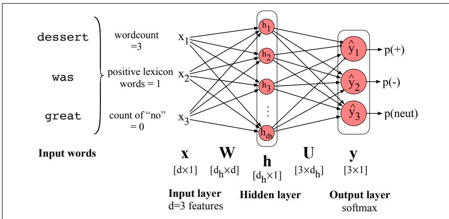

## 6.4 Feedforward networks for NLP: Classification

Let’s see how to apply feedforward networks to NLP classification tasks. In practice, simple feedforward networks aren’t the way we do text classification; for real applications we would use more sophisticated architectures like the BERT transformers of Chapter 9. Nonetheless seeing a feedforward network text classifier will let us introduce key ideas that will play a role throughout the rest of the book, including the ideas of the embedding matrix, representation pooling, and representation learning.

But before introducing any of these ideas, let’s start with a classifier by making only minimal change from the sentiment classifiers we saw in Chapter 4. Like them, we’ll take hand-built features, pass them through a classifier, and produce a class probability. The only difference is that we’ll use a neural network instead of logistic regression as the classifier.

## 6.4.1 Neural net classifiers with hand-built features

Let’s begin with a simple 2-layer sentiment classifier by taking our logistic regression classifier from Chapter 4, which corresponds to a 1-layer network, and just adding a hidden layer. The input element $\mathbf { x } _ { i }$ can be scalar features like those in Fig. 4.2, e.g., $\mathbf { x } _ { 1 } =$ count(words doc), x2 = count(positive lexicon words doc), $\mathbf { x } _ { 3 } = 1 \mathrm { ~ i f ~ } \mathbf { \ddot { \tau } } _ { \mathrm { n o } } \mathbf { \vec { \tau } } \in$ doc, and so on, for a total of d features. And the output layer $\hat { \mathbf { y } }$ could have two nodes (one each for positive and negative), or 3 nodes (positive, negative, neutral), in which case $\hat { \bf y } _ { 1 }$ would be the estimated probability of positive sentiment, $\hat { \bf y } _ { 2 }$ the probability of negative and $\hat { \bf y } _ { 3 }$ the probability of neutral. The resulting equations would be just what we saw above for a 2-layer network (as always, we’ll continue to use the $\sigma$ to stand for any non-linearity, whether sigmoid, ReLU or other).

$$
\begin{array}{l l} \mathbf {x} = [ \mathbf {x} _ {1}, \mathbf {x} _ {2},..., \mathbf {x} _ {d} ] & (\text { each   } \mathbf {x} _ {i} \text {   is   a   hand - designed   feature }) \\ \mathbf {h} = \sigma (\mathbf {W x} + \mathbf {b}) \\ \mathbf {z} = \mathbf {U h} \\ \hat {\mathbf {y}} = \operatorname{softmax} (\mathbf {z}) \end{array}\tag{6.19}
$$

Fig. 6.10 shows a sketch of this architecture. As we mentioned earlier, adding this hidden layer to our logistic regression classifier allows the network to represent the non-linear interactions between features. This alone might give us a better sentiment classifier.

  
Figure 6.10 Feedforward network sentiment analysis using traditional hand-built features of the input text.

## 6.4.2 Vectorizing for parallelizing inference

While Eq. 6.19 shows how to classify a single example x, in practice we want to efficiently classify an entire test set of m examples. We do this by vectorizing the process, just as we saw with logistic regression; instead of using for-loops to go through each example, we’ll use matrix multiplication to do the entire computation of an entire test set at once. First, we pack all the input feature vectors for each input x into a single input matrix $\mathbf { x } ,$ with each row i a row vector consisting of the features for input example $x ^ { ( i ) }$ (i.e., the vector $\mathbf { x } ^ { ( i ) } )$ . If the dimensionality of our input feature vector is d, X will be a matrix of shape $[ m \times d ]$

Because we are now modeling each input as a row vector rather than a column vector, we also need to slightly modify Eq. 6.19. X is of shape $[ m \times d ]$ and W is of shape $[ d _ { h } \times d ]$ , so we’ll reorder how we multiply X and W and transpose W so they correctly multiply to yield a matrix H of shape $[ m \times d _ { h } ]$ 1

The bias vector b from Eq. 6.19 of shape $[ 1 \times d _ { h } ]$ will now have to be replicated into a matrix of shape $[ m \times d _ { h } ]$ . We’ll need to similarly reorder the next step and transpose U. Finally, our output matrix $\hat { \pmb { \mathsf { \mathsf { Y } } } }$ will be of shape $[ m \times 3 ]$ (or more generally $[ m \times d _ { o } ]$ , where $d _ { o }$ is the number of output classes), with each row i of our output matrix $\hat { \pmb { \mathsf { Y } } }$ consisting of the output vector $\hat { \mathbf { y } } ^ { ( i ) }$ . Here are the final equations for computing the output class distribution for an entire test set:

$$
\begin{array}{r c l} \mathbf {H} & = & \sigma (\mathbf {X W} ^ {\mathsf {T}} + \mathbf {b}) \\ \mathbf {Z} & = & \mathbf {H U} ^ {\mathsf {T}} \\ \hat {\mathbf {Y}} & = & \text {softmax} (\mathbf {Z}) \end{array}\tag{6.20}
$$

In this book, we’ll sometimes see orderings like WX + b and sometimes XW + b. That’s why it’s always important to be very aware of the shapes of your weight matrices participating in any given equation.
