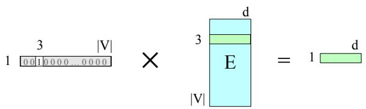
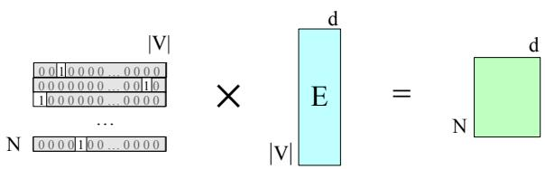
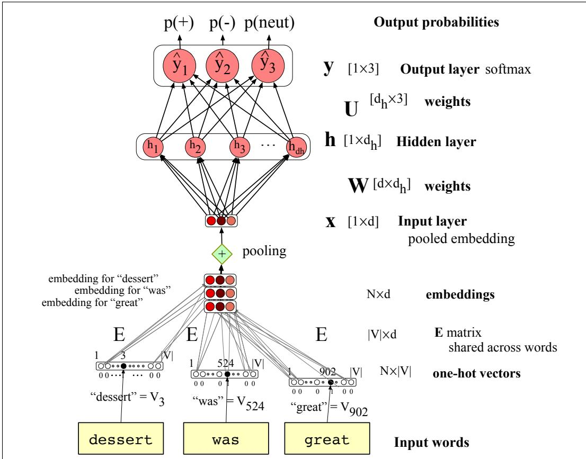
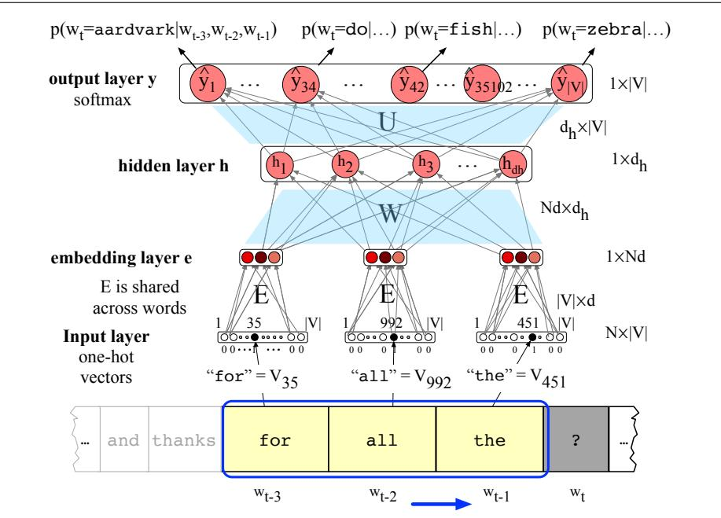

## 6.5 Embeddings as the input to neural net classifiers

While hand-built features are a traditional way to design classifiers, most applications of neural networks for NLP don’t use hand-built human-engineered features as inputs. Instead, we draw on deep learning’s ability to learn features from the data by representing tokens as embeddings. For this section we’ll represent each token by its static word2vec or GloVe embeddings that we saw how to compute in Chapter 5. By static embedding, we mean that each token is represented by a fixed vector that we train once, and then just put into a big dictionary. When we want to refer to that token, we grab its embedding out of the dictionary.

However when we apply neural models to the task of language modeling (as we’ll see in Chapter 7) the situation is more complex, and we’ll use a more powerful kind of embedding called a contextual embedding. Contextual embeddings are different for each time a word occurs in a different context. Furthermore, we’ll have the network learn these embeddings as part of the task of word prediction.

So let’s explore the text classification domain above, but using static embeddings as features instead of the hand-designed features. Let’s focus on the inference stage, in which we have already learned embeddings for all the input tokens. An embedding is a vector of dimension d that represents the input token. The dictionary of static embeddings in which we store these embeddings is the embedding matrix E. Each row of the embedding matrix represents each token of the vocabulary V as a (row) vector of dimensionality d. Since E has a row for each of the V tokens in the vocabulary, E has shape $[ | V | \times d ]$ . This embedding matrix E plays a role whenever we are using embeddings as input to neural NLP systems, including in the transformer-based large language models we will introduce over the next chapters.

Given an input token string like dessert was great we first convert the tokens into vocabulary indices (these were created when we first tokenized the input using BPE or SentencePiece). So the representation of dessert was great might be $\boldsymbol { \mathsf { w } } = [ 3 , 5 2 4 , 9 0 2 ]$ . Next we use indexing to select the corresponding rows from E (row 3, row 524, row 902).

Another way to think about selecting token embeddings from the embedding matrix is to represent input tokens as one-hot vectors of shape $[ 1 \times | V | ]$ , i.e., with one dimension for each word in the vocabulary. Recall that in a one-hot vector all the elements are 0 except one, the element whose dimension is the word’s index in the vocabulary, which has value 1. So if the word “dessert” has index 3 in the vocabulary, $x _ { 3 } = 1$ , and $x _ { i } = 0 ~ \forall i \neq 3$ , as shown here:

$$
\begin{array}{c c c c c c c c c c} \text {[ 0 0 1 0 0 0 0 ... 0 0 0 0 ]} \\ 1   2   3   4   5   6   7   \ldots & \ldots & | V | \end{array}
$$

Multiplying by a one-hot vector that has only one non-zero element $x _ { i } = 1$ simply selects out the relevant row vector for word i, resulting in the embedding for word i, as depicted in Fig. 6.11.

  
Figure 6.11 Selecting the embedding vector for word $V _ { 3 }$ by multiplying the embedding matrix E with a one-hot vector with a 1 in index 3.

We can extend this idea to represent the entire input token sequence as a matrix of one-hot vectors, one for each of the N input positions as shown in Fig. 6.12.

  
Figure 6.12 Selecting the embedding matrix for the input sequence of token ids W by multiplying a one-hot matrix corresponding to W by the embedding matrix E.

We now need to classify this input of $N \left[ 1 \times d \right]$ embeddings, representing a window of N tokens, into a single class (like positive or negative).

There are two common ways to pass embeddings to a classifier: concatenation and pooling. First, we can take this input of shape $[ N \times d ]$ and reshape it by concatenating all the input vectors into one very long vector of shape $[ 1 \times d N ]$ . Then we pass this input to our classifier and let it make its decision. This gives us lots of information, at the cost of using a pretty large network. Second, we can pool the N embeddings into a single embedding and then pass that single pooled embedding to the classifier. Pooling gives us less information than would have been present in all the original embeddings, but has the advantage of being small and efficient and is especially useful in tasks for which we don’t care as much about the original word order. Let’s give an example of each: pooling for the sentiment task, and concatenation for the language modeling task.

Pooling input embeddings for sentiment So let’s begin with seeing how pooling can work for the sentiment classification task. The intuition of pooling is that for sentiment, the exact position of the input (is some word like great the first word? the second word?) is less important than the identity of the word itself.

A pooling function is a way to turn a set of embeddings into a single embedding.

For example, for a text with N input words/tokens $w _ { 1 } , . . . , w _ { N }$ , we want to turn the N row embeddings $\mathbf { e } ( w _ { 1 } ) , . . . , \mathbf { e } ( w _ { N } )$ (each of dimensionality d) into a single embedding also of dimensionality d.

There are various ways to pool. The simplest is mean-pooling: taking the mean by summing the embeddings and then dividing by N:

$$
\mathbf {x} _ {\mathrm{mean}} = \frac {1}{N} \sum_ {i = 1} ^ {N} \mathbf {e} (w _ {i})\tag{6.21}
$$

Here are the equations for this classifier assuming mean pooling:

$$
\begin{array}{l l} \mathbf {x} = & \text {mean} (\mathbf {e} (w _ {1}), \mathbf {e} (w _ {2}), \ldots , \mathbf {e} (w _ {n})) \\ \mathbf {h} = & \sigma (\mathbf {x W} + \mathbf {b}) \\ \mathbf {z} = & \mathbf {h U} \\ \hat {\mathbf {y}} = & \text {softmax} (\mathbf {z}) \end{array}\tag{6.22}
$$

The architecture is sketched in Fig. 6.13, where we also give the shapes for all the relevant matrices (note that we’re using row vectors now).

There are many other options for pooling, like max-pooling, in which case for each dimension we take the element-wise max over all the inputs. The element-wise max of a set of N vectors is a new vector whose kth element is the max of the kth elements of all the N vectors.

Concatenating input embeddings for language modeling For sentiment analysis we saw how to generate an output vector with probabilities over three classes: positive, negative, or neutral, given as input a window of N input tokens, by first pooling those token embeddings into a single embedding vector.

Now let’s consider language modeling: predicting upcoming words from prior words. In this task we are given the same window of N input tokens, but our task now is to predict the next token that should follow the window. We’ll sketch a simple feedforward neural language model, drawing on an algorithm first introduced by Bengio et al. (2003). The feedforward language model introduces many of the important concepts of large language modeling that we will return to in Chapter 7.

Neural language models have many advantages over the n-gram language models of Chapter 3. Neural language models can handle much longer histories, can generalize better over contexts of similar words, and are far more accurate at wordprediction. On the other hand, neural net language models are slower, more complex, need vast amounts of energy to train, and are less interpretable than n-gram models, so for some smaller tasks an n-gram language model is still the right tool.

  
Figure 6.13 Feedforward network sentiment analysis using a pooled embedding of the input words. At each timestep the network computes a d-dimensional embedding for each context word (by multiplying a one-hot vector by the embedding matrix E), and pools the resulting N embeddings to get a single embedding that represents the context window as the layer x.

A feedforward neural language model is a feedforward network that takes as input at time t a representation of some number of previous words $( w _ { t - 1 } , w _ { t - 2 } , \mathrm { e t c . } )$ and outputs a probability distribution over possible next words. Thus—like the ngram LM—the feedforward neural LM approximates the probability of a word given the entire prior context $P ( w _ { t } | w _ { 1 : t - 1 } )$ by approximating based on the N 1 previous words:

$$
P (w _ {t} | w _ {1}, \dots , w _ {t - 1}) \approx P (w _ {t} | w _ {t - N + 1}, \dots , w _ {t - 1})\tag{6.23}
$$

In the following examples we’ll use a 4-gram example, so we’ll show a neural net to estimate the probability $P ( w _ { t } = i | w _ { t - 3 } , w _ { t - 2 } , w _ { t - 1 } )$

Neural language models represent words in this prior context by their embeddings, rather than just by their word identity as used in n-gram language models. Using embeddings allows neural language models to generalize better to unseen data. For example, suppose we’ve seen this sentence in training:

## I have to make sure that the cat gets fed.

but have never seen the words “gets fed” after the word $^ { \mathrm { \bullet } } \mathrm { d o g } ^ { \mathrm { \ 9 } }$ . Our test set has the prefix “I forgot to make sure that the dog gets”. What’s the next word? An n-gram language model will predict “fed” after “that the cat gets”, but not after “that the dog gets”. But a neural LM, knowing that “cat” and “dog” have similar embeddings, will be able to generalize from the “cat” context to assign a high enough probability to “fed” even after seeing “dog”.

  
Figure 6.14 Forward inference in a feedforward neural language model. At each timestep t the network computes a d-dimensional embedding for each of the N = 3 context tokens (by multiplying a one-hot vector by the embedding matrix E), and concatenates the three to get the embedding e. This embedding e is multiplied by weight matrix W and then an activation function is applied element-wise to produce the hidden layer h, which is then multiplied by another weight matrix U. A softmax layer predicts at each output node i the probability that the next word wt will be vocabulary word $V _ { i \cdot }$ . We show the context window size N as 3 just to fit on the page, but in practice language modeling requires a much longer context.

This prediction task requires an output vector that expresses V probabilities: one probability value for each possible next token. We might have a vocabulary between 60,000 and 300,000 tokens, so the output vector for the task of language modeling is much longer than 3. Another difference for language modeling is that instead of pooling the embeddings of the N input tokens to create a single embedding, we concatenate the inputs into one very long input vector. To predict the next token, it helps to know each of the preceding tokens and what order they were in.

Fig. 6.14 shows the language modeling task, sketched with a very short context window of N = 3 just to fit on the page. These 3 embedding vectors are concatenated to produce e, the embedding layer. This is multiplied by a weight matrix W to produce a hidden layer, and another weight matrix U to produce an output layer whose softmax gives a probability distribution over words. For example y42, the value of output node 42, is the probability of the next word wt being $V _ { 4 2 }$ , the vocabulary word with index 42 (which is the word ‘fish’ in our example).

The equations for a simple feedforward neural language model with a window

size of 3, given one-hot input vectors for each input context word, are:

$$
\begin{array}{l l} \mathbf {e} = & [ \mathsf {E x} _ {\mathbf {t} - 3}; \mathsf {E x} _ {\mathbf {t} - 2}; \mathsf {E x} _ {\mathbf {t} - 1} ] \\ \mathbf {h} = & \sigma (\mathbf {W e} + \mathbf {b}) \\ \mathbf {z} = & \mathbf {U h} \\ \hat {\mathbf {y}} = & \text {softmax} (\mathbf {z}) \end{array}\tag{6.24}
$$

Note that we use semicolons to mean concatenation of vectors, so we form the embedding layer e by concatenating the 3 embeddings for the three context vectors.

We’ll return to this idea of using neural networks to do language modeling in Chapter 7 when we introduce transformer language models.
