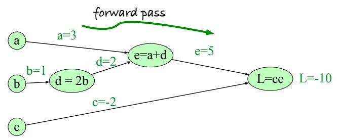
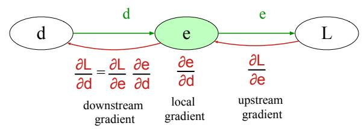
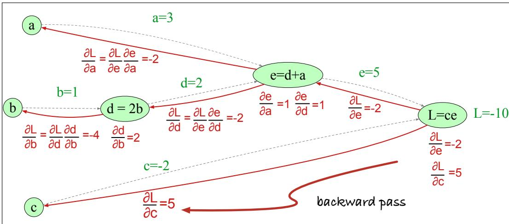
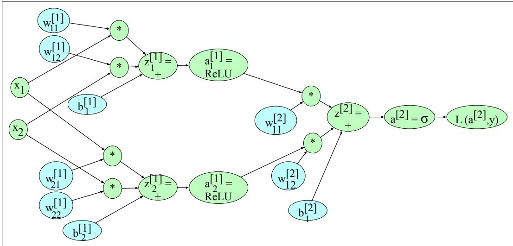

## 6.6 Training Neural Nets

A feedforward neural net is an instance of supervised machine learning in which we know the correct output y for each observation x. What the system produces, via Eq. 6.13, is ˆy, the system’s estimate of the true y. The goal of the training procedure is to learn parameters $\boldsymbol { \mathsf { W } } ^ { [ i ] }$ and $\mathbf { b } ^ { [ i ] }$ for each layer i that make $\hat { y }$ for each training observation as close as possible to the true y.

In general, we do all this by drawing on the methods we introduced in Chapter 4 for logistic regression, so the reader should be comfortable with that chapter before proceeding. We’ll explore the algorithm on simple generic networks rather than networks designed for sentiment or language modeling.

First, we’ll need a loss function that models the distance between the system output and the gold output, and it’s common to use the loss function used for logistic regression, the cross-entropy loss.

Second, to find the parameters that minimize this loss function, we’ll use the gradient descent optimization algorithm introduced in Chapter 4.

Third, gradient descent requires knowing the gradient of the loss function, the vector that contains the partial derivative of the loss function with respect to each of the parameters. In logistic regression, for each observation we could directly compute the derivative of the loss function with respect to an individual w or b. But for neural networks, with millions of parameters in many layers, it’s much harder to see how to compute the partial derivative of some weight in layer 1 when the loss is attached to some much later layer. How do we partial out the loss over all those intermediate layers? The answer is the algorithm called error backpropagation or backward differentiation.

## 6.6.1 Loss function

The cross-entropy loss that is used in neural networks is the same one we saw for logistic regression. If the neural network is being used as a binary classifier, with the sigmoid at the final layer, the loss function is the same logistic regression loss we saw in Eq. 4.19:

$$
L _ {C E} (\hat {y}, y) = - \log p (y | x) = - [ y \log \hat {y} + (1 - y) \log (1 - \hat {y}) ]\tag{6.25}
$$

If we are using the network to classify into 3 or more classes, the loss function is exactly the same as the loss for multinomial regression that we saw in Chapter 4 on page 112. Let’s briefly summarize the explanation here for convenience. First, when we have more than 2 classes we’ll need to represent both y and $\hat { \bf y }$ as vectors. Let’s assume we’re doing hard classification, where only one class is the correct one. The true label y is then a vector with $K$ elements, each corresponding to a class, with $\mathsf { y } _ { c } = 1$ if the correct class is $^ { c , }$ with all other elements of $\pmb { y }$ being 0. Recall that a vector like this, with one value equal to 1 and the rest $0 ,$ is called a one-hot vector. And our classifier will produce an estimate vector with K elements ${ \hat { \mathbf { y } } } ,$ each element $\hat { \mathbf { y } } _ { k }$ of which represents the estimated probability $p ( \mathbf { y } _ { k } = 1 | \mathbf { x } )$

The loss function for a single example x is the negative sum of the logs of the K output classes, each weighted by their probability yk:

$$
L _ {C E} (\hat {\mathbf {y}}, \mathbf {y}) = - \sum_ {k = 1} ^ {K} \mathbf {y} _ {k} \log \hat {\mathbf {y}} _ {k}\tag{6.26}
$$

We can simplify this equation further; let’s first rewrite the equation using the function $\mathbb { 1 } \{ \}$ which evaluates to 1 if the condition in the brackets is true and to 0 otherwise. This makes it more obvious that the terms in the sum in Eq. 6.26 will be 0 except for the term corresponding to the true class for which $\mathbf { y } _ { k } = 1$

$$
L _ {C E} (\hat {\mathbf {y}}, \mathbf {y}) = - \sum_ {k = 1} ^ {K} \mathbb {1} \left\{\mathbf {y} _ {k} = 1 \right\} \log \hat {\mathbf {y}} _ {k}
$$

In other words, the cross-entropy loss is simply the negative log of the output probability corresponding to the correct class, and we therefore also call this the negative log likelihood loss:

$$
L _ {C E} (\hat {\mathbf {y}}, \mathbf {y}) = - \log \hat {\mathbf {y}} _ {c} \quad (\text { where   } c \text {   is   the   correct   class })\tag{6.27}
$$

Plugging in the softmax formula from Eq. 6.9, and with K the number of classes:

$$
L _ {C E} (\hat {\mathbf {y}}, \mathbf {y}) = - \log \frac {\exp (\mathbf {z} _ {c})}{\sum_ {j = 1} ^ {K} \exp (\mathbf {z} _ {j})} \quad (\text { where   } c \text {   is   the   correct   class })\tag{6.28}
$$

Let’s think about the negative log probability as a loss function. A perfect classifier would assign the correct class i probability 1 and all the incorrect classes probability 0. That means the higher $p ( \hat { y } _ { i } )$ (the closer it is to 1), the better the classifier; $p ( \hat { y } _ { i } )$ is, and the lower it is (the closer it is to 0), the worse the classifier. The negative log of this probability is a beautiful loss metric since it goes from 0 (negative log of 1, no loss) to infinity (negative log of $^ { 0 , }$ infinite loss). This loss function also ensures that as probability of the correct answer is maximized, the probability of all the incorrect answers is minimized; since they all sum to one, any increase in the probability of the correct answer is coming at the expense of the incorrect answers.

The number K of classes of the output vector ˆy can be small or large. Perhaps our task is 3-way sentiment, and then the classes might be positive, negative, and neutral. Or if our task is deciding the part of speech of a word (i.e., whether it is a noun or verb or adjective, etc.), then K is the set of possible parts of speech in our tagset (of which there are 17 in the tagset we will define in Chapter 18). And if our task is language modeling, and our classifier is trying to predict which word is next, then our set of classes is the set of words, which might be 50,000 or 100,000.

## 6.6.2 Computing the Gradient

How do we compute the gradient of this loss function? Computing the gradient requires the partial derivative of the loss function with respect to each parameter. For a network with one weight layer and sigmoid output (which is what logistic regression is), we could simply use the derivative of the loss that we used for logistic regression in Eq. 6.29 (and derived in Section 4.15):

$$
\begin{array}{r c l} \frac {\partial L _ {\mathrm{CE}} (\hat {\mathbf {y}} , \mathbf {y})}{\partial w _ {j}} & = & (\hat {y} - y)   \mathbf {x} _ {j} \\ & = & (\sigma (\mathbf {w} \cdot \mathbf {x} + b) - y)   \mathbf {x} _ {j} \end{array}\tag{6.29}
$$

Or for a network with one weight layer and softmax output (=multinomial logistic regression), we could use the derivative of the softmax loss from Eq. 4.41, shown for a particular weight ${ \pmb w } _ { k }$ and input $\pmb { x } _ { i }$

$$
\begin{array}{l l} \frac {\partial L _ {\mathrm{CE}} (\hat {\mathbf {y}} , \mathbf {y})}{\partial \mathbf {w} _ {k , i}} & = - (\mathbf {y} _ {k} - \hat {\mathbf {y}} _ {k}) \mathbf {x} _ {i} \\ & = - (\mathbf {y} _ {k} - p (\mathbf {y} _ {k} = 1 | \mathbf {x})) \mathbf {x} _ {i} \\ & = - \left(\mathbf {y} _ {k} - \frac {\exp \left(\mathbf {w} _ {k} \cdot \mathbf {x} + b _ {k}\right)}{\sum_ {j = 1} ^ {K} \exp \left(\mathbf {w} _ {j} \cdot \mathbf {x} + b _ {j}\right)}\right) \mathbf {x} _ {i} \end{array}\tag{6.30}
$$

But these derivatives only give correct updates for one weight layer: the last one! For deep networks, computing the gradients for each weight is much more complex, since we are computing the derivative with respect to weight parameters that appear all the way back in the very early layers of the network, even though the loss is computed only at the very end of the network.

The solution to computing this gradient is an algorithm called error backpropagation or backprop (Rumelhart et al., 1986). While backprop was invented specially for neural networks, it turns out to be the same as a more general procedure called backward differentiation, which depends on the notion of computation graphs. Let’s see how that works in the next subsection.

## 6.6.3 Computation Graphs

A computation graph is a representation of the process of computing a mathematical expression, in which the computation is broken down into separate operations, each of which is modeled as a node in a graph.

Consider computing the function $L ( a , b , c ) = c ( a + 2 b )$ . If we make each of the component addition and multiplication operations explicit, and add names (d and e) for the intermediate outputs, the resulting series of computations is:

$$
\begin{array}{r l} {d} & {= 2 * b} \\ {e} & {= a + d} \\ {L} & {= c * e} \end{array}
$$

We can now represent this as a graph, with nodes for each operation, and directed edges showing the outputs from each operation as the inputs to the next, as in Fig. 6.15. The simplest use of computation graphs is to compute the value of the function with some given inputs. In the figure, we’ve assumed the inputs $a = 3$ $b = 1 , c = - 2$ , and we’ve shown the result of the forward pass to compute the result $L ( 3 , 1 , - 2 ) = - 1 0$ . In the forward pass of a computation graph, we apply each operation left to right, passing the outputs of each computation as the input to the next node.

  
Figure 6.15 Computation graph for the function $L ( a , b , c ) = c ( a + 2 b )$ , with values for input nodes $a = 3 , b = 1 , c = - 2$ , showing the forward pass computation of L.

## 6.6.4 Backward differentiation on computation graphs

The importance of the computation graph comes from the backward pass, which is used to compute the derivatives that we’ll need for the weight update. In this example our goal is to compute the derivative of the output function L with respect to each of the input variables, i.e., $\begin{array} { r } { \frac { \partial L } { \partial a } , \frac { \partial L } { \partial b } } \end{array}$ , and $\frac { \partial L } { \partial c }$ . The derivative $\textstyle { \frac { \partial L } { \partial a } }$ tells us how much a small change in a affects L.

Backwards differentiation makes use of the chain rule in calculus, so let’s remind ourselves of that. Suppose we are computing the derivative of a composite function $f ( x ) = u ( \nu ( x ) )$ . The derivative of $f ( x )$ is the derivative of $u ( x )$ with respect to $\nu ( x )$ times the derivative of v(x) with respect to x:

$$
{\frac {d f}{d x}} = {\frac {d u}{d v}} \cdot {\frac {d v}{d x}}\tag{6.31}
$$

The chain rule extends to more than two functions. If computing the derivative of a composite function $f ( x ) = u ( \nu ( w ( x ) ) ) ,$ ), the derivative of $f ( x )$ is:

$$
\frac {d f}{d x} = \frac {d u}{d v} \cdot \frac {d v}{d w} \cdot \frac {d w}{d x}\tag{6.32}
$$

The intuition of backward differentiation is to pass gradients back from the final node to all the nodes in the graph. Fig. 6.16 shows part of the backward computation at one node e. Each node takes an upstream gradient that is passed in from its parent node to the right, and for each of its inputs computes a local gradient (the gradient of its output with respect to its input), and uses the chain rule to multiply these two to compute a downstream gradient to be passed on to the next earlier node.

Let’s now compute the 3 derivatives we need. Since in the computation graph $L = c e .$ , we can directly compute the derivative $\frac { \partial L } { \partial c }$ :

$$
\frac {\partial L}{\partial c} = e\tag{6.33}
$$

For the other two, we’ll need to use the chain rule:

$$
\begin{array}{l} \frac {\partial L}{\partial a} = \frac {\partial L}{\partial e} \frac {\partial e}{\partial a} \\ \frac {\partial L}{\partial b} = \frac {\partial L}{\partial e} \frac {\partial e}{\partial d} \frac {\partial d}{\partial b} \end{array}\tag{6.34}
$$

  
Figure 6.16 Each node (like e here) takes an upstream gradient, multiplies it by the local gradient (the gradient of its output with respect to its input), and uses the chain rule to compute a downstream gradient to be passed on to a prior node. A node may have multiple local gradients if it has multiple inputs.

Eq. 6.34 and Eq. 6.33 thus require five intermediate derivatives: $\begin{array} { r } { \frac { \partial L } { \partial e } , \frac { \partial L } { \partial c } , \frac { \partial e } { \partial a } , \frac { \partial e } { \partial d } } \end{array}$ , and $\frac { \partial d } { \partial b }$ , which are as follows (making use of the fact that the derivative of a sum is the sum of the derivatives):

$$
\begin{array}{c c} L = c e: & \frac {\partial L}{\partial e} = c, \frac {\partial L}{\partial c} = e \\ e = a + d: & \frac {\partial e}{\partial a} = 1, \frac {\partial e}{\partial d} = 1 \\ d = 2 b: & \frac {\partial d}{\partial b} = 2 \end{array}
$$

In the backward pass, we compute each of these partials along each edge of the graph from right to left, using the chain rule just as we did above. Thus we begin by computing the downstream gradients from node $L ,$ which are $\frac { \partial L } { \partial e }$ and $\frac { \partial L } { \partial c }$ . For node e, we then multiply this upstream gradient $\frac { \partial L } { \partial e }$ by the local gradient (the gradient of the output with respect to the input), $\textstyle { \frac { \partial e } { \partial d } }$ to get the output we send back to node d: $\frac { \partial L } { \partial d }$ And so on, until we have annotated the graph all the way to all the input variables. The forward pass conveniently already will have computed the values of the forward intermediate variables we need (like d and e) to compute these derivatives. Fig. 6.17 shows the backward pass.

  
Figure 6.17 Computation graph for the function $\overline { { L ( a , b , c ) = c ( a + 2 b ) } }$ ), showing the backward pass computation of $\begin{array} { r } { \frac { \partial L } { \partial a } , \frac { \partial L } { \partial b } } \end{array}$ , and $\frac { \partial L } { \partial c }$

## Backward differentiation for a neural network

Of course computation graphs for real neural networks are much more complex. Fig. 6.18 shows a sample computation graph for a 2-layer neural network with $n _ { 0 } =$ $2 , n _ { 1 } = 2$ , and $n _ { 2 } = 1$ , assuming binary classification and hence using a sigmoid output unit for simplicity. The function that the computation graph is computing is:

$$
\begin{array}{r c l} \mathbf {z} ^ {[ 1 ]} & = & \mathbf {W} ^ {[ 1 ]} \mathbf {x} + \mathbf {b} ^ {[ 1 ]} \\ \mathbf {a} ^ {[ 1 ]} & = & \operatorname{ReLU} (\mathbf {z} ^ {[ 1 ]}) \\ z ^ {[ 2 ]} & = & \mathbf {W} ^ {[ 2 ]} \mathbf {a} ^ {[ 1 ]} + b ^ {[ 2 ]} \\ a ^ {[ 2 ]} & = & \boldsymbol {\sigma} (z ^ {[ 2 ]}) \\ \hat {y} & = & a ^ {[ 2 ]} \end{array}\tag{6.35}
$$

For the backward pass we’ll also need to compute the loss L. The loss function for binary sigmoid output from Eq. 6.25 is

$$
L _ {C E} (\hat {y}, y) = - [ y \log \hat {y} + (1 - y) \log (1 - \hat {y}) ]\tag{6.36}
$$

Our output $\hat { y } = a ^ { [ 2 ] }$ , so we can rephrase this as

$$
L _ {C E} (a ^ {[ 2 ]}, y) = - \left[ y \log a ^ {[ 2 ]} + (1 - y) \log (1 - a ^ {[ 2 ]}) \right]\tag{6.37}
$$

  
Figure 6.18 Sample computation graph for a simple 2-layer neural net (= 1 hidden layer) with two input units and 2 hidden units. We’ve adjusted the notation a bit to avoid long equations in the nodes by just mentioning the function that is being computed, and the resulting variable name. Thus the \* to the right of node $w _ { 1 1 } ^ { [ 1 ] }$ means that $w _ { 1 1 } ^ { [ 1 ] }$ is to be multiplied by $x _ { 1 }$ , and the node $z ^ { [ 1 ] } = +$ means that the value of $z ^ { [ 1 ] }$ is computed by summing the three nodes that feed into it (the two products, and the bias term $b _ { i } ^ { [ 1 ] } )$ .

The weights that need updating (those for which we need to know the partial derivative of the loss function) are shown in teal. In order to do the backward pass, we’ll need to know the derivatives of all the functions in the graph. We already saw in Section 4.15 the derivative of the sigmoid σ:

$$
\frac {d \sigma (z)}{d z} = \sigma (z) (1 - \sigma (z))\tag{6.38}
$$

We’ll also need the derivatives of each of the other activation functions. The derivative of tanh is:

$$
\frac {d \tanh (z)}{d z} = 1 - \tanh ^ {2} (z)\tag{6.39}
$$

The derivative of the ReLU $\mathrm { i } \mathrm { s } ^ { 2 }$

$$
\frac {d \operatorname{ReLU} (z)}{d z} = \left\{ \begin{array}{l l} 0 & \text { for } z <   0 \\ 1 & \text { for } z \geq 0 \end{array} \right.\tag{6.40}
$$

We’ll give the start of the computation, computing the derivative of the loss function L with respect to $z ,$ or $\frac { \partial L } { \partial z }$ (and leaving the rest of the computation as an exercise for the reader). By the chain rule:

$$
\frac {\partial L}{\partial z} = \frac {\partial L}{\partial a ^ {[ 2 ]}} \frac {\partial a ^ {[ 2 ]}}{\partial z}\tag{6.41}
$$

So let’s first compute $\frac { \partial L } { \partial a ^ { [ 2 ] } }$ , taking the derivative of Eq. 6.37, repeated here:

$$
\begin{array}{r c l} L _ {C E} (a ^ {[ 2 ]}, y) & = & - \left[ y \log a ^ {[ 2 ]} + (1 - y) \log (1 - a ^ {[ 2 ]}) \right] \\ & \frac {\partial L}{\partial a ^ {[ 2 ]}} & = - \left(\left(y \frac {\partial \log (a ^ {[ 2 ]})}{\partial a ^ {[ 2 ]}}\right) + (1 - y) \frac {\partial \log (1 - a ^ {[ 2 ]})}{\partial a ^ {[ 2 ]}}\right) \\ & = & - \left(\left(y \frac {1}{a ^ {[ 2 ]}}\right) + (1 - y) \frac {1}{1 - a ^ {[ 2 ]}} (- 1)\right) \\ & = & - \left(\frac {y}{a ^ {[ 2 ]}} + \frac {y - 1}{1 - a ^ {[ 2 ]}}\right) \end{array}\tag{6.42}
$$

Next, by the derivative of the sigmoid:

$$
\frac {\partial a ^ {[ 2 ]}}{\partial z} = a ^ {[ 2 ]} (1 - a ^ {[ 2 ]})
$$

Finally, we can use the chain rule:

$$
\begin{array}{r c l} \frac {\partial L}{\partial z} & = & \frac {\partial L}{\partial a ^ {[ 2 ]}} \frac {\partial a ^ {[ 2 ]}}{\partial z} \\ & = & - \left(\frac {y}{a ^ {[ 2 ]}} + \frac {y - 1}{1 - a ^ {[ 2 ]}}\right) a ^ {[ 2 ]} (1 - a ^ {[ 2 ]}) \\ & = & a ^ {[ 2 ]} - y \end{array}\tag{6.43}
$$

Continuing the backward computation of the gradients (next by passing the gradients over $b _ { 1 } ^ { [ 2 ] }$ and the two product nodes, and so on, back to all the teal nodes), is left as an exercise for the reader.

## 6.6.5 More details on learning

Optimization in neural networks is a non-convex optimization problem, more complex than for logistic regression, and for that and other reasons there are many best practices for successful learning.

For logistic regression we can initialize gradient descent with all the weights and biases having the value 0. In neural networks, by contrast, we need to initialize the weights with small random numbers. It’s also helpful to normalize the input values to have 0 mean and unit variance.

Various forms of regularization are used to prevent overfitting. One of the most important is dropout: randomly dropping some units and their connections from the network during training (Hinton et al. 2012, Srivastava et al. 2014). At each iteration of training (whenever we update parameters, i.e. each mini-batch if we are using mini-batch gradient descent), we choose a probability p and for each unit we replace its output with zero with probability p (and renormalize the rest of the outputs from that layer). Thus probability p is a hyperparameter of the algorithm.

Tuning of such hyperparameters is also important. The parameters of a neural network are the weights W and biases b; those are learned by gradient descent. The hyperparameters are things that are chosen by the algorithm designer; optimal values are tuned on a devset rather than by gradient descent learning on the training set. Hyperparameters include the learning rate η, the mini-batch size, the model architecture (the number of layers, the number of hidden nodes per layer, the choice of activation functions), how to regularize, and so on. Gradient descent itself also has many architectural variants such as Adam (Kingma and Ba, 2015).

Finally, most modern neural networks are built using computation graph formalisms that make it easy and natural to do gradient computation and parallelization on vector-based GPUs (Graphic Processing Units). PyTorch (Paszke et al., 2017) and TensorFlow (Abadi et al., 2015) are two of the most popular. The interested reader should consult a neural network textbook for further details; some suggestions are at the end of the chapter.
