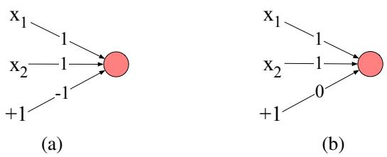
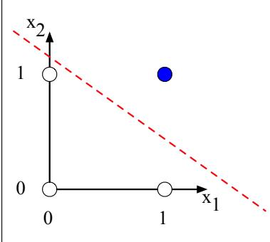
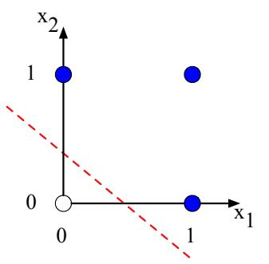
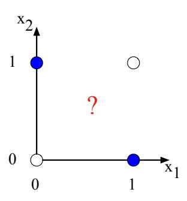
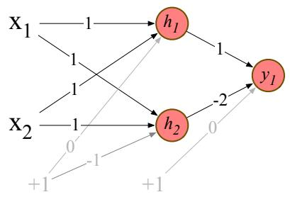
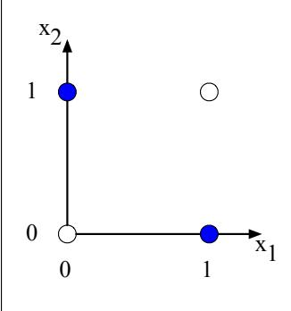
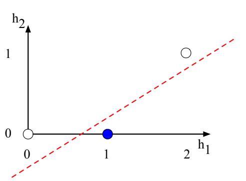

## 6.2 XOR 问题

神经网络研究早期，人们便认识到：与其生物学灵感来源一样，神经网络的能力来自把多个单元组合成更大的网络。

Minsky and Papert（1969）对多层网络必要性的一个巧妙证明是：单个神经单元无法计算输入的某些极简单函数。考虑两个输入的基本逻辑函数 AND、OR 和 XOR，其真值表如下：

<table><tr><td colspan="3">AND</td><td colspan="3">OR</td><td colspan="3">XOR</td></tr><tr><td>x1</td><td>x2</td><td>y</td><td>x1</td><td>x2</td><td>y</td><td>x1</td><td>x2</td><td>y</td></tr><tr><td>0</td><td>0</td><td>0</td><td>0</td><td>0</td><td>0</td><td>0</td><td>0</td><td>0</td></tr><tr><td>0</td><td>1</td><td>0</td><td>0</td><td>1</td><td>1</td><td>0</td><td>1</td><td>1</td></tr><tr><td>1</td><td>0</td><td>0</td><td>1</td><td>0</td><td>1</td><td>1</td><td>0</td><td>1</td></tr><tr><td>1</td><td>1</td><td>1</td><td>1</td><td>1</td><td>1</td><td>1</td><td>1</td><td>0</td></tr></table>

这个例子最早针对**感知机**（perceptron）提出。感知机是非常简单的神经单元，使用阶跃函数作为非线性激活，输出 $y$ 为 0 或 1：

$$
y=\left\{\begin{array}{ll}0,&\mathbf w\cdot\mathbf x+b\le0\\1,&\mathbf w\cdot\mathbf x+b>0\end{array}\right.\tag{6.7}
$$

构造计算二元输入 AND 或 OR 的感知机很容易，所需权重见图 6.4。

  
**图 6.4 计算逻辑函数的感知机权重 $\mathbf w$ 和偏置 $b$。输入为 $x_1,x_2$；偏置表示为值固定为 +1、再乘偏置权重 $b$ 的特殊节点。（a）AND：$w_1=w_2=1,b=-1$；（b）OR：$w_1=w_2=1,b=0$。这些只是无穷多组可实现相应函数的权重和偏置之一。**

然而，无法构造一个感知机来计算 XOR。理解这一结果的关键是：感知机是**线性分类器**（linear classifier）。对二维输入 $x_1,x_2$，感知机方程 $w_1x_1+w_2x_2+b=0$ 是一条直线的方程，可改写为 $x_2=(-w_1/w_2)x_1+(-b/w_2)$。该直线充当二维空间中的决策边界：一侧的所有输入输出 0，另一侧输出 1。若输入超过二维，边界会从直线变为超平面，但仍将空间分为两类。

图 6.5 展示四种可能输入（00、01、10、11），以及 AND 和 OR 分类器某组参数画出的直线。无论怎样画一条直线，都无法把 XOR 的正例（01、10）与负例（00、11）分开。因此，XOR 不是**线性可分函数**（linearly separable function）。曲线或其他函数可以完成划分，但单条直线不行。

### 6.2.1 解决方案：神经网络

单个感知机不能计算 XOR，但分层的感知机网络可以。下面不使用简单感知机，而按照 Goodfellow et al.（2016），用两层 ReLU 单元计算 XOR。图 6.6 中输入经过两层神经单元：中间层 $\mathbf h$ 有两个单元，输出层 $\mathbf y$ 有一个单元；图示权重和偏置能让网络正确计算 XOR。

以输入 $\mathbf x=[0,0]$ 为例。各输入乘相应权重、求和并加偏置后得到 $[0,-1]$；应用 ReLU，隐藏层输出为 $[0,0]$。再次乘权重、求和并加偏置（此处为 0），最终得到 0。读者可推算其余三组输入：$[0,1]$ 和 $[1,0]$ 的 $y$ 为 1，$[0,0]$ 和 $[1,1]$ 为 0。

  
（a）$x_1\operatorname{AND}x_2$

  
（b）$x_1\operatorname{OR}x_2$

  
（c）$x_1\operatorname{XOR}x_2$

**图 6.5 AND、OR 和 XOR 函数，横轴为 $x_1$，纵轴为 $x_2$。实心圆表示输出 1，空心圆表示输出 0。不存在一条能正确分开 XOR 两类的直线。图式参考 Russell and Norvig（2002）。**

  
**图 6.6 依据 Goodfellow et al.（2016）的 XOR 解法。两层共有三个 ReLU 单元，分别为 $h_1,h_2$（h 表示隐藏层）和 $y_1$。箭头上的数字表示各单元权重；偏置 $b$ 表示为固定值 +1 的单元所对应的权重，偏置权重和单元以灰色显示。**

观察中间结果也很有启发。输入 $\mathbf x=[0,0]$ 时，隐藏向量 $\mathbf h=[0,0]$。图 6.7b 展示四种输入的隐藏层值。输入点 $[0,1]$ 和 $[1,0]$（XOR 输出均为 1）的隐藏表示合并为同一点 $\mathbf h=[1,0]$，从而使 XOR 的正例和负例易于线性分离。换言之，可以把网络隐藏层视为形成了输入的一种新表示。

本例直接指定了图 6.6 的权重；真实任务中，神经网络权重会用第 6.6 节介绍的**误差反向传播**（error backpropagation）算法自动学习，隐藏层也会学习形成有用表示。神经网络能自动学习输入表示，是它的核心优势之一，后续章节将反复回到这一点。

  
（a）原始 $\mathbf x$ 空间

  
（b）新的、线性可分的 $\mathbf h$ 空间  
**图 6.7 隐藏层形成输入的新表示。（b）展示隐藏层表示 $\mathbf h$，并与（a）的原始输入表示 $\mathbf x$ 比较。输入点 $[0,1]$ 与 $[1,0]$ 被合并，使 XOR 的正例和负例可以线性分离。依据 Goodfellow et al.（2016）。**
