# Transformers and Pretraining

“The true art ofmemory is the art ofattention

Samuel Johnson, Idler #74, September 1759

In this chapter we introduce the transformer, the standard architecture for building large language models, and how to pretrain them and how to use them to generate text. We’ll introduce transformers for left-to-right (sometimes called causal or autoregressive or decoder) language modeling, in which we are given a sequence of input tokens and predict output tokens one by one by conditioning on the prior context; we’ll introduce other architectures like the encoder architecture in Chapter 9.

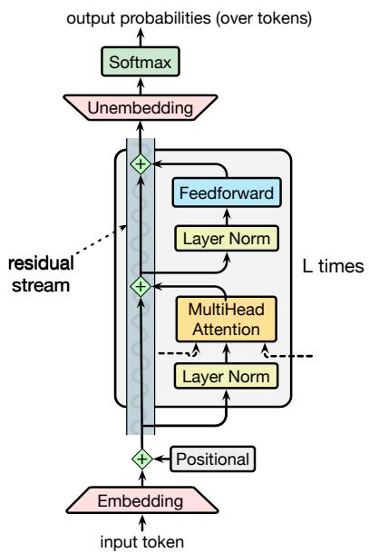  
Figure 7.1 A transformer decoder for language modeling, showing the residual stream for processing an input token. A single token is embedded and passed forward in the network, with the feedforward and attention components adding information. The multihead attention layer takes inputs (not shown in detail) from the neighboring token streams. This is thus one column of an autoregressive transformer language model, taking an input token and outputting a distribution over next tokens.

Fig. 7.1 sketches the transformer architecture following a single token as it passes up through the layers of the network. Each token is first converted to an embedding from the embedding matrix E. Recall from Chapter 6 in Section 6.5 that E is a linear layer that maps a token id to a vector embedding representing that token. Each token in the vocabulary has an initial embedding representation in E. Transformers also have a special mechanism for encoding the position/index of the token in the input string, which is simply added to the embedding. The resulting embedding represents both the word and its position, and is then passed through a set of L transformer blocks.

It’s common to think of each of these transformer blocks as part of a stream in which the input embedding is directly passed up to the output, while simultaneously being enriched by the application of various processing modules: the multi-head attention layer, feedforward networks and the layer normalization. The value of the stream at any layer for any input token is a vector that is the sum of the original embedding for that token and all the outputs from all the previous layers and blocks.

The core intuition of the transformer, and the component that distinguishes it from the feedforward layers we saw in Chapter 6, is this multi-head attention layer, also called a self-attention layer. Attention can be thought of as a way to build contextual representations of a token’s meaning by attending to and integrating information from surrounding tokens, helping the model learn how tokens relate to each other over large spans. It can also be thought of as a way to move information from one residual stream to another, augmenting the stream at one token position with information from another token position.

After the L transformer blocks we take the output embedding that is produced by the final transformer block, pass it through a linear unembedding matrix U and then a softmax over the vocabulary to generate a distribution over possible next tokens. These last two components (the unembedding matrix and the softmax) are sometimes called the language modeling head. In the rest of this chapter we’ll introduce attention and the rest of these modules in more detail.

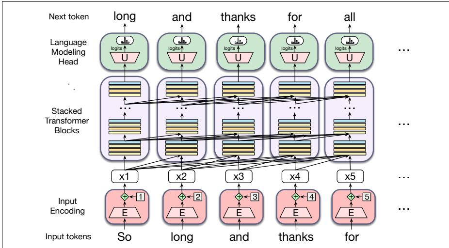  
Figure 7.2 The architecture of a (left-to-right) transformer, showing how each input token gets encoded, passed through a set of stacked transformer blocks, and then a language model head that predicts the next token. The embeddings at each token position in the residual stream are passed up the stack, and the arrows in the figure shows how information from the hidden representations of preceding tokens are also incorporated.

Fig. 7.2 shows the transformer architecture applied to a context window with the words So long and thanks for, showing at each token position what is the most likely token to be generated. In this full figure, the stack of L blocks over n tokens maps an entire context window of input vectors $\left( \mathbf { x } _ { 1 } , . . . , \mathbf { x } _ { n } \right)$ to a window of output vectors $\left( \mathbf { h } _ { 1 } , . . . , \mathbf { h } _ { n } \right)$ of the same length. A column might contain from $L = 1 2$ to $L = 9 6$ or more stacked blocks. The arrows in the figure show how information from the hidden representations of preceding tokens is incorporated into the transformer

block.

Transformer-based language models are complex, and so the details will unfold over this chapter and the next few chapters, in addition to the high-level overview in Chapter 1. This chapter will introduce multi-head attention, the rest of the transformer block, the input encoding and language modeling head components of the transformer, the concepts of decoding and sampling to generate output text, and the details of pretraining. Chapter 8 introduces post-training: fine-tuning and instructiontuning language models to perform NLP tasks, and aligning the model with human preferences. Chapter 9 introduces masked language modeling and the BERT family of bidirectional transformer encoder models. Chapter 13 will introduce machine translation with the encoder-decoder architecture. And we’ll see application of the transformer to speech recognition, as well as further use of the encoder-decoder architecture, in Chapter 16.

## 7.1 Attention

Recall from Chapter 5 that for word2vec and other static embeddings, the representation of a word’s meaning is always the same vector irrespective of the context: the word chicken, for example, is always represented by the same fixed vector. So a static vector for the word it might somehow encode that this is a pronoun used for animals and inanimate entities. But in context it has a much richer meaning. Consider it in one of these two sentences:

(7.1) The chicken didn’t cross the road because it was too tired.

(7.2) The chicken didn’t cross the road because it was too wide.

In (7.1) it is the chicken (i.e., the reader knows that the chicken was tired), while in (7.2) it is the road (and the reader knows that the road was wide).1 That is, if we are to compute the meaning of this sentence, we’ll need the meaning of it to be associated with the chicken in the first sentence and associated with the road in the second one, sensitive to the context.

Furthermore, consider reading left to right like a causal language model, processing the sentence up to the word it:

## (7.3) The chicken didn’t cross the road because it

At this point we don’t yet know which thing it is going to end up referring to! So a representation of it at this point might have aspects of both chicken and road as the reader is trying to guess what happens next.

This fact that words have rich linguistic relationships with other words that may be far away pervades language. Consider two more examples:

(7.4) The keys to the cabinet are on the table.

(7.5) I walked along the pond, and noticed one of the trees along the bank.

In (7.4), the phrase The keys is the subject of the sentence, and in English and many languages, must agree in grammatical number with the verb are; in this case both are plural. In English we can’t use a singular verb like is with a plural subject like keys (we’ll discuss agreement more in Chapter 19). In (7.5), we know that bank refers to the side of a pond or river and not a financial institution because of the context, including words like pond. (We’ll discuss word senses more in Chapter 9.)

The point of all these examples is that these contextual words that help us compute the meaning of words in context can be quite far away in the sentence or paragraph. Transformers can build contextual representations of word meaning, contextual embeddings, by integrating the meaning of these helpful contextual words. In a transformer, layer by layer, we build up richer and richer contextualized representations of the meanings of input tokens. At each layer, we compute the representation of a token i by combining information about i from the previous layer with information about the neighboring tokens to produce a contextualized representation for each word at each position.

Attention is the mechanism in the transformer that weighs and combines the representations from appropriate other tokens in the context from layer k to build the representation for tokens in layer k + 1.

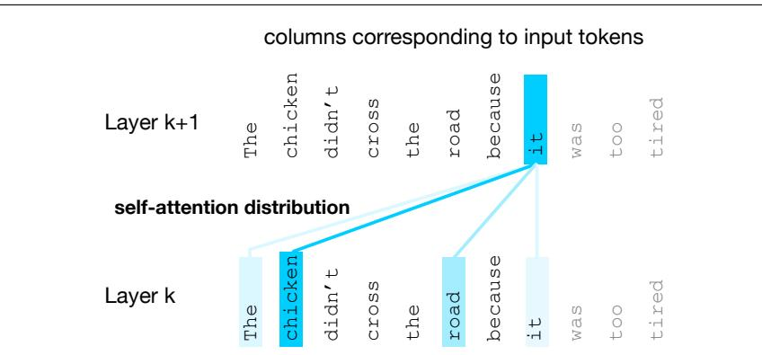  
Figure 7.3 The self-attention weight distribution α that is part of the computation of the representation for the word it at layer k + 1. In computing the representation for it, we attend differently to the various words at layer k, with darker shades indicating higher self-attention values. Note that the transformer is attending highly to the columns corresponding to the tokens chicken and road, a sensible result, since at the point where it occurs, it could plausibly corefer with the chicken or the road, and hence we’d like the representation for it to draw on the representation for these earlier words. Figure adapted from Uszkoreit (2017).

Fig. 7.3 shows a schematic example simplified from a transformer (Uszkoreit, 2017). The figure describes the situation when the current token is it and we need to compute a contextual representation for this token at layer k+1 of the transformer, drawing on the representations (from layer k) of every prior token. The figure uses color to represent the attention distribution over the contextual words: the tokens chicken and road both have a high attention weight, meaning that as we are computing the representation for it, we will draw most heavily on the representation for chicken and road. This will be useful in building the final representation for it, since it will end up coreferring with either chicken or road.

Let’s now turn to how this attention distribution is represented and computed.

## 7.1.1 Attention more formally

As we’ve said, the attention computation is a way to compute a vector representation for a token at a particular layer of a transformer, by selectively attending to and integrating information from prior tokens at the previous layer. Attention takes an input representation $\pmb { x } _ { i }$ corresponding to the input token at position $i ,$ and a context window of prior inputs $\mathbf { x } _ { 1 } . . \mathbf { x } _ { i - 1 }$ , and produces an output $\mathbf { a } _ { i } .$

In causal, left-to-right language models, the context is any of the prior words. That is, when processing $\mathbf { x } _ { i } .$ , the model has access to $\pmb { x } _ { i }$ as well as the representations of all the prior tokens in the context window (context windows consist of thousands of tokens) but no tokens after i. (By contrast, in Chapter 9 we’ll generalize attention so it can also look ahead to future words.)

Fig. 7.4 illustrates this flow of information in an entire causal self-attention layer, in which this same attention computation happens in parallel at each token position i. Thus a self-attention layer maps input sequences $\left( \mathbf { x } _ { 1 } , . . . , \mathbf { x } _ { n } \right)$ to output sequences of the same length $\left( \mathbf { a } _ { 1 } , . . . , \mathbf { a } _ { n } \right)$

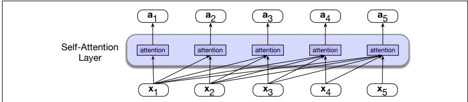  
Figure 7.4 Information flow in causal self-attention. When processing each input $\mathbf { x } _ { i } ,$ the model attends to all the inputs up to, and including $\mathbf { x } _ { i } .$

Simplified version of attention At its heart, attention is really just a weighted sum of context vectors, with a lot of complications added to how the weights are computed and what gets summed. For pedagogical purposes let’s first describe a simplified intuition of attention, in which the attention output $\mathbf { a } _ { i }$ at token position i is simply the weighted sum of all the representations $\mathbf { x } _ { j } ,$ , for all $j \leq i ;$ we’ll use $\alpha _ { i j }$ to mean how much $\mathbf { \boldsymbol { x } } _ { j }$ should contribute to $\mathbf { a } _ { i }$ :

$$
\text { Simplified   version: } \quad \mathbf {a} _ {i} = \sum_ {j \leq i} \alpha_ {i j} \mathbf {x} _ {j}\tag{7.6}
$$

Each $\alpha _ { i j }$ is a scalar used for weighing the value of input $\mathbf { \boldsymbol { x } } _ { j }$ when summing up the inputs to compute $\mathbf { a } _ { i }$ . How shall we compute this α weighting? In attention we weight each prior embedding proportionally to how similar it is to the current token i. So the output of attention is a sum of the embeddings of prior tokens weighted by their similarity with the current token embedding. We compute similarity scores via dot product, which maps two vectors into a scalar value ranging from ∞ to $\infty .$ The larger the score, the more similar the vectors that are being compared. We’ll normalize these scores with a softmax to create the vector of weights $\alpha _ { i j } , j \leq i .$

$$
\text { Simplified   Version: } \quad \operatorname{score} (\mathbf {x} _ {i}, \mathbf {x} _ {j}) = \mathbf {x} _ {i} \cdot \mathbf {x} _ {j}\tag{7.7}
$$

$$
\alpha_ {i j} = \operatorname{softmax} (\operatorname{score} (\mathbf {x} _ {i}, \mathbf {x} _ {j})) \forall j \leq i\tag{7.8}
$$

Thus in Fig. 7.4 we compute $\mathbf { a } _ { 3 }$ by computing three scores: $\mathbf { x } _ { 3 } \cdot \mathbf { x } _ { 1 } , \mathbf { x } _ { 3 } \cdot \mathbf { x } _ { 2 }$ and $\mathbf { x } _ { 3 } \cdot \mathbf { x } _ { 3 }$ normalizing them by a softmax, and using the resulting probabilities as weights indicating each of their proportional relevance to the current position 3. Of course, the softmax weight will likely be highest for $\mathbf { x } _ { i } ,$ since $\pmb { x } _ { i }$ is very similar to itself, resulting in a high dot product. But other context words may also be similar to i, and the softmax will also assign some weight to those words. Then we use these weights as the α values in Eq. 7.6 to compute the weighted sum that is our a3.

The simplified attention in equations $7 . 6 - 7 . 8 $ demonstrates the attention-based approach to computing ai: compare the $\pmb { x } _ { i }$ to prior vectors, normalize those scores into a probability distribution used to weight the sum of the prior vectors. But now we’re ready to remove the simplifications.

A single attention head using query, key, and value matrices Now that we’ve seen a simple intuition of attention, let’s introduce the actual attention head, the version of attention that’s used in transformers. (The word head is often used in transformers to refer to specific structured layers). The attention head allows us to distinctly represent three different roles that each input embedding plays during the course of the attention process:

• As the current element being compared to the preceding inputs. We’ll refer to this role as a query.

• In its role as a preceding input that is being compared to the current element to determine a similarity weight. We’ll refer to this role as a key.

• And finally, as a value of a preceding element that gets weighted and summed up to compute the output for the current element.

To capture these three different roles, transformers introduce weight matrices WQ, $\boldsymbol { \mathsf { W } } ^ { \mathsf { K } }$ , and $\boldsymbol { \mathsf { W } } ^ { \boldsymbol { \mathsf { v } } }$ . These weights will project each input vector $\pmb { x } _ { i }$ into a representation of its role as a query, key, or value:

$$
\mathbf {q} _ {i} = \mathbf {x} _ {i} \mathbf {W} ^ {\mathsf {Q}}; \quad \mathbf {k} _ {i} = \mathbf {x} _ {i} \mathbf {W} ^ {\mathsf {K}}; \quad \mathbf {v} _ {i} = \mathbf {x} _ {i} \mathbf {W} ^ {\mathsf {V}}\tag{7.9}
$$

Given these projections, when we are computing the similarity of the current element $\pmb { x } _ { i }$ with some prior element $\mathbf { x } _ { j } .$ , we’ll use the dot product between the current element’s query vector $\mathbf { q } _ { i }$ and the preceding element’s key vector $\mathsf { k } _ { j }$ . Furthermore, the result of a dot product can be an arbitrarily large (positive or negative) value, and exponentiating large values can lead to numerical issues and loss of gradients during training. To avoid this, we scale the dot product by a factor related to the size of the embeddings, via dividing by the square root of the dimensionality of the query and key vectors $( d _ { k } )$ . We thus replace the simplified Eq. 7.7 with Eq. 7.11. The ensuing softmax calculation resulting in $\alpha _ { i j }$ remains the same, but the output calculation for head is now based on a weighted sum over the value vectors v (Eq. 7.13).

Here’s a final set of equations for computing self-attention for a single selfattention output vector $\mathbf { a } _ { i }$ from a single input vector $\mathbf { x } _ { i }$ . This version of attention computes $\mathbf { a } _ { i }$ by summing the values of the prior elements, each weighted by the similarity of its key to the query from the current element:

$$
\mathbf {q} _ {i} = \mathbf {x} _ {i} \mathbf {W} ^ {\mathrm{Q}}; \quad \mathbf {k} _ {j} = \mathbf {x} _ {j} \mathbf {W} ^ {\mathrm{K}}; \quad \mathbf {v} _ {j} = \mathbf {x} _ {j} \mathbf {W} ^ {\mathrm{V}}\tag{7.10}
$$

$$
\operatorname{score} \left(\mathbf {x} _ {i}, \mathbf {x} _ {j}\right) = \frac {\mathbf {q} _ {i} \cdot \mathbf {k} _ {j}}{\sqrt {d _ {k}}}\tag{7.11}
$$

$$
\alpha_ {i j} = \text { softmax } (\text { score } (\mathbf {x} _ {i}, \mathbf {x} _ {j})) \forall j \leq i\tag{7.12}
$$

$$
\mathbf {h e a d} _ {i} = \sum_ {j \leq i} \alpha_ {i j} \mathbf {v} _ {j}\tag{7.13}
$$

$$
\mathbf {a} _ {i} = \mathbf {h e a d} _ {i} \mathbf {W} ^ {0}\tag{7.14}
$$

We illustrate this in Fig. 7.5 for the case of calculating the value of the third output a3 in a sequence.

Note that we’ve also introduced one more matrix, $\boldsymbol { \mathsf { W } } ^ { 0 }$ , which is left-multiplied by the attention head. This is necessary to reshape the output of the head. The input to attention $\bf { x } _ { i }$ and the output from attention $\mathbf { a } _ { \mathbf { i } }$ both have the same dimensionality $[ 1 \times d ]$ . We often call $d$ the model dimensionality, and indeed as we’ll discuss in

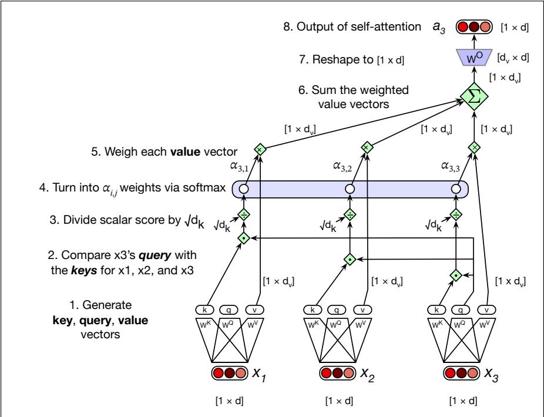  
Figure 7.5 Calculating the value of ${ \bf a } _ { 3 } ,$ the third element of a sequence using causal (leftto-right) self-attention.

Section 7.2 the output $\mathbf { h } _ { \mathbf { i } }$ of each transformer block, as well as the intermediate vectors inside the transformer block also have the same dimensionality $[ 1 \times d ]$ . Having everything be the same dimensionality makes the transformer very modular.

So let’s talk shapes. How do we get from $[ 1 \times d ]$ at the input to $[ 1 \times d ]$ at the output? Let’s look at all the internal shapes. We’ll have a dimension $d _ { k }$ for the query and key vectors. The query vector and the key vector are both dimensionality $[ 1 \times d _ { k } ]$ , so we can take their dot product ${ \pmb q } _ { i } \cdot { \pmb k } _ { j }$ to produce a scalar. We’ll have a separate dimension $d _ { \nu }$ for the value vectors. The transform matrix $\boldsymbol { \mathsf { W } } ^ { \mathbf { Q } }$ has shape $[ d \times d _ { k } ]$ $\boldsymbol { \mathsf { W } } ^ { \mathsf { K } }$ is $[ d \times d _ { k } ]$ , and $\boldsymbol { \mathsf { W } } ^ { \boldsymbol { \mathsf { v } } }$ is $[ d \times d _ { \nu } ]$ . So the output of headi in equation Eq. 7.13 is of shape $[ 1 \times d _ { \nu } ]$ . To get the desired output shape $[ 1 \times d ]$ we’ll need to reshape the head output, and so $\bar { \mathsf { w } ^ { 0 } }$ is of shape $[ d _ { \nu } \times d ]$ . In the original transformer work (Vaswani et al., 2017), d was 512, $d _ { k }$ and $d _ { \nu }$ were both 64.

Multi-head Attention Equations 7.11-7.13 describe a single attention head. But actually, transformers use multiple attention heads. The intuition is that each head might be attending to the context for different purposes: heads might be specialized to represent different linguistic relationships between context elements and the current token, or to look for particular kinds of patterns in the context.

So in multi-head attention we have A separate attention heads that reside in parallel layers at the same depth in a model, each with its own set of parameters that allows the head to model different aspects of the relationships among inputs. Thus each head i in a self-attention layer has its own set of query, key, and value matrices: $\boldsymbol { \mathsf { W } } ^ { \mathrm { Q i } }$ $\boldsymbol { \mathsf { W } } ^ { \kappa \mathrm { i } }$ , and ${ \boldsymbol { \mathsf { W } } } ^ { \mathsf { V i } }$ . These are used to project the inputs into separate query, key, and value embeddings for each head.

When using multiple heads the model dimension $d$ is still used for the input and output, the query and key embeddings have dimensionality $d _ { k } .$ , and the value embeddings are of dimensionality $d _ { \nu }$ (again, in the original transformer paper $d _ { k } =$ $d _ { \nu } = 6 4 , A = 8$ , and $d = 5 1 2 )$ . Thus for each head i, we have weight layers $\boldsymbol { \mathsf { W } } ^ { \mathrm { Q i } }$ of shape $[ d \times d _ { k } ] , \boldsymbol { \mathsf { W } } ^ { \kappa }$ of shape $[ d \times d _ { k } ]$ , and ${ \boldsymbol { \mathsf { W } } } ^ { \mathsf { V i } }$ of shape $[ d \times d _ { \nu } ]$

Below are the equations for attention augmented with multiple heads; Fig. 7.6 shows an intuition.

$$
\mathbf {q} _ {i} ^ {c} = \mathbf {x} _ {i} \mathbf {W} ^ {\mathbf {Q c}}; \quad \mathbf {k} _ {j} ^ {c} = \mathbf {x} _ {j} \mathbf {W} ^ {\mathbf {K c}}; \quad \mathbf {v} _ {j} ^ {c} = \mathbf {x} _ {j} \mathbf {W} ^ {\mathbf {V c}}; \quad \forall c 1 \leq c \leq A\tag{7.15}
$$

$$
\operatorname{score} ^ {c} \left(\mathbf {x} _ {i}, \mathbf {x} _ {j}\right) = \frac {\mathbf {q} _ {i} ^ {c} \cdot \mathbf {k} _ {j} ^ {c}}{\sqrt {d _ {k}}}\tag{7.16}
$$

$$
\alpha_ {i j} ^ {c} = \text { softmax } (\text { score } ^ {c} (\mathbf {x} _ {i}, \mathbf {x} _ {j})) \forall j \leq i\tag{7.17}
$$

$$
\mathbf {h e a d} _ {i} ^ {c} = \sum_ {j \leq i} \alpha_ {i j} ^ {c} \mathbf {v} _ {j} ^ {c}\tag{7.18}
$$

$$
\mathbf {a} _ {i} = \left(\mathbf {h e a d} ^ {1} \oplus \mathbf {h e a d} ^ {2} \dots \oplus \mathbf {h e a d} ^ {A}\right) \mathbf {W} ^ {O}\tag{7.19}
$$

$$
\text { MultiHeadAttention } (\mathbf {x} _ {i}, [ \mathbf {x} _ {1}, \dots , \mathbf {x} _ {i - 1} ]) = \mathbf {a} _ {i}\tag{7.20}
$$

Note in Eq. 7.20 that MultiHeadAttention is a function of the current input xi, as well as all the other inputs. For the causal or left-to-right attention that we use in this chapter, the other inputs are only to the left, but we’ll also see a version of attention in Chapter 9 where attention is a function of the tokens to the right as well. We’ll return to this idea about causal inputs in Eq. 7.35 when we introduce the idea of masking the right context.

The output of each of the A heads is of shape $[ 1 \times d _ { \nu } ]$ , and so the output of the multi-head layer with A heads consists of A vectors of shape $[ 1 \times d _ { \nu } ]$ These are concatenated to produce a single output with dimensionality $[ 1 \times A d _ { \nu } ]$ Then we use yet another linear projection $\mathsf { W } ^ { \mathbf { O } } \in \mathbb { R } ^ { A d _ { \nu } \times d }$ to reshape it, resulting in the multihead attention vector $\mathbf { a } _ { i }$ with the correct output shape $[ 1 \times d ]$ at each input i. The dimensionality $d _ { \nu }$ of the heads is set so that $d _ { \nu } = d / A$ , which means that multihead attention costs about the same in parameters as having a single head.

## 7.2 Transformer Blocks

The self-attention calculation lies at the core of what’s called a transformer block, which, in addition to the self-attention layer, includes three other kinds of layers: (1) a feedforward layer, (2) residual connections, and (3) normalizing layers (colloquially called “layer norm”).

Fig. 7.7 illustrates a transformer block, sketching a common way of thinking about the block that is called the residual stream (Elhage et al., 2021). In the residual stream viewpoint, we consider the processing of an individual token i through the transformer block as a single stream of d-dimensional representations for token position i. This residual stream starts with the original input vector, and the various components read their input from the residual stream and add their output back into the stream.

The input at the bottom of the stream is an embedding for a token, which has dimensionality $d .$ This initial embedding gets passed up (by residual connections), and is progressively added to by the other components of the transformer: the attention layer that we have seen, and the feedforward layer that we will introduce. Before the attention and feedforward layer is a computation called the layer norm.

Thus the initial vector is passed through a layer norm and attention layer, and the result is added back into the stream, in this case to the original input vector $\mathbf { x } _ { i } .$ And then this summed vector is again passed through another layer norm and a feedforward layer, and the output of those is added back into the residual, and we’ll use $\mathbf { h } _ { i }$ to refer to the resulting output of the transformer block for token i.

  
Figure 7.6 The multi-head attention computation for input $\mathbf { x } _ { i } ,$ producing output $\mathbf { a } _ { i } .$ A multi-head attention layer has A heads, each with its own query, key, and value weight matrices. In this figure, we show $A = 4 ,$ , a smaller value than is usually used, just to fit on the page. The outputs from each of the heads are of shape $[ 1 \times d _ { \nu } ]$ and are concatenated and then projected into a different space by the ${ \boldsymbol { \mathsf { W } } } _ { 0 }$ matrix. Usually the dimensionality $d _ { \nu }$ of the heads is set so that $d _ { \nu } = d / A$ , with the result that $\boldsymbol { \mathsf { W } } _ { 0 }$ is a square matrix of shape $[ A d _ { \nu } \times d ] = [ d \times d ]$ The result is projected to $d ,$ producing an output of the same size as the input.

  
Figure 7.7 The architecture of a transformer block showing the residual stream, showing how most information flows up through the residual stream, and only the attention module is sensitive to information from other streams at prior token positions. In this figure and throughout the chapter, we use the prenorm version of the architecture, in which the layer norms happen before the attention and feedforward layers rather than after.

We’ve already seen the attention layer, so let’s now introduce the feedforward and layer norm computations in the context of processing a single input $\pmb { x } _ { i }$ at token position i.

## 7.2.1 Feedforward layer

The feedforward layer is a fully-connected 2-layer network, i.e., one hidden layer, two weight matrices (Chapter 6).

The feedforward layer is position-wise, meaning that it operates on each token position i independently. This makes a contrast with the attention network, whose job is to mix information from different token positions. The feedforward weights are shared across positions, meaning that the same parameters are applied to every token position, but are different from layer to layer.

It is common to make the dimensionality $d _ { \mathrm { f f } }$ of the hidden layer of the feedforward network be 4 times larger than the model dimensionality $d .$ (For example in the original transformer model, $d = 5 1 2$ and $d _ { \mathrm { f f } } = 2 0 4 8 . )$ ) This means the feedforward networks have most of the parameters of the transformers, and these feedforward network parameters seem to encode most of the factual knowledge in the transformer. (Geva et al., 2021; Meng et al., 2022).

Most LLMs now actually use gated feedforward layers, by employing an activation function called SwiGLU (Shazeer, 2020) that works better than simpler functions like ReLU. SwiGLU is in the family of Gated Linear Unit (GLU) functions (Dauphin et al., 2017), which do a component-wise product ( ) of two linear transformations of the input. The idea is that one of the functions is a value, and the other is a gate that specifies how much of that value goes through. SwiGLU uses the Swish function (Ramachandran et al., 2017) as the gate:

$$
\operatorname{Swish} _ {\beta} (\mathbf {x}) = \mathbf {x} \sigma (\beta \mathbf {x})\tag{7.21}
$$

The SwiGLU feedforward equation is then:

$$
\operatorname{FFN} _ {\text {SwiGLU}} \left(\mathbf {x}, \mathbf {W} _ {1}, \mathbf {W} _ {2}, \mathbf {W} _ {3}, b _ {1}, b _ {2}, b _ {3}, \beta\right) = \left(\operatorname{Swish} _ {\beta} \left(\mathbf {x} \mathbf {W} _ {1} + b _ {1}\right) \otimes \left(\mathbf {x} \mathbf {W} _ {2} + b _ {2}\right)\right) \mathbf {W} _ {3} + b _ {3}\tag{7.22}
$$

Because gated activation functions have extra parameters for the gating, the dimensionality $d _ { \mathrm { f f } }$ of gated models is usually set to be slightly less than the normal 4d.

## 7.2.2 Layer Norm

At two stages in the transformer block we normalize the vector (Ba et al., 2016). This process, called layer norm (short for layer normalization), is one of many forms of normalization that can be used to improve training performance in deep neural networks by keeping the values of a hidden layer in a range that facilitates gradient-based training.

Layer norm is a variation of the z-score from statistics, applied to a single vector in a hidden layer. That is, the term layer norm is a bit confusing; layer norm is not applied to an entire transformer layer, but just to the embedding vector of a single token. Thus the input to layer norm is a single vector of dimensionality d and the output is that vector normalized, again of dimensionality $d .$ The first step in layer normalization is to calculate the mean, $\mu ,$ and standard deviation, σ, over the elements of the vector to be normalized. Given an embedding vector x of dimensionality $d ,$ these values are calculated as follows.

$$
\mu = \frac {1}{d} \sum_ {j = 1} ^ {d} x [ j ]\tag{7.23}
$$

$$
\sigma = \sqrt {\frac {1}{d} \sum_ {j = 1} ^ {d} (x [ j ] - \mu) ^ {2}}\tag{7.24}
$$

Given these values, the vector components are normalized by subtracting the mean from each and dividing by the standard deviation. The result of this computation is a new vector with zero mean and a standard deviation of one.

$$
\hat {\mathbf {x}} = \frac {(\mathbf {x} - \boldsymbol {\mu})}{\sigma}\tag{7.25}
$$

Finally, in the standard implementation of layer normalization, two learnable parameters, $\gamma$ and $\beta ,$ , representing gain and offset values, are introduced.

$$
\operatorname{LayerNorm} (\mathbf {x}) = \gamma \frac {(\mathbf {x} - \mu)}{\sigma} + \beta\tag{7.26}
$$

In practice, many modern networks use a simpler norm, called RMSNorm (Zhang and Sennrich, 2019), which rescales the vectors by dividing by the root-mean-square statistic, but skips the mean-centering step.

## 7.2.3 Putting it all together

The function computed by a transformer block can be expressed by breaking it down with one equation for each component computation, using t (of shape $[ 1 \times d ] )$ to stand for transformer and superscripts to demarcate each computation inside the block:

$$
\mathbf {t} _ {i} ^ {\mathbf {1}} = \operatorname{LayerNorm} (\mathbf {x} _ {i})\tag{7.27}
$$

$$
\mathbf {t} _ {i} ^ {2} = \text { MultiHeadAttention } (\mathbf {t} _ {i} ^ {1}, [ \mathbf {t} _ {1} ^ {1}, \dots , \mathbf {t} _ {i - 1} ^ {1} ])\tag{7.28}
$$

$$
\mathbf {t} _ {i} ^ {3} = \mathbf {t} _ {i} ^ {2} + \mathbf {x} _ {i}\tag{7.29}
$$

$$
\mathbf {t} _ {i} ^ {4} = \text { LayerNorm } (\mathbf {t} _ {i} ^ {3})\tag{7.30}
$$

$$
\mathbf {t} _ {i} ^ {\mathbf {5}} = \mathrm{FFN} (\mathbf {t} _ {i} ^ {\mathbf {4}})\tag{7.31}
$$

$$
\mathbf {h} _ {i} = \mathbf {t} _ {i} ^ {5} + \mathbf {t} _ {i} ^ {3}\tag{7.32}
$$

Notice that the only component that takes as input information from other tokens (other residual streams) is multi-head attention, which (as we see from Eq. 7.28) looks at all the neighboring tokens in the context. The output from attention, however, is then added into this token’s embedding stream. In fact, Elhage et al. (2021) show that we can view attention heads as literally moving information from the residual stream of a neighboring token into the current stream. The high-dimensional embedding space at each position thus contains information about the current token and about neighboring tokens, albeit in different subspaces of the vector space. Fig. 7.8 shows a visualization of this movement. We therefore call the attention function the token-mixing component of the architecture, because it mixes information from neighboring token streams into the current stream.

Crucially, the input and output dimensions of transformer blocks are matched so they can be stacked. Each token vector $\pmb { x } _ { i }$ at the input to the block has dimensionality d, and the output $\mathbf { h } _ { i }$ also has dimensionality d. Transformers for large language models stack many of these blocks, from 12 layers (used for the T5 or GPT-3-small language models) to 96 layers (used for GPT-3 175B), to even more for more recent models. We’ll come back to this issue of stacking in a bit.

  
Figure 7.8 An attention head can move information from token A’s residual stream into token B’s residual stream.

Equation 7.27 and following are just the equation for a single transformer block, but the residual stream metaphor goes through all the transformer layers, from the first transformer blocks to the 12th, in a 12-layer transformer. At the earlier transformer blocks, the residual stream is representing the current token. At the highest transformer blocks, the residual stream is usually representing the following token, since at the very end it’s being trained to predict the next token.

Once we stack many blocks, there is one more requirement: at the very end of the last (highest) transformer block, there is a single extra layer norm that is run on the last hi of each token stream (just below the language model head layer that we will define soon). 2

## 7.3 Parallelizing computation using a single matrix X

This description of multi-head attention and the rest of the transformer block has been from the perspective of computing a single output at a single time step i in a single residual stream. But as we pointed out earlier, the attention computation performed for each token to compute ai is independent of the computation for each other token, and that’s also true for all the computation in the transformer block computing $\mathbf { h } _ { i }$ from the input xi. That means we can easily parallelize the entire computation, taking advantage of efficient matrix multiplication routines.

We do this by packing the input embeddings for the N tokens of the input sequence into a single matrix X of size $[ N \times d ]$ . Each row of X is the embedding of one token of the input. Transformers for large language models can have an input length N of hundreds of thousands of tokens, and millions of tokens can be achieved with long-context mechanisms that we don’t discuss here. So for vanilla transformers, we can think of X having hundreds of thousands of rows, each of the dimensionality of the embedding d (the model dimension).

Parallelizing attention Let’s first see this for a single attention head and then turn to multiple heads, and then add in the rest of the components in the transformer block. For one head we multiply X by the query, key, and value matrices $\boldsymbol { \mathsf { W } } ^ { \mathbf { Q } }$ of shape $[ d \times d _ { k } ] , \boldsymbol { \mathsf { w } } ^ { \kappa }$ of shape $[ d \times d _ { k } ]$ , and $\boldsymbol { \mathsf { w } } ^ { \flat }$ of shape $[ d \times d _ { \nu } ]$ , to produce matrices Q of shape $[ N \times d _ { k } ]$ , K of shape $[ N \times d _ { k } ]$ , and V of shape $[ N \times d _ { \nu } ]$ , containing all the key, query, and value vectors:

$$
\mathbf {Q} = \mathbf {X W} ^ {\mathrm{Q}}; \mathbf {K} = \mathbf {X W} ^ {\mathrm{K}}; \mathbf {V} = \mathbf {X W} ^ {\mathrm{V}}\tag{7.33}
$$

Given these matrices we can compute all the requisite query-key comparisons simultaneously by multiplying Q and $\mathsf { K } ^ { \top }$ in a single matrix multiplication. The product is of shape $N \times N$ , visualized in Fig. 7.9.

<table><tr><td rowspan="4">N</td><td>q1·k1</td><td>q1·k2</td><td>q1·k3</td><td>q1·k4</td></tr><tr><td>q2·k1</td><td>q2·k2</td><td>q2·k3</td><td>q2·k4</td></tr><tr><td>q3·k1</td><td>q3·k2</td><td>q3·k3</td><td>q3·k4</td></tr><tr><td>q4·k1</td><td>q4·k2</td><td>q4·k3</td><td>q4·k4</td></tr></table>

Figure 7.9 The $N \times N$ QK⊺ matrix showing how it computes all $q _ { i } \cdot k _ { j }$ comparisons in a single matrix multiple.

Once we have this QK⊺ matrix, we can very efficiently scale these scores, take the softmax, and then multiply the result by V resulting in a matrix of shape $N \times d \colon$ a vector embedding representation for each token in the input. We’ve reduced the entire self-attention step for an entire sequence of N tokens for one head to the following computation:

$$
\mathbf {h e a d} = \text { softmax } \left(\operatorname{mask} \left(\frac {\mathbf {Q K} ^ {\intercal}}{\sqrt {d _ {k}}}\right)\right) \mathbf {V}\tag{7.34}
$$

$$
\mathbf {A} = \text {   head   } \mathbf {W} ^ {0}\tag{7.35}
$$

Masking out the future You may have noticed that we introduced a mask function in Eq. 7.34 above. This is because the self-attention computation as we’ve described it has a problem: the calculation of $\mathbf { Q } \mathbf { K } ^ { \intercal }$ results in a score for each query value to every key value, including those that follow the query. This is inappropriate in the setting of language modeling: guessing the next word is pretty simple if you already know it! To fix this, the elements in the upper-triangular portion of the matrix are set to ∞, which the softmax will turn to zero, thus eliminating any knowledge of words that follow in the sequence. This is done in practice by adding a mask matrix M in which $M _ { i j } = - \infty \forall j > i ( \mathrm { i . e }$ . for the upper-triangular portion) and $M _ { i j } = 0$ otherwise. Fig. 7.10 shows the resulting masked $\mathbf { Q } \mathbf { K } ^ { \intercal }$ matrix. As we’ll see in Section 7.7, the use of the mask is what lets every position in the window serve as a training example, making the transformer very efficient to train. And we’ll see in Chapter 9 how to adjust the mask to make use of words in the future for tasks that need it.

Fig. 7.11 shows a schematic of all the computations for a single attention head parallelized in matrix form.

Fig. 7.9 and Fig. 7.10 also make it clear that attention is quadratic in the length of the input, since at each layer we need to compute dot products between each pair of tokens in the input. This makes it expensive to compute attention over very long documents (like entire novels). Nonetheless modern large language models manage to use quite long contexts of thousands or tens of thousands of tokens.

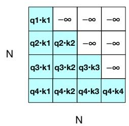  
Figure 7.10 The $N \times N$ QK⊺ matrix showing the $q _ { i } \cdot k _ { j }$ values, with the upper-triangle portion of the comparisons matrix zeroed out (set $\mathrm { t o } \mathrm { - } \infty ,$ which the softmax will turn to zero).

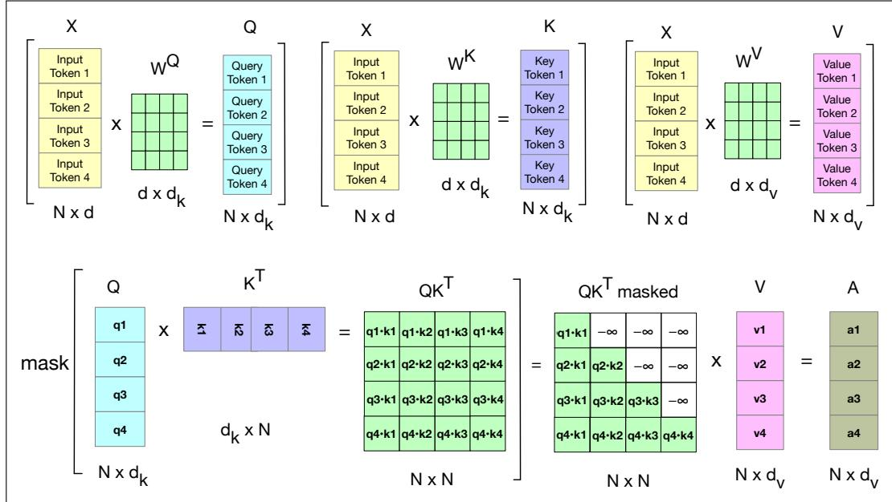  
Figure 7.11 Schematic of the attention computation for a single attention head in parallel. The first row shows the computation of the Q, K, and V matrices. The second row shows the computation of $\mathsf { Q } \mathsf { K } ^ { \mathsf { T } }$ , the masking (the softmax computation and the normalizing by dimensionality are not shown) and then the weighted sum of the value vectors to get the final attention vectors

Parallelizing multi-head attention In multi-head attention, as with self-attention, the input and output have the model dimension $d ,$ the key and query embeddings have dimensionality $d _ { k } ,$ and the value embeddings are of dimensionality $d _ { \nu }$ (again, in the original transformer paper $d _ { k } = d _ { \nu } = 6 4 , A = 8 .$ and $d = 5 1 2 )$ Thus for each head $^ { c , }$ we have weight layers $\boldsymbol { \mathsf { W } } ^ { \mathsf { Q } } _ { c }$ c of shape $[ d \times d _ { k } ] , \boldsymbol { \mathsf { W } } ^ { \mathsf { K } } _ { c }$ of shape $[ d \times d _ { k } ] ,$ and $\boldsymbol { \mathsf { W } } _ { ~ c } ^ { \mathsf { v } }$ of shape $[ d \times d _ { \nu } ]$ , and these get multiplied by the inputs packed into X to produce Q of shape $[ N \times d _ { k } ]$ , K of shape $[ N \times d _ { k } ]$ , and V of shape $[ N \times d _ { \nu } ]$ . The output of each of the A heads is of shape $[ N \times d _ { \nu } ]$ , and so the output of the multihead layer with A heads consists of A matrices of shape $[ N \times d _ { \nu } ]$ To make use of these matrices in further processing, they are concatenated to produce a single output with dimensionality $[ N \times A d _ { \nu } ]$ . Finally, we use a final linear projection $\bar { \mathsf { w } } ^ { 0 }$ of shape $[ A d _ { \nu } \times d ]$ , that reshapes it to the original output dimension for each token.

Multiplying the concatenated $[ N \times A d _ { \nu } ]$ matrix output by $\boldsymbol { \mathsf { W } } ^ { 0 }$ of shape $[ A d _ { \nu } \times d ]$ yields the self-attention output A of shape $[ N \times d ]$

$$
\mathbf {Q} ^ {\mathrm{i}} = \mathbf {X W} ^ {\mathrm{Qi}}; \quad \mathbf {K} ^ {\mathrm{i}} = \mathbf {X W} ^ {\mathrm{Ki}}; \quad \mathbf {V} ^ {\mathrm{i}} = \mathbf {X W} ^ {\mathrm{Vi}}\tag{7.36}
$$

$$
\mathbf {h e a d} _ {i} = \text { SelfAttention } (\mathbf {Q} ^ {\mathrm{i}}, \mathbf {K} ^ {\mathrm{i}}, \mathbf {V} ^ {\mathrm{i}}) = \text { softmax } \left(\text { mask } \left(\frac {\mathbf {Q} ^ {\mathrm{i}} \mathbf {K} ^ {\mathrm{iT}}}{\sqrt {d _ {k}}}\right)\right) \mathbf {V} ^ {\mathrm{i}}\tag{7.37}
$$

$$
\text { MultiHeadAttention } (\mathbf {X}) = \left(\mathbf {h e a d} _ {1} \oplus \mathbf {h e a d} _ {2} \dots \oplus \mathbf {h e a d} _ {A}\right) \mathbf {W} ^ {\mathbf {0}} \tag {7.38}
$$

Putting it all together with the parallel input matrix X The function computed in parallel by an entire layer of N transformer blocks—each block over one of the N input tokens—can be expressed as:

$$
\mathbf {O} = \mathbf {X} + \text { MultiHeadAttention } (\text { LayerNorm } (\mathbf {X}))\tag{7.39}
$$

$$
\mathbf {H} = \mathbf {O} + \operatorname{FFN} (\text { LayerNorm } (\mathbf {O}))\tag{7.40}
$$

Note that in Eq. 7.39 we are using X to mean the input to the layer, wherever it comes from. For the first layer, as we will see in the next section, that input is the initial word + positional embedding vectors that we have been describing by X. But for subsequent layers $k ,$ the input is the output from the previous layer $\mathsf { \mathbf { H } } ^ { \bar { k } - 1 }$ . We can also break down the computation performed in a transformer layer, showing one equation for each component computation. We’ll use T (of shape $[ N \times d ] )$ to stand for transformer and superscripts to demarcate each computation inside the block, and again use X to mean the input to the block from the previous layer or the initial embedding:

$$
\mathbf {T} ^ {1} = \text { LayerNorm } (\mathbf {X})\tag{7.41}
$$

$$
\mathbf {T} ^ {2} = \text { MultiHeadAttention } (\mathbf {T} ^ {1})\tag{7.42}
$$

$$
\mathbf {T} ^ {3} = \mathbf {T} ^ {2} + \mathbf {X}\tag{7.43}
$$

$$
\mathbf {T} ^ {4} = \operatorname{LayerNorm} (\mathbf {T} ^ {3})\tag{7.44}
$$

$$
\mathbf {T} ^ {5} = \operatorname{FFN} (\mathbf {T} ^ {4})\tag{7.45}
$$

$$
\mathbf {H} = \mathbf {T} ^ {5} + \mathbf {T} ^ {3}\tag{7.46}
$$

Here when we use a notation like $\mathrm { F F N } ( \boldsymbol { \mathsf { T } } ^ { 3 } )$ we mean that the same FFN is applied in parallel to each of the N embedding vectors in the window. Similarly, each of the N tokens is normed in parallel in the LayerNorm. Crucially, the input and output dimensions of transformer blocks are matched so they can be stacked. Since each token $x _ { i }$ at the input to the block is represented by an embedding of dimensionality $[ 1 \times d ]$ , that means the input X and output H are both of shape $[ N \times d ]$

## 7.4 The input: embeddings for token and position

embedding

Let’s talk about where the input X comes from. Given a sequence of N tokens (N is the context length in tokens), the matrix X of shape $[ N \times d ]$ has an embedding for each word in the context. The transformer does this by separately computing two embeddings: an input token embedding, and an input positional embedding.

A token embedding, introduced in Chapter 6, is a vector of dimension d that will be our initial representation for the input token. (As we pass vectors up through the transformer layers in the residual stream, this embedding representation will change and grow, incorporating context and playing a different role depending on the kind of language model we are building.) The set of initial embeddings are stored in the embedding matrix E, which has a row for each of the V tokens in the vocabulary. (Reminder that V here means the vocabulary of tokens, this V is not related to the value vector.) Thus each word is a row vector of d dimensions, and E has shape $[ | V | \times d ]$

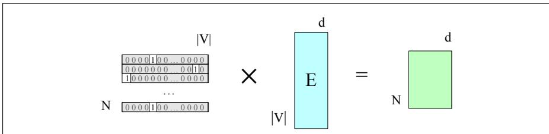  
Figure 7.13 Selecting the embedding matrix for the input sequence of token ids W by multiplying a one-hot matrix corresponding to W by the embedding matrix E.

Given an input token string like Thanks for all the we first convert the tokens into vocabulary indices (these were created when we first tokenized the input using BPE or SentencePiece). So the representation of thanks for all the might be $\boldsymbol { \mathsf { w } } =$ [5,4000,10532,2224]. Next we use indexing to select the corresponding rows from E, (row 5, row 4000, row 10532, row 2224).

Another way to think about selecting token embeddings from the embedding matrix is to represent tokens as one-hot vectors of shape $[ 1 \times | V | ]$ , i.e., with one dimension for each word in the vocabulary. Recall that in a one-hot vector all the elements are 0 except one, the element whose dimension is the word’s index in the vocabulary, which has value 1. So if the word “thanks” has index 5 in the vocabulary, $x _ { 5 } = 1$ , and $x _ { i } = 0 ~ \forall i \neq 5 .$ , as shown here:

$$
\begin{array}{c c c c c c c c c c} \text {[ 0 0 0 0 1 0 0 \ldots 0 0 0 0 ]} \\ 1   2   3   4   5   6   7   \ldots   \ldots   | V | \end{array}
$$

Multiplying by a one-hot vector that has only one non-zero element xi = 1 simply selects out the relevant row vector for word i, resulting in the embedding for word i, as depicted in Fig. 7.12.

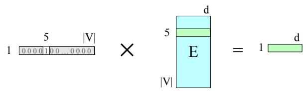  
Figure 7.12 Selecting the embedding vector for word $V _ { 5 }$ by multiplying the embedding matrix E with a one-hot vector with a 1 in index 5.

We can extend this idea to represent the entire token sequence as a matrix of onehot vectors, one for each of the N positions in the transformer’s context window, as shown in Fig. 7.13.

These token embeddings are not position-dependent. To represent the position of each token in the sequence, we combine these token embeddings with positional embeddings specific to each position in an input sequence.

Where do we get these positional embeddings? The simplest method, called absolute position, is to start with randomly initialized embeddings corresponding to each possible input position up to some maximum length. For example, just as we have an embedding for the word $~ \mathit { f i s h } ,$ we’ll have an embedding for the position 3. As with word embeddings, these positional embeddings are learned along with other parameters during training. We can store them in a matrix $\mathsf { \mathbf { E } _ { p o s } }$ of shape $[ N \times d ]$

To produce an input embedding that captures positional information, we just add the word embedding for each input to its corresponding positional embedding. The individual token and position embeddings are both of size $[ 1 \times d ]$ , so their sum is also $[ 1 \times d ]$ . This new embedding serves as the input for further processing. Fig. 7.14 shows the idea.

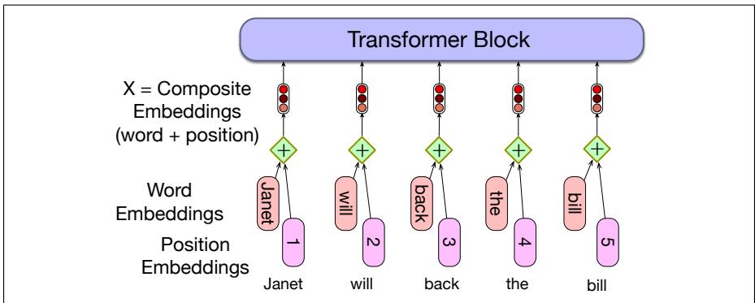  
Figure 7.14 A simple way to model position: add an embedding of the absolute position to the token embedding to produce a new embedding of the same dimensionality.

The final representation of the input, the matrix X, is an $[ N \times d ]$ matrix in which each row i is the representation of the ith token in the input, computed by adding $\pmb { \mathsf { E } } [ i d ( i ) ]$ —the embedding of the id of the token that occurred at position i—, to $\mathsf { \mathbf { E } } _ { \mathrm { p o s } } [ i ]$ , the positional embedding of position i.

A potential problem with the simple position embedding approach is that there will be plenty of training examples for the initial positions in our inputs and correspondingly fewer at the outer length limits. These latter embeddings may be poorly trained and may not generalize well during testing. An alternative is to choose a static function that maps integer inputs to real-valued vectors in a way that better handles sequences of arbitrary length. A combination of sine and cosine functions with differing frequencies was used in the original transformer work. Sinusoidal position embeddings may also help in capturing the inherent relationships among the positions, like the fact that position 4 in an input is more closely related to position 5 than it is to position 17.

A more complex style of positional embedding methods extend this idea of capturing relationships even further to directly represent relative position instead of absolute position, often implemented in the attention mechanism at each layer rather than being added once at the initial input. The most popular such positional embedding mechanism is the Rotary Position Embedding (RoPE) (Su et al., 2024).

## 7.5 The Language Modeling Head

The last component of the transformer we must introduce is the language modeling languagemodeling head head. Here we are using the word head to mean the additional neural circuitry we head add on top of the basic transformer architecture when we apply pretrained transformer models to various tasks. The language modeling head is the circuitry we need to do language modeling.

Recall that language models, from the simple n-gram models of Chapter 3 through the feedforward models of Chapter 6, are word predictors. Given a context of words, they assign a probability to each possible next word. For example, if the preceding context is “Thanks for all $t h e ^ { , { \bf { \rangle } } }$ and we want to know how likely the next word is $\ " { \hbar } s h \ " { }$ we would compute:

$$
P (f i s h | T h a n k s f o r a l l t h e)
$$

Language models give us the ability to assign such a conditional probability to every possible next word, giving us a distribution over the entire vocabulary. The n-gram language models of Chapter 3 compute the probability of a word given counts of its occurrence with the n 1 prior words. The context is thus of size $n - 1$ . For transformer language models, the context is the size of the transformer’s context window, which as we mentioned above can range from hundreds of thousands of tokens to millions.

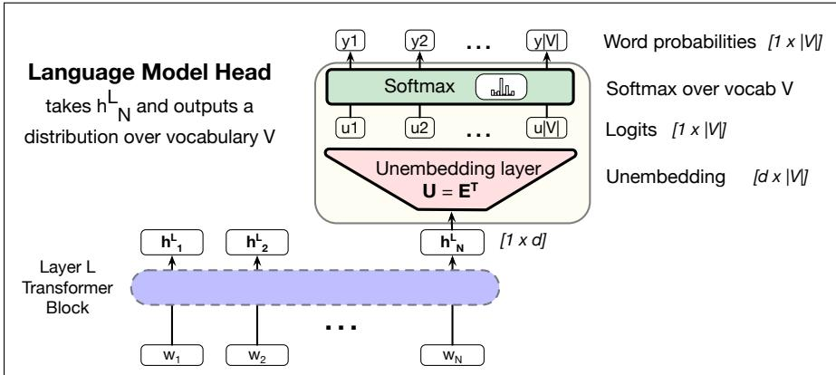  
Figure 7.15 The language modeling head: the circuit at the top of a transformer that maps from the output embedding for token N from the last transformer layer $( { \bf h } _ { N } ^ { L } )$ to a probability distribution over words in the vocabulary V.

The job of the language modeling head is to take the output of the final transformer layer at each token i and use it to predict the upcoming word at position $i + 1$ For inference, we just run the head on the very last token N and use it to predict the upcoming word at position $N + 1 . ^ { 3 }$ Fig. 7.15 shows how to accomplish this task, taking the output of the last token at the last layer (the d-dimensional output embedding of shape $[ 1 \times d ] )$ and producing a probability distribution over words (from which we will choose one to generate).

The first module in Fig. 7.15 is a linear layer, whose job is to project from the output $h _ { N } ^ { L }$ , which represents the output token embedding at position N from the final block L, (hence of shape $[ 1 \times d ] )$ to the logit vector, or score vector, that will have a single score for each of the V possible words in the vocabulary V. The logit vector u is thus of dimensionality $[ 1 \times | V | ]$

This linear layer can be learned, but it is also very common to tie this matrix to (the transpose of) the embedding matrix E. Recall that in weight tying, we use the same weights for two different matrices in the model. Thus at the input stage of the transformer the embedding matrix (of shape $[ | V | \times d ] )$ is used to map from a one-hot vector over the vocabulary (of shape $[ 1 \times | V | ] )$ to an embedding (of shape $[ 1 \times d ] )$ And then in the language model head, $\bar { \mathsf { E } } ^ { \mathsf { T } }$ , the transpose of the embedding matrix (of shape $[ d \times | V | ] )$ is used to map back from an embedding (shape $[ 1 \times d ] )$ to a vector over the vocabulary (shape $[ 1 \times | V | ] )$ ). In the learning process, E will be optimized to be good at doing both of these mappings. We therefore sometimes call the transpose $\mathsf { E } ^ { \mathsf { T } }$ the unembedding layer because it is performing this reverse mapping.

A softmax layer turns the logits u into the probabilities y over the vocabulary.

$$
\mathbf {u} = \mathbf {h} _ {N} ^ {L} \mathbf {E} ^ {T}\tag{7.47}
$$

$$
\mathbf {y} = \operatorname{softmax} (\mathbf {u})\tag{7.48}
$$

We can use these probabilities to do things like help assign a probability to a given text. But the most important usage is to generate text, which we’ll see how to do in the next section by repeatedly sampling an entry $y _ { k }$ from the probability vector y, and generating the word with index k.

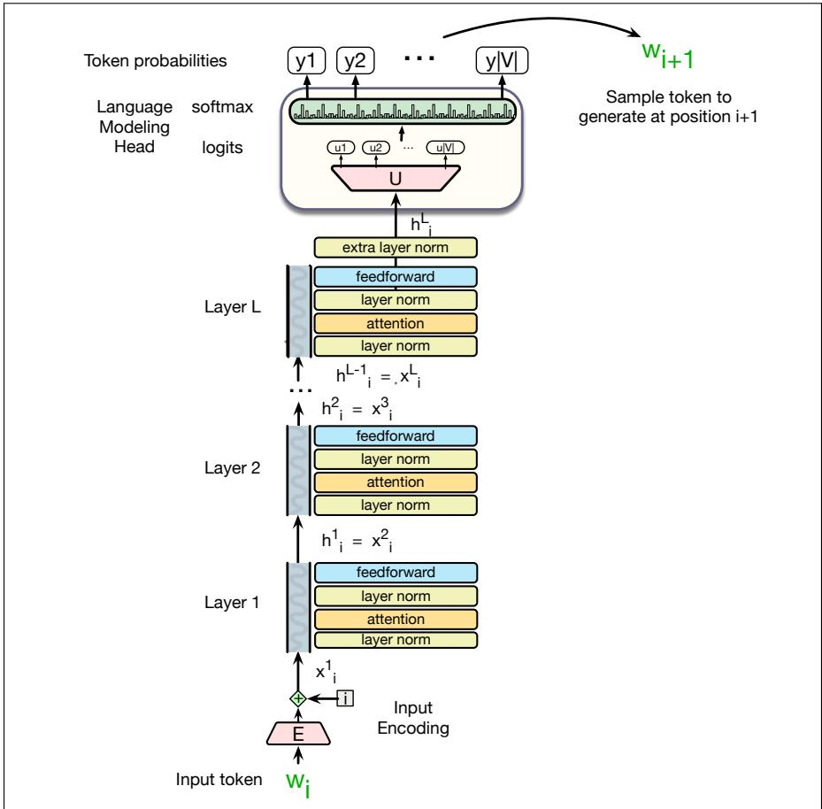  
Figure 7.16 A transformer language model (decoder-only), stacking transformer blocks and mapping from an input token $w _ { i }$ to a predicted next token $w _ { i + 1 }$

Fig. 7.16 shows the total stacked architecture for one token i. Note that the input to each transformer layer $x _ { i } ^ { \ell }$ is the same as the output from the preceding layer $h _ { i } ^ { \ell - 1 }$

A terminological note before we conclude: You will sometimes see a transformer used for this kind of unidirectional causal language model called a decoderonly model. This is because this model constitutes roughly half of the encoderdecoder model for transformers that we’ll see how to apply to machine translation in Chapter 13. (Confusingly, the original introduction of the transformer had an encoder-decoder architecture, and it was only later that the standard paradigm for causal language model was defined by using only the decoder part of this original architecture).

## 7.6 Decoding

The task of choosing a token to generate based on the model’s probabilities is called decoding. As we mentioned above, decoding from a language model in a left-toright manner (or right-to-left for languages like Arabic in which we read from right to left), and thus repeatedly choosing the next token conditioned on our previous choices is called causal or autoregressive generation.4

We’re decoding from the probability vector y, of shape $[ 1 \times | V | ]$ , which assigns a probability to each token in the vocabulary. Fig. 7.17 shows an example in which the softmax is computed for pedagogical purposes on a simplified vocabulary of only 4 words. Let’s use this example to investigate different methods of sampling words to generate.

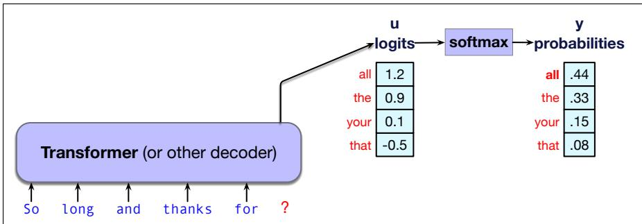  
Figure 7.17 Using the softmax to create a probability vector y from the logit vector u.

## 7.6.1 Greedy decoding

The simplest way to generate tokens is to always generate the most likely token given the context, which is called greedy decoding. A greedy algorithm is one that makes a choice that is locally optimal, whether or not it will turn out to have been the best choice with hindsight. Thus in greedy decoding, at each time step in generation, we turn the logits into a probability distribution over tokens and then we choose as the output wt the token in the vocabulary that has the highest probability (the argmax):

$$
\hat {w} _ {t} = \operatorname{argmax} _ {w \in V} P (w | \mathbf {w} _ {<   t})\tag{7.49}
$$

Fig. 7.18 shows that in our example, the model chooses to generate all.  
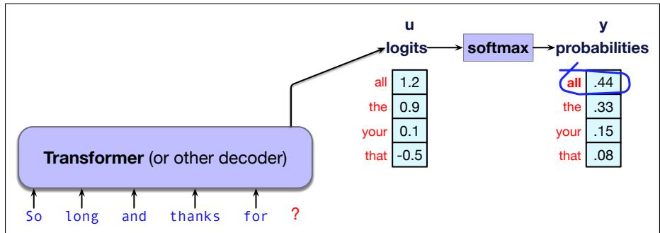  
Figure 7.18 Greedy decoding: choose the highest probability word.

In practice, however, we don’t use greedy decoding with large language models. A major problem with greedy decoding is that because the tokens it chooses are (by definition) extremely predictable, the resulting text is generic and often quite repetitive. Indeed, greedy decoding is so predictable that it is deterministic; if the context is identical, and the probabilistic model is the same, greedy decoding will always result in generating exactly the same string.

We’ll see in Chapter 13 that an extension to greedy decoding called beam search works well in tasks like machine translation, which are very constrained in that we are always generating a text in one language conditioned on a very specific text in another language.

In most other tasks, however, people prefer text which has been generated by sampling methods that introduce a bit more diversity into the generations.

## 7.6.2 Random sampling

Thus the most common method for decoding in large language models involves sampling. Recall from Chapter 3 that sampling from a distribution means to choose random points according to their likelihood. Thus sampling from a language model— which represents a distribution over following tokens—means to choose the next token to generate according to its probability assigned by the model. Thus we are more likely to generate tokens that the model thinks have a high probability and less likely to generate tokens that the model thinks have a low probability.

That is, we randomly select a token to generate according to its probability in context as defined by the model, generate it, and iterate. We could think of this as rolling a die and choosing a token according to the resulting probability, as we saw in Chapter 3. Such a model is of course more likely to generate the highest probability token, just like the greedy algorithm, but it could also generate any token, just with smaller chances. But in general we are more likely to generate tokens that the model thinks have a high probability in the context and less likely to generate tokens that the model thinks have a low probability.

Sampling from language models was first suggested very early on by Shannon (1948) and Miller and Selfridge (1950), and we saw back in Chapter 3 on page 79 how to generate text from a unigram language model by repeatedly randomly sampling tokens according to their probability until we either reach a pre-determined length or select the end-of-sentence token.

To generate text from a large language model we’ll just generalize this model a bit: at each step we’ll sample tokens according to their probability conditioned

i 1 wi p(w) while wi != EOS i i + 1 wi ∼ p(wi|w<i)

on our previous choices, and we’ll use the large language model as the probability model that tells us this probability.

The algorithm is called random sampling, or random multinomial sampling (because we are sampling from a multinomial distribution across words). We can formalize random sampling as follows: we are generating a sequence of tokens $\left\{ w _ { 1 } , w _ { 2 } , \ldots , w _ { N } \right\}$ until we hit the end-of-sequence token, using $x \sim p ( x )$ to mean ‘choose x by sampling from the distribution p(x)’:

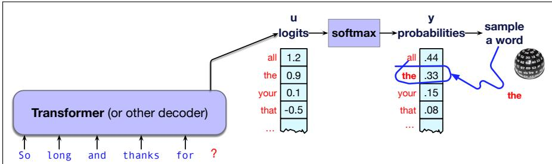  
Figure 7.19 Random multinomial sampling: we randomly chose a word according to its probability.

Alas, it turns out random sampling doesn’t work well either. The problem is that even though random sampling is mostly going to generate sensible, high-probable tokens, there are many odd, low-probability tokens in the tail of the distribution. Even though each one is low-probability, the sum of these rare tokens constitutes a non-trivial portion of the distribution. As a result, these tokens get chosen often enough to result in weird sentences being generated.

In other words, greedy decoding is too boring, and random sampling is too random. We need something that doesn’t greedily choose the top choice every time, but doesn’t stray down too far into the very low-probability events.

There are three standard sampling methods that modify random sampling to address these issues. Temperature sampling, top-k, and top-p.

## 7.6.3 Temperature sampling

The next three methods we introduce enable trading off two important factors in generation: quality and diversity. Methods that emphasize the most probable words tend to produce generations that are rated by people as more accurate, more coherent, and more factual, but also more boring and more repetitive. Methods that give a bit more weight to the middle-probability words tend to be more creative and more diverse, but less factual and more likely to be incoherent or otherwise low-quality.

The idea of temperature sampling is to reshape the probability distribution to increase the probability of the high probability tokens and decrease the probability of the low probability tokens. The result is that we are less likely to generate very lowprobability tokens, and more likely to generate tokens that are higher probability.

We implement this intuition by simply dividing the logit by a temperature parameter τ before passing it through the softmax. In low-temperature sampling, τ  (0, 1].

Thus instead of computing the probability distribution over the vocabulary directly from the logit as in the following (repeated from Eq. 7.48):

$$
\mathbf {y} = \operatorname{softmax} (\mathbf {u})\tag{7.50}
$$

we instead first divide the logits by τ, computing the probability vector y as

$$
\mathbf {y} = \operatorname{softmax} (\mathbf {u} / \tau)\tag{7.51}
$$

That is, normally we convert from logits to softmax as shown in Fig. 7.20(a). But when we use a temperature parameter we first scale the logit as in Fig. 7.20(b).

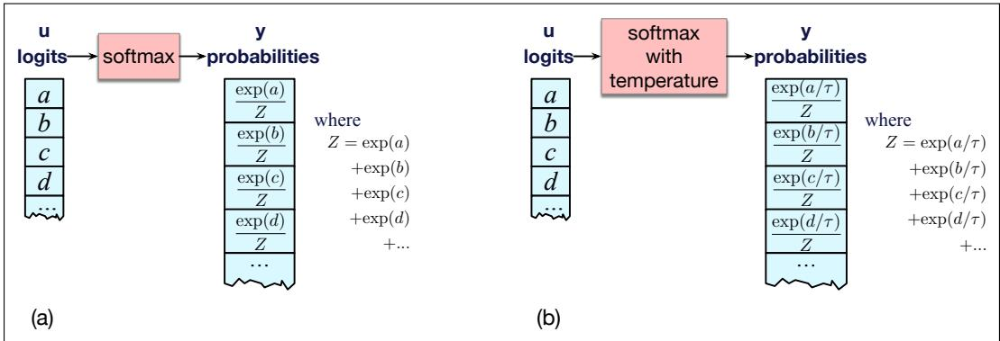  
Figure 7.20 (a): Normal softmax without temperature scaling (b) Adding temperature scaling to the softmax by first dividing by the temperature parameter τ.

Why does dividing by τ increase the high probability elements and decrease the low probability elements in the vector over vocabulary items? When τ is 1, we are doing normal softmax, and so when τ is close to 1 the distribution doesn’t change much. But for smaller τ, dividing by τ < 1 results in larger scores being passed to the softmax function.

Recall that one of the useful properties of a softmax is that it tends to push high values toward 1 and low values toward 0. Thus when larger numbers are passed to a softmax the result is a distribution with increased probabilities of the most highprobability tokens and decreased probabilities of the low probability tokens, making the distribution more greedy. And as τ approaches 0, dividing by τ means the probability of the most likely word approaches 1, resulting in greedy decoding.

The intuition for temperature sampling comes from thermodynamics, where a system at a high temperature is very flexible and can explore many possible states, while a system at a lower temperature is likely to explore a subset of lower energy (better) states. In low-temperature sampling, we smoothly increase the probability of the most probable tokens and decrease the probability of the rare tokens.

Fig. 7.21 shows a schematic example again simplified to have a vocabulary with only 4 tokens (all, the, your, that), and showing how different temperature values influence the probabilities computed from the initial logits. τ = 1 is the normal softmax, and we can see how setting τ = 0.5 increases the probability of the top candidate from .44 to .59. Setting τ = 0.1 increases the probability of the top candidate to .95, getting us close to greedy decoding.

We can also see in Fig. 7.21 some other options for situations where we may want toflatten the word probability distribution instead of making it greedy. Temperature sampling can help with this situation too, in this case high-temperature sampling, in which case we use τ > 1.

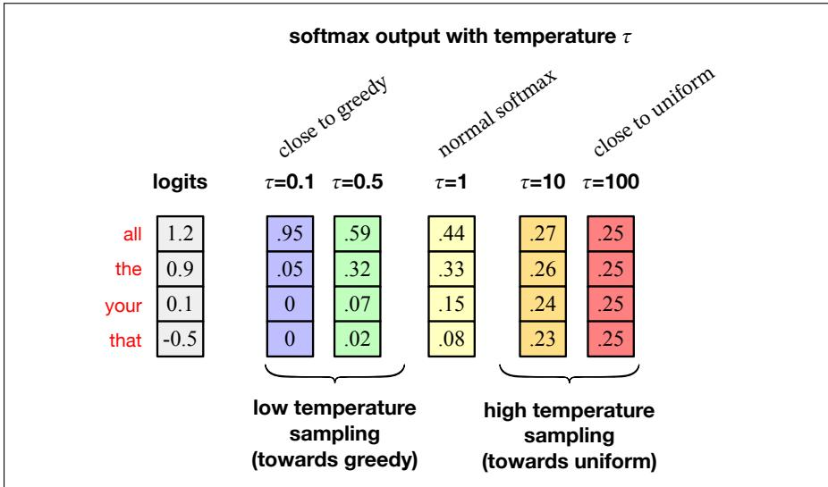  
Figure 7.21 Temperature sampling: different values of τ change the resulting probabilities from the initial logits (simplified example with just 4 tokens in the vocabulary).

## 7.6.4 Top-k and top-p sampling

Top-k sampling is a simple generalization of greedy decoding. Instead of choosing the single most probable word to generate, we first truncate the distribution to the top k most likely words, renormalize to produce a legitimate probability distribution, and then randomly sample from within these k words according to their renormalized probabilities. More formally:

1. Choose in advance a number of words k

2. For each word in the vocabulary V, use the language model to compute the likelihood of this word given the context $p ( w _ { t } | \mathbf { w } _ { < t } )$

3. Sort the words by their likelihood, and throw away any word that is not one of the top k most probable words.

4. Renormalize the scores of the k words to be a legitimate probability distribution.

5. Randomly sample a word from within these remaining k most-probable words according to its probability.

When k = 1, top-k sampling is identical to greedy decoding. Setting k to a larger number than 1 leads us to sometimes select a word which is not necessarily the most probable, but is still probable enough, and whose choice results in generating more diverse but still high-enough-quality text.

One problem with top-k sampling is that k is fixed, but the shape of the probability distribution over words differs in different contexts. If we set k = 10, sometimes the top 10 words will be very likely and include most of the probability mass, but other times the probability distribution will be flatter and the top 10 words will only include a small part of the probability mass.

An alternative, called top-p sampling or nucleus sampling (Holtzman et al., 2020), is to keep not the top k words, but the top p percent of the probability mass. The goal is the same; to truncate the distribution to remove the very unlikely words. But by measuring probability rather than the number of words, the hope is that the measure will be more robust in very different contexts, dynamically increasing and decreasing the pool of word candidates.

Given a distribution $P ( w _ { t } | \mathbf { w } _ { < t } )$ , we sort the distribution from most probable, and then the top-p vocabulary $V ^ { ( p ) }$ is the smallest set of words such that

$$
\sum_ {w \in V ^ {(p)}} P (w | \mathbf {w} _ {<   t}) \geq p.\tag{7.52}
$$

Perhaps surprisingly, it is common to combine both top-k and top-p sampling, using top-k first as a kind of a hard filter to eliminate garbage, and then using top-p to adapt to the model’s confidence level.

## 7.7 Pretraining Transformer LLMs

In pretraining, as we discussed in Chapter 1, we tokenize a large corpus of text as training material, usually by augmenting large crawls of the web with other high quality data. Then at each token t we ask the model to predict the next token, and train the parameters of the model (the embedding, feedforward, attention, and other weight matrices) via error backpropagation with gradient descent. We call such a model self-supervised because we don’t have to add any special gold labels to the data; the natural sequence of words is its own supervision! We simply train the model to minimize the error in predicting the true next word in the training sequence.

The loss function we minimize and pass back through the network is the crossentropy loss function we’ve now seen twice, in Chapter 4 and Chapter 6. Recall that the cross-entropy loss measures the difference between a predicted probability distribution and the correct distribution. The probability distribution is over the token vocabulary, making the loss be:

$$
L _ {C E} (\hat {\mathbf {y}} _ {t}, \mathbf {y} _ {t}) = - \sum_ {w \in V} \mathbf {y} _ {t} [ w ] \log \hat {\mathbf {y}} _ {t} [ w ]\tag{7.53}
$$

In the case of language modeling, the correct distribution yt comes from knowing the next word. This is represented as a one-hot vector corresponding to the vocabulary where the entry for the actual next word is 1, and all the other entries are 0. Thus, the cross-entropy loss for language modeling is determined by the probability the model assigns to the correct next token (all other tokens get multiplied by zero by the first term in Eq. 7.53).

So without loss of generality we can say that at time t the cross-entropy loss in Eq. 7.53 can be simplified as the negative log probability the model assigns to the next word in the training sequence, $- \log p ( w _ { t + 1 } )$ , or more formally, using yˆ to mean the vector of estimated token probabilities from the language model:

$$
L _ {C E} (\hat {\mathbf {y}} _ {t}, \mathbf {y} _ {t}) = - \log \hat {\mathbf {y}} _ {t} [ w _ {t + 1} ]\tag{7.54}
$$

Thus at each word position t of the input, the model takes as input the correct sequence of tokens $w _ { 1 : t } ,$ and uses them to compute a probability distribution over possible next tokens so as to compute the model’s loss for the next token $w _ { t + 1 }$ . Then we move to the next word, we ignore what the model predicted for the next word and instead use the correct sequence of tokens $w _ { 1 : t + 1 }$ to get the model to estimate the probability of token $w _ { t + 2 }$ . This idea that we always give the model the correct history sequence to predict the next word (rather than feeding the model its best guess from the previous time step) is called teacher forcing.

Fig. 7.22 illustrates the general training approach. At each step, given all the preceding tokens, the final transformer layer produces an output distribution over the entire vocabulary. During training, the probability assigned to the correct word is used to calculate the cross-entropy loss for each item in the sequence. The loss for each batch is the average cross-entropy loss over the entire sequence of negative log probabilities, or more formally:

$$
L _ {C E} (\text { batch   of   length   T }) = \frac {1}{T} \sum_ {t = 1} ^ {T} - \log \hat {\mathbf {y}} _ {t} [ w _ {t + 1} ]\tag{7.55}
$$

The weights in the network are then adjusted to minimize this average cross-entropy loss over the batch via gradient descent (Fig. 4.5), using error backpropagation on the computation graph to compute the gradient. Training adjusts all the weights of the network, including the embedding matrix E that contains the embeddings for each word. Thus embeddings will be learned that are most successful at predicting upcoming words.

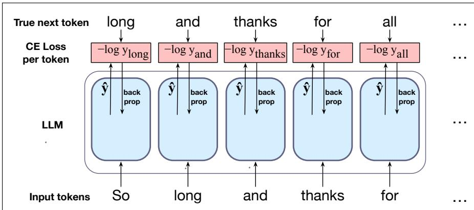  
Figure 7.22 Pretraining an LLM. At each token position, the model passes up yˆ, its probability estimate over possible next words. The negative log of the model’s probability estimate for the correct token is used as the loss, which is backpropagated through the model to train all the weights, including the embeddings. Losses are averaged over all the tokens in a batch.

One of the strengths of the transformer is that training can be done in parallel, making it practical to pretrain on trillions of tokens. Parallelism is possible because we know in advance the desired output $\left( w _ { t + 1 } \right)$ , and the causal mask prevents each position from attending to its own target, allowing the output for each token to be computed separately. This means that all N positions in the context window can be scored at once against their true next tokens, giving N training examples from one pass through the network.

Large models are generally trained by filling the full context window (of hundreds of thousands of tokens) with text. If documents are shorter than this, multiple documents are packed into the window with a special end-of-text token between them. The batch size for gradient descent is usually quite large (the largest GPT-3 model uses a batch size of 3.2 million tokens).

## 7.7.1 Evaluating Large Language Models: Perplexity

As we first saw in Chapter 3, one way to evaluate language models is to measure how well they predict unseen text. A better language model is better at predicting upcoming words, and so it will be less surprised by (i.e., assign a higher probability to) each word when it occurs in the test set. So we can compute the probability of a text by multiplying the conditional probabilities for each token in the text, and use that as a metric:

$$
\operatorname{likelihood} \left(w _ {1: T}\right) = \prod_ {i = 1} ^ {T} P \left(w _ {i} \mid w _ {<   i}\right)\tag{7.56}
$$

However, the probability of a test set depends on its length, and gets smaller the longer it is. (The higher T is, the more probabilities we multiply, and since probabilities are each less than 1 the product will get smaller and smaller). So it’s useful to have a metric that is per-token, normalized by length, so we can compare across texts of different lengths.

We have a length-normalized metric already, introduced in Chapter 3: perplexity. Recall that the perplexity of a model on an unseen test set is the inverse probability that the model assigns to the test set normalized by the test set length in tokens. For a test set of T tokens $w _ { 1 : T }$ , the perplexity is

$$
\begin{array}{l l} \text { Perplexity } (w _ {1: T}) & = P (w _ {1: T}) ^ {- \frac {1}{T}} \\ & = \left(\prod_ {t = 1} ^ {T} P (w _ {t} | w _ {<   t}) ^ {- 1}\right) ^ {\frac {1}{T}} \end{array}\tag{7.57}
$$

But Eq. 7.57 for perplexity should look familiar from the previous section. It’s almost the same as the mean cross-entropy loss function that we used to train, Eq. 7.55. We’ve repeated that equation here, changing the notation a bit to use P instead of yˆt:

$$
L _ {C E} (\text { batch   of   length   T }) = \frac {1}{T} \sum_ {t = 1} ^ {T} - \log P (w _ {t} | w _ {<   t})\tag{7.58}
$$

In fact, the perplexity of a text is simply the exponent of the mean cross-entropy loss for the text. We leave showing this as an exercise for the reader. (Note that because log here means natural log, mean cross-entropy loss is in nats (the units of entropy when we use ln as opposed to log2).)

Note that because of the inverse in Eq. 7.57 (and the fact that it’s equivalent to a loss), the higher the probability of the word sequence, the lower the perplexity. Thus the lower the perplexity of a model on the data, the better the model. Minimizing perplexity is equivalent to maximizing the test set probability according to the language model.

One caveat: because perplexity depends on the number of tokens n in a text, it is very sensitive to differences in the tokenization algorithm. That means that it’s hard to exactly compare perplexities produced by two language models if they have very different tokenizers. For this reason perplexity is best used when comparing language models that use the same tokenizer.

Perplexity measures one kind of accuracy: accuracy at predicting words. In Chapter 1 we also introduced MMLU and other datasets for measuring accuracy at question answering tasks. In future chapters we’ll introduce more task-specific evaluations for measuring LLM accuracy at other tasks: for machine translation in Chapter 13, information retrieval in Chapter 11, and speech recognition in Chapter 16.

## 7.8 Current models and some numbers

Current transformer language models use a number of advanced settings. Some of these we’ve mentioned above, like rotary position embeddings (RoPE), RMSNorm, and gated feedforward layers with SwiGLU activation (Shazeer, 2020). These are mainly ways to make models better, more accurate.

Others advances that we haven’t discussed at all focus on efficiency, ways to make models faster or use less memory. Just to give a flavor of these, here we give a short introduction to one such advance, the KV cache.

Recall from Fig. 7.11 and in Eq. 7.34 (repeated below) that the attention vector can be very efficiently computed in parallel for training, via two matrix multiplications:

$$
\mathbf {h e a d} = \text { softmax } \left(\frac {\mathbf {Q K} ^ {\intercal}}{\sqrt {d _ {k}}}\right) \mathbf {V}\tag{7.59}
$$

Unfortunately we can’t do quite the same efficient attention computation in inference as in training. That’s because at inference time, we iteratively generate the next tokens one at a time. For a new token that we have just generated, call it $\mathbf { x } _ { i } ,$ we need to compute its query, key, and values by multiplying by $\mathbf { \Delta } \mathsf { w } ^ { \mathsf { Q } } , \mathsf { w } ^ { \kappa }$ , and $\boldsymbol { \mathsf { W } } ^ { \boldsymbol { \mathsf { v } } }$ respectively. But it would be a waste of computation time to recompute the key and value vectors for all the prior tokens $\mathbf { x } _ { < i } ;$ at prior steps we already computed these key and value vectors!

The KV cache is a technique to avoid this waste of time. Instead of recomputing these, whenever we compute the key and value vectors we store them in memory in a cache, and then we can just grab them from the cache when we need them. Fig. 7.23 modifies Fig. 7.11 to show the computation that takes place for a single new token, showing which values we can take from the KV cache rather than recompute.

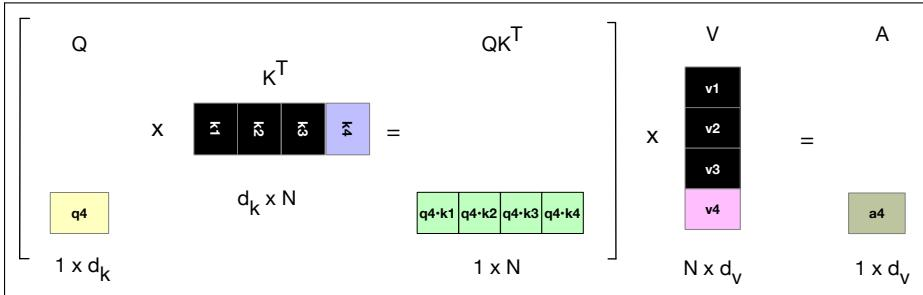  
Figure 7.23 Parts of the attention computation (extracted from Fig. 7.11) showing, in black, the vectors that can be stored in the cache rather than recomputed when computing the attention score for the 4th token.

There are many other such efficiency-focused innovations, including Mixtureof-Experts models, Grouped-Query Attention (GQA), and quantization. We hope to get to these in a future version of Volume II.

To give a basic idea of the range of architectural parameters, Fig. 7.24 shows some architectural parameters for a small selection of current and older LLMs. Because makers of frontier proprietary models like GPT-5, Claude, and Gemini don’t disclose any of this information, we only list open models. Note that because some of these models use modern architectures like GQA and SwiGLU (which have different A and don’t exactly set $d _ { f f }$ to be 4 times $d ) ,$ , these parameters numbers should be taken as rough approximations just to get ideas of scale.

<table><tr><td>Model</td><td>Year</td><td>L</td><td>d</td><td>A</td><td> $d_{ff}$ </td><td>|V|</td><td>Context</td><td>Params</td></tr><tr><td>GPT-2 XL</td><td>2019</td><td>48</td><td>1600</td><td>25</td><td>6400</td><td>50K</td><td>1K</td><td>1.5B</td></tr><tr><td>GPT-3</td><td>2020</td><td>96</td><td>12288</td><td>96</td><td>49152</td><td>50K</td><td>2K</td><td>175B</td></tr><tr><td>Qwen3-0.6B</td><td>2025</td><td>28</td><td>1024</td><td>16</td><td>3072</td><td>152K</td><td>32K</td><td>0.6B</td></tr><tr><td>Qwen3-32B</td><td>2025</td><td>64</td><td>5120</td><td>64</td><td>25600</td><td>152K</td><td>128K</td><td>32B</td></tr><tr><td>Llama 3.1 8B</td><td>2024</td><td>32</td><td>4096</td><td>32</td><td>14336</td><td>128K</td><td>128K</td><td>8B</td></tr><tr><td>Llama 3.1 405B</td><td>2024</td><td>126</td><td>16384</td><td>128</td><td>53248</td><td>128K</td><td>128K</td><td>405B</td></tr></table>

Figure 7.24 Configurations of some transformer language models. L is the number of layers, d the model dimension, A the number of attention heads, $d _ { f f }$ the feedforward dimension, and $| V |$ the vocabulary size.

## 7.9 Summary

This chapter has introduced the transformer and its components for language modeling, and the pretraining and decoding processes. Here’s a summary of the main points that we covered:

• Transformers are networks based on the idea of attention.

• A multi-head attention computation takes an input vector xi and maps it to an output $\mathbf { a } _ { i }$ by adding in vectors from prior tokens, weighted by how relevant they are for the processing of the current word.

• A transformer block consists of a residual stream in which the input from the prior layer is passed up to the next layer, with the output of different components added to it. These components include a multi-head attention layer followed by a feedforward layer, each preceded by layer normalizations. Transformer blocks are stacked to make deeper and more powerful networks.

• The input to a transformer is computed by adding an embedding (computed with an embedding matrix) to a positional encoding that represents the sequential position of the token in the window.

• Language models can be built out of stacks of transformer blocks, with a language model head at the top, which applies an unembedding matrix to the output H of the top layer to generate the logits, which are then passed through a softmax to generate word probabilities.

• Transformer-based language models have a wide context window (hundreds of thousands to millions of tokens) allowing them to draw on enormous amounts of context to predict upcoming words.

• The choice of which word to generate in transformer LLMs is done by sampling from the distribution of possible next words.

• A common sampling approach is temperature sampling, which lies in between two extremes, those of greedy decoding in which we always generate the most probable word, and at the other end random sampling, in which we generate a random word according to its probability.

• Temperature sampling increases the probabilities of the high-probability words, decreases the probability of the low-probability words, and then samples from this new distribution.

• Large language models are pretrained via cross-entropy loss to predict words on datasets of trillions of tokens generally scraped from the web.

• Language model predictive accuracy can be evaluated by perplexity, which turns out to be the exponent of the cross-entropy loss.

## Historical Notes

As we discussed in Chapter 3, the earliest language models were the n-gram language models developed (roughly simultaneously and independently) by Fred Jelinek and colleagues at the IBM Thomas J. Watson Research Center, and James Baker at CMU. It was Jelinek and the IBM team who first coined the term language model to mean a model of the way any kind of linguistic property (grammar, semantics, discourse, speaker characteristics), influenced word sequence probabilities (Jelinek et al., 1975). They contrasted the language model with the acoustic model which captured acoustic/phonetic characteristics of phone sequences.

N-gram language models were very widely used over the next 40 years, across a wide variety of NLP tasks like speech recognition and machine translation, often as one of multiple components of the model. The contexts for these n-gram models grew longer, with 5-gram models used quite commonly by very efficient LM toolkits (Stolcke, 2002; Heafield, 2011).

The roots of the neural large language model lie in multiple places. One was the application in the 1990s, again in Jelinek’s group at IBM Research, of discriminative classifiers to language models. Roni Rosenfeld in his dissertation (Rosenfeld, 1994) first applied logistic regression (under the name maximum entropy or maxent models) to language modeling in that IBM lab, and published a more fully formed version in Rosenfeld (1996). His model integrated various sorts of information in a logistic regression predictor, including n-gram information along with other features from the context, including distant n-grams and pairs of associated words called trigger pairs. Rosenfeld’s model prefigured modern language models by being a statistical word predictor trained in a self-supervised manner simply by learning to predict upcoming words in a corpus.

Another was the first use of pretrained embeddings to model word meaning in the LSA/LSI models (Deerwester et al., 1988). Recall from the history section of Chapter 5 that in LSA (latent semantic analysis) a term-document matrix was trained on a corpus and then singular value decomposition was applied and the first 300 dimensions were used as a vector embedding to represent words. It was Landauer et al. (1997) who first used the word “embedding”. In addition to their development of the idea of pretraining and of embeddings, the LSA community also developed ways to combine LSA embeddings with n-grams in an integrated language model (Bellegarda, 1997; Coccaro and Jurafsky, 1998).

In a very influential series of papers developing the idea of neural language models, (Bengio et al. 2000; Bengio et al. 2003; Bengio et al. 2006), Yoshua Bengio and colleagues drew on the central ideas of both these lines of self-supervised language modeling work (the discriminatively trained word predictor, and the pretrained embeddings). Like the maxent models of Rosenfeld, Bengio’s model used the next word in running text as its supervision signal. Like the LSA models, Bengio’s model learned an embedding, but unlike the LSA models did it as part of the process of language modeling. The Bengio et al. (2003) model was a neural language model: a neural network that learned to predict the next word from prior words, and did so via learning embeddings as part of the prediction process.

The neural language model was extended in various ways over the years, perhaps most importantly in the form of the RNN language model of Mikolov et al. (2010) and Mikolov et al. (2011). The RNN language model was perhaps the first neural model that was accurate enough to surpass the performance of a traditional 5-gram

language model.

Soon afterwards, Mikolov et al. (2013a) and Mikolov et al. (2013b) proposed to simplify the hidden layer of these neural net language models to create pretrained word2vec word embeddings.

The static embedding models like LSA and word2vec instantiated a particular model of pretraining: a representation was trained on a pretraining dataset, and then the representations could be used in further tasks. Dai and Le (2015) and Peters et al. (2018) reframed this idea by proposing models that were pretrained using a language model objective, and then the identical model could be either frozen and directly applied for language modeling or further fine-tuned still using a language model objective. For example ELMo used a biLSTM self-supervised on a large pretrained dataset using a language model objective, then fine-tuned on a domainspecific dataset, and then froze the weights and added task-specific heads. The ELMo work was particularly influential and its appearance was perhaps the moment when it became clear to the community that language models could be used as a general solution for NLP problems.

Transformers were first applied as encoder-decoders (Vaswani et al., 2017) and then to masked language modeling (Devlin et al., 2019) (as we’ll see in Chapter 13 and Chapter 9). Radford et al. (2019) then showed that the transformer-based autoregressive language model GPT-2 could perform zero-shot on many NLP tasks like summarization and question answering.

The technology used for language models can also be applied to other domains and tasks, like vision, speech, and genetics. The term foundation model is sometimes used as a more general term for this use of large language model technology across domains and areas, when the elements we are computing over are not necessarily words. Bommasani et al. (2021) is a broad survey that sketches the opportunities and risks of foundation models, with special attention to large language models.

The transformer (Vaswani et al., 2017) was developed drawing on two lines of prior research: self-attention and memory networks.

Encoder-decoder attention, the idea of using a soft weighting over the encodings of input words to inform a generative decoder (see Chapter 13) was developed by Graves (2013) in the context of handwriting generation, and Bahdanau et al. (2015) for MT. This idea was extended to self-attention by dropping the need for separate encoding and decoding sequences and instead seeing attention as a way of weighting the tokens in collecting information passed from lower layers to higher layers (Ling et al., 2015; Cheng et al., 2016; Liu et al., 2016).

Other aspects of the transformer, including the terminology of key, query, and value, came from memory networks, a mechanism for adding an external readwrite memory to networks, by using an embedding of a query to match keys representing content in an associative memory (Sukhbaatar et al., 2015; Weston et al., 2015; Graves et al., 2014).

[More transformer history is TBD in the next draft.]

## Exercises

7.1 A transformer has L layers, model dimension d, A attention heads with $d _ { k } =$ $d _ { \nu } = d / A$ , and feedforward dimension $d _ { f } f = 4 d$

a. Count the parameters in one attention layer’s $W ^ { Q } , W ^ { K } , W ^ { V }$ , and $W ^ { O }$ Does your answer depend on A?

b. Count the parameters in one feedforward layer.

c. Show that the full stack of L blocks has about $1 2 L d ^ { 2 }$ parameters, ignoring biases and layer norm.

7.2 Why does the attention mask in Fig. 7.10 use ∞ rather than 0? What would happen if we used 0?

7.3 Compute the perplexity of a language model on the string It was a dream, assuming the conditional probabilities of each respective word are .0001, .0002, .000005, and .0000001.

7.4 Prove that the perplexity of a text is equal to the exp of the mean cross-entropy loss for the text.

7.5 With the logits in Fig. 7.17, compute the probabilities at $\tau = 0 . 2$ and $\tau = 2$ Verify each sums to 1. What happens as $\tau \to 0 ? \mathrm { \ A s \ } \tau \to \infty ?$