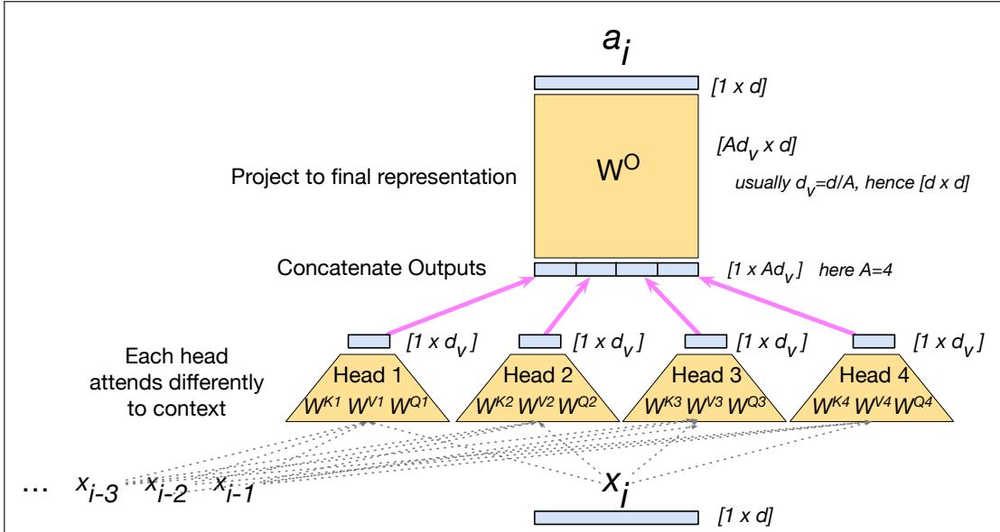
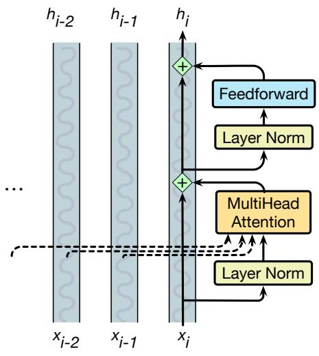
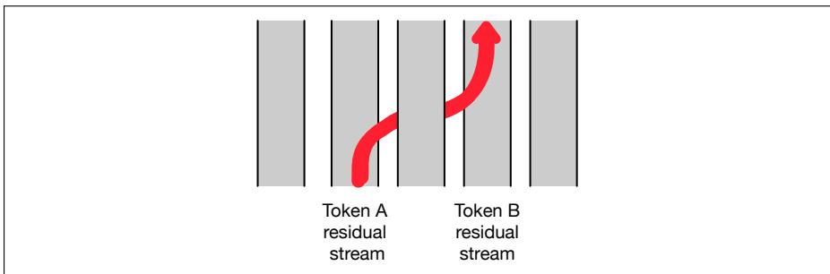

## 7.2 Transformer Blocks

The self-attention calculation lies at the core of what’s called a transformer block, which, in addition to the self-attention layer, includes three other kinds of layers: (1) a feedforward layer, (2) residual connections, and (3) normalizing layers (colloquially called “layer norm”).

Fig. 7.7 illustrates a transformer block, sketching a common way of thinking about the block that is called the residual stream (Elhage et al., 2021). In the residual stream viewpoint, we consider the processing of an individual token i through the transformer block as a single stream of d-dimensional representations for token position i. This residual stream starts with the original input vector, and the various components read their input from the residual stream and add their output back into the stream.

The input at the bottom of the stream is an embedding for a token, which has dimensionality $d .$ This initial embedding gets passed up (by residual connections), and is progressively added to by the other components of the transformer: the attention layer that we have seen, and the feedforward layer that we will introduce. Before the attention and feedforward layer is a computation called the layer norm.

Thus the initial vector is passed through a layer norm and attention layer, and the result is added back into the stream, in this case to the original input vector $\mathbf { x } _ { i } .$ And then this summed vector is again passed through another layer norm and a feedforward layer, and the output of those is added back into the residual, and we’ll use $\mathbf { h } _ { i }$ to refer to the resulting output of the transformer block for token i.

  
Figure 7.6 The multi-head attention computation for input $\mathbf { x } _ { i } ,$ producing output $\mathbf { a } _ { i } .$ A multi-head attention layer has A heads, each with its own query, key, and value weight matrices. In this figure, we show $A = 4 ,$ , a smaller value than is usually used, just to fit on the page. The outputs from each of the heads are of shape $[ 1 \times d _ { \nu } ]$ and are concatenated and then projected into a different space by the ${ \boldsymbol { \mathsf { W } } } _ { 0 }$ matrix. Usually the dimensionality $d _ { \nu }$ of the heads is set so that $d _ { \nu } = d / A$ , with the result that $\boldsymbol { \mathsf { W } } _ { 0 }$ is a square matrix of shape $[ A d _ { \nu } \times d ] = [ d \times d ]$ The result is projected to $d ,$ producing an output of the same size as the input.

  
Figure 7.7 The architecture of a transformer block showing the residual stream, showing how most information flows up through the residual stream, and only the attention module is sensitive to information from other streams at prior token positions. In this figure and throughout the chapter, we use the prenorm version of the architecture, in which the layer norms happen before the attention and feedforward layers rather than after.

We’ve already seen the attention layer, so let’s now introduce the feedforward and layer norm computations in the context of processing a single input $\pmb { x } _ { i }$ at token position i.

## 7.2.1 Feedforward layer

The feedforward layer is a fully-connected 2-layer network, i.e., one hidden layer, two weight matrices (Chapter 6).

The feedforward layer is position-wise, meaning that it operates on each token position i independently. This makes a contrast with the attention network, whose job is to mix information from different token positions. The feedforward weights are shared across positions, meaning that the same parameters are applied to every token position, but are different from layer to layer.

It is common to make the dimensionality $d _ { \mathrm { f f } }$ of the hidden layer of the feedforward network be 4 times larger than the model dimensionality $d .$ (For example in the original transformer model, $d = 5 1 2$ and $d _ { \mathrm { f f } } = 2 0 4 8 . )$ ) This means the feedforward networks have most of the parameters of the transformers, and these feedforward network parameters seem to encode most of the factual knowledge in the transformer. (Geva et al., 2021; Meng et al., 2022).

Most LLMs now actually use gated feedforward layers, by employing an activation function called SwiGLU (Shazeer, 2020) that works better than simpler functions like ReLU. SwiGLU is in the family of Gated Linear Unit (GLU) functions (Dauphin et al., 2017), which do a component-wise product ( ) of two linear transformations of the input. The idea is that one of the functions is a value, and the other is a gate that specifies how much of that value goes through. SwiGLU uses the Swish function (Ramachandran et al., 2017) as the gate:

$$
\operatorname{Swish} _ {\beta} (\mathbf {x}) = \mathbf {x} \sigma (\beta \mathbf {x})\tag{7.21}
$$

The SwiGLU feedforward equation is then:

$$
\operatorname{FFN} _ {\text {SwiGLU}} \left(\mathbf {x}, \mathbf {W} _ {1}, \mathbf {W} _ {2}, \mathbf {W} _ {3}, b _ {1}, b _ {2}, b _ {3}, \beta\right) = \left(\operatorname{Swish} _ {\beta} \left(\mathbf {x} \mathbf {W} _ {1} + b _ {1}\right) \otimes \left(\mathbf {x} \mathbf {W} _ {2} + b _ {2}\right)\right) \mathbf {W} _ {3} + b _ {3}\tag{7.22}
$$

Because gated activation functions have extra parameters for the gating, the dimensionality $d _ { \mathrm { f f } }$ of gated models is usually set to be slightly less than the normal 4d.

## 7.2.2 Layer Norm

At two stages in the transformer block we normalize the vector (Ba et al., 2016). This process, called layer norm (short for layer normalization), is one of many forms of normalization that can be used to improve training performance in deep neural networks by keeping the values of a hidden layer in a range that facilitates gradient-based training.

Layer norm is a variation of the z-score from statistics, applied to a single vector in a hidden layer. That is, the term layer norm is a bit confusing; layer norm is not applied to an entire transformer layer, but just to the embedding vector of a single token. Thus the input to layer norm is a single vector of dimensionality d and the output is that vector normalized, again of dimensionality $d .$ The first step in layer normalization is to calculate the mean, $\mu ,$ and standard deviation, σ, over the elements of the vector to be normalized. Given an embedding vector x of dimensionality $d ,$ these values are calculated as follows.

$$
\mu = \frac {1}{d} \sum_ {j = 1} ^ {d} x [ j ]\tag{7.23}
$$

$$
\sigma = \sqrt {\frac {1}{d} \sum_ {j = 1} ^ {d} (x [ j ] - \mu) ^ {2}}\tag{7.24}
$$

Given these values, the vector components are normalized by subtracting the mean from each and dividing by the standard deviation. The result of this computation is a new vector with zero mean and a standard deviation of one.

$$
\hat {\mathbf {x}} = \frac {(\mathbf {x} - \boldsymbol {\mu})}{\sigma}\tag{7.25}
$$

Finally, in the standard implementation of layer normalization, two learnable parameters, $\gamma$ and $\beta ,$ , representing gain and offset values, are introduced.

$$
\operatorname{LayerNorm} (\mathbf {x}) = \gamma \frac {(\mathbf {x} - \mu)}{\sigma} + \beta\tag{7.26}
$$

In practice, many modern networks use a simpler norm, called RMSNorm (Zhang and Sennrich, 2019), which rescales the vectors by dividing by the root-mean-square statistic, but skips the mean-centering step.

## 7.2.3 Putting it all together

The function computed by a transformer block can be expressed by breaking it down with one equation for each component computation, using t (of shape $[ 1 \times d ] )$ to stand for transformer and superscripts to demarcate each computation inside the block:

$$
\mathbf {t} _ {i} ^ {\mathbf {1}} = \operatorname{LayerNorm} (\mathbf {x} _ {i})\tag{7.27}
$$

$$
\mathbf {t} _ {i} ^ {2} = \text { MultiHeadAttention } (\mathbf {t} _ {i} ^ {1}, [ \mathbf {t} _ {1} ^ {1}, \dots , \mathbf {t} _ {i - 1} ^ {1} ])\tag{7.28}
$$

$$
\mathbf {t} _ {i} ^ {3} = \mathbf {t} _ {i} ^ {2} + \mathbf {x} _ {i}\tag{7.29}
$$

$$
\mathbf {t} _ {i} ^ {4} = \text { LayerNorm } (\mathbf {t} _ {i} ^ {3})\tag{7.30}
$$

$$
\mathbf {t} _ {i} ^ {\mathbf {5}} = \mathrm{FFN} (\mathbf {t} _ {i} ^ {\mathbf {4}})\tag{7.31}
$$

$$
\mathbf {h} _ {i} = \mathbf {t} _ {i} ^ {5} + \mathbf {t} _ {i} ^ {3}\tag{7.32}
$$

Notice that the only component that takes as input information from other tokens (other residual streams) is multi-head attention, which (as we see from Eq. 7.28) looks at all the neighboring tokens in the context. The output from attention, however, is then added into this token’s embedding stream. In fact, Elhage et al. (2021) show that we can view attention heads as literally moving information from the residual stream of a neighboring token into the current stream. The high-dimensional embedding space at each position thus contains information about the current token and about neighboring tokens, albeit in different subspaces of the vector space. Fig. 7.8 shows a visualization of this movement. We therefore call the attention function the token-mixing component of the architecture, because it mixes information from neighboring token streams into the current stream.

Crucially, the input and output dimensions of transformer blocks are matched so they can be stacked. Each token vector $\pmb { x } _ { i }$ at the input to the block has dimensionality d, and the output $\mathbf { h } _ { i }$ also has dimensionality d. Transformers for large language models stack many of these blocks, from 12 layers (used for the T5 or GPT-3-small language models) to 96 layers (used for GPT-3 175B), to even more for more recent models. We’ll come back to this issue of stacking in a bit.

  
Figure 7.8 An attention head can move information from token A’s residual stream into token B’s residual stream.

Equation 7.27 and following are just the equation for a single transformer block, but the residual stream metaphor goes through all the transformer layers, from the first transformer blocks to the 12th, in a 12-layer transformer. At the earlier transformer blocks, the residual stream is representing the current token. At the highest transformer blocks, the residual stream is usually representing the following token, since at the very end it’s being trained to predict the next token.

Once we stack many blocks, there is one more requirement: at the very end of the last (highest) transformer block, there is a single extra layer norm that is run on the last hi of each token stream (just below the language model head layer that we will define soon). 2
