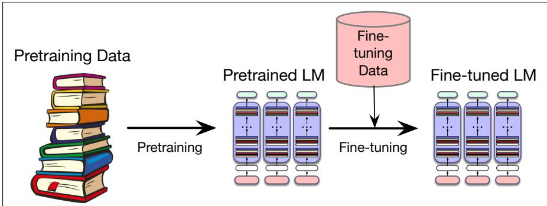
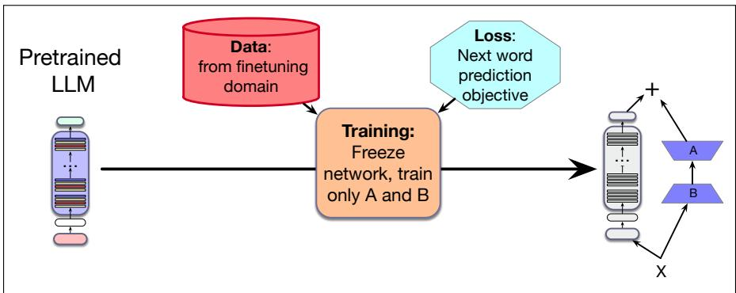
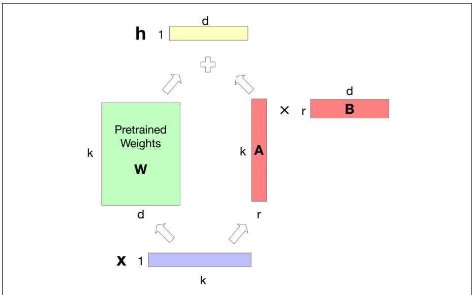

## 8.2 Parameter Efficient Fine Tuning

Before turning to the second stage, let’s consider a practical problem. Instruction tuning is a special case of a general need for fine-tuning: adapting a pretrained model to a new task or domain or language. Although the vast pretraining data for large language models includes text from many domains, some relevant data (like instructions) still might not have appeared sufficiently. Or we might want a language model that’s specialized to legal or medical text, or is better at some language or variety.

  
Figure 8.6 Pretraining and fine-tuning. A pre-trained model can be fine-tuned to a particular domain or dataset. There are many different ways to fine-tune, depending on exactly which parameters are updated from the fine-tuning data: all the parameters, some of the parameters, or only the parameters of specific extra circuitry, as we’ll see in future chapters.

In such cases, as we did for instruction tuning, we continue training the model on relevant data from the new domain or language (Gururangan et al., 2020) using the cross-entropy loss, just as we do in pretraining. For instruction tuning, as we saw in Fig. 8.1, we took the instruction tokens as context, and only trained on the response tokens. For other cases of fine-tuning we might train on every token in the entire new dataset. Fig. 8.6 shows the intuition.

In practice, however, it’s hard to fine-tune very large language models, because there are enormous numbers of parameters to train; each pass of batch gradient descent has to backpropagate through many many huge layers. This makes finetuning huge language models extremely expensive in processing power, in memory, and in time. Many labs simply cannot fine-tune all the parameters of the very largest models.

For this reason, in most cases in post-training we use alternate methods that fine-tune models without changing all the parameters. Such methods are called parameter-efficient fine-tuning or sometimes PEFT, because we efficiently select a subset of parameters to update when fine-tuning. In particular we freeze some of the parameters (don’t change them), and only update some particular subset of parameters.

Here we describe the most common parameter efficient fine-tuning method, called LoRA, for Low-Rank Adaptation (Hu et al., 2022). The intuition of LoRA is that transformers have many dense layers which perform matrix multiplication (for example the ${ \bf w } ^ { \sf q } , { \bf w } ^ { \sf K } , { \bf w } ^ { \sf v } , { \bf w } ^ { \sf o }$ layers in the attention computation). Instead of updating these layers during fine-tuning, with LoRA we freeze these layers and instead update a low-rank approximation that has fewer parameters. Fig. 8.7 shows the intuition.

Consider a matrix W of dimensionality $[ k \times d ]$ that needs to be updated during fine-tuning via gradient descent. Normally this matrix would get updates ∆W of dimensionality $[ k \times d ]$ , for updating the $k \times d$ parameters after gradient descent. In LoRA, we freeze W and update instead a low-rank decomposition of W. We create two matrices A and B, where A has size $\left[ k \times r \right]$ and B has size $[ r \times d ] .$ , and we choose r to be quite small, $r < <$ < min(d,k). During fine-tuning we update A and B instead of W. That is, we replace $\boldsymbol { \mathsf { W } } + \Delta \boldsymbol { \mathsf { W } }$ with $\boldsymbol { \mathsf { W } } + \boldsymbol { \mathsf { A } } \boldsymbol { \mathsf { B } }$ . Fig. 8.8 shows the intuition. For replacing the forward pass h = xW, the new forward pass is instead:

$$
\mathbf {h} = \mathbf {x W} + \mathbf {x A B}\tag{8.1}
$$

  
Figure 8.7 Parameter-Efficient Fine-Tuning methods like LoRA.

LoRA has a number of advantages. It dramatically reduces hardware requirements,  
  
Figure 8.8 The intuition of LoRA. We freeze W to its pretrained values, and instead finetune by training a pair of matrices A and B, updating those instead of W, and just sum W and the updated AB.

since gradients don’t have to be calculated for most parameters. The weight updates can be simply added in to the pretrained weights, since AB is the same size as W. That means it doesn’t add any time during inference. And it also means it’s possible to build LoRA modules for different domains and just swap them in and out by adding them in or subtracting them from W.

In its original version LoRA was applied just to the matrices in the attention computation (the $\mathsf { w } ^ { \mathsf { q } } , \mathsf { w } ^ { \mathsf { K } } , \mathsf { w } ^ { \mathsf { v } }$ , and ${ \boldsymbol { \mathsf { W } } } ^ { \flat }$ layers). Many variants of LoRA exist.
