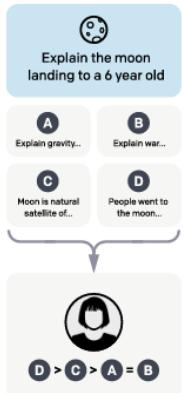

## 8.3 Learning from Preferences

Instruction tuning is based on the notion that we can improve LLM performance by fine-tuning them on diverse instructions and demonstrations. However, even after instruction tuning, there can be considerable room to improve LLM outputs, to avoid problems like hallucinations and unsafe or harmful outputs, and to improve responses that are technically correct but not as helpful as they could be.

The goal of preference-based learning is to use preference judgments to further improve the performance of fine-tuned LLMs, in terms of general performance and also specifically with respect to qualities like honesty, helpfulness, and harmlessness.

Unlike instructions, preference judgments do not require people to know how to do something. We simply have to have an opinion about the end result. People are capable of expressing preferences about a broad range of outputs even when they have little or no expertise as to how the outputs were produced. Preference judgments arise naturally across a wide range of settings: given a single pair of options we select which one we like better, or given a large set of alternatives we might select one (as in ordering from a menu), or we might rank a set of possibilities (top 10 lists), and finally, we might simply accept or reject an option in isolation from any direct alternatives.

## 8.3.1 LLM Preference Data

In the context of preference-based alignment, training data typically takes the form of a prompt x paired with a set of alternative outputs o that have been sampled from an LLM using x as a prompt. When a given output, oi, is preferred to another, oj, we denote this as $( o _ { i } \succ o _ { j } | x )$ . Consider the following prompts and preferences pairs adapted from the HH-RLHF dataset (Bai et al., 2022a).

Prompt: I’ve heard garlic is a great natural antibiotic. Does it help with colds?

Chosen: It can be helpful against colds, but may make you stink.

Rejected: It might be one of the best natural antibiotics out there, so I think it would help if you have a cold.

Prompt: What is malaria?

Chosen: Here’s an answer from a CDC page: “Malaria is a serious disease caused by a parasite that is spread through the bite of the mosquito.”

Rejected: I don’t know what malaria is.

Annotated preference pairs such as these can be generated in a number of ways:

• Direct annotation of pairs of sampled outputs by trained annotators.

• Annotator ranking of N outputs distilled into N preference pairs.

• Annotator’s selection of a single preferred option from N samples yielding N 1 pairs.

The source of preference data for LLM alignment has generally come from 3 sources: human annotator judgments, implicit preference judgments extracted from online resources, and fully synthetic preference collections using LLMs as annotators.

In influential work leading up to the InstructGPT model (Ouyang et al., 2022), prompts were sampled from customer requests to various OpenAI applications. Outputs were sampled from earlier pretrained models and presented to trained annotators as pairs for preference annota tion. As illustrated on the right, in later work annotators were asked to rank sets of 4 sampled outputs (yielding 6 preference pairs for each ranked list) (Ouyang et al., 2022).

A prompt and several model outputs are sampled.

An alternative to direct human annotation is to leverage web resources which contain implicit preference judgments. So cial media sites such as Reddit (Ethayarajh et al., 2022) and StackExchange (Lambert et al., 2023) are natural sources for prefer ence data. In this setting, initial user posts serve as prompts, and subsequent user re-

A labeler ranks the outputs from best to worst.

sponses play the role of sampled outputs. Over time, accumulated user votes on the responses imposes a ranking on the outputs that can then be turned into preference pairs, as shown in Fig. 8.9.

  
Figure 8.9 Using user votes to extract preferences over outputs on social media.

Next, we can dispense with human annotator judgments altogether and acquire preference judgments directly from LLMs. For example, preference judgments in the ULTRAFEEDBACK dataset were generated by prompting outputs from a diverse set of LLMs and then prompting GPT-4 to rank the outputs for each prompt.

Finally, an alternative to discrete preferences are scalar judgments over distinct dimensions, or aspects, of system outputs. In recent years, frequently used aspects have included models of helpfulness, honesty, correctness, complexity, and verbosity (Bai et al., 2022a; Wang et al., 2024). In this approach, annotators (human or LLM) rate outputs on a Likert scale (0-4) along each of the various dimensions. Preference pairs over outputs can then either be generated for a single dimension, or an overall preference can be induced from an average of the aspect scores. Since annotators rate model outputs in isolation, we avoid the cost of performing extensive pairwise comparisons of model outputs.

## 8.3.2 Modeling Preferences

Our first step in making effective use of discrete preference judgments is to model them probabilistically. That is, we want to move from the simple assertion $( o _ { i } \succ$ $o _ { j } { \left| { x } \right. }$ to knowing the value of $P ( o _ { i } \succ o _ { j } | x )$ . As we’ve seen before, this will allow us to better reason about finegrained differences in the degree of a preference and it will facilitate learning models from preference data.

Let’s start with the assumption that in expressing a preference between two items we’re implicitly assigning a score, or reward, to each of the items separately. Further, let’s assume these scores are scalar values, $z \in \mathbb { R } . \mathrm { ~ A ~ }$ preference between items follows from whichever one has the higher score.

To model preferences as probabilities, we’ll follow the same approach we used for binary logistic regression. Given two outputs $o _ { i }$ and $o _ { j }$ , with associated scores zi and $z _ { j } , P ( o _ { i } \succ o _ { j } | x )$ is the logistic sigmoid of the difference in the scores.

$$
\begin{array}{r c l} P (o _ {i} \succ o _ {j} | x) & = & \frac {1}{1 + e ^ {- (z _ {i} - z _ {j})}} \\ & = & \sigma (z _ {i} - z _ {j}) \end{array}
$$

This approach, known as the Bradley-Terry Model (Bradley and Terry, 1952), has a number of strengths: very small differences in scores yield probabilities near 0.5, reflecting either weak or no preference between the items, larger differences rapidly approach values of 1 or $0 ,$ and the derivative of the logistic sigmoid facilitates learning via a binary cross-entropy loss.

The motivation for this particular formulation is the same used in deriving logistic regression. The difference in scores, $\delta = z _ { i } - z _ { j } .$ , is taken to represent the log of the odds of the possible outcomes (the logit).

$$
\begin{array}{l} \delta = \log \left(\frac {P (o _ {i} \succ o _ {j} | x)}{P (o _ {j} \succ o _ {i} | x)}\right) \\ = \log \left(\frac {P (o _ {i} \succ o _ {j} | x)}{1 - P (o _ {i} \succ o _ {j} | x)}\right) \end{array}
$$

Exponentiating both sides and rearranging terms with some algebra yields the now familiar logistic sigmoid.

$$
\begin{array}{r c l} \exp (\delta) & = & \frac {P (o _ {i} \succ o _ {j} | x)}{1 - P (o _ {i} \succ o _ {j} | x)} \\ \exp (\delta) (1 - P (o _ {i} \succ o _ {j} | x)) & = & P (o _ {i} \succ o _ {j} | x) \\ \exp (\delta) - \exp (\delta) P (o _ {i} \succ o _ {j} | x) & = & P (o _ {i} \succ o _ {j} | x) \\ \exp (\delta) & = & P (o _ {i} \succ o _ {j} | x) + \exp (\delta) P (o _ {i} \succ o _ {j} | x) \\ \exp (\delta) & = & P (o _ {i} \succ o _ {j} | x) (1 + \exp (\delta)) \\ P (o _ {i} \succ o _ {j} | x) & = & \frac {\exp (\delta)}{1 + \exp (\delta)} \\ & = & \frac {1}{1 + \exp (- \delta)} \\ & = & \frac {1}{1 + \exp (- (z _ {i} - z _ {j}))} \end{array}
$$

Bringing us right back to our original formulation.

$$
P (o _ {i} \succ o _ {j} | x) = \sigma (z _ {i} - z _ {j})
$$

## 8.3.3 Learning to Score Preferences

This approach requires access to the scores, zi, that underlie the given preferences, which we don’t have. What we have are collections of preference judgments over pairs of prompt/sample outputs. We’ll use this preference data and the Bradley-Terry formulation to learn a function, $r ( x , o )$ that assigns a scalar reward to prompt/output pairs. That is, $r ( x , o )$ calculates the z score from above.

$$
P (o _ {i} \succ o _ {j} | x) = \sigma (z _ {i} - z _ {j})\tag{8.2}
$$

$$
= \sigma (r (o _ {i}, x) - r (o _ {j}, x))\tag{8.3}
$$

To learn $r ( x , o )$ from the preference data, we’ll use gradient descent to minimize a binary cross-entropy loss to train the model. Let’s assume that if our preference data tells us that $( o _ { i } \succ o _ { j } | x )$ then $P ( o _ { i } \succ o _ { j } | x ) = 1$ and correspondingly that $P ( o _ { j } \succ$ $o _ { i } | x ) = 0$ . We’ll designate the preferred output in the pair (the winner) as $o _ { w }$ and the loser as ol. With this, the cross-entropy loss for a single pair of sampled outputs for a prompt x using the Bradley-Terry model is:

$$
\begin{array}{r c l} L _ {C E} (x, o _ {w}, o _ {l}) & = & - \log P (o _ {w} \succ o _ {l} | x) \\ & = & - \log \sigma (r (x, o _ {w}) - r (x, o _ {l})) \end{array}
$$

That is, the loss is the negative log-likelihood of the model’s estimate of $P ( o _ { w } \succ$ $o _ { l } | \boldsymbol { x } )$ . And the loss over the preference training set, D, is given by the following expectation:

$$
L _ {C E} = - \mathbb {E} _ {(x, o _ {w}, o _ {l}) \sim \mathcal {D}} [ \log \sigma (r (x, o _ {w}) - r (x, o _ {l})) ]\tag{8.4}
$$

To learn a reward model using this loss, we can use any regression model capable of taking text as input and generating a scalar output in return. As shown in Fig. 8.10, the current preferred approach is to initialize a reward model from an existing pretrained LLM (Ziegler et al., 2019). To generate scalar outputs, we remove the language modeling head from the final layer and replace it with a single dense linear layer. We then use gradient descent with the loss from 8.4 to learn to score model outputs using the preference training data.

Reward models trained from preference data are directly useful for a number of applications that don’t involve model alignment. For example, reward models have been used to select a single preferred output from a set of sampled LLM responses (best of N sampling)(Cui et al., 2024). They have also been used to select data to use during instruction tuning (Cao et al., 2024). Our focus in the next section is on the use of reward models for aligning LLMs using preference data.
