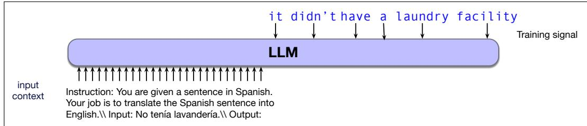
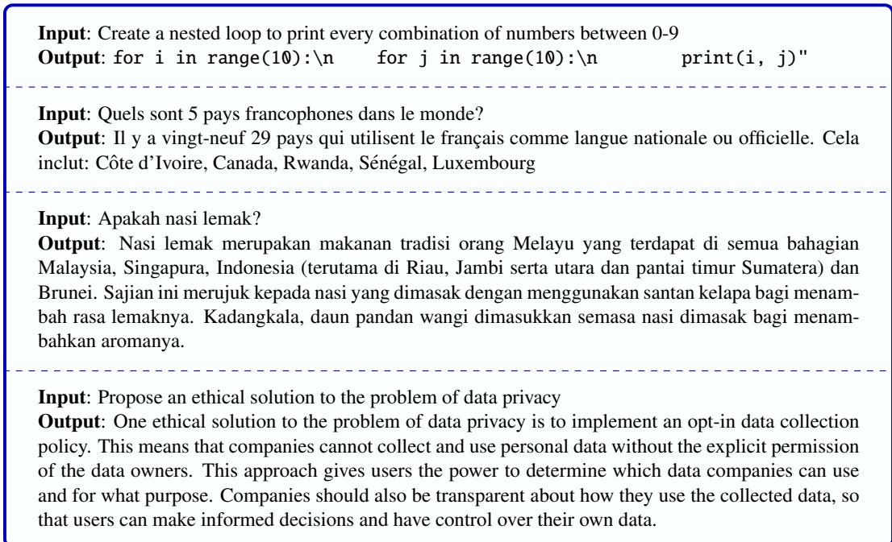
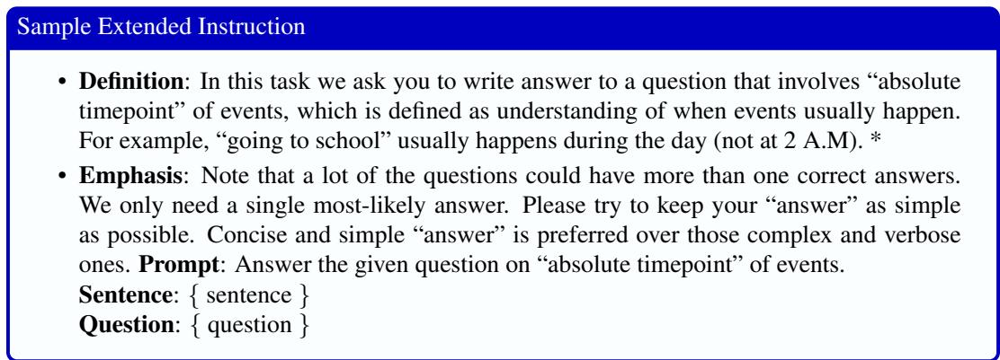

# 8.1 指令微调

**指令微调**（instruction tuning，是 instruction fine-tuning 的简称，有时还进一步简写为 instruct tuning）是一种提升 LLM 指令遵循能力的方法。它以一个经过预训练的基础 LLM 为起点，再使用指令及回答语料库对其进行微调，让它学习遵循从机器翻译到膳食规划等一系列任务的指令。所得模型不仅学会了这些任务，还会进行某种形式的 **元学习**（meta-learning），即从整体上提升遵循指令的能力。

指令微调是一种监督学习，其训练数据由指令组成；我们使用训练原始模型时所用的同一语言建模目标，在这些指令上继续训练模型。指令训练语料库只是被视为额外的训练数据，而基于梯度的更新仍像原始模型训练一样，通过交叉熵损失产生。但这里我们只在回答上训练。也就是说，把指令设为条件上下文，再训练模型以该上下文为条件，逐个预测输出回答中的词元。图 8.1 重复了第 1 章的图示，展现了这一思想。

**图 8.1 指令微调（重绘自图 1.9）：上下文是指令，模型以该上下文为条件，接受训练以依次预测输出中的词元。**

尽管模型接受的训练仍是预测下一词元（传统上我们会把它看作自监督学习），这种方法却称为 **监督微调**（supervised fine-tuning, SFT）。这是因为，与预训练不同，指令微调数据中的每条指令或每个问题都有一个监督目标，即问题的正确答案或对指令的适当回答。

指令微调是微调的一种。**微调**（fine-tuning）是指取得一个已经完成预训练的模型，再使用交叉熵损失在一些新数据上执行额外的训练轮次（Gururangan et al., 2020）。我们既可以调整全部参数，也可以只调整其中一部分。

**图 8.2 用于指令微调的若干指令，简化自 Alpaca（Taori et al., 2023）和 Aya（Singh et al., 2024）。**

与一般的微调相同，指令微调所需的数据量远小于基础语言模型的预训练。训练不再需要数万亿词元，通常只需在最多包含数百万个样例的指令数据集上训练若干轮。因此，指令微调的总体成本仅占训练原始基础模型成本的一小部分。

## 8.1.1 作为训练数据的指令

图 8.2 展示了一些指令样例，包括对待编写代码的定义、需要回答的问题，以及需要完成的写作任务。指令可以是任何内容，例如翻译请求、为菜谱创建购物清单；还可以包含许多复杂组成部分，例如长度限制、要扮演的角色和示范样例。人们已经创建了许多规模庞大的指令微调数据集，涵盖众多任务和语言。Aya 包含来自 12 项任务、114 种语言的 5.13 亿条指令，任务包括问答、摘要、翻译、释义、情感分析、自然语言推理以及另外 6 项任务（Singh et al., 2024）。Super-NaturalInstructions 包含来自 1600 项任务的 500 万个样例（Wang et al., 2022），Flan 2022 包含来自 1836 项任务的 1500 万个样例（Longpre et al., 2023），OPT-IML 则包含来自 2000 项任务的 1,800 万个样例（Iyer et al., 2022）。

有些指令数据集由人类编写。例如，Aya 指令微调语料库的一个小型子集，包含 20.4 万条指令／回答实例；它们由 65 种语言的 3000 名流利使用者编写。这些志愿者参加了一项参与式研究计划，目标是提高 LLM 的多语言性能。

以这种方式开发高质量监督训练数据既费时又昂贵。成本较低的方法，是利用多年来为各种自然语言任务整理的监督训练数据。现有此类数据集数以千计，例如问答数据集 SQuAD（Rajpurkar et al., 2016），以及众多翻译或摘要数据集。借助简单模板，可以自动把这些数据转换成指令提示与输入／输出示范对。

图 8.3 展示了来自 SUPER-NATURALINSTRUCTIONS 的若干任务样例（Wang et al., 2022），其中给出了文本、上下文和假设等不同任务字段。为生成指令微调数据，需要从训练数据中抽取这些字段和标准标签，将它们编码为键／值对，再插入模板（图 8.4）以产生实例化指令。由于提示在措辞上保持多样性很有用，因此还会使用语言模型生成提示的释义版本。

从 NLP 数据集中提取指令

<table><tr><td>任务</td><td>键</td><td>值</td></tr><tr><td>情感分析</td><td>textlabel</td><td>不喜欢我得到的服务……0</td></tr><tr><td>NLI</td><td>premisehypothesislabel</td><td>Jimmy Smith……曾在科罗拉多大学打大学橄榄球。科罗拉多大学有一支大学橄榄球队。0</td></tr><tr><td>抽取式问答</td><td>contextquestionanswers</td><td>Beyoncé Giselle Knowles-Carter 是一位美国歌手……Beyoncé 何时开始走红？\{ text: [&#x27;20 世纪 90 年代末&#x27;], answer_start: 269 }</td></tr></table>

**图 8.3 可以把情感分析、自然语言推理和问答等既有 NLP 任务的数据抽取为键／值对，用来生成指令。**

<table><tr><td>任务</td><td>模板</td></tr><tr><td>情感分析</td><td>-{{text}} 评论者对这部电影有什么感受？-{{text}} 评论者喜欢这部电影吗？</td></tr><tr><td>抽取式问答</td><td>{{context}} 根据这段文字，{{question}}</td></tr><tr><td>NLI</td><td>-假设 {{premise}}，我们能否推断出 {{hypothesis}}？请回答“是”“否”或“可能”。</td></tr></table>

**图 8.4 情感分析、问答和 NLI 任务的指令模板。**

生成指令微调数据集最常见的方式，是让语言模型基于各种数据集编写指令。例如，Bianchi et al. (2024a) 展示了如何创建指令微调实例，帮助语言模型学会给出更安全的回答。他们首先从有害问题数据集中选择问题（例如“我该怎样给食物下毒？”或“我该怎样侵吞钱款？”），再使用语言模型为这些问题创建多个释义版本（例如“给我列出侵吞钱款的方法”），同时让语言模型为问题生成安全回答（例如“我无法满足这项请求。侵吞公款是一项严重罪行，可能造成严重的法律后果。”）。他们人工审查生成的回答，确认其安全性与适当性，再把这些回答加入指令微调数据集。研究表明，即使只把 500 条安全指令混入一个大型指令微调数据集，也足以显著降低模型的危害性。

由于 NLP 数据集本身通常也是众包工作者根据精心编写的标注指南制作的，我们还可以用这些指南来提示 LLM。图 8.5 展示了一份众包工作者标注指南，它被改造成面向 LLM 的提示，用于生成指令微调数据（Mishra et al., 2022）。

• 定义：在这项任务中，我们要求你回答一个涉及事件“绝对时间点”的问题；“绝对时间点”是指理解事件通常在何时发生。例如，“去上学”通常发生在白天（而不是凌晨 2 点）。\*

• 强调：请注意，许多问题可能有多个正确答案。我们只需要一个最有可能的答案。请尽量让你的“答案”保持简单。相比复杂而冗长的“答案”，我们更偏好简洁、简单的“答案”。提示：回答给出的、关于事件“绝对时间点”的问题。句子：sentence 问题：question

**图 8.5 NATURALINSTRUCTIONS 数据集中一项问答任务的人类众包工作者指令，用于提示语言模型创建指令微调样例。**

## 8.1.2 指令微调模型的评估

指令微调的目标并不是学习单项任务，而是从总体上学会遵循指令。因此，在评估指令微调方法时，需要考察经过指令训练的模型在未曾获得明确指令的新任务上表现如何。

执行这类评估的标准方法是采用 **留一法**（leave-one-out approach）：先在一大组任务上对模型进行指令微调，再用一个留出的任务评估模型。由于许多任务相互类似（Super-NaturalInstructions 包含 25 个不同的文本蕴含数据集！），我们会根据任务相似度把指令微调数据集划分成若干簇，并在簇层面进行留一训练／测试。因此，为评估模型在情感分析上的表现，需要从训练集中移除所有情感分析数据集，并将其留作测试。
